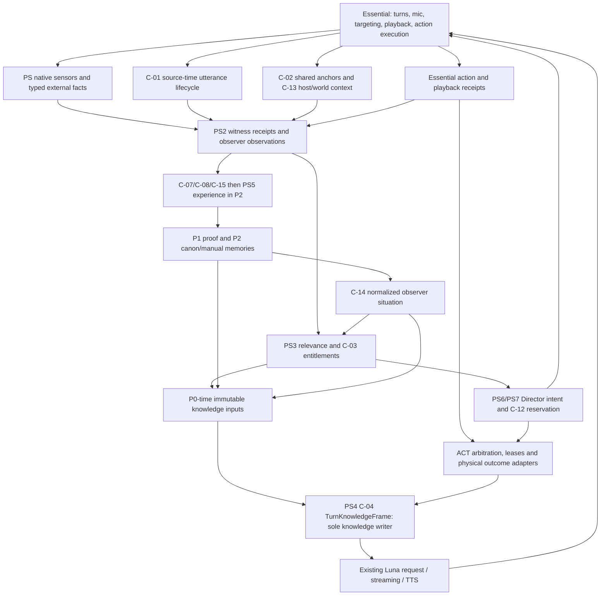
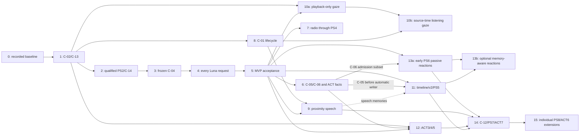

# Unified LSA intelligence and world awareness: master implementation plan

**Active implementation boundary — October 9, 2026:** The user has narrowed the active implementation goal to [playable LSA v1.0](../lsa-v1-implementation-milestone.md): finish Phase 6, close baseline PS4 automated acceptance and implement Phase 13a; Phase 10a is conditional on proven insufficiency of existing Essential gaze. All other unfinished phases are deferred. This scope override changes the active delivery queue, not settled contracts, phase specifications or PR #21. Stop at the milestone boundary with external GTA gates documented.

**Prepared:** October 8, 2026. **Scope:** architecture reconciliation and implementation planning only. **Runtime baseline:** `main@7e54b17b53f2786f3e9294e546db6b560fb5f6a7`. **PS4 input:** [PR #21](https://github.com/ComradeGenosse/LSA-Enhanced-essential-fork/pull/21), head `dafa170f648cf44d776761ff893df863d73e25aa`. **Local planning branch:** `docs/unified-intelligence-master-plan-20261008`.

The original [PS4 code-level plan](PS4-code-level-implementation-plan-20261008.md) is preserved unchanged. Its seven phases, 81 tests, nine gates and 19 GTA cases remain the detailed baseline specification. This master plan coordinates that work with ACT, radio, speech, gaze, memory, social initiative and selected Genesis ideas. It does not replace C-01–C-15 or authorize implementation, merge, deployment, configuration changes or GitHub publication. New symbols, encodings, constants and test names below are **proposed implementation specifications**, unless identified as existing code.

**PR #22 sequencing refinement (October 8):** passive PS6 reactions may ship after accepted PS4 and native admission, before PS5; playback-only CGE may ship without C-01, while player-listening still requires C-01. One bounded Director policy function may eventually select alternative proposals through the same C-11/ACT/Essential path. No implementation, model-specific phase or new infrastructure is introduced. Source baseline remains unchanged; §19.1 and §20.1 record the additional verification. Phase numbers remain stable identifiers, not a compulsory serial queue.

## 1. Outcome, authority and scope

Deliver one continuous path:

**GTA evidence → observer-qualified PS2 knowledge → existing PS3 relevance → frozen PS4 TurnKnowledgeFrame → Luna's existing request → validated Essential speech/action → independently qualified outcome → later P2 experience.**

An NPC can discuss what that individual saw, heard, experienced, was told, or safely recalled, with uncertainty and identity boundaries preserved. The same qualified evidence can later inform a bounded Director proposal; ACT arbitrates physical activity and Essential executes it. A song, a nearby utterance, a gaze command, an instruction to follow, and a completed action are different evidence types. They never become interchangeable merely because they share an event or character.

Authority order for this plan:

1. Current source, main ancestry and current phase/deployment receipts establish implementation facts. A branch name or old test total establishes none of these.
2. [DECISIONS.md](DECISIONS.md), [system-contract-register.md](system-contract-register.md), and [system-contracts.v1.json](system-contracts.v1.json) govern architecture: D-001–D-017 and C-01–C-15.
3. PR #21 governs the precise baseline PS4 implementation. This document adds sequencing, adapters and acceptance for the broader ecosystem.
4. Active convergence documents provide the ownership/dependency synthesis. Archived material and unmerged research supply provenance and useful evidence, interpreted through the settled contracts.

No locked decision is reopened here. Necessary corrections concern stale status, incomplete adapters and unmerged implementation that conflicts with an already settled contract. Examples are R5's second prompt writer, ACT's stale `idle` owner label and the Genesis proposal for a competing event ledger. The reconciliation decisions are explicit in §5.

### 1.1 Three delivery boundaries

| Boundary | User-visible result | Required foundations | Explicitly unnecessary for this boundary |
| --- | --- | --- | --- |
| **MVP conversational intelligence** | Existing requested Luna turns use the exact actor's supported PS2/PS3 awareness plus existing P2 canon/manual memories and committed conversation. | C-02/C-13 shared lifetime; C-14 supported situation; C-04 frozen projection; existing C-03 acknowledgements; production request tests. | Radio, CGE, proximity hearing, automatic memory, Director, ACT3+, provider routing, dispatch. |
| **Environmental and social enrichment** | Correct activity self-knowledge, qualified radio, overheard speech, natural gaze and timeline-safe personal experiences enrich requested turns. | MVP plus contributor-specific gates; C-05/C-06; existing playback for early gaze, C-01 for player hearing/listening gaze; C-07/C-08/C-15 before automatic durable writes. | General autonomous agents, global world simulation, unrestricted navigation or multi-provider failover. |
| **Early passive initiative** | One owned NPC can make an appropriate short, observer-grounded warning/comment through the existing Luna turn pipeline. | Accepted PS4; existing PS3 reaction entitlement; C-02/C-13/C-14; truthful C-06/native admission; C-11 speech ticket/intake/outcome gate MP13a. | PS5, Profile v2/timeline migration, C-01 hearing, C-12 social routing, ACT3+ or physical proposals. |
| **Advanced bounded autonomy** | Memory-informed reactions, validated physical proposals and a small coordinated exchange. | MP13a plus the particular contributor's gates: PS5 for automatic recall, C-12 for routing, ACT for physical effects/DI, C-07/C-08/C-15 for durable social state. | New executor, autonomous raw natives, another service/store/ledger/router. |

Baseline delivery is complete only when a supported observation is present in an intercepted **actual Luna request** and produces a useful in-game exchange without changing E1–E6 guarantees. A frame hash, a plausible reply, or a green selector unit test alone is insufficient.

## 2. Verified current architecture and implementation status

During initial pre-publication preparation, remote refs were refreshed by `git fetch origin --prune`; no merge or push occurred in that preparation. Main remains `7e54b17`. The local branch started at PR #21's head, whose merge base is exactly that main. The working tree was clean before the branch was created. The original branch inventory and pinned-file checks are recorded in [the source audit](unified-intelligence-source-audit-20261008.json); §18 lists those 59 remote branches separately. This refinement operates on published PR #22, preserves that snapshot, and records its refreshed refs/source checks in §19.1/§20.1.

### 2.1 State ladder

Use separate columns: **implemented in source**, **on main**, **recorded installed**, **runtime mode**, **physical acceptance**. “Merged” does not mean enabled; “shadow” does not mean model-visible; “handler accepted” does not mean physically completed. The present audit reads repository records and does not re-hash the live GTA installation.

| System | Source / merge state | Recorded deployment or runtime evidence | What it currently contributes / remaining gap |
| --- | --- | --- | --- |
| E1/E1.1, E2–E6 | Implemented on main. Provider contracts, stage-aware retries, structured streaming and segmented TTS exist. | Prior GTA/API evidence is in E-stage status docs; integrated baseline remains the existing deployment lineage. Some early-TTS/long-session stress acceptance remains open. | Preserve exact tuple, one accepted player input, buffered action barrier, playback-gated assistant history and native interruption. E7 is still final regression/soak acceptance. [M01–M05] |
| P0 | Implemented on main: immutable `TurnSnapshot` and P/V time-of-use validation. | Used in subsequent installed P1/P2/UX/PS builds. | Correct seam to freeze knowledge before awaits. Raw snapshot remains private validation input. [M06] |
| P1/P2 | Implemented on main: authenticated durable identity, profile/canon, manual memory editor, promotion, summon and guarded controls. | P2 command/editor/profile/summon/vehicle behavior exercised in GTA; host corrections are merged. | Canon and selected manual memories already reach dialogue. No automatic experiential writer or timeline-safe relationship graph exists. [M07–M10] |
| UX0–UX4 | Implemented on main, including shared Talk interception and later direct-hold/tap-selector refinement. | Earlier shared Talk/PTT path GTA-observed. Fresh physical acceptance of the later selector refinement remains open. | Keep selection separate from Essential's committed partner lifetime. Typed target integration is later C-01 work. [M11] |
| PS0/PS1 | Native anchors, factual transport, bounded discovery and sensor adapters implemented on main. | Installed in shadow; supported producer counters exercised. Full producer/witness scenario matrix remains incomplete. | Independent run/epoch tables; no shared C-02/C-13 join yet. Global evidence is not observer knowledge. [M12–M15] |
| PS2 | Witness rules, episode/observation stores, speech validators and shared transcript primitive on main. | Live correlation/witness counts verified in shadow. Speech hearing is disabled; there is no authoritative source-time receipt. | Typed semantics/self-injury gaps must be repaired for PS4; returned speech perceptions are not yet wired through observations/salience. [M16–M20] |
| PS3 | Corrected deterministic salience and C-03 acknowledgements implemented on main. | Deployed in shadow October 5; live PS2→PS3 evaluation, JSONL cadence and history pressure verified. | Not connected to Luna requests. Live profile/relationship/trait policy branches lack the authenticated actor/observer association and C-14 provider. [M21] |
| ACT0–ACT2 | Implemented and merged through PR #18 (`b2221917`), including post-review hardening. | October 6 record: 83-file hash-parity install and integrated GTA smoke test. Focused capability probes remain open. | Only four ACT2 native capabilities advertised. Defaults off, local `passedProbes` required; current source still needs C-02/C-06/C-13 convergence and fenced factual reads. [M22–M26] |
| ACT3–ACT7 | Registry declarations and forward plans exist; execution for these phases is not implemented. | No confirmed deployment/acceptance. | Registry rows alone do not establish dispatch, cancellation or completion. ACT6 navigation is probe-gated; DI execution belongs to ACT7. [M27] |
| Radio R0–R5/v2 | Unmerged implementation stack, consolidated tip `ad6cad61a0108f40e9ed2e738be756c63ab05350`, five commits ahead of main. | No current v2 full offline/build/GTA acceptance established by its status document. | Sampler/catalog/witness/salience/phrasing are reusable. R5 violates the settled frozen single-writer seam and must be adapted before incorporation. [R01–R06] |
| CGE | Current amended native plan is on main; branch is docs only. | Exact supplemental gaze mechanism and coexistence probe remain open. | No gaze runtime exists. Essential already has conversation-look behavior; CGE must yield. [M28] |
| Proximity/social | Research plus existing PS2 speech storage/validation primitives; no live hearing or social routing implementation. | C-01 mic begin/end and C-12 silent-yield probes unresolved. | Reuse one capture/STT; do not fan out separate nearby-NPC turn stacks. [M19–M20, H01] |
| PS4 | PR #21 documentation only. | No implementation/deployment. | Immediate integration work, with no new perception engine or research effort. |
| PS5–PS8 | Forward research/contracts, no runtime implementation for these phases. | No confirmed deployment. | P2 migration/timeline first; Director and social arbitration later; new producers/capabilities individually gated. [H01–H03] |
| Genesis | Three research documents on `1d38913fd2479c9e3760b4e38dcf62109036aeab`; no runtime changes. | No runtime prototype/deployment evidence. | Ideas evaluated individually in §12; proposed research ladders are not implementation branches. [G01] |

The former CURRENT/ROADMAP overview paragraphs calling ACT unmerged are contradicted by main ancestry and the newer ACT status/deployment entries. Their status/navigation is corrected alongside this plan. Radio's main R0–R2 status describes an older slice; the newer unmerged stack is represented as branch evidence, not as deployed main.

### 2.2 Existing disconnection, at code level

```text
native/intelligence/IntelligenceIntegration.Update/Publish
  → IntelligenceClient → ShadowRuntime.ingest
  → EpisodeCorrelator.ingest → ObservationStore → SalienceCache
  → currently stops before the conversation request

Essential WP/Xn/qK/BK source-pinned hooks
  → OpenAIConnection.beginTurn / prepareIdentity
  → CharacterService.prepareTurn
  → runSequentialTurn → decide / decideStreaming → buildRequest
  → currently raw context/system narrative + actor/listener/world JSON
```

`bootstrap.mjs` constructs intelligence only in shadow. `hostFor.prepareTurn` currently depends on identity/character services. `ShadowRuntime.noteSalience` supplies generic activity, not authenticated P2 state. `CharacterService.prepareTurn` reads a live profile after async preparation and canon is independently projected/appended. `buildRequest` serializes raw scene data. The integration task is to bridge these **existing** paths with C-04 while closing the raw narrative bypass. [M01, M03–M04, M08, M17, M21]

Speech forwarding also has an existing optional wrapper mismatch: bootstrap calls `runtime.intelligence.acceptPlayerTranscript`, but the method is on the client's `runtime` (ShadowRuntime). The turn pipeline passes `receipt:null`, and that runtime method merely returns `SharedTranscriptStore.accept`; it does not convert returned speech perceptions to stored PS2 observations/PS3 decisions. These are small adapter gaps plus a missing native receipt, not justification for a communication service. Current player input remains usable independently of hearing. [M01, M02, M17, M19–M20]

## 3. Unified end-to-end information flow



Arrows are contract-qualified transfers, not new services. Radio is a raw auditory producer followed by PS2/PS3. CGE is a yielding presentation consumer of C-01/Essential playback; any useful attention evidence follows the typed qualification rules in §9. Memory is owner-private durable recall, not the global episode table. Director→Essential is only checked speech admission; Director→ACT is physical intent. No Director invokes providers directly.

### 3.1 One ordinary requested turn

1. Essential commits the actor and allocates the full `(pedId, sessionNonce, turnId, generationId)` tuple. Native EnrichActor records a private C-02 association for the **supplied** Ped.
2. At `OpenAIConnection.beginTurn`, existing P0 captures actor/listener/world/referenceMap. Synchronously capture the matching actor association, host/world context, loaded canon/profile candidate, committed prior history, observation/decision/situation pairs and optional contributor snapshots. No await, rescan or provider call is added.
3. Existing P1 preparation validates owned incarnation/proof. It may release only the matching frozen profile candidate. Missing loaded data/proof yields less knowledge, not a late substitution. Ordinary NPCs remain eligible for their own PS awareness without promotion.
4. One typed input or one accepted STT transcript fills current CONVERSE input. Topic selection, including a direct radio question, chooses from the frozen candidate pool only. Future C-01 hearing of this same utterance reaches other observers as qualified speech evidence; it does not add a second player message.
5. PS4 selects with existing PS3 ordering and existing P2 selected-memory ordering. It produces one allowlisted frame with SELF, PERCEIVED, CONVERSE, RECALLED, SITUATION and transitional COMPAT lanes.
6. Both nonstreaming and streaming request paths render that frame and trusted behavior/action instructions. Private P0 validation remains available for DO target checks. Every retry reuses the same projection and deadline.
7. A successful final reasoning result acknowledges exact included PS3 keys as `ps4_context:delivered`; later playback independently determines assistant history commit. An action receipt is independent of whether the reply was fully heard.
8. Native execution and physical sampling generate their own evidence. Other NPCs know the outcome only through their own perception/report, while the actor's qualified receipt may enter SELF on a subsequent turn. PS5 later persists qualified experience through P2 and timeline rules.

### 3.2 Evidence taxonomy and allowed knowledge

| Evidence form | Authority and minimum qualification | Allowed wording / knowledge | Must not infer |
| --- | --- | --- | --- |
| Engine/raw event | Native signal and source pin; not yet observer evidence | Nothing to an ordinary NPC until PS2 qualifies it | Omniscient crime/event history or hidden attacker identity |
| Visual observation | Source-time observer, range/interior/LOS and current anchors; supported typed claim | What was visibly observed, retaining uncertainty | A heard source, intent, name or private profile |
| Auditory non-speech | Actual supported sound producer plus source-time audibility receipt | Sound was heard; cause/source unknown unless separately supported | “I saw him shoot” from noise alone |
| Radio music | Live text ID/station plus proven same-vehicle hearing, content kind, current observer association | Current music/commercial/unknown content | Preference, prior familiarity, lyrics or knowledge of outside-car listeners |
| Current input | Genuine accepted typed/mic player input to this turn | Conversational claim as user-provided data | Typed input being audible to nearby NPCs |
| Overheard speech | C-01 window and observer-authorized full coverage; one accepted transcript | “I heard you say…” / report with a supported speaker association | Report becoming world truth or private profile knowledge |
| Partial/unknown hearing | Incomplete or uncertain source-time receipt | Presence of possible speech, only if supported | Full transcript, named addressee or keywords from unlocalized fragments |
| ACT instruction / handler | Authenticated instruction or exact action callback | Intended/agreed/handler accepted | Completed travel, successful transfer, actual arrival |
| Established mode / physical completion | Sampled mode or world-strong completion adapter | “I am following” / verified completed outcome | Physical success from a boolean handler return |
| CGE presentation | Exact owned finite gaze command; physical evidence only if probed | Command/status to its private diagnostics; supported self-state if useful | Attention proving hearing, recognition, affection or comprehension |
| Recalled experience | P2 owner-private record, active timeline, provenance and recognized SubjectRef | Qualified recollection and reports as reports | Backend-known characters being socially recognized |
| Inference | Derived only from supported premises, explicitly labeled uncertain | “It might have…” | New fact, relationship update or native action authority |

No gaze refresh, successful STT, global radio query or model assertion upgrades witness certainty. No action receipt distributes self-knowledge to every nearby NPC.

## 4. Consolidated ownership and contract matrix

| Concern / lifecycle | Sole owner | Existing seam to reuse | Consumers / planned convergence |
| --- | --- | --- | --- |
| GTA physical behavior and reflex | Essential under GTA/script guards | NpcActionQueue/NpcActions, NpcStateStore, playback coordinator | ACT requests; PS observes; CGE yields |
| Conversation tuple, partner and history outcome | Essential; companion DialogueHistory for staged/committed messages | WP/Xn hooks, native lifecycle bridge, `acceptPlaybackResult` | UX commits target once; no clear on PTT release |
| Run-local entity lifetime | C-02 host service, by promoting existing PS EntityAnchors | Retain/Resolve/Retire/Cleanup | PS, P2, ACT, Director and CGE share refs; no extra entity table |
| Host/world discontinuity | C-13 RuntimeEntry/P2 owner | Existing reset methods and pipe hellos | One broadcast; channel epochs remain local |
| Durable identity and proof | P1 | OwnerFactChannel, ownerEvidence, runtimeBindings | Own-profile reads require current incarnation proof; social recognition separate |
| Canon/manual memory and later durable experience | P2 | ProfileStore, editor CAS, immutable get/list | One C-08 migration; no new memory DB |
| Source-time player utterance | C-01 host adapter at proven Essential mic seam | Existing mic ownership evidence and accepted STT pipeline | PS2 hearing, player-listening CGE, UX typed follow-up, PS7/PS5 |
| World evidence / episodes / observer knowledge | PS0–PS2 | SensorAdapters, WitnessPolicy, EpisodeCorrelator, stores | Radio and supported world/communication producers extend these contracts |
| Relevance / suppression / consumer acknowledgement | PS3 | SalienceCache/evaluate/orderSalienceDecisions/acknowledge | PS4 context, PS5 memory, PS6 reaction are distinct consumers |
| Situation and profile-policy metadata | C-14 one provider | Sampled Essential/ACT state + exact P1/P2 association | PS3 and frozen PS4; unknown until proven |
| Model-visible knowledge | PS4 C-04 | P2 allowlisted canon plus planned selector/projection | Every contributor supplies typed evidence, never prompt text |
| Primary physical ownership | C-06 P2/ACT owner token | BeginOwnership/EndOwnership and sampled state | ACT arbitration, C-14, Director, CGE safety |
| Activity planning/execution requests | ACT | ActivityEngine/Validator/StepRunner/CompletionAdapters | Player UX first; validated player dialogue and Director later |
| Initiative and responder policy | PS6/PS7 Director | SpecialGeminiTurnScheduler and planned checked tickets | Speech admission; C-11 activity proposals to ACT; C-12 reservations |
| Supplemental head/eye engagement | CGE | Essential ConversationLookBehavior/NpcFocus if probe-approved | Consume lifecycle; no body turns, no model call |
| Provider selection, STT and TTS | Existing provider stack | ProviderContract, ProviderExecutor, VoiceResolver | No second inference router or voice store |
| Capability/health presentation | C-09 read model | Existing manifests/hellos/probe gates and E4 metrics | Existing UX diagnostics; each subsystem still enforces gates |

### 4.1 C-01–C-15 implementation crosswalk

| Contract | Current truth | Implementation owner / master phase | Required dependency / gate |
| --- | --- | --- | --- |
| C-01 UtteranceLifecycle | Missing native lifecycle; v1 speech validators/store exist but gated. | Host adapter + companion annotation; phase 8. | Exact source-time probe before speech/gaze/social; not MVP prerequisite. |
| C-02 Shared anchors/index | PS table exists; ACT has private entity refs; no turn actor join. | RuntimeEntry host/P2/PS/ACT; phase 1. | Ordinary and owned actor roundtrip, quotas, retirement. |
| C-03 acknowledgement | Implemented on main; consumers not connected. | Existing SalienceCache; phases 5, 11, 13. | Outcome-specific exact keys; stale keys fail safely. |
| C-04 single frame | Planned in PR #21. | Companion PS4; phases 3–5. | One renderer on all OpenAI paths, frozen inputs, no raw bypass. |
| C-05 dialogue-action receipt | Not implemented. ACT callback ring is reusable. | Native callback drain + companion receipt adapter; phase 6. | Exact tuple/action/lifetime correlation; callback-only acceptance strength. |
| C-06 owner token | Not implemented; EndOwnership currently sets idle. | P2/ACT; phase 6, with sampled fields used conservatively in phase 2. | Truthful essential_residual/unknown, no automatic restore/replay. |
| C-07 timeline | Not implemented. No verified save hook. | P2 explicit timeline policy; phase 11. | Fail closed on rollback uncertainty; before automatic durable writes. |
| C-08 Profile v2 | Schema v1 and explicit migration map exist; no migration registered. | P2 alone; phase 11. | One lossless migration, backup, bounded CAS, empty future fields. |
| C-09 capability health | Individual gates exist; no unified read model. | Companion/UX thin projection; phase 5. | Reported validation tied to payload, never manufactured from config. |
| C-10 partner policy | Implemented UX4 ownership fix. | Essential/UX preserved in every phase. | Hold/release/supersession regression; no competing clear. |
| C-11 Director→ACT | Forward contract only. | PS6 speech part phase 13; PS7/ACT7 physical DI phase 14. | Director proposes; ACT admits exact refs/leases. |
| C-12 responder reservation/yield | Missing; stock silent-yield behavior unknown. | PS7 + native intake; phase 14. | Probe before multiple responders; no fan-out workaround. |
| C-13 host/world epoch | Independent channel resets today. | RuntimeEntry/P2 broadcasts; phase 1. | Cross-channel hello/reset/currentness tests. |
| C-14 ObserverSituation | Helper exists; live provider/join missing. | Native/P2 read model and companion provider; phase 2. | Recognized/private metadata separated; unknown supported as unknown. |
| C-15 SubjectRef | Forward taxonomy only. | P2 v2 phase 11; PS7/ACT7 consume. | Protagonist switch and local-ref provenance cannot pool identities. |

The register's numerical “Phase: ACT0/1 reconciliation” entries for C-13/C-09 describe intended sequencing, not proof those contracts shipped with ACT0–ACT2. Their definitions stay settled; their remaining implementation is now phased against merged code.

## 5. Reconciliation: overlapping work, conflicts and minimal corrections

| ID | Source conflict / overlap | Reconciled implementation decision | Evidence and effect on scope |
| --- | --- | --- | --- |
| X01 | ACT unmerged in overview, merged/deployed in newer status. | Correct status and start from main's ACT implementation. Do not rebuild/remerge ACT0–ACT2. | Main ancestry + ACT status; phase 0 only. |
| X02 | PS, ACT entity dictionaries and P2 handle-based encounter reuse. | Promote EntityAnchors to one host service; retain P2 ownership records and ACT PlaceTable as their distinct concerns. | C-02, PR #21 §4; phase 1. |
| X03 | Per-channel nativeRun/adapterEpoch used as though comparable. | Shared hostRunId/worldEpoch qualify cross-system joins; preserve separate transport epoch/stream/sequence fences. | C-13, PR #21 §5; phase 1. |
| X04 | PS3 relationships/traits exist offline, production always generic. | One C-14 provider supplies only current authenticated actor metadata and real sampled activity. Backend identity does not provide recognition. | `noteSalience`, `situationFromCharacterView`; phase 2. |
| X05 | Raw actor/listener/world/BK scene bypasses qualified knowledge. | One safe C-04 renderer on every OpenAI request; raw P0 remains private action context. | `buildRequest`, WP/Xn/qK/BK/EO hooks; phases 3–4. |
| X06 | P2 canon is projected/appended independently; later live reads can change a turn. | Capture loaded P2 candidate with P0, release after matching proof, render SELF/RECALLED once. Preserve selected pins and 16 KiB canon budget. | CharacterService/sessionProfiles; PR #21 §§8–10. |
| X07 | Radio R5 uses live `conversation:true` after STT and appends contextText. | Replace selection ingress with frozen exact observer pool; retain topic detector/catalog/phrasing as pure typed contributors. Single PS4 ack owner. | R5 implementation vs C-04; phase 7. |
| X08 | Radio edge-only updates can miss initial stable track/new listener and retain old hearing until TTL. | Source-verify current sample/membership transitions; add narrowly bounded current-state refresh in the existing sampler and invalidate observer current-radio availability on vehicle exit/retire. No new sampler. | SensorAdapters.Radio suppresses first/unchanged tuple; correlator invalidates on subsequent edges; R3 integration tests must cover gaps. Phase 7. |
| X09 | ACT summaries/history are tempting model evidence; facts have no incarnation/run fence. | Read existing ActivityFacts through a bounded provenance-qualified snapshot; clear/filter reset/retirement; no use of summary history as physical evidence. | ActivityFacts/Engine and PR #21 phase G; phase 6. |
| X10 | EndOwnership says idle even when an Essential mode remains. | C-06 truthful owner read model from current sampled state, never restoration of prior task. | ActivityDispatch.EndOwnership; phase 6. |
| X11 | Interrupted reply loses spoken history although its DO may execute. | C-05 receipt correlated at actual publication/callback boundary, independent of history commit. Failed/ambiguous correlation remains unknown. | C-05 and existing callback ring; phase 6. |
| X12 | Seven speech representations; null receipt; optional wrapper missing. | One native C-01 lifecycle and turn join; one STT; small wrapper and speech→PS2 adapter. No estimated post-STT window. | EssentialMicState proves owned mic view, not begin/end receipt; phases 8–9. |
| X13 | NPC playback exists but no nearby listener transcript authorization. | Playback event alone proves playback state, not semantic content heard. Full observed NPC speech needs exact playback text/window plus PS2 coverage; remain unsupported until proven. | Existing playback producer vs SharedTranscriptStore player-only validator; phase 9 extension. |
| X14 | CGE private target state/body-turn telemetry in an otherwise head/eye-only plan. | C-02 resolves physical target; C-13 retires state. Keep small policy state, remove body execution/settled telemetry claims. ACT3 owns body turns. Split playback-only 10a from C-01 player-listening 10b. | D-014, CGE runtime contract; phase 10. |
| X15 | Separate future memory/edge/commitment schema bumps. | One C-08 envelope with C-07/C-15 first; future collections empty until their writer ships. | D-011, ProfileStore migration map; phase 11. |
| X16 | Director might start DI or dispatch actions itself. | C-11 speech tickets use checked Essential intake; physical/DI proposals use ACT with leases and bounded P2 exemption. | Active contracts supersede older research; phases 13–14. |
| X17 | Genesis W0 suggests a new ledger before PS4. | Reuse PS2 EpisodeStore/ObservationStore/correlator; add typed producer adapters and bounded read views only when a real consumer needs them. PS4 first. | Existing code already implements event/observation distinction; §12. |
| X18 | Genesis G0/V0/C0 suggest new broker, voice store and comms bus. | Reuse provider contracts/retries/voice identity and C-01/PS2 communication evidence. Defer failover and new channel agents. | E2/E3/E4 and existing voice assignment; §12. |
| X19 | Zero damage callbacks could motivate new polling/event machinery. | Preserve sampled injury/death; perform the discriminating external-producer diagnostic only before claiming damage callbacks. Do not guess attacker or patch speculative producer internals. | Damage branch `569ed9e`; sampled state remains usable for MVP. |
| X20 | Registry/planned public API exposes more than four actual capabilities. | Advertise only compiled, configured, runtime-supported and physically validated rows. Capability health is informational; it never grants execution. | StepRunner.Advertises and C-09; every ACT extension. |
| X21 | Old phase graph made all PS6 speech wait for PS5. | Existing PS3 response grants and exact playback delivery are independent of memory writes. Move transient passive reactions to 13a after PS4/admission; only memory-aware 13b waits for PS5. | SalienceCache/classify/acknowledge, C-03/C-11; F01–F02/F06–F09/F12. |
| X22 | Old CGE prose made all gaze wait for C-01. | Native playback already has exact speaker/turn/generation events. Permit playback-only 10a; C-01 remains the sole source for player-speaking/listening in 10b. Ownership/mechanism probe still mandatory. | Native callback subscription, shipped metadata, D-014; F03–F05/F13. |
| X23 | Future policy changes could duplicate stores, ticketing or execution. | One small selection function returns existing C-11 proposals to the invariant admission/arbitration pipeline. Policy identity never increases privileges or produces native effects. | C-11, ACT source vocabulary versus actual ACT2 admission; F10–F11. |

These corrections reuse settled architecture. They neither introduce another research program nor require optional source probes before baseline PS4 visual awareness.

## 6. MVP file-level and API-level specification

Paths beginning `src/`, `tests/` or `tools/` in specifications below are inside `lsa-essential-e1-candidate/`. Native and contract paths are repository-relative. **Existing names** below were checked in source; names marked **new/proposed** are deliverables, not present-day APIs. Reuse the complete PR #21 specification for details of source-pinned AST seams, claims, budgets, retries and baseline test oracles.

### 6.1 Shared references and host context: C-02/C-13

| File / existing function | Exact planned delta | Interface / lifecycle requirement |
| --- | --- | --- |
| `native/promoted-characters/RuntimeEntry.cs`: `Start`, owner lifetime fiber, `Stop` | Instantiate proposed `HostContext` once before P2/PS/ACT construction; pass the same instance/delegates into existing integrations. | One hostRunId, one world epoch, one monotonic clock and existing anchor table. Existing 100 ms lifetime/status fiber does not become a new sensor pump. |
| `native/intelligence/EntityAnchors.cs`: `Retain`, `Resolve`, `Retire`, `Cleanup` | Promote existing service into host ownership. Add consumer/reason accounting, retirement subscription and optional owner-lifetime association. | C-02 `Retain(ped,reason,ownerLifetime?) → captureRef`, `Resolve(ref) → current Ped|null`, `Retire(ref,reason)`. Preserve retained wrapper/full handle/address/owner proof; no delayed handle lookup. |
| `native/intelligence/IntelligenceIntegration.cs`: constructor, `Retain`, `Update`, `EnrichActor`, `OwnerRetired` | Inject anchors/host; implement exact actor block and private observer-index publication; consume shared reset. | Current 16-observer priority remains PS-owned. Merely retaining a turn actor/ACT target does not promote it into the roster. |
| `native/promoted-characters/PromotedCharactersIntegration.cs`: `EncounterFor`, `PerceptionRoster`, `EnrichActor`, reset/retire | Add shared captureRef to ownership records; refuse reuse unless the **supplied** wrapper/handle/address and owner lifetime match. Publish exact optional encounter/incarnation index. | P2 captures/ownership tokens remain the control authority; ordinary observers need no promotion. No CharacterId added to factual signals. |
| `native/promoted-characters/ActivityDispatch.cs`: `EssentialActivityWorld.Resolve`, `Sample`, `AnchorLive` | Replace private entity `captures`/`addresses` with shared anchors. Keep PlaceTable and `here` coordinates. | ACT's existing 32-ref quota and exact target checks survive. No ACT3 capability added in this change. |
| `OwnerFactChannel.cs`, `ControlChannel.cs`, `IntelligenceChannel.cs`, `ActivityChannel.cs`; P1/P2/PS/ACT companion validators | Add closed versioned host context to existing hellos and world_epoch control frames. ACT client echoes matching context. | Unknown/missing extension version disables the new cross-system capability. Existing adapterEpoch/stream/nativeRun/sequence checks remain mandatory. No pipe treats another pipe's transport epoch as its own. |
| **New/proposed** `native/promoted-characters/HostContext.cs` | Small shared context/service owner and reset broadcaster. | P2/Core update detects discontinuity once. UInt tick wrap policy is explicit and tested; host reload mints a new hostRunId; world_epoch reset is idempotent. |

Preserve global 256 anchors, PS 16 observers, per-consumer quotas, PS companion 3 s anchor/channel leases and native 30 s unrefreshed retirement. These are not leases for a pending model turn. A valid frozen frame can outlive a routine live-cache expiry according to PR #21's pending-turn retention rules; an explicit retirement, revoke, incarnation conflict, host/world reset or native session failure invalidates it. Before request/retry/delivery/effect, perform the appropriate **validity check**, never a knowledge resample.

Proposed encoding from PR #21:

```text
observer_index rows <=32/frame, <=256 retained:
  {captureRef, kind, owned, encounterId?, incarnationId?}
  keyed privately by hostRunId/worldEpoch/PS adapterEpoch/captureRef

actor.integrations.turnKnowledge (reserved private block):
  {version:1, hostRunId, worldEpoch, captureRef, sampledGameTick,
   encounterId?, incarnationId?}
```

The block is a candidate reference, not self-authenticating knowledge. It must join an independently live admitted ped anchor/index; owned metadata must match P1/P2 proof. Never recover it from a name, nearest NPC, pedId alone, live `conversation:true`, or flattened `integrations.raw` lookalike. Strip it on every model path, including failed/disabled identity paths. Publish index snapshots in channel order and clear them with anchor retirement/reset. [M12–M15, M29]

### 6.2 PS2 semantics and C-14/PS3 read integration

| File / existing function | Planned delta | Required oracle |
| --- | --- | --- |
| `src/perception/episodeCorrelator.mjs`: `ingest`, harm continuation logic | Preserve allowlisted signal-specific details in observer claims: sampled injury/death/state, action names/outcome strength, vehicle/activity/location transitions. Retain report modality and source certainty. | An observation can be meaningfully rendered without reading raw signal/episode/global participants. Cause/attacker is absent unless witness receipt supports it. |
| `src/perception/shadowRuntime.mjs`: `ingest`, `noteSalience`, `reset`, `retire` | Add missing sample-based self-injury/self-state receipts using current observer anchor. Inject the one situation provider. Keep intake independent of retained diagnostic signal history. | Supported self evidence reaches PS2/PS3; missing damage callback producer is never replaced by invented attacker claims. |
| `src/perception/observationStore.mjs`: `put`, `expire` | Add proposed `snapshotForObserver(ref,{nativeRun,now})`, read-only and bounded. | At most existing 128 observations/observer; global 2,048/2 MiB bounds unchanged. No exposure of mutable Maps. |
| `src/perception/salienceEngine.mjs`: `SalienceCache.evaluate`, `orderSalienceDecisions`, `situationFromCharacterView` | Retain paired immutable observation/situation metadata with existing decision entries. Add proposed `snapshotForObserver`. Use same evaluate/order helper; refresh pairs on actual supported policy changes. | Observation ID/revision, decisionKey, profile/situation revision and run match. Request rendering/retry/preview does not mint grants or rescore. |
| `src/characters/characterService.mjs`, P1 `runtimeBindings`/`ownerEvidence` | Provide bounded read-only current actor metadata to **one** C-14 adapter. | Current incarnation proof gates own profile; recognition gates claims about other participants. No alias/display-name joins. |
| **New/proposed** `src/perception/observerSituation.mjs`, host situation snapshot | Normalize activity and private policy metadata once for PS3 and PS4. | `unknown` is valid. Distinguish driving/passenger/conversation/following/waiting from ACT plan labels; use sampled state and C-06 when available. |

Do not rewrite PS3 ranker, entitlement rules or tie-break order. Its relationship/memory/trait branches can receive current own-profile policy metadata, but participants remain anonymous until an explicit recognition provider exists. Traits are the exact closed policy tags accepted by current PS3, not personality prose or approximate matches. C-14 metadata is private selection input; raw profiles, UUIDs and revision numbers are not narrative.

The controlled DamageTrackingFramework producer probe is independent. The existing research localizes zero callbacks before LSA handler entry but does not confirm the October 6 root cause. If additional attribution is needed, first capture the external plugin/load/hash evidence and bounded MMF activity diagnostic described there. MVP can use already supported sampled injury/death and visually qualified firing without claiming sound/attacker semantics. [M16–M21, D01]

### 6.3 Frozen knowledge capture and projection: C-04

| File / existing function | Planned delta |
| --- | --- |
| `src/openai/openaiConnection.mjs`: `beginTurn`, `#launch`, `prepareIdentity`, teardown/supersession | Capture private knowledge inputs with P0 before awaits; retain one frame per generation. Prepare matching proof/voice without reading new world/profile inputs. Accepted input finalizes only the current-input slot and topic selection. |
| `src/integration/essentialGlue.mjs`: `createRuntime`, `hostFor.prepareTurn` | Provide knowledge preparation even with identity/character services absent. Inject bounded read/ack wrappers through existing runtime services. Preserve original provider deadline. |
| `src/characters/characterService.mjs`: `prepareTurn`; `src/characters/sessionProfiles.mjs` canon/memory helpers | Add a read-only loaded profile/canon candidate capture, verified later against frozen proof. Factor existing selected-memory ordering into one shared helper used by P2/PS3/PS4. Canon is rendered once. |
| **New/proposed** `src/perception/knowledgeSelector.mjs` | Pure selection from frozen paired observation/decision/situation and memory inputs. Existing PS3 ordering, no extra model/ranker. |
| **New/proposed** `src/perception/knowledgeProjection.mjs` | Sole C-04 assembler/renderer, private fence metadata, byte budgeting, closed omission reasons and safe basic frame. |
| `src/context/turnSnapshot.mjs`, `decisionValidator.mjs` | Reuse immutable capture/action validation; add no second turn allocator or target resolver. |

Proposed private API, housed in the existing runtime/projection layer:

```text
captureKnowledgeInputs({identity,source,p0Snapshot}) → immutable private inputs
prepareKnowledgeFrame({inputs,verifiedCharacterSnapshot}) → immutable base/candidate frame
finalizeKnowledgeInput({frame,acceptedInput,source,utteranceId?}) → immutable final frame
assertKnowledgeCurrent(inputs) → current | closed omission/terminal reason
acknowledgeKnowledge({identity,frame,requestHash,outcome}) → bounded counts
```

Private inputs contain exact tuple/P0 revision/host/world, captured actor and claim association, frozen loaded profile/session canon, prior committed history, paired observations/salience/situation, contributor candidates and private P/V map. Model projection excludes those identities/proofs/clocks/keys. Retain the original snapshot unchanged for `validateStockDecision` time-of-use checks.

| C-04 lane | Qualified provider | Baseline content / future contribution |
| --- | --- | --- |
| SELF | Frozen P2 allowlisted canon; later qualified C-05/ACT self-state | Existing biography/personality/own canon once; later intent, accepted action, established physical mode/outcome at honest strength. |
| PERCEIVED | Frozen exact-observer PS2/PS3 pairs | Supported observations and uncertainty; later radio/environment/communication event facts. |
| CONVERSE | Genuine accepted input + frozen committed history; later observer-authorized speech | Current input once and up to existing history limit. Overheard text as evidence/report, never a fabricated player turn. |
| RECALLED | Existing selected P2 manual-memory ordering; later timeline-filtered PS5 records | Selected pins preserved; private IDs removed. Automatic recall cannot displace authored pins by inventing another retrieval engine. |
| SITUATION | Allowlisted world fields and normalized C-14 | Supported location/weather/self activity, with unsupported fields unknown. No global event/crime ledger. |
| COMPAT | Transitional strict Essential field allowlist | Safe booleans/enums/action affordance tokens/PV aliases only; no raw nested JSON or stock narrative. |

“One lane producer” means PS4 owns lane assembly and dispatches to named qualified providers. ACT/radio/CGE/speech do not own independent renderers. Contributors return typed data; PS4 decides whether/how to include it. The proposed contributor seam can be an ordinary function map in `knowledgeProjection.mjs`, not a dynamic plugin framework:

```text
captureContributorInputs(actorAssociation,hostContext) → bounded immutable typed candidates
selectContributorItems(frozenCandidates,acceptedInput,situation) → typed lane items
private delivery metadata = exact observation/revision/decisionKey or receipt provenance
```

For perceptual items the candidates remain existing Observation/Salience pairs; this seam must not wrap them in a second event store. Non-perceptual ACT self receipts are a separate type with their own evidence strength. Unknown contributors/keys fail closed. Shadow preview is side-effect free.

### 6.4 Request ingress, delivery and budgets

Modify `tools/buildCandidate.mjs` at the existing pinned WP/Xn/qK/BK/EO seams to separate trusted behavior/action instructions from generated scene text and reserve private metadata. Stock qM/dM/FM/mT context builders are audited through their existing source pins. Preserve stock Gemini's route. Extend `src/openai/decide.mjs`, streaming adapter and `src/context/essentialDecision.mjs:buildRequest` to use the **same** renderer. No identity-disabled, special-event, retry or nonstreaming raw fallback survives.

Preserve stock action declaration/filtering and self inventory affordances. Arbitrary role/weapon/nearby/location/vehicle/radio/activity/integration strings are not direct narrative. Special events use closed typed triggers and fixed internal instructions; current user text is not replaced or promoted to trusted instructions. Only supported public descriptions accompany P/V aliases; aliases alone do not establish visibility/recognition. Explicit null listener stays unavailable; omitted listener retains existing P0 semantics.

Carry PR #21's proposed numerical limits unchanged into baseline implementation:

| Budget | Limit / accounting |
| --- | --- |
| Frozen per-observer candidate pool | ≤128 observations, ≤256 KiB retained serialized candidate input. |
| PERCEIVED | ≤8 observations × ≤4 claims, ≤8 KiB; 2 KiB reserved for highest-priority compact safety facts. |
| SELF canon + manual RECALLED | **Combined** existing 16 KiB canon cap; not 16 KiB each added together. Preserve all selected memories that fit; no historical three-memory cap. |
| CONVERSE | ≤80 KiB: current input ≤72 KiB serialized and history ≤8 KiB; keep 12,000 UTF-16 input units and ≤12 prior messages, dropping oldest whole history messages. |
| SITUATION / COMPAT | ≤1 KiB / ≤4 KiB. |
| Projected frame messages / trusted behavior | ≤112 KiB including framing reserve / ≤16 KiB. |
| Final reasoning JSON body | ≤160 KiB, measured after final serialization including schema/options/all escaping. No append afterward. |

These are proposed initial PS4 bounds, not inherited contractual numbers except the P2 16 KiB canon cap. Budget Unicode/JSON escaping at final fetch-body level; preserve the genuine current input before optional context. `must_include` packs first but never bypasses finite limits; count safety overflow. Whole-item drops retain evidential qualification. Unsupported/oversized mandatory input/instructions fail before fetch; optional failures use the same safe base serializer, never the former raw request.

In `runSequentialTurn`, one proposed `recordReasoningSuccess` helper acknowledges included exact keys after a valid final reasoning result and current frame/tuple checks. For early TTS, acknowledge immediately after final valid model result **before awaiting** remaining TTS/playback work. Retries reuse frame/ack token. Rendering, partial segments, refused/malformed results and shadow previews do not acknowledge delivered. Terminal failure records rejected/expired appropriately. If a newer decision replaces the key, false ack is recorded as `ack_key_retired`, not redirected to the new key. Only PS6 delivery consumes reaction entitlement; PS4 knowledge delivery is independent of assistant history commit. [M03–M05, M21, M29–M33]

## 7. Activities, truthful self-knowledge and later execution

### 7.1 Reuse ACT0–ACT2; converge C-05/C-06

The current `ActivityEngine`, `ActivityValidator`, `GoalStore`, `ActivityFacts`, `StepRunner`, `CompletionAdapters`, `SupersessionMonitor`, `ActivitySession` and Essential dispatch already provide bounded plans, admission, leases, receipts and explicit pause/resume/cancel. Keep them. Do not replace them with a Genesis planner or let PS3 issue activities.

| File / existing seam | Planned implementation |
| --- | --- |
| `native/promoted-characters/ActivityDispatch.cs:BeginOwnership/EndOwnership/Sample` and P2 control methods | Add C-06 owner/mode read model. On detach/supersede/terminal, inspect current supported Essential state and report `essential_residual`/unknown rather than idle. Player controls preempt ACT first. No prior-task restore. |
| `src/activities/activityFacts.mjs:record/forCharacter`; `activityEngine.mjs:clockReset`, fact ingestion | Add private host/world/encounter/incarnation provenance and proposed `factsForCharacter(binding)` frozen read. Clear/filter stale facts on reset/retirement. Keep 128 facts and ≤16 selected self facts; summaries/history remain UI summaries. |
| `native/promoted-characters/ActivityCommands.cs:PushActivity/DrainActivityRing`; Essential integration callbacks | Reuse the existing bounded callback ring; drain only on owner fiber. ACT correlation stays unchanged. Add separate C-05 correlation only for admitted published dialogue actions. |
| `src/openai/runSequentialTurn.mjs` just before `output_transcript`; stock controller action publication hook | Record one canonical pending action with exact tuple/actor anchor/host/world and publication time after validation and before the synchronous action listener boundary. Receipt capture is passive; never delays/retries action publication to get evidence. |
| **New/proposed** `src/activities/dialogueActionReceipts.mjs`, native receipt correlation helper | Bounded pending/read-only receipt adapter implementing C-05; correlate exact pending action to matching current-body callback. Ambiguous overlap, dropped correlation, late callback or stale epoch produces unknown/rejected rather than success. |
| `src/perception/knowledgeProjection.mjs` | Map instruction/intent, HANDLER_ACCEPTED, mode_flag, world_strong independently to SELF/SITUATION. Do not expose receipt IDs or claim “arrived” from weak evidence. |

Current callback ring gating matters: `PushActivity` only records while an ACT session exists, and `DrainActivityRing` accepts owned P2 encounters. A C-05 implementation must adapt this shared collection/drain so passive dialogue-action receipts work for ordinary anchored actors **without enabling ACT execution or inventing P2 ownership**. It must preserve existing ACT callback semantics and capacity, not add a second action executor. The source-time action publication→native callback association is an explicit integration probe/test gate; callback payloads do not currently carry the full turn tuple. [M24–M26, M34]

Use the existing full-duplex ACT channel only if a private, versioned pending-publication annotation is needed; such a read-only annotation cannot acquire a lease, dispatch a step or advertise execution. Pin and test its stock/native ordering. If the source-pinned bridge can supply the association directly, reuse that hook instead. The phase must establish **one proven** association, record the chosen source offsets/version, and fail closed if it cannot disambiguate same-action concurrent callbacks. This is a bounded implementation gate, not permission to infer the latest tuple or create a new transport/service.

C-05 receipts survive interruption only as outcome evidence; cancelled unpublished work has none. Physical strengthening uses the same ACT completion adapters under fresh lifetime checks. A callback outside an ACT plan is not assigned an invented activity/goal; it stays a dialogue receipt. SELF action evidence is not copied to another observer's PERCEIVED lane without witness qualification.

### 7.2 ACT3, ACT4 and ACT5 are separate deliverables

| ACT phase | Reuse / exact implementation boundary | Completion / rollout condition |
| --- | --- | --- |
| ACT3 short range | Extend CapabilityTable/StepRunner/EssentialActivityWorld and CompletionAdapters only for one probed capability at a time: first `stop_and_face`, `approach_person`; then vehicle seats/exit, scenario, walk-away, cover and optional items. Use C-02 refs and registry's cancellation/timeouts. | Registry row + dispatch + exact target + cancellation + physical evidence + focused GTA probe all present. A declaration alone is insufficient. `take_cover` risk/probe remains distinct; chase/perform_activity remain excluded. |
| ACT4 aware dialogue/interruption | Feed current ActivityFacts/C-05/C-06 into frozen frame, preserve talk without automatically cancelling an activity. Harden pause/resume token expiry and player/native supersession using existing engine. | Requested dialogue truthfully reflects current mode, failed/paused/outcome state; interruption never silently replays stale step. Body-facing request goes through ACT3. |
| ACT5 closed proposals | Implement the settled flag-gated decision schema v2 and `player_dialogue` admission through existing intentTemplates/activityValidator/GoalStore. Keep the current schema when dialogue proposals are disabled. | Strict closed `activity`, command/activity exclusivity, `buffered_action` required, current own promoted actor and frozen slot validation; one accepted proposal per decision and no duplicate DO effect. `makeGoal` currently hardcodes player_ux/player_direct and must accept only a validated source/priority. |

Player dialogue proposals and autonomous proposals are not the same phase. ACT5 does not give Director arbitrary control; C-11 later uses its own allowed source/priority. ACT6 walk_to/drive_to needs real navigation/completion probes, named-place semantics and retry policy. ACT7 durability/DI waits for timeline-safe P2 and social contracts. Exact current registry capability/probe names are retained in source audit and implementation handoff. [M27, H02]

ACT5's existing design is an implementation specification, not an invitation to select a different output architecture. The **proposed** strict decision is `{dialogue, command, activity:null|{intent,slots}}`; segmented decisions are `{mode,segments,command,activity}`. `intent` and each slot key/value come only from the currently enabled closed intent registry. A non-null activity requires empty command; segmented activity decisions also require `mode:'buffered_action'`. Reject the entire malformed decision rather than quietly discarding one side effect. No actor ID, priority, source, captureRef, coordinate, native command, step list or timeout is model-authored. Application validation binds slots to the frozen P/V reference map and current C-02 proof, supplies the turn's own promoted actor and clamps `source:'player_dialogue'`/priority. No new model call or automatic model replan is added. [H02 §8.5–8.7]

Exact ACT5 changes: `src/context/essentialDecision.mjs` selects the strict/segmented v2 schema behind `activities.dialogue` and lists only enabled intents in trusted output rules; `src/openai/streamDecision.mjs` and `segmentDecoder.mjs` enforce the same envelope incrementally and prohibit early TTS for activity decisions; `src/context/decisionValidator.mjs` validates closed slots and exclusive effects; `tools/buildCandidate.mjs:validateDecision` carries the private activity binding and a **proposed** `validateTurnActivity` mirrors `validateTurnAction` at time of use. `src/openai/runSequentialTurn.mjs` admits the one validated proposal immediately after the existing `output_transcript` publication boundary, with a fresh `host.isCurrent(identity)`/actor/alias check. `src/activities/activityValidator.mjs` admits only enabled `player_dialogue` intents; `intentTemplates.mjs`/`goalStore.mjs` expand that validated source without a second dispatcher. These files/functions are current seams, while their ACT5 extensions remain proposed. With the gate off, the legacy OpenAI schema remains unchanged; Gemini remains unchanged in both modes. Admission creates an accepted goal; only matching successful complete playback establishes a delivered spoken promise, and durable commitments still wait for ACT7. [M04–M05, M29, M31, M59, H02 §8.5/ACT5]

## 8. Radio R0–R5/v2 integration without another prompt writer

Use the consolidated `feature/radio-track-perception-v2-text-id@ad6cad61…` as the reusable source set. Earlier R0–R5, pre-squash backups and tmp branches are provenance; do not layer all their commits over each other. Preserve research/catalog provenance and branch tests.

| Existing branch file/function | Incorporation specification |
| --- | --- |
| `native/intelligence/IntelligenceIntegration.cs:SampleRadio/ReadRadio/CommitRadio/CaptureWitnesses` | Reconcile into the now-shared host/anchors/reset service. Keep existing 250 ms sampler, source-time vehicle identity and bounded native failure counters. `GET_AUDIBLE_MUSIC_TRACK_TEXT_ID` is primary content evidence; soundHash is container evidence. No audio upload/network lookup. |
| `native/intelligence/SensorAdapters.cs:Radio`; native WitnessPolicy `SameVehicleRadio` | Preserve music/change/stop facts and same-vehicle auditory witness rules. Repair initial stable-state/new-listener/lease-refresh and observer-exit gaps using existing sampler/state inputs. Do not emit a fake “song changed” when only listener membership changed. |
| `radioTrackTextCatalog.mjs`, v2 data and verification/converter tools | Keep station+text-ID validation, contentKind music/commercial/off/unknown and safe labels. Wrong station/unknown/nonpositive runtime ID stays unknown until proven. Preserve 1,058 candidate rows as branch evidence, subject to catalog release gate. |
| PS contracts, EpisodeCorrelator, EpisodeStore, ObservationStore | Port typed radio extension, current vehicle episode replacement, stop/remove and salience invalidation into current generic code. Preserve other PS2 bounds/semantics; radio's 120 s current-state episode exception is explicit, not a global TTL change. |
| `salienceEngine.mjs` R4 extension | Keep radio low-priority context-only and response/memory none. Use captured C-14 inputs; explicit topic selection may use the frozen pool without rescoring unrelated observations. |
| `radioContextProjector.mjs:radioTurnRelevant/renderRadioContext` | Keep topic/phrasing helpers but return typed radio lane data. Remove `currentConversationObserver` and post-STT live-store lookup from production ingress; remove `[SELECTED AUDIBLE ENVIRONMENT]` contextText append and duplicate acknowledgement. |

Proposed pure replacement is `selectRadioLaneItem(frozenObserverCandidates,acceptedInput)`. It yields ≤1 bounded typed current auditory fact plus private decision provenance; PS4 packs/renders/acknowledges it. Capture current observer and vehicle qualification before awaits. A song arriving during STT/provider work appears only next turn. Confirmed radio off/observer exit before a future turn excludes stale current-radio knowledge; a previously heard track may later be qualified past experience, never silently represented as still playing.

The stable-state correction can be a current-state receipt at initial supported sample/new observer or bounded refresh near expiry, on the existing sampler. It renews existing current-radio observer knowledge without response/memory entitlement or another polling loop. Store whether a claim is current or past; do not repeatedly manufacture song-change episodes. Exact refresh constants are chosen from existing lease/TTL and measured telemetry, with deterministic tests before GTA. Until this adapter is present, code-level R3 tests must expose initial-baseline suppression and listener-exit retention as open failures, not assume R5 answered them.

GTA gates include actual audibility/radio-on behavior, two independent stations, a multi-song container transition with stable soundHash, commercial/DJ/news/off semantics, same-car passenger versus outsider, initial stable track, passenger entry/exit, frozen delayed turn and unknown IDs. Same vehicle is the branch's proposed audibility proxy, not universal acoustic proof. Expand exterior radio only through separately validated witness policy.

The v2 status explicitly leaves offline build/GTA Gate B incomplete and notes unresolved redistribution provenance for the research-derived catalog. Production packaging must use metadata with established permission or reproducible extraction from the user's locally owned game files under the existing provenance process; do not advertise the current candidate as release-cleared. This is a radio release gate, not an MVP gate. Music metadata grants neither preference nor recognition/memory; no lyrics are required. [R01–R06]

## 9. Source-time speech, proximity hearing and conversation evidence

### 9.1 C-01 lifecycle implementation

EssentialMicState currently discovers the pinned active-mic Ped field from `SendMicStop` IL and proves UX4 may stop only its own Ped/address. That is useful evidence, but polling its value cannot recover authoritative start/end ticks or cancellation ordering. Establish the exact Essential mic begin/release seam with the existing pinned native audit/build tooling; record offsets/ordering and probe stock Talk, MarkedTalk and UX4 shared Talk. Do not introduce a standalone mic detector.

| File / seam | Planned delta |
| --- | --- |
| `native/promoted-characters/RuntimeEntry.cs`, `EssentialMicState.cs`, Essential source-pinned mic boundary | Register **new/proposed** `native/intelligence/SpeechCaptureAdapter.cs`, consuming exact begin/release/cancel events on the existing host. Callback handlers record bounded facts; owner Update reconciles witness geometry. |
| Existing PS pipe `IntelligenceChannel` and `src/perception/contracts.mjs`/client | Carry versioned lifecycle/receipt frames alongside existing facts, with C-13 host/world and channel epoch qualification. No new pipe. |
| `src/perception/speechContract.mjs` | Extend player receipt/transcript validation to C-01 v2 fields/input sources/turn join. Typed zero-duration lifecycle is valid **only without acoustic observers**; do not loosen v1 duration/coverage rules globally. |
| `src/openai/openaiConnection.mjs`, `runSequentialTurn.mjs`, bootstrap/client wrapper | Attach exact utteranceId to turn; link accepted STT once, using frozen source receipt. Repair wrapper delegation. Current input remains usable if optional hearing fails. |
| `native/promoted-characters/TalkPttSession.cs` and UX4 input bridge | Annotate selection provenance/UX generation without minting a second utterance. Preserve exact stop ownership and C-10 partner lifetime. |

```text
utterance.started:
  {utteranceId,hostRunId,inputSource,micPed:{captureRef},selectionProvenance,
   startGameTick,startMonotonicMs}
utterance.turn: {utteranceId,pedId,sessionNonce,turnId}  // Essential allocates; join once
utterance.ended:
  {utteranceId,endGameTick,endMonotonicMs,terminal:captured|cancelled|empty|overflow}
SpeechCaptureReceipt v2: C-01 fields + source-time observer coverage/acoustic evidence
```

Exactly one start/terminal per admitted utterance; duplicate/late join cannot retarget it. Terminal timeout/overflow fails hearing closed. Typed events retain zero-duration/no-hearing semantics and existing typed dialogue behavior. Reconnect/reset retires pending utterance associations, not committed Essential history. STT is not retried per nearby NPC; existing E3 retry rules apply to its one provider operation.

### 9.2 Qualified proximity and nearby conversation adapters

Current `SharedTranscriptStore` already bounds 64 transcripts, 4 KiB each, 256 KiB text total, 1,024 dedupe/suppression entries and 10-minute suppression. It authorizes text per observer only for full interval coverage, with a 30 s receipt/transcript window. Reuse it. Existing 12 m on-foot / 6 m enclosed-vehicle hearing policies and unknown acoustic conditions remain conservative pending GTA acceptance.

Add proposed `src/perception/speechEvents.mjs` to convert returned speech perceptions into **existing Observation v1** and feed `ObservationStore` plus existing PS3. Preserve utterance/transcript/witness IDs privately and modality `auditory/report`; allowlisted details include coverage, speech-presence and observer-authorized text reference. Observation storage does not copy raw transcript into every event; the projection resolves only the exact observer's authorized text from frozen candidates, within original bounds.

Current-turn mic actor has genuine input directly; overhearing evidence is principally for **other** requested turns or later social/Director consumers. PS4's P0 freeze must not be mutated to add newly arrived other-observer evidence mid-turn. After speech ends and STT is accepted, future observers' frames can select supported hearing. Responder routing cannot replace current actor after STT without C-12/native admission.

Full coverage permits verbatim conversational content as quoted/report data. Partial coverage permits only supported speech-presence metadata, unless a future separately proven word-time alignment contract authorizes fragments. Unknown acoustic path means no text. Name spans are address hints, not recognition: knownNamesByObserver must come from explicit observer belief, not all P2 display names. An overheard allegation stays a report; it does not produce a crime fact or private relationship update.

For NPC↔NPC/nearby NPC playback, extend a **separate, versioned producer** using existing final output text and exact `PlaybackStarted/Ended` window. Current player-only validators cannot be relabeled. Require matching tuple/generation, successful actual full playback, source-time observer coverage and published text association; interrupted early TTS cannot expose the whole final transcript to listeners who heard only part. Do not retranscribe TTS audio, broadcast backend text globally, or infer words from playback_started alone. This producer can be deferred after initial player proximity hearing.

Speech observation does not automatically allocate a responder, turn, action, memory or extra STT call. Initial enrichment remains requested-turn only; C-12/PS6/PS7 later govern socially appropriate initiative. [M17–M20, M35, H01]

## 10. Conversation gaze and attention evidence

Keep the current CGE source layout proposal under `native/conversation-engagement/`: Integration, Controller, Policy, Target, Config, NativeAttentionDriver and offline tests. Compile into the existing runtime project with explicit Compile entries. RuntimeEntry owns optional registration/failure containment. No loader-domain native ped work, extra plugin, network/model call or persistent gaze store is needed.

### 10.1 Source-verified early boundary

`IntelligenceIntegration.Initialize` already subscribes to `NpcPlaybackCoordinator.PlaybackStarted/PlaybackEnded` and unsubscribes on shutdown. The shipped metadata records `SpeakerPed`, `PedId`, `TurnId`, `GenerationId`; ended events also provide `Reason`, `WasInterrupted`, `HadAudio`, `PlaybackStarted`. Its DLL fingerprint matches the actual upstream assembly pinned by current code. These are native audio-lifecycle events, independent of C-01 player capture and PS2 transcript authorization. Current PS raw playback signals **discard turn/generation fields**, so they cannot safely drive precise gaze. Reuse direct native event subscriptions in the existing CGE integration rather than reconstruct a key from those lossy signals or the latest conversation target. [F03–F05]

**Conclusion:** basic NPC-speaking engagement is technically separable from player-listening/proximity speech. Supplemental visible gaze still requires the CGE0 mechanism/ownership probe; a public event is not physical acceptance. Essential already provides `ConversationLookBehavior.Start/Stop` around native playback, so first verify that its existing gaze satisfies the case. Add a CGE refresh only for a demonstrated gap with proven non-ownership. If Essential owns gaze, or ownership is unknown, yield with zero commands. No public active-ownership getter is established by the audited method list; prove a source-pinned read-only indication or remain conservatively yielded. Do not call Essential Start/Stop to take over or release its gaze. [F05, M28]

### 10.2 Phase 10a: playback-only on-foot engagement

- Subscribe/unsubscribe existing native playback callbacks in `ConversationEngagementIntegration`; handlers copy bounded event facts and the supplied speaker wrapper, without reading/mutating peds. Existing Core-fiber Update drains them and validates the exact C-02 body/handle/address, current conversation participant and safety facts. No additional native update pump or retained entity table.
- Proposed local key: `(hostRunId,worldEpoch,captureRef,pedId,turnId,generationId)`. Native events have no session nonce; this local presentation key is sufficient only within the validated body/run. It cannot authorize companion history, model delivery, semantic hearing or actions. Those use the existing full tuple/admitted mapping. Never fill a nonce from the latest session.
- `PlaybackStarted` for the exact supported conversation speaker activates `NpcSpeaking`; provider start, generated text, pending PCM, target highlight, PTT release and post-STT completion do not. Initially target the validated player-facing conversation only; NPC↔NPC partner gaze waits for separately proven partner/DI context.
- Duplicate starts are idempotent. Only the matching ended key releases that playback; a late end for generation A cannot clear generation B. Interrupt/cancel, body/target retirement, unknown ownership, host/world reset, disable/shutdown and a bounded missing-terminal watchdog stop CGE refresh. Never search for a replacement speaker by PedId or CharacterId.
- Keep one active playback key and a proposed ≤32 callback-fact queue; overflow releases the supplement and requires a fresh valid start. Already-exposed native speaking/pending-audio queries may veto an ended/inactive key, never establish a new key or fill missing identity. CGE0 must record the finite missing-terminal watchdog bound and freeze it in the policy/config tests before MP10a; it cannot exceed the supported native playback lifetime or keep refreshing indefinitely after an unknown result. Finite gaze expiry remains the final release mechanism. [F04–F05]
- Resolve C-02 refs and use C-13 resets. Preserve C-10 partner ownership; CGE cannot set or clear the conversation partner. Idle selection alone does not start indefinite attention. `PlayerSpeaking` is unsupported in 10a, with no estimated mic detector or utterance ID.
- Probe finite head/eye behavior on foot, yield to Essential look/P2 focus/reflex/script/combat/unsafe transitions, and contain failures. Existing proposed tuning (150 ms refresh, 650 ms native duration, 12 m distance, 500 ms target-loss grace, 900 ms normal release hold) remains tunable/unproven. Interrupted/stale playback force-releases; normal finite hold does not imply continued speech/hearing. Shadow issues no native mutations. Vehicles remain off until independent acceptance.

**Completion/gate:** MP10a, U29–U32/U69–U72, A23/A24/A41/A42. Test with C-01 and proximity hearing unavailable. A correct zero-command yield while Essential supplies visible gaze is acceptable coexistence evidence; it does not certify an untested supplemental driver.

### 10.3 Phase 10b: source-time listening and advanced presentation

After 10a and phase 8's C-01 source-time lifecycle, consume authoritative `utterance.started/turn/ended` for `PlayerSpeaking`, listening-role changes and bounded between-turn presentation. **Full proximity processing (phase 9) is not required merely to use C-01 for gaze.** Typed input retains zero-duration/no-acoustic-observer semantics. Do not derive player speaking from STT or create a private capture/coverage adapter. Multi-participant, vehicle, micro-break/reacquisition and NPC↔NPC tuning are separate supported/probed slices, with their actual partner/DI contracts when relevant. MP10b/U19–U22/U29–U32/U71/A19/A20/A43 apply.

Gaze is presentation, never epistemic authority. A command/status fact cannot imply visible orientation, recognition, comprehension or full acoustic coverage. Any future PS4 contributor requires separate sampled PS2 evidence and the single C-04 assembler. Whole-body face/turn belongs to ACT3 `stop_and_face` under ACT leases. CGE failure stops only its own refresh; it never broad-clears tasks or shuts down PS/P2/dialogue. [M28, F13]

## 11. Timeline-safe memory and bounded autonomous behavior

### 11.1 One P2 migration before automatic experience: C-07/C-08/C-15

Current `ProfileStore` is schema 1, exact-key validated, CAS/serialized writes, with an empty explicit `PROFILE_MIGRATIONS` map. Preserve its store/editor/limits and P1 identity registry. `worldProfileId` is a namespace, not save lineage. No reliable save rollback hook is established; explicit timeline selection is the initial safe implementation.

Add proposed `src/characters/timelineGuard.mjs` and the **one** P2 v1→v2 migration. Reuse native C-13 to broadcast timeline_change/reset; epoch is run-local and does not replace durable timelineId. Migration preserves every canon/manual record and voice binding; future fields default empty/null, a v1 backup is retained, unknown versions are preserved and disabled, and there is no automatic downgrade.

```text
P2 v2 store envelope:
  schemaVersion=2, worldProfileId, timelines[], explicit activeTimelineId/policy,
  existing store revision and profiles

profile additions:
  traitPolicies[], memorySuppressions[], relationshipEdges[], commitments[], homeAnchor=null
  memories retain v1 editable fields + timelineId?/eventMetadata?

SubjectRef = character{characterId} | protagonist{key} | local{ref}
```

This is the settled C-08 sketch made into an implementation target; retain existing v1 canon field names where a nested rewrite is unnecessary. Empty future collections do not imply their writer is implemented. Manual canon/notes stay editor-owned and timeline-agnostic unless user explicitly scopes them. Automatic experience/edges/commitments require active timeline and protagonist-safe subject. A local ref may be opaque provenance/belief only; it cannot identify a durable stranger after despawn or resolve a physical action.

TimelineGuard reads filter by activeTimelineId. Rollback suspicion hides potentially future records against a known checkpoint and pauses auto writes; never deletes memories or guesses a new lineage. Explicit timeline change invalidates run-local frozen contributors/Director/activity resumptions without erasing canon. No automatic protagonist switch pools relationship/memory records. Bounds extend current 500 profiles/8 MiB store/128 memories/1,200 chars; new bounded collections must fit the same store budget and fail closed, not auto-grow indefinitely. [M09, H03, H04]

### 11.2 PS5 experiential memory

Add proposed `src/perception/memoryStager.mjs` with deterministic qualified summary templates and P2 `upsertAutomaticMemory`/suppression operations. It consumes current owned observer observation + existing `memory:stage` entitlement, active timeline, proof/recognition and explicit supported outcome. No background LLM summary is required. Existing manual selected memories keep priority and editing semantics.

C-05 is a hard prerequisite for enabling the automatic writer, including its initial visual-only slice; the contract's “before ACT4/PS5” sequence remains authoritative. Timeline/schema migration may ship earlier with automatic writes disabled. This does not require every optional speech/action memory form to ship together.

Minimum automatic record provenance: observer owner CharacterId privately, timelineId, SubjectRef participants/recognition beliefs, observation/episode revision as opaque provenance, evidence modality/certainty, formedAt, automatic/manual-amended status and supersession/suppression metadata. Deduplicate a material revision of the same incident, not all similar gunfights or every meeting with one person. Reports remain reported experiences; actions record only established strength. No persistence of raw full speech/audio by default.

Write through existing P2 serial/CAS path. A retry verifies the same event key and does not create a duplicate memory. Manual amendment stops automatic overwrite. User deletion can add bounded suppression rather than immediate automatic recreation. Ack `ps5_memory:delivered` only after durable write/CAS validation succeeds; failed/expired staging remains unconsumed according to existing C-03 semantics. Recall enters RECALLED through the same frozen PS4 provider and active timeline filter; no vector DB or separate memory file/service.

### 11.3 PS6 Director: early passive speech, later memory-aware reactions

**PS5 is not a technical prerequisite for 13a.** Current `classify` can issue `response:'eligible'` for witnessed death while `memory:'none'`; self danger also grants response without consulting a durable writer. `SalienceCache.acknowledge` consumes reaction only for `ps6_ticket:delivered`; `ps5_memory` and `ps4_context` are distinct consumers. The existing special-event/P0/Luna pipeline and native playback acknowledgement do not require Profile v2. The older PS5→PS6 arrow represented preferred serial delivery, not a settled contract. [F01–F02/F06–F09, F12]

**13a prerequisites:** phases 1–5/MP1–MP5; observer-qualified paired PS2/PS3 evidence and current C-14; C-06 truthful owner/admission portion of phase 6; C-11 speech-only ticket/intake/outcome proof. The relevant C-06 subset may be accepted without claiming full MP6/C-05 complete. Unknown owner/safety remains a veto. C-05 receipts are required for future action self-knowledge/PS5, not for a visual-only empty-command bark. There is no dependency on phase 11, C-01/hearing, CGE, radio, C-12, ACT3–ACT7 or automatic relationships. Those capabilities remain disabled.

13a uses RAM observations/cooldowns/reservations and existing P2 v1 canon/manual memories only. It neither invokes nor requires `memoryStager`, a migration, timeline selection or durable auto-memory writes. Policy cannot upgrade `response:'none'` by citing persona text. Unknown cause, recognition, hearing and action outcome remain unknown. Start with already-owned exact speakers and supported player listener/admission, no actor promotion, group exchange or background world scanning. A supported warning about present evidence is not a durable remembered episode.


Add proposed `src/perception/sceneDirector.mjs`/policy plus `native/intelligence/DirectorAdmission.cs`. Reuse exact PS3 response entitlement and qualified observation; no world scanning or direct provider call. Initial candidates are explicitly owned/current supported actors under quiet/safe conditions. Player input, Essential playback/reflex, mission/cutscene, unsupported ownership, stale anchors/epoch and cooldowns veto optional initiative.

Use C-11 `DirectorIntent` with speech ticket only initially. Native admission retains speaker/listener refs, owner incarnation/proof revision, policy/player-turn version and a short expiry (existing research proposal: ≤32 tickets, 2 s pre-admission). Consume UUID once; DedupeKey `ps:<ticketUUID>`. After Essential admission, map to the full actual tuple under existing provider/playback deadlines. Do not use handle-re-resolving delayed native submission. Wait in the bounded policy queue, then submit zero-delay, no-interrupt, cancel-on-player, skip-if-busy, initially no body-facing.

The PS factual pipe is currently output-only. For the eventual reserve/submit/cancel requests, extend the **existing** PS pipe with a separately versioned closed application vocabulary and owner-fiber dispatch; keep factual and request frames separate. This realizes the established research request channel within existing transport, not a new service/pipe. It cannot promote/spawn/task/allocate tuples/send PCM or accept arbitrary request text. Native renders only fixed-intent qualified trigger data; PS4 later builds the model frame.

Add source-pinned checks at stock special-turn `kb` intake: before hydration, after exact speaker/listener hydration, and after async preparation/before generation. Namespaced PS ticket without valid proof fails closed and does not fall back to a new anonymous session. Carry expected owned anchor through existing P1 preparation. Standard stock special events retain their behavior. Early Director turns require **validated** empty command and no activity proposal: passive speech only. Enforce this source-specific restriction in the strict/segmented decision validator and pinned dispatch hook before any side-effect publication; prompt wording alone is insufficient. Reject a non-empty DO or ACT5 proposal whole; preserve existing early-TTS buffered-action rules and all non-Director stock special events. No body-facing (`FaceListener=false`), P2 control or native reflex trigger may be issued by the Director.

Ack `ps6_ticket:delivered` only from matching successful complete playback, not reservation, model completion or partial audio; this is distinct from PS4 reasoning delivery. Failed/cancelled/expired attempts release reservations and back off without switching to another NPC or immediately retrying. Physical proposals later use ACT's source/priority allowlist and truthful C-06, not a direct native action. [H01–H02, M21, M30–M34]

Retain the existing research's proposed initial limits: one PS6 turn in flight globally, one scene speech reservation, 4 attempted starts/min globally, routine/urgent speaker cooldowns 20 s/5 s, 8 s scene gap, one response per incident/observer plus one supported material escalation. Candidate TTL: immediate warning 2 s/routine 10 s; pre-admission tickets ≤32 and 2 s. Bounds live outside policy selection and count failed attempts. Expired urgent evidence may remain later requested-turn context, never an old automatic bark. Revalidate original evidence, grant, actor/listener and safety when quiet, at ticket consumption, after hydration/async preparation and before publication; no knowledge resampling inside a frozen request. These are proposed research defaults, requiring pressure/GTA acceptance, not current deployed settings. [F12]

**13b is an optional enrichment of the same Director:** after MP11b, automatic recall can inform policy and the ordinary PS4 RECALLED lane under active timeline/SubjectRef rules. It adds no second queue, reservation map, scheduler, acknowledgement path or model pipeline. Without valid automatic recall, 13a still works using transient evidence/manual canon. Memory, social/DI, commitments and physical capabilities each need their own gates; no bundled permission follows from a successful passive bark. [C-07/C-08/C-11/C-15, H01–H03]


### 11.4 PS7 social routing and ACT7 directed interaction

Before any multi-responder behavior, prove C-12 native silent-yield and reservation semantics. Start with one primary responder/utterance and the existing mic Ped. Address hints alone cannot redirect a committed turn; a non-mic addressee needs checked native admission and deliberate mic-turn yield. Group questions do not fan out simultaneous Luna/STT stacks. Secondary initiative is serialized behind primary playback and normal player priority.

Add proposed `src/perception/socialRouting.mjs` for address/evidence/reservation policy. ReserveResponder is keyed by utteranceId, exact current captureRef, host/world and role; deadlines/terminal receipts retire it. Relationship edges are P2 v2 SubjectRef/timeline records backed by recognized experience; manual relationship text remains intact. PS7 does not silently infer a friendship graph from shared backend identities.

For NPC↔NPC, Director submits an ACT7 `directed_interaction` proposal. ACT acquires physical lease(s), validates both anchors, calls Essential's DirectedInteractionManager and owns exact interaction cancellation. A bounded P2 `lsaDirectedInteraction {interactionId,leaseId}` exemption applies only to that matching owned activity; unknown/foreign DI still suspends P2 controls. Do not assume stock server orchestration exists: the preserved native audit reports normal `tb`/`rb` exchange handling is stubbed.

On matching `NpcToNpcInteractionReady`, PS7 schedules one existing special turn, with true partner/listener intent, after C-12/ACT admission. Each participant gets their own PS4 frame, never the other profile/observations. A heard completed reply can become report evidence via §9. Proposed initial limit from existing research: two alternating spoken turns, one generation at a time, 15 s per attempt and 40 s whole exchange. Player takeover, epoch change, retirement, guard/lease loss and timeout cancel by exact interaction ID. One rejected participant does not trigger an uncontrolled replacement search.

ACT7 commitments/home anchor use P2 v2 and timeline-safe records; active native plans/leases/resume tokens remain RAM. Durable commitments are intentions, not persisted step/execution IDs or permission to replay after load. Future return-home/navigation requires ACT6 physical capability acceptance. [H01–H03]

### 11.5 Future policy flexibility without parallel infrastructure

Place one ordinary function boundary in the proposed `sceneDirector.mjs`, not a new policy service, plugin registry or framework. Its initial implementation is the settled deterministic selection policy. A future alternative can replace **selection only** through a bounded read-only call such as `selectIntent(qualifiedCandidates,policyFacts) -> null | DirectorIntent`, returning the existing C-11 vocabulary. This signature is proposed; `DirectorIntent` and ACT proposal contracts remain authoritative. No alternative policy, model backend or inference phase is added by this plan.

| Boundary | Fixed authority / behavior |
| --- | --- |
| Input preparation | PS2 observation + paired PS3 decision + C-14 and exact C-02/C-13 identity; only observer-authorized bounded views, existing own canon/manual recall and later timeline-filtered automatic recall. No global raw signals, other actors' private profiles, mutable Maps, raw native handles or new evidence store. |
| Selection | Default deterministic function selects no intent or one supported C-11 speech/activity intent; no world scan, prompt assembly, provider call, ticket creation, grant consumption or persistence. The orchestrator supplies provenance/IDs and clamps source/priority, so policy cannot invent authority. |
| Invariant admission shell | Validate evidence/revision/entitlement/lifetime, allowed intent/source/capability and output size; enforce one-turn/rate/cooldown/scene/ticket budgets, player priority and native safety; revalidate at every async/native boundary. Rejection/exception/late result is no proposal plus bounded diagnostics. Policy replacement cannot reset cooldowns or resurrect consumed/stale decisions. |
| Speech | Existing C-11 ticket → checked Essential special turn → frozen PS4/Luna/TTS → exact successful playback → C-03 `ps6_ticket` outcome. Every policy shares this path and source-specific empty-command rule in 13a. |
| Physical behavior, later | Translate C-11 capability/RefSlots through the existing registered ACT intent templates into its validated proposal; do not pass a policy object unchecked as a wire command. Extend `activityValidator`/`intentTemplates` source-gated ingress only in the accepted later ACT phase, retaining GoalStore/ActivityEngine. Use `source:'scene_director'`, clamped priority, shared exact refs, local probes and ACT leases; Essential executes. Current ACT2 rejects this source, with no `player_ux`/P2-control fallback. ACT7/C-11 and per-capability acceptance precede activation. |

Use existing runtime dependency injection/fake-policy fixtures to test this boundary; do not create a second candidate cache, decision ledger, retry loop, provider interface, or public registration API. A bounded diagnostic policy revision may identify the selection implementation but is not a new permission/enum. If a future policy ever returns asynchronously, preserve the same candidate expiry/original budget and discard cancelled/retired/late results before the fixed validator; changing selection cannot extend ticket lifetime or replay an effect. Test alternative outputs with local fakes, not a new production policy. [F01–F02/F10–F11, C-03/C-04/C-11]

## 12. Genesis ideas: reuse, selective additions and explicit deferrals

The Genesis research is a clean-room opportunity list based on public descriptions, not verified upstream internals. No claim of current upstream API/feature availability is needed for this blueprint. Its suggested branch ladder is a proposal only; those W0/G0/C0/D0 branches were not discovered as actual implementation refs.

| Research idea | What existing code already supplies | Master decision / genuinely missing addition | Dependency / priority |
| --- | --- | --- | --- |
| W0 World Event Ledger | PS2 normalization, bounded EpisodeStore/ObservationStore, immutable revisions, TTL, witness separation, E4 telemetry. | **Reject a parallel ledger and mandatory W0-first project.** Add typed producer contracts and bounded read/subscription views to existing PS2 only for a concrete consumer. Durable owner experience goes to P2, not a global event DB. | MVP PS4 first. Longer retention/retraction/new event families are individually scoped PS8 work. |
| G0 inference runtime/router | ProviderContract/Stack, injected mock providers, capabilities, ProviderExecutor, original deadlines, E3 retry/side-effect fences, E4 latency/failure metrics. | **Reuse; no new router.** If needed, project provider health into C-09. Multi-provider/circuit/fallback policies are deferred and require separate real requirements plus output-duplication tests. | Not MVP dependency. Never fail over after native PCM/action publication. |
| V0 voice identity/broker / Realcast inspiration | Deterministic session voice, P1 persistent voice assignment, P2 voice reference, VoiceResolver and bounded acting instructions. | **Reuse; no voice store/migration now.** Provider-neutral descriptors/fallback are deferred to an actual second backend need. Preserve identity across this plan. | Independent later provider enhancement; no schema bump merely for a name. |
| C0 communication bus | C-01 lifecycle, SharedTranscriptStore authorization, PS2/PS3, existing pipes and replay suppression. | **Reuse communication evidence adapters, not a bus/service.** Distinct speech/music/dispatch channel types only when real producers exist. | Player proximity after C-01; NPC playback later; no global delivery. |
| D0 institutional dispatch / dynamic emergency radio | PS2 evidence, qualified reports, provider interfaces, exact output/receipts, ACT closed capabilities. | **Defer.** A non-ped dispatcher requires an explicit authorized information policy and channel/output lifecycle before a bounded incident read model. Do not fabricate a Ped, CharacterId, acoustic listener or global event knowledge. | After MVP/enrichment; initial offline fixtures and shadow state only if separately requested. |
| A0 intent/activity planner / autonomous partner | ACT goals/plans/validation/leases, PS3 eligibility and C-11 DirectorIntent. | **Reuse ACT5/PS6/ACT7 path; no second planner.** Add bounded policy for reasons/intent/commitment and source priorities after gates. Unchanged evidence cannot cause planner churn. | Later autonomy; passive speech precedes physical initiative. |
| E0 emotion/body expression | Existing voice acting, validated Essential gestures/actions, CGE presentation, ACT3 orientation. | **Defer persistent/free-form emotion machinery.** Optional closed delivery/gesture mapping may use evidence and current capabilities; no new knowledge, session or TASK owner. | Presentation after gaze/ACT acceptance; not MVP. |
| API0 public extension API | Versioned existing pipes/contracts/capability registry and local UX bridge. | **Reuse internal contracts.** Defer external plugin-registration/public API until stable consumers justify versioned access, quotas and permissions. Never expose raw natives or private profiles. | After integrations stabilize; no plugin platform first. |
| RED0 organization/underworld simulation | Future P2 edges/SubjectRef/commitments and witnessed communications. | **Defer speculative organization simulation/store.** Organizational knowledge would require explicit reports/access rules; no magical shared memory or unrestricted autonomous agents. | Long term after PS7/ACT7 and real gameplay requirement. |
| Context 2.0, public/restricted-area awareness, destination inference | P0, PS2/PS4 and ACT6 place/navigation contract. | **Selective later PS8 adapters** for proven local zone/access facts and qualified intent; restricted access/hidden destination is not ordinary NPC knowledge. | No new spatial world service or navigation claim before probes. |
| AI callouts, patrol/free-driving, investigations | Existing Essential capability seams, ACT3/ACT6 and future Director. | **Defer content/controller expansion.** A generated incident is not witnessed evidence; spawning/callout ownership and institutional authority need separate explicit contracts. | Not part of conversational MVP or current production implementation. |

The genuinely new infrastructure is a small set of **in-process contract implementations/adapters**: shared host/index/situation, PS4 selector/projection, source-time utterance adapter, passive action receipt correlation, one timeline-aware P2 migration/writer, and later Director/reservation policy. These attach to existing runtime/pipes/stores. No new service, database, event ledger, inference router, voice broker or general agent framework is required to deliver this plan. [G01, M05, M09, M18–M21, M22–M27, M36–M38]

## 13. Numbered implementation phases and dependency graph

These are future implementation tasks, not authorization to perform them in this planning change. Phase numbers preserve existing identifiers; §17 states the refined execution priority and the graph distinguishes hard prerequisites from independent extensions. **Phases 1–5 deliver the MVP.** Optional phases can ship separately; none is a prerequisite for phase 5.



Phase numbers are stable work identifiers, **not** hard chronological ordering. After phase 5, prioritize 10a and 13a as independently gated slices; phase 11/PS5 is not a prerequisite for either. The C-06 portion of phase 6 is required for 13a admission, while full C-05 is still required before ACT4/PS5. Phase 10b needs C-01/phase 8 but not full phase 9 proximity processing. Automatic recall is conditional 13b; durable social/commitment and physical capabilities retain their later gates. No optional slice delays baseline PS4. Probes may proceed independently without enabling effects or claiming their gates passed.

### Phase 0 — Preserve and record the current baseline

**Deliver:** clean/change inventory, main/PR21/branch SHAs, architecture authority map, runtime-state ledger, preserved original plan and source pins. Update stale planning overview only. Do not apply old implementation branch stacks to current main.

**Targeted verification:** main ancestry; PR21 metadata; branch diff inventory; pinned files/symbols; corpus links/IDs; docs-only diff. This planning change completes phase 0's document preparation, not any runtime phase or GTA probe.

**Gate:** MP0. **Handoff:** use current main plus approved planning documents as source; baseline tests/build receipts must be recorded freshly when runtime implementation starts. Historical 407/407 companion evidence is not a new run in this master audit.

### Phase 1 — Shared host lifetime, anchors and exact actor association

**Dependency:** phase 0. **Files:** §6.1, including native/companion pipe contract validators, explicit native Compile/source links and offline harnesses.

**Deliver:** one EntityAnchors owner and detector; C-13 hello/world_epoch; C-02 index and EnrichActor turn block; exact ordinary/owned actor association; ACT refs use shared service. Preserve P2 ownership records and PlaceTable. Callback threads copy facts only; all native resolution/cleanup occurs on owner/Core fiber.

**Required tests:** PR21 T01–T12; master U01–U04, U37–U40. Prove real pipe roundtrip/version failure and actor ordinary/owned/reused/retired cases, host reload/reset and no new polling/native executor.

**Completion:** actor block joins the same independently current anchor on both sides; mixed host/epoch cannot read another character; stale work retires once. **Gate:** MP1/PS4 G1. **GTA:** A01/A02/A04; source/contract tests precede any deployment.

### Phase 2 — Qualified PS2 inputs and real C-14 relevance

**Dependency:** phase 1. **Files:** §6.2: ShadowRuntime, EpisodeCorrelator, ObservationStore, SalienceCache, one situation adapter and P1/P2 read views.

**Deliver:** preserve typed claim details; sampled self injury/death; bounded immutable paired read; real supported activity/profile-policy view; no live backend recognition inference. Old suppressed keys retain normal ledger lifetime even when paired payloads expire.

**Required tests:** PR21 T13–T27; U05/U06/U37. Preserve auditory/visual/report/self distinction, repeat/escalation, exact trait tags, unknown policy and policy-change bounded refresh.

**Completion:** supported visual/self event is useful projection input; PS3 gets exact actor's supported situation; unsupported damage/hearing remains visibly unsupported. **Gate:** MP2/PS4 G2. **GTA:** A03/A05; independent native damage probe A27 is conditional, not an MVP gate.

### Phase 3 — Freeze P2/PS knowledge and implement one C-04 projection

**Dependency:** phase 2. **Files:** §6.3, new selector/projection plus existing P0/P2/openai connection integration.

**Deliver:** P0-time candidate capture; asynchronous proof only validates matching frozen data; one canon/manual memory projection; accepted current input once; typed contributor interface; byte budgets/safe base serializer. No live observations/profile/history join after freeze.

**Required tests:** PR21 T28–T49; U01/U05/U06/U38. Delay proof/STT/editor, retention pressure, Unicode escaping, selected pin precedence and every unknown/raw canary route.

**Completion:** repeated render gives stable bounded bytes; current input survives optional context packing; ordinary/identity-disabled actors have safe basic context and own PS evidence where qualified. **Gate:** MP3/PS4 G3–G4. **GTA:** shadow preparation only; no enrichment delivery until phase 4/5.

### Phase 4 — Wire all production Luna requests and preserve E1–E6

**Dependency:** phase 3. **Files:** buildCandidate source-pinned WP/Xn/qK/BK/EO hooks, decide/streaming/buildRequest, runSequentialTurn and stock controller fixtures.

**Deliver:** final actual body contains one C-04 projection and trusted instruction/action declaration; no raw system/scene/integration fallback. Private action validation/referenceMap remains intact. Default-off extra perceptions do not bypass safe base rendering. Gemini remains stock.

**Required tests:** PR21 T50–T62; U01/U37/U39. Real patched-controller interception for typed/mic/internal/special; identity/P2 disabled/failing; nonstreaming/streaming/early-TTS; retries and changed target. Test final fetch bodies, not a selector mock.

**Completion:** one supported PS2/PS3 item reaches Luna in every eligible request mode; hidden scene/profile/private IDs are excluded; old DO and weapon/target affordances still pass correct validator. **Gate:** MP4/PS4 G5. **GTA:** A06–A10 under controlled acceptance only after phase 5 payload gate.

### Phase 5 — MVP acknowledgement, observability and controlled rollout

**Dependency:** phase 4. **Files:** common reasoning completion helper, IntelligenceClient read/ack wrapper, bootstrap/e1Config, E4 event allowlist/diagnostics, build metadata; docs status. Proposed `dialogueKnowledge` modes remain off/shadow/active, default off.

**Deliver:** C-03 exact context delivery, safe terminal outcomes, default-off enrichment, unsent shadow preview, private-by-default counters/hashes and accurate optional request audit. Thin C-09 projection can use existing diagnostics; it reports configured/compiled/runtime-supported/validated/suspended independently. No health service or new global gate engine.

**Required tests:** PR21 T63–T73; U37–U40. Fresh companion/native/build/isolation matrix for the implementation commit, manifest version and source hash parity, zero preview acknowledgements/extra model calls/memory/actions.

**Completion:** PS4 G6 permits preview, G7 permits explicit active controlled validation. Actual request and spoken reply pass A01–A12/A25/A26. This is the MVP release boundary. **Gate:** MP5/PS4 G6–G7. Radio/hearing/gaze/autonomy are unnecessary.

### Phase 6 — ACT/C-05 self-knowledge and C-06 truthful owner

**Dependency:** phase 5; shared host complete. **Files:** §7.1, shared callback ring, factual snapshot/provenance, native owner sample, pending-publication correlation and projection adapter.

**Deliver:** no stale facts after body recreation/reset; truthful residual ownership; observed exact dialogue action outcome survives interrupted speech. Add passive ordinary-actor receipt support separately from ACT dispatch; all ACT execution gates remain local.

**Required tests:** PR21 T74–T76 where applicable; U07–U12/U39/U40. Probe publication→callback association, ambiguity/overflow and handler false; action is still published at most once. Physical facts retain evidence strength.

**Completion:** Luna distinguishes agreement/handler acceptance/established mode/completed outcome and has no false idle/arrival claim. **Gate:** MP6/PS4 G8 for ACT contributor only. **GTA:** A13–A15 and existing Q1/F1/K1/R1/FR1 plus ACT1 Q2/PT1/X1/M1 as applicable. Unproven modes remain disabled.

### Phase 7 — Incorporate radio v2 as a qualified PS4 contributor

**Dependency:** phase 5 and radio-specific native/catalog gates; no C-01 dependency. **Files:** §8, preserve/reconcile R0–R4 implementation, replace R5 ingress with frozen lane adapter, migrate branch tests to final request fixtures.

**Deliver:** current text-ID/metadata handling; source-time same-car witness; initial/new-listener/exit/stop/TTL correctness; frozen direct-topic projection; one request writer/ack. Existing radio 250 ms sampler reused.

**Required tests:** PR21 T77–T81; U13–U18/U37/U40, original radio catalog/witness/salience/request tests adapted. Candidate extraction/provenance verifier and both native/companion radio validators must agree.

**Completion:** one qualified audible fact on direct current-radio question, none on unrelated/outside-car/unknown hearing; track change during STT waits next turn. **Gate:** MP7/PS4 G8 for radio only; catalog provenance and GTA text-ID Gate B remain explicit. **GTA:** A16–A18. No memory/preferences/autonomous song comments.

### Phase 8 — One C-01 utterance lifecycle

**Dependency:** phase 1. **Files:** §9.1 and existing native pin/build/UX4/turn tests. This phase may be prepared independently but cannot expand MVP gates.

**Deliver:** proven source-time start/terminal/turn association for stock/marked/shared UX4 mic; typed zero-duration annotation; closed receipt/transcript v2, exact host/world, one-STT join; repaired safe wrapper. Source/IL unknowns are resolved by a focused probe, not a replacement capture stack.

**Required tests:** U19–U23/U37/U39/U40; retain existing perception-speech tests and UX4 mic ownership regressions.

**Completion:** lifecycle is true under cancel/empty/overflow/supersession/focus loss and all input variants. **Gate:** MP8. **GTA:** A19/A20. Failure leaves player speech witnessing unsupported and requested dialogue functional.

### Phase 9 — Qualified proximity awareness, then NPC speech evidence

**Dependency:** phases 5 and 8. **Files:** speechEvents adapter, SharedTranscriptStore, PS2 contracts/store/correlator, PS3, PS4 CONVERSE selection, source-time witness adapter.

**Deliver:** one accepted transcript shared under observer authorization; speech perceptions become stored/salient observations; partial/unknown/no-hearing restrictions; no new responders by default. NPC playback speech is a separately versioned second slice, with complete window/text/receipt proof.

**Required tests:** U24–U28/U37–U40; existing speech/witness/store tests plus actual request fixtures. Assert one STT even with 16 observers and zero unauthorized transcript leakage.

**Completion:** a later requested nearby NPC turn can truthfully discuss a fully heard utterance; non-hearer cannot. Report attribution stays reported. **Gate:** MP9. **GTA:** A21/A22; NPC completed/interrupted playback scenario is required only when that producer is included. Social routing still disabled.

### Phase 10 — Playback-only gaze first, source-time listening later

**10a dependency:** C-02/C-13 and accepted MVP; existing Essential playback callbacks, exact speaker key, safety and gaze ownership/mechanism proof. No C-01, phase 9, radio, PS5 or Director dependency. **Files:** existing CGE proposed layout, RuntimeEntry and Compile lists; §10.2 direct event-key adapter.

**10a deliver:** CGE0 playback/ownership/finite mechanism probe; on-foot playback engagement, native Core-fiber event drain, exact-key release/watchdog, Essential-look yield and isolated failures. Verify existing Essential gaze first; duplicate look loops are not a deliverable.

**10b dependency/deliver:** accepted 10a plus phase 8 C-01 lifecycle; add player-listening/role changes. Proximity transcript processing, vehicles and multi-participant tuning have separate actual dependencies/acceptance.

**Required tests:** U29–U32/U69–U72/U37/U40; C-01 absent fixtures for 10a and U19–U22 for 10b. Shadow mutation count is zero; no broad clear, heading/body task or extra model call.

**Completion/gates:** MP10a with A23/A24/A41/A42; MP10b with A19/A20/A43. Speaking engagement begins at actual playback, player-speaking remains unsupported before C-01, old terminal cannot end a new generation, and Essential ownership always wins. Body orientation stays ACT3.

### Phase 11 — P2 v2/timelines, then PS5 experience

**Dependency:** phase 5 for migration slice 11a; phase 6/C-05 before automatic writer slice 11b; phase 9 additionally for speech-memory forms. **Files:** ProfileStore migration/validators, editor/CharacterService serial/CAS operations, TimelineGuard, memoryStager, existing PS3/PS4 recall adapter, C-13 timeline broadcast.

**Deliver in two reviewable slices:** (a) pure lossless v2 migration/explicit timeline/SubjectRef with empty future fields and manual profile compatibility; (b) deterministic qualified automatic-memory staging/write/recall with dedupe/suppression/manual-amendment protection.

**Required tests:** U33–U36/U41–U44/U37/U38/U40; P2 store/editor/voice tests, malicious/truncated file and crash/CAS fixtures. Automatic records are never written merely by a PS3 stage label.

**Completion:** known visual experience can be retained and recalled after restart on correct timeline; other timeline/protagonist/private observer record never leaks. **Gate:** MP11a migration, MP11b automatic writer. **GTA:** A28–A30. No general memory DB or automatic rollback detection claim.

### Phase 12 — ACT3 short-range, ACT4 awareness, ACT5 closed proposals

**Dependency:** shared refs; phases 5–6 for dialogue/proposals. **Files:** §7.2 and existing registry/commands/engine native and companion harnesses.

**Three separate slices:** (a) a single ACT3 capability with execution/cancel/outcome probe; (b) ACT4 interruption/resume and frozen self awareness; (c) ACT5 validated dialogue intent source without duplicate DO effects. Extend capability/pin hashes on both sides deliberately; later registry rows remain false.

Slice 12c follows 12b/ACT4. Its enabled intents reuse already accepted ACT2/ACT3 capabilities; the v2 proposal schema cannot advertise a new physical capability merely by adding an intent.

**Required tests:** U45–U49/U37/U39/U40 and each capability's exact registry probes/completion failures. Preserve four-live-actor/eight-execution/resume/deadline/retry bounds unless evidence justifies an explicit reviewed adjustment.

**Completion:** no capability admitted without physical outcome proof and honest cancellation; ACT dialogue and ordinary Essential actions coexist. **Gate:** MP12 per capability/slice. **GTA:** A31/A32; navigation excluded until phase 15. Player choices still outrank optional autonomous intent.

### Phase 13 — Early PS6 passive reactions, optional later recall

**13a dependency:** phases 1–5 and C-06/native admission truth from phase 6; C-11 ticket/intake/full-playback proof. **Not required:** PS5/phase 11, full C-05 receipts, C-01/hearing/CGE/radio, C-12 or new ACT execution. **Files:** §11.3, proposed sceneDirector/policy, existing PS pipe versioned requests/native DirectorAdmission, pinned stock special-turn intake and normal PS4 request/lifecycle/decision validators.

**13a deliver:** bounded observer-grounded candidate selection; one invariant admission/budget shell; exact ticket→actual tuple mapping; speech-only validated decision; outcome/backoff and private lifetime fencing. Initial deterministic policy uses §11.5's small selection boundary. Shadow submits no turn/calls; Profile v1/manual canon remains sufficient and no automatic memory file/write occurs.

**Required tests:** U50–U54/U65–U68/U73–U76/U37/U39/U40; real stock hydration/proof await races, player takeover, attempted-start/scene/ticket bounds, forbidden DO/activity decisions and C-03 independence from memory. Alternative-selection fakes must traverse the same validator/admission shell; no production alternative policy is implemented.

**13a completion/gate:** MP13a; A33/A34/A39/A40. One appropriate short warning/comment while quiet, no interruption/churn/replacement speaker, exact complete playback consumes only the response entitlement. Essential owns the turn; no Director body movement/action/reflex.

**13b optional dependency/deliver:** MP13a plus MP11b only for automatic recall; same queue/ticket/frame/outcome path with timeline-safe recalled context. Manual canon/recall is already allowed in 13a. **Tests/gate/GTA:** U33–U36/U41–U44/U76, MP13b, A44. Social/DI/physical initiative remains phase 14/accepted ACT capability; policy flexibility is a boundary, not a model-specific phase or additional infrastructure.

### Phase 14 — C-12 routing, PS7 social and ACT7 DI/commitments

**Dependency:** phases 9, 11, 12, 13; source-pinned silent-yield/DI probes. **Files:** §11.4, socialRouting, native reservation/intake, ACT directed_interaction adapter, P2 bounded lease exemption/v2 record validators.

**Separate slices:** (a) primary address/reservation preserving mic/partner ownership; (b) one two-participant DI with exact ACT ownership and bounded alternating turns; (c) durable commitments/edges/home fields with timeline-safe writers, no saved runtime plan replay.

**Required tests:** U55–U60/U37–U40; normal player/typed/mic regression with multiple candidates, hostile/reused partner, missing playback, foreign interaction and player takeover.

**Completion:** one authorized responder, no extra STT per actor, independent knowledge, exact DI cancellation and correct timeline/private edges. **Gate:** MP14 per slice. **GTA:** A35/A36. Unknown silent-yield blocks multi-responder routing, not earlier hearing awareness or MVP.

### Phase 15 — Individually scoped PS8/ACT6 extensions and E7 acceptance

**Dependency:** appropriate earlier contributor contracts; recommended after stabilized social/autonomy baseline. **Files:** current sensor/WitnessPolicy/PS contract vocabulary, capability registry/completion adapters, ACT PlaceTable/navigation extensions and final integration harnesses.

**Deliver:** one proven new producer or capability at a time. Explosion/theft/siren/restricted-area/vehicle events require actual supported sources and observer semantics; enum presence is insufficient. Navigation requires real lsawalkto/lsadriveto completion/cancel/target-place probes. Institutional dispatch, callouts/faction simulation and external API remain separate deferred product work.

**Required tests:** U61–U64/U37–U40 and producer/capability-specific fixtures; E7 integrated soak/failure/concurrency matrix after enabled scope stabilizes.

**Completion:** each enabled new signal/action has pinned source, qualified witness, bounded retention, safe execution and focused physical acceptance; no unbounded world scan/task planner. **Gate:** MP15 for each extension; E7 closure only for the tested enabled scope. **GTA:** A37/A38.

## 14. Required tests with exact failure oracles

All PR #21 **T01–T81** remain required for their included scope. T74–T81 are conditional optional contributors. The matrix below specifies **64 additional or cross-system test obligations**, not 64 newly executed tests or a requirement to duplicate equivalent existing assertions. Put coverage in the closest current test file/harness; new file names are proposed only where a new component has no existing suite. A phase may reuse an existing meaningful oracle, but must show which case proves it.

### 14.1 MVP and activity convergence

| ID | Required oracle | Reuse target / phase |
| --- | --- | --- |
| U01 | Two NPCs with different knowledge, same delayed question: each actual final request contains only its frozen actor's evidence. Latest conversation flag cannot retarget either. | stock-controller/openai-transport + PS snapshot tests; 1–5. |
| U02 | One retained body shared by PS/P2/ACT; quota accounting/retirement does not duplicate entities or observer admission. ACT here remains a place. | native intelligence/ACT/P2 harnesses; 1. |
| U03 | Cross-pipe hello host/world mismatch disables only optional join; reconnect invalidates old annotations/receipts, no transport epoch equality shortcut. | real pipe clients/validators; 1. |
| U04 | World regression/host reload/UInt wrap sends one correct reset outcome, clears all old join/pending work and preserves durable canon. | lifecycle/runtime/PS host harnesses; 1. |
| U05 | Report, visual, auditory and self claims of one episode retain modality; raw event/source/attacker/name absent where unsupported. | witness/correlator/salience/projection; 2–3. |
| U06 | Canon edit/STT delay/situation revision/change after freeze affects next turn only; selected pins preserve ordering and no repeated evaluation/ack in preview/retry. | P2/salience/knowledge/request tests; 2–5. |
| U07 | ACT self fact from old incarnation/host/world is absent after resummon/reset even when CharacterId is same. | activities-act2 + facts/projection; 6. |
| U08 | Detach/supersede with sampled follow/sit leaves essential_residual mode, not idle; unknown state remains unknown. | native ACT/P2 + C-14 tests; 6. |
| U09 | Current strong physical outcome reaches SELF; handler true yields only accepted, handler false fails, summary history cannot claim arrival. | CompletionAdapters/activityFacts/request; 6. |
| U10 | Pending DO binds exact tuple/action/body before synchronous publication; ordinary actor obtains passive receipt while ACT dispatch stays disabled. | patched-controller + native callback correlation; 6. |
| U11 | Same-action overlap/foreign callback/drop/late epoch mismatch cannot fabricate C-05 success; ring bounds and ACT supersession remain intact. | ActivityCommands/StepRunner + receipt tests; 6. |
| U12 | Interrupted playback erases staged assistant speech but preserves independent proven action outcome; failed publication has no executed receipt, no retry/replay of effect. | stock lifecycle/history/reliability/receipt; 6. |

### 14.2 Radio and source-time speech

| ID | Required oracle | Reuse target / phase |
| --- | --- | --- |
| U13 | Initial stable supported track and observer joining same car get qualified current state without waiting for song change or inventing change event. | native radio/correlator witness tests; 7. |
| U14 | Observer exit/reused vehicle/retired anchor/stop/catalog Off removes current radio availability before next request; past hearing not rendered current. | radio/PS store/request tests; 7. |
| U15 | Two songs share soundHash but different textID: metadata changes; wrong station/unknown ID/commercial/off semantics remain honest. | radio catalog/validator tools and tests; 7. |
| U16 | Direct-question selector reads frozen exact-observer pool, not runtime conversation flag; STT-time song change waits next generation. | radio-context + real openai request; 7. |
| U17 | Unrelated music mention, outsider, unsupported audibility and disabled radio yield no item; stronger PS4 safety facts/pins are not displaced. | salience/budget/request tests; 7. |
| U18 | Exactly one radio contribution/PS4 acknowledgement, no contextText block/duplicate writer/model/catalog-network call; bounded stable refresh has no reaction/memory grant. | radio bootstrap/PS3/request/replay tests; 7. |
| U19 | Stock Talk/MarkedTalk/UX4 shared Talk produce one authoritative start/end/join; one UX generation does not mint another ID; duplicate end/join ignored. | native mic seam + UX/runtime contract tests; 8. |
| U20 | Typed input is zero-duration, no observers/hearing/native mic start; selected typed target follows exact admission without redirecting an existing mic turn. | typed stock/UX/C-01 tests; 8. |
| U21 | Empty/cancelled/overflow/focus-loss/reused actor/shutdown/timeout retires exact utterance, no stranded mic or hearing window. | mic/PTT lifecycle/harness; 8. |
| U22 | STT accepted once maps exact source receipt despite reordered frames; missing/stale/conflicting run/turn receipt cannot authorize overhearing. | speech-contract/client/turn tests; 8. |
| U23 | 16 observers share one provider transcription; partial/did_not_hear/unknown and transcript capacity never trigger extra STT/retries per NPC. | perception-speech/provider invocation count; 8–9. |
| U24 | Full coverage authorizes exact observer text; partial coverage produces only supported speech presence; no raw transcript Map exposure. | SharedTranscriptStore + projection; 9. |
| U25 | Returned speech perceptions become valid stored Observation/PS3 pairs, privately retain authorizedTextRef and appear only in eligible future frozen request. | speechEvents/store/salience/request; 9. |
| U26 | Different room/out-of-range/enclosed-vehicle/unknown occlusion never gives text; movement during capture evaluates intervals, not final position. | native witness/speech-contract tests; 9. |
| U27 | Name/group/address hints use observer-known names, cannot leak global P2 names/private profiles or turn report into fact. | speech/name recognition/projection; 9. |
| U28 | NPC full successful playback can authorize matching completed text; interrupted/partial early TTS/wrong tuple/never-started playback cannot authorize full transcript. | native delivery/playback/CONVERSE tests, optional NPC producer; 9. |

### 14.3 Gaze, persistence and cross-system lifecycle

| ID | Required oracle | Reuse target / phase |
| --- | --- | --- |
| U29 | Current target without actual playback stays inactive in 10a; matching playback acquires. Only 10b additionally consumes C-01 source-time player speech; preview/STT/provider completion does not stare. | proposed CGE policy tests; 10a/10b. |
| U30 | Essential look ownership/reflex/script/unsafe vehicle state yields with zero supplemental commands; no ClearPedTasks/heading/body-turn emission. | CGE driver fake + source scan; 10. |
| U31 | Shared ref target swap/address reuse/epoch/shutdown forces release; finite refresh cadence bounded, one driver exception disables CGE only. | CGE native runtime/policy; 10. |
| U32 | Gaze command is not hearing/recognition proof; no new prompt writer/model call. Shadow emits zero native mutations, unsupported vehicle mechanism remains off. | CGE + PS4 contributor/side-effect tests; 10. |
| U33 | v1→v2 migration is lossless for every canon/manual memory/editor revision/voice reference; backups retained; interrupted write recovers; unknown versions unchanged. | p2-profiles/editor/store fake FS; 11a. |
| U34 | Timeline/protagonist switch isolates experiential recall/edges/commitments; manual canon persists; worldProfileId alone cannot select an experience. | TimelineGuard/SubjectRef/P2 request; 11a. |
| U35 | Rollback suspicion hides future records/pauses auto writes without deletion; explicit checkpoint/timeline reset invalidates pending runtime contributors. | timeline/host reset tests; 11a. |
| U36 | Empty future envelope fields do not enable writers; malformed/unbounded edges/commitments/memory metadata fail store validation/CAS. | v2 validator/editor tests; 11a. |
| U37 | Every existing/new wire change has native plus companion exact-key/version/capacity tests; unknown extension disables only its capability. | all included phase contract harnesses. |
| U38 | Total bytes/retained pairs/transcripts/facts/records/reservations bounded under overflow/Unicode/failure storm; no hidden unbounded pending map. | all included phase pressure tests. |
| U39 | Supersession/retirement/lease loss/provider retry/early-TTS cancellation never replays a side effect, retargets another body or commits failed speech. | E1–E6 stock/native/history/reliability regressions. |
| U40 | off/shadow cannot produce optional prompt item/auto memory/turn/native command/ack; active local gate/version/probe required. Health display never grants execution. | bootstrap/config/capability/actual request/effect counters. |

### 14.4 Memory, ACT extensions and autonomy

| ID | Required oracle | Reuse target / phase |
| --- | --- | --- |
| U41 | Automatic memory stages only owned qualified supported evidence with active timeline/recognized SubjectRefs; report/uncertainty and physical outcome strength retained. | memoryStager/PS3/P2; 11b. |
| U42 | Duplicate/material revision retry produces one event-memory record or explicit supersession; unrelated similar event remains distinct; manual amendment never overwritten. | P2 serial/CAS/memory writer; 11b. |
| U43 | User delete/suppression prevents immediate auto recreation; bounded capacity failure does not evict pinned manual memories or consume entitlement. | P2 memory/suppression/PS3 ack; 11b. |
| U44 | ps5_memory delivered only after durable successful write; failed/expired CAS/retired key returns honest outcome; RECALLED frozen before awaits. | writer/ack/request tests; 11b. |
| U45 | Each ACT3 added capability requires supported dispatch/target/guard/cancel/timeout and matched registry/native capability; unimplemented rows remain false. | ACT contracts/native StepRunner/completion; 12a. |
| U46 | Face/approach/seat/scenario modes use exact shared target; handler true alone never claims completed physical goal; foreign task/residual mode preserved. | per-capability native fake tests; 12a. |
| U47 | Talking does not automatically cancel ACT; pause/resume re-preflight/mints new execution and expires old 120 s token; conversation partner stays Essential-owned. | activities/stock dialogue/UX; 12b. |
| U48 | ACT5 strict/segmented v2 accepts only closed enabled intents/slots for current own promoted actor; disabled gate preserves legacy schema and Gemini stays identical in both modes. Forged source/priority, non-promoted actor, stale/remapped alias, unsupported/excluded capability and extra fields reject whole decision. | schema/stream decoder/validator/templates/goalStore/pinned binding/admission; 12c. |
| U49 | Non-null activity requires empty command/no early TTS and buffered_action on segmented path; exactly one validated proposal at dispatch boundary with fresh current check, no effect retry or extra provider call. Only matching successful playback establishes delivered promise. | stock action + ACT proposal/stream/playback integration; 12c. |
| U50 | Director shadow queues/logs only; active candidate exact observer/owner/epoch/cooldown and player/reflex/mission conditions enforced with bounded tickets. | proposed Director policy/admission; 13a. |
| U51 | Ticket expires/consumes once; speaker/listener are exact across hydration/proof awaits; failed namespaced ticket has no anonymous fallback or newest-incarnation substitution. | real stock special-turn intake hook tests; 13a. |
| U52 | Admission/reservation/model success/partial audio do not consume response grant; matching complete playback only; old tuple/late receipt cannot revive it. | PS3/Director/native lifecycle; 13a. |
| U53 | Player input/takeover after ticket grant cancels optional exact work; no interruptExisting/delayed handle resolve/body turn/DO in passive PS6. | scheduler/stock controller/Director tests; 13a. |
| U54 | Repeated unchanged observation/failure/backoff cannot cause repeated chorus/new-speaker retries or planner churn; no direct provider calls outside normal turn pipeline. | Director cooldown/trace/invocation tests; 13a. |
| U55 | C-12 one primary responder/utterance, reservations exact host/body; unproven silent-yield keeps multi-responder off rather than spawning parallel turns. | social/responder native intake tests; 14a. |
| U56 | Named/group address cannot redirect mic Ped without checked yield/admission; secondary serialized after primary, one STT and independent observer knowledge. | real typed/mic social request fixtures; 14a. |
| U57 | ACT owns DI leases/start/cancel; P2 exemption only exact interaction+lease; foreign DI remains blocked; no Director task execution. | ACT7/DI/P2 safety tests; 14b. |
| U58 | Matching DI readiness/playback controls two alternating turns; wrong/late partner, guard/retire/player takeover ends exact interaction; whole deadline bounded. | Essential DI lifecycle/PS7 stock tests; 14b. |
| U59 | Relationship/commitment/home record isolated by SubjectRef/timeline and CAS; no recognition/affection inferred solely from same backend/gaze/music. | P2 v2/social/commitment tests; 14c. |
| U60 | Restart/save change preserves intention but never replays persisted execution/lease/resume token or resolves opaque local provenance as current Ped. | P2/ACT7 lifecycle/retirement; 14c. |
| U61 | New PS8 event enum without producer/capability gives no observation; hidden/global fact needs individual supported witness/source. | sensor/contract/witness/PS4 tests; 15. |
| U62 | Explosion/theft/siren/restricted-area uncertainty/occlusion/report and callbacks preserve unknown cause/intent rather than omniscient labels. | producer-specific witness/projection tests; 15. |
| U63 | ACT6 navigation cannot advertise completion from enqueue/handler; place validity/current actor/cancel/path timeout and bounded replans proven. | ACT6 native completion/PlaceTable tests; 15. |
| U64 | Future dispatch/API/organization extension receives only authorized read/proposal contracts; no raw native/private-profile/global-knowledge or separate provider/ledger bypass. | hypothetical extension fixtures, required only if that product scope is later approved. |

### 14.5 Early slices and invariant decision-policy shell

| ID | Required oracle | Reuse target / phase |
| --- | --- | --- |
| U65 | Accepted PS4 + Profile v1, PS5/migration/hearing/CGE/radio off: one owned qualified response uses the normal Luna pipeline, with zero automatic memory writes/import requirement. | PS3/Director + real stock special/request harness; 13a. |
| U66 | response eligible with memory none can be delivered; PS4 ack and absent/failed PS5 writer neither consume nor block response. Only exact successful playback consumes ps6_ticket; failed/retired key never redirects. | SalienceCache/Director/nativeDelivery; 13a. |
| U67 | Early PS6 non-empty command/activity, forged speaker/source/priority or FaceListener request rejected before side-effect dispatch; stock non-PS special events unchanged. | strict/segment/stock pinned validators + native admission; 13a. |
| U68 | One in-flight/scene reservation and attempted-start rate/cooldown/candidate/ticket bounds hold through provider failure/player takeover; expired warning never revived or routed to another speaker. | Director fake clock/native admission/real lifecycle; 13a. |
| U69 | C-01 absent: actual native playback event key/body activates only matching NpcSpeaking; lossy PS playback signal, provider completion, pending PCM, PTT release or latest target cannot substitute. | native CGE callback/Core-fiber policy harness; 10a. |
| U70 | Duplicate callbacks, old ended event versus new generation, same PedId/reused address, missing terminal and host/world reset stop only matching CGE work; no nonce inferred from latest session. | CGE exact-key/lifetime/watchdog tests; 10a. |
| U71 | 10a never sets PlayerSpeaking/mints utterance/hearing receipt; 10b uses C-01 source-time lifecycle even with phase 9 hearing off, typed zero-duration preserved. | CGE/source-time fixtures; 10a/10b. |
| U72 | Essential ownership active or unknown yields zero CGE commands; normal release never calls Essential Stop/StopAll. Proven optional driver has finite expiry/no broad clear and isolated failure. | gaze driver fake/source-pinned ownership + physical probe; 10a/10b. |
| U73 | Two local fake selectors yield equivalent C-11 intent through the same validator/ticket/budget/ack pipeline; invalid output/no-op/throw consumes no grant and causes no native effect. | proposed sceneDirector injection/contract fixtures; 13a. |
| U74 | Future physical policy output uses scene_director source/priority and current exact RefSlots; actual ACT2 rejects it, with no player_ux fallback, P2 control or direct Essential/native dispatch. | existing ACT contracts/admission + future source-gate fixtures; 13a boundary/14 activation. |
| U75 | Policy sees bounded immutable observer-authorized facts, cannot mutate stores/profiles or append model context; policy revision/replacement does not clear global cooldowns/consumed decisions or add a provider call. | policy-shell/read-view/call/effect-counter fixtures; 13a. |
| U76 | Cancelled/late/stale policy selection or automatic recall is revalidated under original expiry/host/body/timeline and budget, never renewed; 13a remains usable when 13b recall unavailable. | lifecycle/Director/PS4 recall tests; 13a/13b. |

## 15. Rollout gates, runtime modes and lifecycle handling

### 15.1 Gate register

Each gate is evaluated for a specific source commit/payload/contract version and included scope. Historical GTA/test results may supply baseline context but cannot mark a new contributor passed. The implementation status record must retain columns for built, installed, enabled, shadow-observed and physically accepted.

| Gate | Evidence required | Permission for subsequent implementation rollout |
| --- | --- | --- |
| MP0 | Source/branch/authority inventory; original PS4 plan preserved; docs-only consistency checks. | Concrete implementation handoff ready, no runtime readiness claim. |
| MP1 | Shared native/companion contract/pipe/identity/epoch tests, no second anchor/detector/pump. | Phase 2 can consume actor association. |
| MP2 | Supported typed PS2 claims + paired C-14/PS3 snapshots, modality and no-recognition tests. | Frozen knowledge inputs are usable. |
| MP3 | Freeze/proof/pin/Unicode/budget/canary matrix; one safe base frame. | Request integration, no enrichment release yet. |
| MP4 | Actual final Luna-body coverage on all existing OpenAI paths; stock action/Gemini/lifecycle regressions. | Safe serializer can ship with extra perception off. |
| MP5 | Fresh complete implementation build/test/manifest matrix; shadow preview no effects; mandatory MVP GTA/request/usefulness scenarios on matching payload. | Explicit baseline requested-turn PS4 enablement. |
| MP6 | Exact C-05 ordinary/owned passive callback association, C-06 truth, ACT fact fencing and relevant physical probes. | Only validated ACT/self contributor active. |
| MP7 | Current v2 radio tests/build/GTA text-ID/audibility/provenance; no R5 prompt injection. | Only qualified radio contributor active. |
| MP8 | Source-time mic seam/terminal/turn join physically proven for supported inputs; v2 validators. | Player-speech receipt capability advertised; no responder/autonomy permission. |
| MP9 | Full observer authorization, stored/salient speech, actual request isolation; NPC producer gated separately. | Requested-turn proximity awareness only. |
| MP10a | C-02/C-13 plus native playback-key/ownership/finite mechanism and C-01-absent on-foot GTA proof; Essential gaze coexistence/yield. | Playback-only engagement; no player-listening/semantic hearing permission. |
| MP10b | MP10a plus phase 8/C-01 source-time lifecycle/role/terminal proof and listening GTA; phase 9 is not required just for gaze. | Supported player-listening gaze; vehicles/multi-participant scopes separately accepted. |
| MP11a | Lossless bounded backed-up v2 migration/editor/voice/timeline/protagonist tests. | Timeline-safe schema usable, auto writer still off. |
| MP11b | MP6/C-05 and MP11a passed; durable writer/ack/suppression/provenance/recall tests and controlled persistence/rollback GTA. | Included automatic memory forms enabled individually. |
| MP12 | Capability/source-specific ACT3/4/5 tests + exact physical outcomes/probes, no duplicate DO. | Only accepted capability/proposal source enabled. |
| MP13a | MP1–MP5, C-06 truthful admission subset, ticket/intake/lifetime/full-playback/cooldown/empty-effect and policy-shell tests; Profile v1/no-auto-memory GTA. | Early speech-only passive reactions; no MP11b, C-01 or new ACT capability required. |
| MP13b | MP13a and MP11b for automatic recalled context, timeline/SubjectRef/freeze/isolation acceptance on the same Director pipeline. | Memory-informed reactions only; no implicit social/physical permission. |
| MP14 | Native silent-yield/reservation/DI lease/independent knowledge tests and bounded social GTA. | Specific social/DI/commitment slice enabled. |
| MP15 | Each new event/navigation capability has real source, witness/execution/outcome/performance acceptance. | Individual PS8/ACT6 extension enabled. |

PR #21 G0–G8 remain the detailed PS4 subgates. MP5 does not imply MP6–MP15. Existing `activities.mode:'on'` plus `passedProbes` remain separate native/companion gates; configured probe IDs are an experiment switch, not validation evidence.

### 15.2 Modes and failure containment

`intelligence.mode` remains its implemented off/shadow vocabulary; do not invent an active PS producer mode to enable dialogue. PS4 adds its separately versioned off/shadow/active knowledge gate. Safe base rendering remains common even when extra perceptions are off. Shadow computes bounded unsent previews, with no context delivery acknowledgement, memory write, autonomous turn or physical effect. Active grants only the included capability whose source/versions/probes are supported.

C-09 combines existing manifests, configured modes, matching host/run hello support, recorded payload validation and suspension into a **read model**. It never overrides local gates or interprets configured `passedProbes` as a passed record. Reuse current diagnostics/F11 presentation and E4 aggregation; validation receipts may use the proposed contract's versioned file under existing diagnostics tooling, not a new database.

Normal telemetry contains counts/byte sizes/omission reasons/policy versions/hashes, not private dialogue/profile/observations. Existing explicit LSA_PROMPT_AUDIT/DialogueTrace may show actual private requests in a controlled session; keep truthful labels and no automatic activation. At final request boundary, no contributor may append any text after body byte/hash accounting.

### 15.3 Cross-system invalidation matrix

| Trigger | PS4 / perception / speech | ACT / CGE / Director | P2 / history |
| --- | --- | --- | --- |
| PTT release | Source-time utterance ends when C-01 exists; current input may proceed; no target resample. | 10a does not infer player speech from release; 10b consumes exact C-01 terminal. Playback engagement follows its own key; no automatic ACT cancellation. | Essential committed partner remains; history unchanged. |
| New player turn / generation supersession | Old frame/request/ack token retires; accepted genuine input semantics remain existing E1. | Optional Director work/reservation yields; ACT only preempted through defined player/ownership policy; CGE follows exact lifecycle. | Failed/partial assistant history discarded; committed prior messages kept. |
| Anchor/body retirement/revoke | Remove index/paired/contributor association and expire pending optional work. No latest-body substitution. | Cancel/detach exact current lease/DI; gaze stop-refresh; tickets/reservations void. | Durable CharacterId/profile retained; no runtime token inherited by summon. |
| Pipe disconnect/reconnect | Clear that channel's live association and dependent pending work; require new version/host handshake. | Lease loss follows existing stop-if-current/detach; no action replay. | Store unaffected; exact session retirement only as existing evidence requires. |
| Host reload / world_epoch reset | One shared reset invalidates frames/transcripts/anchors/live grants/contributor payloads. | All old native refs/tickets/reservations/resume tokens invalid. | Canon/manual store retained; automatic timeline policy may hide future records. |
| Explicit timeline/protagonist change | New frame excludes old scoped recall/social evidence. | Durable intention needs new admission; no persisted physical plan replay. | Timeline-filtered experience/edges/commitments; manual canon and voices preserved. |
| Mission/cutscene/reflex/foreign ownership | Supported observed facts remain facts but optional unsupported context/admission fails closed. | No new competing tasks/gaze/Director; existing ACT pause/supersession rules. | No invented outcome or automatic “returned to idle.” |
| Provider failure/retry | Same frozen request/deadline; terminal ack rejected/expired unless final reasoning already succeeded. | No replay of published action/audio; Director releases/backoff on failed playback. | History staged/commit remains matching PlaybackEnded only. |
| Optional subsystem failure | Safe base frame omits unsupported lane contribution with bounded reason. | Disable only affected capability; no whole-host unload to recover optional gaze/radio. | Existing conversation/editor/persistence stays usable. |

Do not clear a whole task tree to recover a lost lease/receipt. Rollback disables the affected contributor, retaining safe base request hardening and all durable profiles. Full payload rollback follows the existing deployment backup/hash procedure; this plan performs no installation or rollback. Timeline schema rollback is never an automatic destructive downgrade.

## 16. GTA acceptance scenarios and measurable criteria

Future implementation acceptance records must include source commit, staged/installed manifest hashes, enabled config/capabilities, host/world/contract versions, case result, request evidence, native receipts and any remaining unknowns. Preserve config/credentials and established rollback backups. Do not put private dialogue into routine JSONL; use explicit controlled audit for request content.

All mandatory PR #21 **GTA01–GTA14 and GTA17–GTA19** remain MVP acceptance requirements, including its controlled repetition criteria. Its GTA15/radio and GTA16/ACT are conditional contributors. The **38 consolidated scenarios** below group baseline and later cross-system physical acceptance; they do not replace those detailed PS4 oracles. Use three consecutive controlled repetitions for functional contributor cases and record performance/soak samples separately. A plausible answer without the qualified fact in the actual sent request does not pass wiring; a fact in a request without useful/appropriately uncertain conversation does not pass user value.

| ID / scope | Controlled scenario | Pass evidence / expected behavior |
| --- | --- | --- |
| A01 MVP | Ordinary unpromoted NPC witnesses a supported visual event, then receives a requested turn. | Exact ordinary actor anchor joins its own PS2/PS3 pair, request includes qualified fact, conversation reflects it. No promotion/profile is required. |
| A02 MVP | Two owned/ordinary NPCs at different positions; alternate target while one turn is delayed. | Only each actor's evidence/canon enters that tuple's request; target switch cannot borrow other actor's knowledge or proof. |
| A03 MVP | Visible firing/injury/death with one LOS witness and one occluded/different-room NPC. | Supported visual/self claims only for qualified observers; no inferred heard shot/attacker for unsupported producers. Difference is visible in requests/replies. |
| A04 MVP | Despawn/recreate owned character or reuse actor slot while request awaits. | Old body frame expires or optional knowledge is omitted by correct fence; no speech/action/receipt redirected to new incarnation. Persistent canon remains. |
| A05 MVP | Actor suffers sampled injury without native damage callback source. | Supported own injury reaches request at correct certainty; callback count remains honestly zero/unsupported and cause/attacker absent. |
| A06 MVP | Profile with four-plus selected manual memories, long canon and a salient safety event. | Selected pins keep established order/budget, no three-record cap/duplicate canon; safety claim fits priority policy; profile/private IDs absent. |
| A07 MVP | Supported location/time/weather and unknown listener/context fields, including reused sessions and explicit null listener. | Allowlisted situation/compat only; no stale listener persona/private state/raw narrative. Existing voice and dialogue grounding stay stable. |
| A08 MVP | Delay STT/proof, edit profile and create a new event/song after P0 freeze. | This request keeps old supported captured candidates; accepted current text once; next generation sees new qualified input. No late live observer/profile read. |
| A09 MVP | Nonstreaming, streaming and early-TTS turns, provider retry then later TTS/playback failure. | Same final frame/body semantics and exact keys; valid reasoning delivery ack happens once before later failure; partial model alone not delivered; history commits only complete playback. |
| A10 MVP | Existing DO action, self inventory/target action and target disappears before execution. | Original allowed actions still work through stock validator; stale/changed target rejected; no new native ID/authority exposed to model or side-effect retry. |
| A11 MVP | Internal/special turn plus P1/P2 disabled/unavailable and a safe base conversation. | Safe renderer used on every OpenAI route, genuine input/history rules preserved; unknown internal text not fabricated player dialogue; Gemini stock route preserved. |
| A12 MVP | Knowledge off, shadow preview and controlled active toggles; duplicate/repeated observation pressure. | Off/shadow deliver no added PS2 facts/acks/actions/memory/turns; active delivers exact admitted frame. Preview/retry does not mint new salience grants. |
| A13 ACT | Four existing ACT2 intentions at their relevant physical probes. | Instruction/handler/established/physical outcomes recorded separately; Luna does not claim arrival/completion from handler acceptance. Local probe gates remain truthful. |
| A14 ACT | Detach/pause/supersede while Essential follow/sit persists; later summon same character. | C-06 reports residual/unknown mode; old fact/lease not inherited by new body; no task restore or silent automatic resume. |
| A15 C-05 | Luna DO executes, speech interrupted; also ordinary actor, handler false and overlapping same-name foreign command. | Independent proven receipt survives interrupted history, ordinary passive collection does not enable ACT; ambiguous/failed/late cases have no fabricated success. |
| A16 radio | Known songs on two stations, multi-song container, unknown ID, commercial/DJ/news/off. | Runtime textID/station matches supported metadata/content kind; soundHash alone cannot identify song; unsupported content unknown and Off clears current state. |
| A17 radio | Same-car passenger joins stable playing track; outsider asked same question; passenger exits or switches vehicle. | Passenger gets initial qualified current state, outsider none; future request after exit gets no stale “currently playing” fact. Actual audibility proxy validated. |
| A18 radio | Direct versus incidental music query, delayed STT with song change, repeated direct question and safety-event budget pressure. | One PS4 item on relevant request, frozen old song during delay/next turn update, no second prompt writer or preference/memory claim; safety and pins take precedence. |
| A19 C-01 | Stock Talk, MarkedTalk and UX4 direct/selector hold; exact native begin/release and turn allocation recorded. | One utterance UUID/window/turn join across supported paths, no approximate post-STT start; ownership/address/source-time ordering proven. |
| A20 C-01 | Empty/cancelled hold, menu/focus loss, shutdown, typed turn and reused target. | Correct terminal and exact mic release; typed duration zero and no nearby hearing; no duplicate player commit/PTT generation or cleared Essential partner. |
| A21 proximity | NPCs near/far/different room/enclosed vehicle; movement during full/partial utterance. | One STT; only full source-time supported listener gets authorized text in future request. Others have speech presence/unknown/none as evidence permits. |
| A22 conversation evidence | NPC/player report with name/group hint; optional full versus interrupted NPC playback heard by bystander. | Address does not establish recognition; report stays report. NPC transcript only with matching actual completed audible playback, no full text from partial TTS. |
| A23 CGE 10a | On-foot partner during actual NPC playback, player moves side/behind, walking/scenario, Essential look active and combat/reflex; C-01/hearing unavailable. | Finite playback engagement where proven or zero-command yield to existing Essential gaze; no player-listening claim, task theft or acoustic knowledge inferred. |
| A24 CGE 10a/10b | Target/body swap, old playback terminal, death/reset/disable/shutdown; separately driver/passenger/enter-exit. | Old gaze expires safely; terminal A cannot clear generation B. Vehicle overlay remains off unless its own scenario passed; failure confined to CGE. |
| A25 MVP privacy | Controlled canary fixture/audit across raw integration/scene/listener/profile/identity-disabled fallback routes and unrecognized participant. | Zero private-state/cross-observer/raw canary leakage in actual request fixtures; GTA confirms unsupported recognition answered conservatively. Genuine user text is tested as data, not silently redacted. |
| A26 MVP/E7 | PR #21 pressure/30-minute scene-changing soak, ordinary/owned churn, 16 observers, large profiles and provider delays. | Bounded queues/retained payloads, zero stale actions/privacy leaks/salience faults; diagnostic eviction distinguished from admission drops; added native Update p95 ≤1 ms and proposed companion synchronous capture/projection p95 ≤5 ms measured on target setup. |
| A27 conditional damage | Record installed external producer identity/load log/MMF activity alongside isolated ped/player/vehicle hits. | Determine boundary before callbacks, record nonzero counts/order/thread only if observed; sampled state success does not falsely close callback probe. MVP does not require this producer fix. |
| A28 PS5 | Qualified memorable visual experience, restart, same active timeline. | One durable P2 automatic record with provenance; next requested turn recalls appropriate evidence without raw IDs or duplicate summary. |
| A29 timeline | Explicit different lineage, simulated rollback suspicion/checkpoint and protagonist switch. | Wrong/future timeline/other protagonist experience/edge/commitment hidden, writes paused appropriately; canon/manual record and voice preserved; no deletion. |
| A30 PS5 editor | Manually amend/delete automatic record, repeat incident/revision, force concurrent editor CAS. | No overwritten user amendment/immediate resurrection/duplicate write; pin precedence preserved; successful durable write only consumes memory entitlement. |
| A31 ACT3 | One exact accepted approach/face or seat/scenario/item capability, plus actor/target guard change and cancellation. | Real physical adapter evidence and honest terminal, exact target, no broad clear/foreign task theft. Each capability gets separate recorded probe. |
| A32 ACT4/5 | Talk during activity, pause/resume/expiry; valid wait/follow/seat proposal; stale target, unsupported teleport/coordinates/shoot/unbounded follow, same-turn DO overlap and wrong playback tuple. | Dialogue uses current factual strength, player priority preserved, new resume execution only after preflight; one buffered effect, malformed/forged proposal rejected whole, only matching successful playback establishes delivered promise. |
| A33 PS6 | Quiet owned witness receives salient safe event while player is idle; repeat same event. | One checked passive comment/warning through normal Luna/playback, empty command, exact ticket→tuple→complete playback ack; no chorus or repeated reaction from unchanged evidence. |
| A34 PS6 | Player starts mic after admission; host/owner changes during hydration; provider/playback failure; mission/reflex active. | Optional exact work cancels/backs off, no player interruption/latest-body substitution/anonymous fallback or falsely consumed response grant. |
| A35 PS7 | Primary named/group utterance, non-mic addressee and secondary participant. | Only proven C-12 yield/admission changes responder; one primary, one STT, serialized secondary, each request has independent heard/recognized knowledge. If yield unsupported, feature remains off. |
| A36 ACT7/PS7 | Two-party DI ready/exchange, missing partner, player takeover, foreign DI and guard/lease loss. | ACT owns exact interaction/lease, correct P2 exemption, ≤bounded alternating turns/deadline, each participant only own frame; exact cancellation releases without task wipe. |
| A37 PS8 | One real new producer under LOS/audibility/interior/cause ambiguity and unsupported capability. | Qualified evidence only; declaration/engine-global fact produces no omniscient knowledge; unsupported stays off, bounded sampler/telemetry. |
| A38 ACT6/E7 | One verified navigation place/arrival/cancel/path failure, then enabled-scope integrated coexistence soak. | Real arrival/outcome, bounded replans/current refs/no forced task restoration; final E7 certificate lists only tested enabled scope, not deferred Genesis/future features. |
| A39 early PS6 | Current schema-v1 character, PS5/C-01/radio/CGE off; controlled qualified present event while player/native are quiet, then repeat. | One short observer-grounded Luna reaction, empty command/no activity, normal voice/playback, no durable memory write, repeated unchanged event suppressed. |
| A40 early PS6 | Failure storm/candidate pressure, player start during admission/hydration, event/ticket expiry and owner replacement. | Attempt rate and one-flight/scene caps hold, exact optional work cancels/backoffs, no stale/replacement bark, no physical effect or consumed failed response. |
| A41 early gaze | C-01/hearing absent; request ordinary response and delay provider/STT, then actual NPC playback with on-foot player movement. | No fabricated player-listening gaze before audio; playback-only key engages at actual start; existing Essential gaze wins, finite CGE supplement only in proven gaps. |
| A42 early gaze | Begin generation B after A; deliver late A end, swap target/body/reset and interrupt B. | A cannot clear B; retirement/interrupt/reset force-release own supplement; no competing Essential Stop/task clear and no lingering refresh. |
| A43 listening gaze | C-01 lifecycle proven but proximity transcript processing off; mic start/end, empty/cancelled hold and typed input. | 10b uses exact source-time player role/terminal, no hearing claim/extra STT/typed acoustic observers; failure does not regress 10a. |
| A44 memory-aware PS6 | Enable accepted PS5 recall on same Director, then switch timeline/withdraw recall and retry a qualified fresh event. | Supported own recalled context only, no wrong-timeline experience, same tickets/rate/ack pipeline; without recall baseline 13a still functions. |

Performance measurements aggregate included sensor/adapter work on the existing owner Update path; do not claim each new sampler independently fits 1 ms and then sum them without measuring. A missed/deferred witness sample is unknown and visible in diagnostics. No reflection/file I/O/provider call belongs in a native hot update. Model latency does not control gaze or physical cancellation.

## 17. Migration strategy and prioritized Codex handoff

### 17.1 Preserve work and integrate by coherent source slices

1. Start future implementation from then-current main and refresh the source manifest. Keep this local planning branch and PR #21's original docs. Preserve any user's uncommitted work; use a separate implementation branch/worktree only when appropriate to the authorized implementation task.
2. Do not merge historical P1/P2/PS/UX or ACT implementation branches blindly. Most are ancestors, patch-equivalent or superseded by corrected production source. Non-ancestry alone is not proof of missing runtime work. Reuse current source and its regression tests.
3. Incorporate baseline PS4 phases A–F as the first runtime slices, mapped to master phases 1–5. Keep the original source seams/tests/gates. Do not pre-merge radio to make baseline awareness work.
4. For radio, extract the consolidated v2 source slice and tests into a future reviewable integration branch based on current shared-host/PS4 source. Preserve R0–R4 producer/catalog/witness behavior; consciously replace R5 live selector/context append/ack. Reconcile overlapping `RuntimeEntry`, `IntelligenceIntegration`, ShadowRuntime/contracts, salience, bootstrap, buildCandidate and runSequentialTurn **once** against master ownership. Do not overwrite newer PS4/PS3 with old radio tree versions. Preserve original branch SHAs and catalog provenance in the integration PR/status.
5. CGE branch is docs/probe provenance. Implement from amended current plan plus C-02/C-13 changes; keep body behavior in ACT3. Proximity research supplies source evidence/contracts, not executable speech capture. Historical audit tools are not production plugins and are not copied into the GTA payload.
6. ACT0/1's one non-main tip commit only updates its historical deployment status. Current main already contains the implementation/status. Do not reapply it to revert “merged” language. ACT3+ are declarations/plans; extend only accepted rows and deliberately update embedded hashes/native-companion contract tests.
7. Genesis branch is preserved and cited, not merged wholesale. Its W0/G0/C0 research ladder is replaced as current execution guidance by existing infrastructure reuse, as §12 records. If a deferred product is later requested, start from the corresponding contract/consumer requirement rather than reintroducing abandoned duplication.
8. P2 migration has one owner. Back up v1, migrate atomically, keep CAS and editor compatibility, stage new automatic writer after migration acceptance. Never persist host refs/leases/tickets as reusable addresses or downgrade v2 automatically.

No branch is merged, deleted, reset, deployed or pushed by this planning change. Remote historical/backup/tmp refs remain untouched. Canonical docs are updated to point to this blueprint while original research and PR #21 text remain preserved.

### 17.2 Execution priority

| Priority | Concrete next task | Finish boundary / handoff |
| --- | --- | --- |
| P0.1 | Shared C-02/C-13 actor/host association against current main. | Master phase 1, PR21 phase A; do not add sensor/autonomy features. |
| P0.2 | Typed PS2 semantics, sampled self evidence and C-14 paired relevance. | Master phase 2, PR21 phase B. |
| P0.3 | Frozen P2/PS knowledge plus safe C-04 selector/renderer. | Master phase 3, PR21 phases C–D. |
| P0.4 | Every actual Luna request + exact C-03 delivery/gates. | Master phases 4–5, PR21 E–F; MVP GTA baseline accepted. |
| P1.1 | Truthful C-06/native admission, then early passive PS6 reactions. | Phase 6 owner-truth subset → 13a/MP13a, after accepted baseline PS4; do not wait for PS5 or full C-05 receipts. |
| P1.2 | Playback-only on-foot conversation engagement. | Phase 10a/MP10a after shared refs/MVP and Essential-look probe; no C-01/hearing prerequisite. |
| P1.3 | Remaining ACT/C-05 self-knowledge. | Phase 6/MP6; required before ACT4/PS5, independent of early passive speech. |
| P1.4 | Radio v2 qualified contributor. | Phase 7; separate text-ID/audibility/catalog acceptance. |
| P1.5 | C-01 source-time lifecycle, then player-listening gaze and proximity. | Phase 8 → 10b; phase 8 → 9 separately. Full hearing does not block listening gaze; no multi-responder routing yet. |
| P1.6 | One timeline/v2 migration, deterministic PS5 experience, then optional memory-aware reactions. | Phase 11 requires C-05 for writer; 13b reuses accepted 13a. Neither migration nor auto-memory blocks 13a. |
| P2.1 | ACT3 single capability, ACT4 interruption, ACT5 validated proposals. | Phase 12 slices; native physical probes and source priority mandatory. |
| P2.2 | C-12/PS7/ACT7 bounded social/commitment and physical initiative. | Phase 14 consumes earlier 13a speech infrastructure; automatic durable social state still requires phase 11. No second policy/execution stack. |
| P3 | Individual PS8/ACT6/E7 additions; evaluate deferred dispatch/API/voice/provider products only when requested. | Phase 15 or a separately scoped future product task. |

Fresh UX4 direct-hold/tap-selector physical acceptance and controlled damage-producer diagnostic remain useful existing backlog items. Neither creates a prerequisite to *write* the PS4 integration; UX/turn targeting reliability must be verified in the final accepted MVP payload, while unsupported damage remains omitted. E7 integrated acceptance is progressive: do not demand completion of future features before shipping the scoped MVP.

### 17.3 Implementation prompt ready for Codex

> Implement **one specified master phase** in the local LSA clone against current main. Read AGENTS.md, ROADMAP, CURRENT, DECISIONS, C-01–C-15, this master plan and the preserved PR #21 PS4 code-level plan. Record current SHAs and preserve all uncommitted work. Reuse the named existing files/services; new symbols are adapters only. Keep Essential execution/tuple/playback authority, P2 persistence/CAS, ACT local gates and one PS4 request writer. Deliver that phase's bounded implementation and mapped tests; inspect actual final request or native receipt as applicable. Report implemented/built/installed/enabled/GTA-accepted separately. Do not widen scope to optional radio/gaze/hearing/memory/autonomy, merge, push or deploy unless the implementation task authorizes it. Unknown native behavior stays capability-gated and gets the named discriminating probe instead of a speculative workaround.

The next implementation task is **phase 1**, not another corpus/research consolidation. The MVP can ship without radio, CGE, proximity hearing, automatic memory, Director, advanced navigation, dispatch, provider failover or a public extension framework.

## 18. Complete remote branch reconciliation

The inventory below contains all **59 non-main remote branches** observed after the initial pre-publication fetch; `origin/HEAD` is symbolic and excluded. PR #22 subsequently adds this planning branch as the 60th non-main ref, checked in §20.1. Main is listed separately in §2. Remote tip SHA and `+ahead/-behind` are ancestry facts relative to audited main, not a measure of missing features. Each original branch's changed paths, merge base and direct tree differences are in the source audit. No undiscovered implementation is assumed from a proposed research branch name.

| Remote branch | Tip / ancestry | Reconciliation and disposition |
| --- | --- | --- |
| `acceptance/ps-fiber-fix-log-20261003-1645` | [a606bb853e64](https://github.com/ComradeGenosse/LSA-Enhanced-essential-fork/tree/a606bb853e64a06bf8352e562e73b8331ea4804d), +1/−172 | Historical GTA log only; may support its own payload/fiber case, not a certificate for new phases. |
| `audit/native-context-evidence-20261001` | [d50e63902c3f](https://github.com/ComradeGenosse/LSA-Enhanced-essential-fork/tree/d50e63902c3f259285824f23b6f9e57a57645c70), +5/−204 | Historical CI/diagnostic workflow branch, no new production runtime. Retain demographic/parser evidence; current pinned P0/voice code wins. |
| `audit/native-demographics-20261002` | [4fd1a4e51bdc](https://github.com/ComradeGenosse/LSA-Enhanced-essential-fork/tree/4fd1a4e51bdc684c15f0fc80a8a2b5efea544694), +6/−204 | Historical CI/diagnostic workflow branch, no new production runtime. Retain demographic/parser evidence; current pinned P0/voice code wins. |
| `backup/radio-pre-rebase-20261006` | [41604c715ec1](https://github.com/ComradeGenosse/LSA-Enhanced-essential-fork/tree/41604c715ec16cdcaccf0096274ae3dc7da47481), +4/−142 | Radio history/staging only. Preserve ref; use consolidated v2 slice, not another stacked merge. |
| `backup/radio-r3-pre-squash-20261006` | [470a4af10fb8](https://github.com/ComradeGenosse/LSA-Enhanced-essential-fork/tree/470a4af10fb8e41b858bd219b2f62362e831292e), +24/−0 | Radio history/staging only. Preserve ref; use consolidated v2 slice, not another stacked merge. |
| `backup/radio-r4-pre-squash-20261006` | [5624689ba361](https://github.com/ComradeGenosse/LSA-Enhanced-essential-fork/tree/5624689ba361707383d0f0a1b73379d663a35cd8), +13/−0 | Radio history/staging only. Preserve ref; use consolidated v2 slice, not another stacked merge. |
| `backup/radio-r5-pre-squash-20261006` | [d208b1482f5e](https://github.com/ComradeGenosse/LSA-Enhanced-essential-fork/tree/d208b1482f5e569264cbbda40bdb56679eb14618), +17/−0 | Radio history/staging only. Preserve ref; use consolidated v2 slice, not another stacked merge. |
| `backup/radio-v2-pre-squash-20261006` | [9f28f73a9dda](https://github.com/ComradeGenosse/LSA-Enhanced-essential-fork/tree/9f28f73a9ddac3eb26253bebf8f56f2cd3c27bc0), +49/−0 | Radio history/staging only. Preserve ref; use consolidated v2 slice, not another stacked merge. |
| `diagnostics/ps-update-lifecycle` | [046a271d0558](https://github.com/ComradeGenosse/LSA-Enhanced-essential-fork/tree/046a271d055880046688ed14bcd091ee918d74d4), +0/−171 | Ancestor: implementation/fix already in main. Reuse current code/tests; no branch remerge; acceptance only from matching phase receipts. |
| `docs/conversation-gaze-engagement-plan` | [68d9a1af67f3](https://github.com/ComradeGenosse/LSA-Enhanced-essential-fork/tree/68d9a1af67f3b4631ca8f1bfbb4820140c546b0a), +4/−153 | Docs only; amended plan incorporated into corpus/main. No CGE runtime. Reuse phase 10 with shared refs/epoch. |
| `docs/ps4-current-main-update-20261008` | [dafa170f648c](https://github.com/ComradeGenosse/LSA-Enhanced-essential-fork/tree/dafa170f648cf44d776761ff893df863d73e25aa), +2/−0 | PR #21 docs only; preserved source plan. Current local master builds on its two commits; no PS4 runtime yet. |
| `docs/research-corpus-20261005` | [f1542570537e](https://github.com/ComradeGenosse/LSA-Enhanced-essential-fork/tree/f1542570537e894c21bc06db47dd83f8ab08e2d1), +0/−10 | Ancestor: corpus/status/safety checkpoint already incorporated. Preserve provenance; no new runtime change. |
| `docs/research-hygiene-20261006` | [37827715ac07](https://github.com/ComradeGenosse/LSA-Enhanced-essential-fork/tree/37827715ac0749e9a4826763908e8dec92dac545), +0/−9 | Ancestor: corpus/status/safety checkpoint already incorporated. Preserve provenance; no new runtime change. |
| `docs/roadmap-reconcile-20261005` | [dfcf783a96a0](https://github.com/ComradeGenosse/LSA-Enhanced-essential-fork/tree/dfcf783a96a08736bf8064d3a854da8aed129594), +35/−75 | Historical documentation/workflow reconciliation, no new runtime implementation. Newer phase receipts/main win; preserve provenance. |
| `feat/character-aware-npc-voices` | [7dcd4d528359](https://github.com/ComradeGenosse/LSA-Enhanced-essential-fork/tree/7dcd4d5283595369917e234f2c42c3b9c146eba2), +0/−202 | Ancestor: implementation/fix already in main. Reuse current code/tests; no branch remerge; acceptance only from matching phase receipts. |
| `feature/act0-act1-contracts-shadow-observer` | [7f3202607d8f](https://github.com/ComradeGenosse/LSA-Enhanced-essential-fork/tree/7f3202607d8f1d651a79cae0cfb92a36fefa60a2), +1/−8 | Runtime delivered on main through ACT2; sole ahead commit is historical deployment-doc update, superseded by main merged status. |
| `feature/act2-player-assigned-basic-activities` | [04a12b2efd01](https://github.com/ComradeGenosse/LSA-Enhanced-essential-fork/tree/04a12b2efd01594dc3d22e4d76af780c8a0b7311), +0/−4 | Ancestor: ACT0–ACT2 delivered on main; recorded installed/smoke-tested, focused probes remain open. |
| `feature/p1-session-identity` | [c76c3c91cd2b](https://github.com/ComradeGenosse/LSA-Enhanced-essential-fork/tree/c76c3c91cd2bd83976c1e50bae38d515c4195aae), +1/−190 | Non-ancestor historical P1 tip; git cherry reports patch-equivalent implementation on main. Reuse current corrected P1. |
| `feature/p2-promoted-characters` | [da5b0e9f496c](https://github.com/ComradeGenosse/LSA-Enhanced-essential-fork/tree/da5b0e9f496c28e93c3bd2884687bca29ab884aa), +0/−188 | Ancestor: implementation/fix already in main. Reuse current code/tests; no branch remerge; acceptance only from matching phase receipts. |
| `feature/ps0-ps1-perception-foundation` | [9af10e18f5df](https://github.com/ComradeGenosse/LSA-Enhanced-essential-fork/tree/9af10e18f5dffd7d21dccfd5c0eaef062a28a8ee), +0/−173 | Ancestor: implementation/fix already in main. Reuse current code/tests; no branch remerge; acceptance only from matching phase receipts. |
| `feature/ps2-witness-rules-episode-correlation` | [5ea77f8d2883](https://github.com/ComradeGenosse/LSA-Enhanced-essential-fork/tree/5ea77f8d28833a439da1370aa5bdada31e53c45f), +0/−152 | Ancestor: implementation/fix already in main. Reuse current code/tests; no branch remerge; acceptance only from matching phase receipts. |
| `feature/ps3-deterministic-salience` | [579b6df697bf](https://github.com/ComradeGenosse/LSA-Enhanced-essential-fork/tree/579b6df697bf73082b6590bd17ba4a7670b69bf3), +8/−152 | Historical PS3 stack. Initial non-equivalent commits reconciled as current production PS3; later fixes patch-equivalent. Never replace corrected main/test discovery. |
| `feature/radio-track-perception-r0-r2` | [6262c6257cc2](https://github.com/ComradeGenosse/LSA-Enhanced-essential-fork/tree/6262c6257cc26bdc5ee14377829ed64120cfbfba), +1/−0 | Earlier unmerged radio slice; consolidated in v2. Preserve provenance; no separate duplicate merge. |
| `feature/radio-track-perception-r3-ps2-hearing` | [f2388a488c17](https://github.com/ComradeGenosse/LSA-Enhanced-essential-fork/tree/f2388a488c1714043b8bece2f1a666830f063436), +2/−0 | Earlier unmerged radio slice; consolidated in v2. Preserve provenance; no separate duplicate merge. |
| `feature/radio-track-perception-r4-ps3-salience` | [6d166c07bf55](https://github.com/ComradeGenosse/LSA-Enhanced-essential-fork/tree/6d166c07bf550094503d48f23e5e2486d28562d8), +3/−0 | Earlier unmerged radio slice; consolidated in v2. Preserve provenance; no separate duplicate merge. |
| `feature/radio-track-perception-r5-context-projection` | [7be34cc98b85](https://github.com/ComradeGenosse/LSA-Enhanced-essential-fork/tree/7be34cc98b856f86a920cea6d51faf490205eccf), +4/−0 | Earlier unmerged radio slice; consolidated in v2. Preserve provenance; no separate duplicate merge. |
| `feature/radio-track-perception-v2-text-id` | [ad6cad61a010](https://github.com/ComradeGenosse/LSA-Enhanced-essential-fork/tree/ad6cad61a0108f40e9ed2e738be756c63ab05350), +5/−0 | Unmerged R0–R5/v2 code; reuse phases 7 inputs/tests, replace R5 ingress and close branch-specific gates. |
| `feature/ux-phase0-1-command-bridge` | [510ede70698c](https://github.com/ComradeGenosse/LSA-Enhanced-essential-fork/tree/510ede70698c21942d345bc86926305b16aefd95), +0/−159 | Ancestor: implementation/fix already in main. Reuse current code/tests; no branch remerge; acceptance only from matching phase receipts. |
| `feature/ux-phase2-3-router-menu` | [e7c032f8c2f3](https://github.com/ComradeGenosse/LSA-Enhanced-essential-fork/tree/e7c032f8c2f31e49d70f4a8a48a0f8309d4f124a), +0/−157 | Ancestor: implementation/fix already in main. Reuse current code/tests; no branch remerge; acceptance only from matching phase receipts. |
| `feature/ux4-talk-target-selector` | [28b3ac82352b](https://github.com/ComradeGenosse/LSA-Enhanced-essential-fork/tree/28b3ac82352b98e9bbf6ed023234df31a4c60add), +0/−84 | Ancestor: implementation/fix already in main. Reuse current code/tests; no branch remerge; acceptance only from matching phase receipts. |
| `fix/existing-key-gestures` | [3a78067989a8](https://github.com/ComradeGenosse/LSA-Enhanced-essential-fork/tree/3a78067989a89ee0684290045db106fb8a25e531), +0/−153 | Ancestor: implementation/fix already in main. Reuse current code/tests; no branch remerge; acceptance only from matching phase receipts. |
| `fix/native-demographic-contract` | [f33c1f7d2a16](https://github.com/ComradeGenosse/LSA-Enhanced-essential-fork/tree/f33c1f7d2a1620c4ce643d6aa3f2ab831d416a28), +0/−197 | Ancestor: implementation/fix already in main. Reuse current code/tests; no branch remerge; acceptance only from matching phase receipts. |
| `fix/p0-turn-context-snapshots-20261002` | [b018dfa0302f](https://github.com/ComradeGenosse/LSA-Enhanced-essential-fork/tree/b018dfa0302fcf93ec17d70e29d3b8b1fc1e7659), +0/−193 | Ancestor: implementation/fix already in main. Reuse current code/tests; no branch remerge; acceptance only from matching phase receipts. |
| `fix/p2-command-assembly-isolation` | [b13b027c72dc](https://github.com/ComradeGenosse/LSA-Enhanced-essential-fork/tree/b13b027c72dcf34110e4694ebc44811beff5678a), +0/−164 | Ancestor: implementation/fix already in main. Reuse current code/tests; no branch remerge; acceptance only from matching phase receipts. |
| `fix/p2-console-registration` | [7ec33bb9157b](https://github.com/ComradeGenosse/LSA-Enhanced-essential-fork/tree/7ec33bb9157b6d0b5252d8e8a7f480f3a548e1d2), +0/−184 | Ancestor: implementation/fix already in main. Reuse current code/tests; no branch remerge; acceptance only from matching phase receipts. |
| `fix/p2-explicit-command-owner` | [be8c27afa160](https://github.com/ComradeGenosse/LSA-Enhanced-essential-fork/tree/be8c27afa1608cf5a8ba17f3040f6c9b920a702d), +0/−182 | Ancestor: implementation/fix already in main. Reuse current code/tests; no branch remerge; acceptance only from matching phase receipts. |
| `fix/p2-rage-domain-host` | [9fdade97d13f](https://github.com/ComradeGenosse/LSA-Enhanced-essential-fork/tree/9fdade97d13f42371d9a350d8c4f0dc0d5a2da34), +0/−186 | Ancestor: implementation/fix already in main. Reuse current code/tests; no branch remerge; acceptance only from matching phase receipts. |
| `fix/ps3-runtime-observability-followups` | [5558da7398e5](https://github.com/ComradeGenosse/LSA-Enhanced-essential-fork/tree/5558da7398e5ea8b78e97758aadee64f9e28f6bb), +0/−113 | Ancestor: implementation/fix already in main. Reuse current code/tests; no branch remerge; acceptance only from matching phase receipts. |
| `fix/ux4-direct-talk-explicit-selector` | [d7d8311b12d4](https://github.com/ComradeGenosse/LSA-Enhanced-essential-fork/tree/d7d8311b12d469d6c27c236f83cdafdbed35b952), +0/−75 | Ancestor: implementation/fix already in main. Reuse current code/tests; no branch remerge; acceptance only from matching phase receipts. |
| `merge/production-fixes-20261004` | [0c254049bc6e](https://github.com/ComradeGenosse/LSA-Enhanced-essential-fork/tree/0c254049bc6e47371739769147a4c94da9477309), +0/−145 | Ancestor: implementation/fix already in main. Reuse current code/tests; no branch remerge; acceptance only from matching phase receipts. |
| `rebase/ps2-onto-ux-20261004` | [6ae6bc99c82a](https://github.com/ComradeGenosse/LSA-Enhanced-essential-fork/tree/6ae6bc99c82a2d78ec1fea1091e4f8116f0c7257), +0/−155 | Ancestor: implementation/fix already in main. Reuse current code/tests; no branch remerge; acceptance only from matching phase receipts. |
| `research/damage-callback-delivery-20261006` | [569ed9e14909](https://github.com/ComradeGenosse/LSA-Enhanced-essential-fork/tree/569ed9e14909400a8503adb105ae312d657c48d0), +1/−0 | Unmerged diagnostic research only. Preserve leading hypothesis as unconfirmed; conditional producer probe, no speculative fix. |
| `research/essential-action-completion-audit-20261003` | [8e823310a41c](https://github.com/ComradeGenosse/LSA-Enhanced-essential-fork/tree/8e823310a41cac6529c5441a3286938f102229e7), +1/−172 | Action catalog/IL/probe research incorporated into corpus. Reuse C-05/completion strengths; tools are not runtime executors. |
| `research/genesis-runtime-opportunities-20261006` | [1d38913fd247](https://github.com/ComradeGenosse/LSA-Enhanced-essential-fork/tree/1d38913fd2479c9e3760b4e38dcf62109036aeab), +3/−0 | Three unmerged research documents only. Evaluate all ideas in §12; no W0/G0/C0/D0 prototype exists. |
| `research/lsa-activities-goal-execution-20261004` | [ca952a07f549](https://github.com/ComradeGenosse/LSA-Enhanced-essential-fork/tree/ca952a07f5495e3572d67531470f9f336fb4a232), +1/−155 | ACT architecture/capability/native evidence research, incorporated into corpus. ACT0–ACT2 now main; later phases use existing registry/engine. |
| `research/perception-salience-scene-director` | [be6b56294894](https://github.com/ComradeGenosse/LSA-Enhanced-essential-fork/tree/be6b56294894efb10eb2a07db1aa31eebcba9606), +1/−177 | Historical PS/director/proximity source + audit tooling, incorporated in corpus. C-01/C-04/C-11/C-12 supersede old writer/DI assumptions; no live speech/social runtime. |
| `research/ps2-proximity-chat-speech-plan` | [69a91e46ad20](https://github.com/ComradeGenosse/LSA-Enhanced-essential-fork/tree/69a91e46ad205fe25e32944c678f0356aaf03075), +3/−177 | Historical PS/director/proximity source + audit tooling, incorporated in corpus. C-01/C-04/C-11/C-12 supersede old writer/DI assumptions; no live speech/social runtime. |
| `research/radio-public-catalog-v2-20261004` | [7a94f8e0431f](https://github.com/ComradeGenosse/LSA-Enhanced-essential-fork/tree/7a94f8e0431f565906aa695e823ff40cb9a5f309), +12/−142 | Catalog/probe/tool research and supporting docs. Incorporated candidate in v2 branch; current convergence single writer and release provenance gate prevail. |
| `research/radio-track-perception-20261004` | [7f6ad8e5e6b6](https://github.com/ComradeGenosse/LSA-Enhanced-essential-fork/tree/7f6ad8e5e6b6b806285eab967a0a029a209ecc07), +3/−153 | Earlier radio architecture research only. Reuse provenance through v2; actual producer/code in later feature stack. |
| `research/remaining-native-context-audit` | [912ec129f084](https://github.com/ComradeGenosse/LSA-Enhanced-essential-fork/tree/912ec129f084d412242c8d04e8b42b428ff9f1e6), +1/−195 | Native context/IL tools/evidence and old proposal. Evidence reusable; superseded identity-merge proposal is not implemented anew. |
| `research/session-identity-memory-architecture-20261002` | [ebc42bff7a11](https://github.com/ComradeGenosse/LSA-Enhanced-essential-fork/tree/ebc42bff7a117705397957a90e6f82674c2b6e26), +1/−195 | Historical identity/memory provenance incorporated in corpus. Reuse C-07/C-08/C-15; current P1/P2 implementation stays authoritative. |
| `research/system-convergence-architecture-20261005` | [b589e59748b6](https://github.com/ComradeGenosse/LSA-Enhanced-essential-fork/tree/b589e59748b683f4d8ea78025fa085636264fc70), +1/−142 | Historical convergence audit incorporated by PR16/hygiene. Active C-01–C-15/decisions authoritative; old state tables are not deployment truth. |
| `research/ux4-talk-target-selector` | [2ddb8ae059ab](https://github.com/ComradeGenosse/LSA-Enhanced-essential-fork/tree/2ddb8ae059abb364edb551518e31f86bf32a7249), +4/−153 | Historical UX4 research/workflow only. Current main selector/partner policy wins; typed follow-up joins C-01. |
| `safety/main-before-production-fixes-20261004` | [bc3b2027b0b2](https://github.com/ComradeGenosse/LSA-Enhanced-essential-fork/tree/bc3b2027b0b2eb6a3c1a7dcb326587f9af781696), +0/−153 | Ancestor: corpus/status/safety checkpoint already incorporated. Preserve provenance; no new runtime change. |
| `stage/ps3-ready-20261005` | [a9a523cae169](https://github.com/ComradeGenosse/LSA-Enhanced-essential-fork/tree/a9a523cae1699cb8be87c8945dceb6f085633222), +0/−124 | Ancestor: implementation/fix already in main. Reuse current code/tests; no branch remerge; acceptance only from matching phase receipts. |
| `tmp/radio-oldbase-20261006` | [8c63b20492fb](https://github.com/ComradeGenosse/LSA-Enhanced-essential-fork/tree/8c63b20492fbf6bc2e1ba98acc598259c22a57fe), +0/−142 | Radio history/staging only. Preserve ref; use consolidated v2 slice, not another stacked merge. |
| `tmp/radio-rebased-work-20261006` | [4c362aab97d4](https://github.com/ComradeGenosse/LSA-Enhanced-essential-fork/tree/4c362aab97d4e23864fd940246153273feaed462), +24/−0 | Radio history/staging only. Preserve ref; use consolidated v2 slice, not another stacked merge. |
| `tmp/radio-reconcile-20261006` | [41604c715ec1](https://github.com/ComradeGenosse/LSA-Enhanced-essential-fork/tree/41604c715ec16cdcaccf0096274ae3dc7da47481), +4/−142 | Radio history/staging only. Preserve ref; use consolidated v2 slice, not another stacked merge. |
| `tmp/rebase-act-stack-20261006` | [37827715ac07](https://github.com/ComradeGenosse/LSA-Enhanced-essential-fork/tree/37827715ac0749e9a4826763908e8dec92dac545), +0/−9 | Ancestor/hygiene checkpoint. No implementation to reapply. |

## 19. Pinned source index and verification evidence

All source references below were checked from local Git objects at their full commit IDs; needles/line anchors and blob SHA-256 are recorded in the machine-readable source audit. Source names in §§2–12 refer to these rows. Future file/API names are expressly proposed and are not represented as existing source. Historical research rows establish provenance only, interpreted through active contracts.

| Ref | Pinned source and verified line | Why it matters |
| --- | --- | --- |
| M01 | [lsa-essential-e1-candidate/src/bootstrap.mjs:21](https://github.com/ComradeGenosse/LSA-Enhanced-essential-fork/blob/7e54b17b53f2786f3e9294e546db6b560fb5f6a7/lsa-essential-e1-candidate/src/bootstrap.mjs#L21) | Runtime/PS/ACT wiring and optional transcript-forwarding service. **current-code.** |
| M02 | [lsa-essential-e1-candidate/src/perception/intelligenceClient.mjs:69](https://github.com/ComradeGenosse/LSA-Enhanced-essential-fork/blob/7e54b17b53f2786f3e9294e546db6b560fb5f6a7/lsa-essential-e1-candidate/src/perception/intelligenceClient.mjs#L69) | Current factual pipe client and ShadowRuntime owner. **current-code.** |
| M03 | [lsa-essential-e1-candidate/src/openai/openaiConnection.mjs:56](https://github.com/ComradeGenosse/LSA-Enhanced-essential-fork/blob/7e54b17b53f2786f3e9294e546db6b560fb5f6a7/lsa-essential-e1-candidate/src/openai/openaiConnection.mjs#L56) | P0 capture, input/launch/preparation and exact generation lifetime. **current-code.** |
| M04 | [lsa-essential-e1-candidate/src/context/essentialDecision.mjs:53](https://github.com/ComradeGenosse/LSA-Enhanced-essential-fork/blob/7e54b17b53f2786f3e9294e546db6b560fb5f6a7/lsa-essential-e1-candidate/src/context/essentialDecision.mjs#L53) | Current raw scene request ingress and structured decision schema. **current-code.** |
| M05 | [lsa-essential-e1-candidate/src/openai/runSequentialTurn.mjs:50](https://github.com/ComradeGenosse/LSA-Enhanced-essential-fork/blob/7e54b17b53f2786f3e9294e546db6b560fb5f6a7/lsa-essential-e1-candidate/src/openai/runSequentialTurn.mjs#L50) | One STT/model/TTS/action-publication/history pipeline. **current-code.** |
| M06 | [lsa-essential-e1-candidate/src/context/turnSnapshot.mjs:23](https://github.com/ComradeGenosse/LSA-Enhanced-essential-fork/blob/7e54b17b53f2786f3e9294e546db6b560fb5f6a7/lsa-essential-e1-candidate/src/context/turnSnapshot.mjs#L23) | Immutable P0/reference-map source; native action validation remains private. **current-code.** |
| M07 | [lsa-essential-e1-candidate/src/identity/runtimeBindings.mjs:6](https://github.com/ComradeGenosse/LSA-Enhanced-essential-fork/blob/7e54b17b53f2786f3e9294e546db6b560fb5f6a7/lsa-essential-e1-candidate/src/identity/runtimeBindings.mjs#L6) | Existing owner-authenticated incarnation/session binding. **current-code.** |
| M08 | [lsa-essential-e1-candidate/src/characters/characterService.mjs:60](https://github.com/ComradeGenosse/LSA-Enhanced-essential-fork/blob/7e54b17b53f2786f3e9294e546db6b560fb5f6a7/lsa-essential-e1-candidate/src/characters/characterService.mjs#L60) | Current live P2 preparation/canon and serialized editor/control methods. **current-code.** |
| M09 | [lsa-essential-e1-candidate/src/characters/profileStore.mjs:7](https://github.com/ComradeGenosse/LSA-Enhanced-essential-fork/blob/7e54b17b53f2786f3e9294e546db6b560fb5f6a7/lsa-essential-e1-candidate/src/characters/profileStore.mjs#L7) | Profile v1 exact validators, bounds, empty migration map, CAS/persistence. **current-code.** |
| M10 | [lsa-essential-e1-candidate/src/characters/sessionProfiles.mjs:68](https://github.com/ComradeGenosse/LSA-Enhanced-essential-fork/blob/7e54b17b53f2786f3e9294e546db6b560fb5f6a7/lsa-essential-e1-candidate/src/characters/sessionProfiles.mjs#L68) | 16 KiB canon and selected memory sorting/projection. **current-code.** |
| M11 | [docs/UX4-talk-targeting-status.md:1](https://github.com/ComradeGenosse/LSA-Enhanced-essential-fork/blob/7e54b17b53f2786f3e9294e546db6b560fb5f6a7/docs/UX4-talk-targeting-status.md#L1) | Merged UX4, shared-Talk evidence and pending latest physical acceptance. **current-status.** |
| M12 | [native/intelligence/EntityAnchors.cs:22](https://github.com/ComradeGenosse/LSA-Enhanced-essential-fork/blob/7e54b17b53f2786f3e9294e546db6b560fb5f6a7/native/intelligence/EntityAnchors.cs#L22) | Existing retained wrapper/handle/address/owner service. **current-code.** |
| M13 | [native/promoted-characters/RuntimeEntry.cs:19](https://github.com/ComradeGenosse/LSA-Enhanced-essential-fork/blob/7e54b17b53f2786f3e9294e546db6b560fb5f6a7/native/promoted-characters/RuntimeEntry.cs#L19) | Existing owner-domain host construction and optional modes. **current-code.** |
| M14 | [native/intelligence/IntelligenceIntegration.cs:26](https://github.com/ComradeGenosse/LSA-Enhanced-essential-fork/blob/7e54b17b53f2786f3e9294e546db6b560fb5f6a7/native/intelligence/IntelligenceIntegration.cs#L26) | Private PS anchor owner, sensors/reset and empty EnrichActor. **current-code.** |
| M15 | [native/intelligence/IntelligenceChannel.cs:13](https://github.com/ComradeGenosse/LSA-Enhanced-essential-fork/blob/7e54b17b53f2786f3e9294e546db6b560fb5f6a7/native/intelligence/IntelligenceChannel.cs#L13) | Current output-only factual transport/version/epochs. **current-code.** |
| M16 | [lsa-essential-e1-candidate/src/perception/episodeCorrelator.mjs:20](https://github.com/ComradeGenosse/LSA-Enhanced-essential-fork/blob/7e54b17b53f2786f3e9294e546db6b560fb5f6a7/lsa-essential-e1-candidate/src/perception/episodeCorrelator.mjs#L20) | Signal correlation, witness qualification and current typed-detail loss. **current-code.** |
| M17 | [lsa-essential-e1-candidate/src/perception/shadowRuntime.mjs:113](https://github.com/ComradeGenosse/LSA-Enhanced-essential-fork/blob/7e54b17b53f2786f3e9294e546db6b560fb5f6a7/lsa-essential-e1-candidate/src/perception/shadowRuntime.mjs#L113) | Current generic situation and transcript-return path. **current-code.** |
| M18 | [lsa-essential-e1-candidate/src/perception/observationStore.mjs:2](https://github.com/ComradeGenosse/LSA-Enhanced-essential-fork/blob/7e54b17b53f2786f3e9294e546db6b560fb5f6a7/lsa-essential-e1-candidate/src/perception/observationStore.mjs#L2) | Existing immutable observer storage, expiry and bounded Map. **current-code.** |
| M19 | [lsa-essential-e1-candidate/src/perception/sharedTranscriptStore.mjs:57](https://github.com/ComradeGenosse/LSA-Enhanced-essential-fork/blob/7e54b17b53f2786f3e9294e546db6b560fb5f6a7/lsa-essential-e1-candidate/src/perception/sharedTranscriptStore.mjs#L57) | Observer-specific transcript authorization, coverage, bounds/replay. **current-code.** |
| M20 | [lsa-essential-e1-candidate/src/perception/speechContract.mjs:8](https://github.com/ComradeGenosse/LSA-Enhanced-essential-fork/blob/7e54b17b53f2786f3e9294e546db6b560fb5f6a7/lsa-essential-e1-candidate/src/perception/speechContract.mjs#L8) | Exact current player-only receipt and accepted transcript validation. **current-code.** |
| M21 | [lsa-essential-e1-candidate/src/perception/salienceEngine.mjs:349](https://github.com/ComradeGenosse/LSA-Enhanced-essential-fork/blob/7e54b17b53f2786f3e9294e546db6b560fb5f6a7/lsa-essential-e1-candidate/src/perception/salienceEngine.mjs#L349) | Existing deterministic decisions, entitlement/acknowledgement and ordering. **current-code.** |
| M22 | [docs/ACT2-status.md:1](https://github.com/ComradeGenosse/LSA-Enhanced-essential-fork/blob/7e54b17b53f2786f3e9294e546db6b560fb5f6a7/docs/ACT2-status.md#L1) | ACT0–ACT2 merged/deployment/smoke record and remaining capability probes. **current-status.** |
| M23 | [lsa-essential-e1-candidate/src/activities/activityRuntime.mjs:5](https://github.com/ComradeGenosse/LSA-Enhanced-essential-fork/blob/7e54b17b53f2786f3e9294e546db6b560fb5f6a7/lsa-essential-e1-candidate/src/activities/activityRuntime.mjs#L5) | Existing ACT shell/client/engine, history summary versus factual read. **current-code.** |
| M24 | [native/activities/StepRunner.cs:46](https://github.com/ComradeGenosse/LSA-Enhanced-essential-fork/blob/7e54b17b53f2786f3e9294e546db6b560fb5f6a7/native/activities/StepRunner.cs#L46) | Only four ACT2 capabilities admitted/advertised; leases/receipts. **current-code.** |
| M25 | [native/promoted-characters/ActivityDispatch.cs:145](https://github.com/ComradeGenosse/LSA-Enhanced-essential-fork/blob/7e54b17b53f2786f3e9294e546db6b560fb5f6a7/native/promoted-characters/ActivityDispatch.cs#L145) | Current private refs, Essential dispatch/sampling and stale idle assignment. **current-code.** |
| M26 | [native/activities/CompletionAdapters.cs:40](https://github.com/ComradeGenosse/LSA-Enhanced-essential-fork/blob/7e54b17b53f2786f3e9294e546db6b560fb5f6a7/native/activities/CompletionAdapters.cs#L40) | Established mode versus strong completion; handler alone insufficient. **current-code.** |
| M27 | [contracts/activity-capabilities.v1.json:377](https://github.com/ComradeGenosse/LSA-Enhanced-essential-fork/blob/7e54b17b53f2786f3e9294e546db6b560fb5f6a7/contracts/activity-capabilities.v1.json#L377) | Existing registry declaration/probes for ACT2/3/6/7 and exclusions. **current-code.** |
| M28 | [docs/plans/conversation-gaze-engagement/runtime-contract.md:1](https://github.com/ComradeGenosse/LSA-Enhanced-essential-fork/blob/7e54b17b53f2786f3e9294e546db6b560fb5f6a7/docs/plans/conversation-gaze-engagement/runtime-contract.md#L1) | Amended head/eye-only CGE plan and Essential look yield. **current-plan.** |
| M29 | [lsa-essential-e1-candidate/tools/buildCandidate.mjs:53](https://github.com/ComradeGenosse/LSA-Enhanced-essential-fork/blob/7e54b17b53f2786f3e9294e546db6b560fb5f6a7/lsa-essential-e1-candidate/tools/buildCandidate.mjs#L53) | Source-pinned WP/Xn/qK/BK/EO hooks and build contract metadata. **current-code.** |
| M30 | [lsa-essential-e1-candidate/src/integration/nativeDelivery.mjs:7](https://github.com/ComradeGenosse/LSA-Enhanced-essential-fork/blob/7e54b17b53f2786f3e9294e546db6b560fb5f6a7/lsa-essential-e1-candidate/src/integration/nativeDelivery.mjs#L7) | Exact tuple authorization/playback completion observation. **current-code.** |
| M31 | [lsa-essential-e1-candidate/src/memory/dialogueHistory.mjs:57](https://github.com/ComradeGenosse/LSA-Enhanced-essential-fork/blob/7e54b17b53f2786f3e9294e546db6b560fb5f6a7/lsa-essential-e1-candidate/src/memory/dialogueHistory.mjs#L57) | Staged assistant history and matching successful playback commit. **current-code.** |
| M32 | [lsa-essential-e1-candidate/src/observability/eventContract.mjs:1](https://github.com/ComradeGenosse/LSA-Enhanced-essential-fork/blob/7e54b17b53f2786f3e9294e546db6b560fb5f6a7/lsa-essential-e1-candidate/src/observability/eventContract.mjs#L1) | Privacy-filtered event allowlist/counters; separate explicit private trace. **current-code.** |
| M33 | [lsa-essential-e1-candidate/src/integration/essentialGlue.mjs:88](https://github.com/ComradeGenosse/LSA-Enhanced-essential-fork/blob/7e54b17b53f2786f3e9294e546db6b560fb5f6a7/lsa-essential-e1-candidate/src/integration/essentialGlue.mjs#L88) | Optional identity/character-gated current preparation seam. **current-code.** |
| M34 | [native/promoted-characters/ActivityCommands.cs:158](https://github.com/ComradeGenosse/LSA-Enhanced-essential-fork/blob/7e54b17b53f2786f3e9294e546db6b560fb5f6a7/native/promoted-characters/ActivityCommands.cs#L158) | Existing gated callback ring and owned encounter drain. **current-code.** |
| M35 | [native/promoted-characters/EssentialMicState.cs:20](https://github.com/ComradeGenosse/LSA-Enhanced-essential-fork/blob/7e54b17b53f2786f3e9294e546db6b560fb5f6a7/native/promoted-characters/EssentialMicState.cs#L20) | Pinned active microphone ownership view, not source-time receipt. **current-code.** |
| M36 | [lsa-essential-e1-candidate/src/providers/providerStack.mjs:6](https://github.com/ComradeGenosse/LSA-Enhanced-essential-fork/blob/7e54b17b53f2786f3e9294e546db6b560fb5f6a7/lsa-essential-e1-candidate/src/providers/providerStack.mjs#L6) | Existing provider interface/operation/capability injection. **current-code.** |
| M37 | [lsa-essential-e1-candidate/src/reliability/providerExecutor.mjs:79](https://github.com/ComradeGenosse/LSA-Enhanced-essential-fork/blob/7e54b17b53f2786f3e9294e546db6b560fb5f6a7/lsa-essential-e1-candidate/src/reliability/providerExecutor.mjs#L79) | Original-deadline stage retry and safe side-effect boundary. **current-code.** |
| M38 | [lsa-essential-e1-candidate/src/voice/voiceResolver.mjs:7](https://github.com/ComradeGenosse/LSA-Enhanced-essential-fork/blob/7e54b17b53f2786f3e9294e546db6b560fb5f6a7/lsa-essential-e1-candidate/src/voice/voiceResolver.mjs#L7) | Existing stable voice identity and persistent assignment/resolve. **current-code.** |
| M39 | [lsa-essential-e1-candidate/src/characters/characterAuthority.mjs:10](https://github.com/ComradeGenosse/LSA-Enhanced-essential-fork/blob/7e54b17b53f2786f3e9294e546db6b560fb5f6a7/lsa-essential-e1-candidate/src/characters/characterAuthority.mjs#L10) | P2 persistent canon precedence and generated persona suppression. **current-code.** |
| M40 | [lsa-essential-e1-candidate/src/perception/salienceEngine.mjs:126](https://github.com/ComradeGenosse/LSA-Enhanced-essential-fork/blob/7e54b17b53f2786f3e9294e546db6b560fb5f6a7/lsa-essential-e1-candidate/src/perception/salienceEngine.mjs#L126) | Existing normalized policy helper, not live authenticated provider. **current-code.** |
| M41 | [native/promoted-characters/PromotedCharactersIntegration.cs:79](https://github.com/ComradeGenosse/LSA-Enhanced-essential-fork/blob/7e54b17b53f2786f3e9294e546db6b560fb5f6a7/native/promoted-characters/PromotedCharactersIntegration.cs#L79) | Existing handle-based encounter reuse/P2 roster/enrichment/retirement. **current-code.** |
| M42 | [native/session-identity/SessionIdentityIntegration.cs:96](https://github.com/ComradeGenosse/LSA-Enhanced-essential-fork/blob/7e54b17b53f2786f3e9294e546db6b560fb5f6a7/native/session-identity/SessionIdentityIntegration.cs#L96) | Current owner facts/session identity annotation and reset. **current-code.** |
| M43 | [native/session-identity/OwnerFactChannel.cs:21](https://github.com/ComradeGenosse/LSA-Enhanced-essential-fork/blob/7e54b17b53f2786f3e9294e546db6b560fb5f6a7/native/session-identity/OwnerFactChannel.cs#L21) | P1 pipe hello/proof transport. **current-code.** |
| M44 | [native/promoted-characters/ControlChannel.cs:26](https://github.com/ComradeGenosse/LSA-Enhanced-essential-fork/blob/7e54b17b53f2786f3e9294e546db6b560fb5f6a7/native/promoted-characters/ControlChannel.cs#L26) | P2 bounded control transport, owner epoch and commands. **current-code.** |
| M45 | [native/activities/ActivityChannel.cs:38](https://github.com/ComradeGenosse/LSA-Enhanced-essential-fork/blob/7e54b17b53f2786f3e9294e546db6b560fb5f6a7/native/activities/ActivityChannel.cs#L38) | ACT existing full-duplex hello/session transport. **current-code.** |
| M46 | [native/intelligence/WitnessPolicy.cs:22](https://github.com/ComradeGenosse/LSA-Enhanced-essential-fork/blob/7e54b17b53f2786f3e9294e546db6b560fb5f6a7/native/intelligence/WitnessPolicy.cs#L22) | Current source-time geometry/modal qualification. **current-code.** |
| M47 | [native/intelligence/SensorAdapters.cs:17](https://github.com/ComradeGenosse/LSA-Enhanced-essential-fork/blob/7e54b17b53f2786f3e9294e546db6b560fb5f6a7/native/intelligence/SensorAdapters.cs#L17) | Current state/damage/action/playback producers and bounded intake. **current-code.** |
| M48 | [native/intelligence/DamageSensors.cs:10](https://github.com/ComradeGenosse/LSA-Enhanced-essential-fork/blob/7e54b17b53f2786f3e9294e546db6b560fb5f6a7/native/intelligence/DamageSensors.cs#L10) | Damage callback entry counters and subscriptions. **current-code.** |
| M49 | [lsa-essential-e1-candidate/src/perception/episodeStore.mjs:11](https://github.com/ComradeGenosse/LSA-Enhanced-essential-fork/blob/7e54b17b53f2786f3e9294e546db6b560fb5f6a7/lsa-essential-e1-candidate/src/perception/episodeStore.mjs#L11) | Bounded immutable world-level incident storage, not NPC memory. **current-code.** |
| M50 | [lsa-essential-e1-candidate/src/config/e1Config.mjs:86](https://github.com/ComradeGenosse/LSA-Enhanced-essential-fork/blob/7e54b17b53f2786f3e9294e546db6b560fb5f6a7/lsa-essential-e1-candidate/src/config/e1Config.mjs#L86) | Current normalized config and feature gates. **current-code.** |
| M51 | [lsa-essential-e1-candidate/src/activities/goalStore.mjs:29](https://github.com/ComradeGenosse/LSA-Enhanced-essential-fork/blob/7e54b17b53f2786f3e9294e546db6b560fb5f6a7/lsa-essential-e1-candidate/src/activities/goalStore.mjs#L29) | Bounded existing goals and currently hardcoded player_ux/player_direct source. **current-code.** |
| M52 | [lsa-essential-e1-candidate/src/activities/activityEngine.mjs:55](https://github.com/ComradeGenosse/LSA-Enhanced-essential-fork/blob/7e54b17b53f2786f3e9294e546db6b560fb5f6a7/lsa-essential-e1-candidate/src/activities/activityEngine.mjs#L55) | Existing ACT admission, one-live-plan arbitration and engine/fact lifetime. **current-code.** |
| M53 | [lsa-essential-e1-candidate/src/activities/activityValidator.mjs:5](https://github.com/ComradeGenosse/LSA-Enhanced-essential-fork/blob/7e54b17b53f2786f3e9294e546db6b560fb5f6a7/lsa-essential-e1-candidate/src/activities/activityValidator.mjs#L5) | Existing validated capability/source/probe/priority boundary. **current-code.** |
| M54 | [lsa-essential-e1-candidate/src/activities/intentTemplates.mjs:29](https://github.com/ComradeGenosse/LSA-Enhanced-essential-fork/blob/7e54b17b53f2786f3e9294e546db6b560fb5f6a7/lsa-essential-e1-candidate/src/activities/intentTemplates.mjs#L29) | Existing closed activity templates; no general autonomous agent. **current-code.** |
| M55 | [lsa-essential-e1-candidate/src/activities/capabilityRegistry.mjs:7](https://github.com/ComradeGenosse/LSA-Enhanced-essential-fork/blob/7e54b17b53f2786f3e9294e546db6b560fb5f6a7/lsa-essential-e1-candidate/src/activities/capabilityRegistry.mjs#L7) | Embedded hash/registry checks against native contract. **current-code.** |
| M56 | [native/activities/SupersessionMonitor.cs:18](https://github.com/ComradeGenosse/LSA-Enhanced-essential-fork/blob/7e54b17b53f2786f3e9294e546db6b560fb5f6a7/native/activities/SupersessionMonitor.cs#L18) | Current native ownership/supersession observation. **current-code.** |
| M57 | [native/activities/SupersessionMonitor.cs:5](https://github.com/ComradeGenosse/LSA-Enhanced-essential-fork/blob/7e54b17b53f2786f3e9294e546db6b560fb5f6a7/native/activities/SupersessionMonitor.cs#L5) | Existing callback record/ring contract definitions. **current-code.** |
| M58 | [native/promoted-characters/PromotedCharacters.csproj:7](https://github.com/ComradeGenosse/LSA-Enhanced-essential-fork/blob/7e54b17b53f2786f3e9294e546db6b560fb5f6a7/native/promoted-characters/PromotedCharacters.csproj#L7) | Explicit native source linking/packaging; proposed sources require Compile entries. **current-code.** |
| M59 | [lsa-essential-e1-candidate/src/context/decisionValidator.mjs:12](https://github.com/ComradeGenosse/LSA-Enhanced-essential-fork/blob/7e54b17b53f2786f3e9294e546db6b560fb5f6a7/lsa-essential-e1-candidate/src/context/decisionValidator.mjs#L12) | Existing private action/PV/time-of-use validation. **current-code.** |
| M60 | [docs/E5-E6-implementation-status.md:1](https://github.com/ComradeGenosse/LSA-Enhanced-essential-fork/blob/7e54b17b53f2786f3e9294e546db6b560fb5f6a7/docs/E5-E6-implementation-status.md#L1) | Existing streaming/TTS implementation versus remaining acceptance. **current-status.** |
| M61 | [docs/P2-promoted-characters-status.md:1](https://github.com/ComradeGenosse/LSA-Enhanced-essential-fork/blob/7e54b17b53f2786f3e9294e546db6b560fb5f6a7/docs/P2-promoted-characters-status.md#L1) | P2 persistent character/editor/native behavior evidence. **current-status.** |
| M62 | [docs/PS3-deterministic-salience-status.md:1](https://github.com/ComradeGenosse/LSA-Enhanced-essential-fork/blob/7e54b17b53f2786f3e9294e546db6b560fb5f6a7/docs/PS3-deterministic-salience-status.md#L1) | Merged deployed shadow/evaluation proof, missing live profile join/hearing/callback gates. **current-status.** |
| M63 | [lsa-essential-e1-candidate/src/providers/providerContract.mjs:3](https://github.com/ComradeGenosse/LSA-Enhanced-essential-fork/blob/7e54b17b53f2786f3e9294e546db6b560fb5f6a7/lsa-essential-e1-candidate/src/providers/providerContract.mjs#L3) | Existing stateless provider capability contract; no extra broker needed. **current-code.** |
| M64 | [lsa-essential-e1-candidate/src/voice/voiceProfile.mjs:172](https://github.com/ComradeGenosse/LSA-Enhanced-essential-fork/blob/7e54b17b53f2786f3e9294e546db6b560fb5f6a7/lsa-essential-e1-candidate/src/voice/voiceProfile.mjs#L172) | Existing persistent voice provider assignment and bounded delivery instructions. **current-code.** |
| M65 | [lsa-essential-e1-candidate/src/perception/contracts.mjs:3](https://github.com/ComradeGenosse/LSA-Enhanced-essential-fork/blob/7e54b17b53f2786f3e9294e546db6b560fb5f6a7/lsa-essential-e1-candidate/src/perception/contracts.mjs#L3) | Existing observer/anchor/queue/observation limits and exact-key validators. **current-code.** |
| M66 | [docs/plans/conversation-gaze-engagement/implementation-plan.md:1](https://github.com/ComradeGenosse/LSA-Enhanced-essential-fork/blob/7e54b17b53f2786f3e9294e546db6b560fb5f6a7/docs/plans/conversation-gaze-engagement/implementation-plan.md#L1) | Existing proposed CGE files, lifecycle and probe/acceptance sequencing. **current-plan.** |
| R01 | [docs/radio-track-perception-v2-status.md:1](https://github.com/ComradeGenosse/LSA-Enhanced-essential-fork/blob/ad6cad61a0108f40e9ed2e738be756c63ab05350/docs/radio-track-perception-v2-status.md#L1) | Unmerged v2 implementation status, missing build/GTA/catalog release evidence. **unmerged-code/status.** |
| R02 | [lsa-essential-e1-candidate/src/perception/radioContextProjector.mjs:20](https://github.com/ComradeGenosse/LSA-Enhanced-essential-fork/blob/ad6cad61a0108f40e9ed2e738be756c63ab05350/lsa-essential-e1-candidate/src/perception/radioContextProjector.mjs#L20) | R5 live observer lookup and pure topic/phrase helpers; ingress must be replaced. **unmerged-code/status.** |
| R03 | [native/intelligence/IntelligenceIntegration.cs:268](https://github.com/ComradeGenosse/LSA-Enhanced-essential-fork/blob/ad6cad61a0108f40e9ed2e738be756c63ab05350/native/intelligence/IntelligenceIntegration.cs#L268) | Existing 250 ms sampler/textID/source-time same-vehicle witness implementation. **unmerged-code/status.** |
| R04 | [native/intelligence/SensorAdapters.cs:137](https://github.com/ComradeGenosse/LSA-Enhanced-essential-fork/blob/ad6cad61a0108f40e9ed2e738be756c63ab05350/native/intelligence/SensorAdapters.cs#L137) | Initial/unchanged tuple suppression and change/stop producer. **unmerged-code/status.** |
| R05 | [lsa-essential-e1-candidate/src/perception/episodeCorrelator.mjs:24](https://github.com/ComradeGenosse/LSA-Enhanced-essential-fork/blob/ad6cad61a0108f40e9ed2e738be756c63ab05350/lsa-essential-e1-candidate/src/perception/episodeCorrelator.mjs#L24) | Current-radio episode/observer removal/stop semantics. **unmerged-code/status.** |
| R06 | [lsa-essential-e1-candidate/src/perception/radioTrackTextCatalog.mjs:1](https://github.com/ComradeGenosse/LSA-Enhanced-essential-fork/blob/ad6cad61a0108f40e9ed2e738be756c63ab05350/lsa-essential-e1-candidate/src/perception/radioTrackTextCatalog.mjs#L1) | TextID+station content-kind/catalog validation. **unmerged-code/status.** |
| H01 | [docs/research/archive/perception/perception-salience-scene-director-architecture-20261004.md:1](https://github.com/ComradeGenosse/LSA-Enhanced-essential-fork/blob/7e54b17b53f2786f3e9294e546db6b560fb5f6a7/docs/research/archive/perception/perception-salience-scene-director-architecture-20261004.md#L1) | Preserved PS/proximity/Director source evidence; C-04/DI amendments apply. **historical-provenance.** |
| H02 | [docs/research/archive/activities/lsa-activities-goal-execution-architecture-20261004.md:1](https://github.com/ComradeGenosse/LSA-Enhanced-essential-fork/blob/7e54b17b53f2786f3e9294e546db6b560fb5f6a7/docs/research/archive/activities/lsa-activities-goal-execution-architecture-20261004.md#L1) | Preserved ACT capability/phase/physical probe rationale, not current merge state. **historical-provenance.** |
| H03 | [docs/research/archive/identity/session-identity-memory-perception-salience-architecture-20261002.md:1](https://github.com/ComradeGenosse/LSA-Enhanced-essential-fork/blob/7e54b17b53f2786f3e9294e546db6b560fb5f6a7/docs/research/archive/identity/session-identity-memory-perception-salience-architecture-20261002.md#L1) | Preserved identity/memory/SubjectRef/timeline rationale. **historical-provenance.** |
| H04 | [docs/research/archive/convergence/system-convergence-architecture-audit-20261005.md:1](https://github.com/ComradeGenosse/LSA-Enhanced-essential-fork/blob/7e54b17b53f2786f3e9294e546db6b560fb5f6a7/docs/research/archive/convergence/system-convergence-architecture-audit-20261005.md#L1) | Preserved unified v2 envelope and source-time/ownership audit evidence. **historical-provenance.** |
| D01 | [docs/research/damage-callback-delivery-20261006.md:1](https://github.com/ComradeGenosse/LSA-Enhanced-essential-fork/blob/569ed9e14909400a8503adb105ae312d657c48d0/docs/research/damage-callback-delivery-20261006.md#L1) | Conditional external producer delivery diagnosis; root cause not confirmed. **unmerged-research.** |
| G01 | [docs/research/genesis-platform/README.md:1](https://github.com/ComradeGenosse/LSA-Enhanced-essential-fork/blob/1d38913fd2479c9e3760b4e38dcf62109036aeab/docs/research/genesis-platform/README.md#L1) | Nine Genesis opportunity tracks and proposed research ladders; not runtime. **unmerged-research.** |
| G02 | [docs/research/genesis-platform/IMPLEMENTATION_MATRIX.md:1](https://github.com/ComradeGenosse/LSA-Enhanced-essential-fork/blob/1d38913fd2479c9e3760b4e38dcf62109036aeab/docs/research/genesis-platform/IMPLEMENTATION_MATRIX.md#L1) | Genesis proposed deliverables/experiments and reuse claims evaluated in §12. **unmerged-research.** |
| G03 | [docs/research/genesis-platform/NEXT_RESEARCH_PROMPT.md:1](https://github.com/ComradeGenosse/LSA-Enhanced-essential-fork/blob/1d38913fd2479c9e3760b4e38dcf62109036aeab/docs/research/genesis-platform/NEXT_RESEARCH_PROMPT.md#L1) | Unexecuted reconciliation prompt, provenance only; user task supersedes research ladder. **unmerged-research.** |
| P21 | [docs/research/PS4-code-level-implementation-plan-20261008.md:1](https://github.com/ComradeGenosse/LSA-Enhanced-essential-fork/blob/dafa170f648cf44d776761ff893df863d73e25aa/docs/research/PS4-code-level-implementation-plan-20261008.md#L1) | Preserved full PS4 baseline: A–G, T01–T81, G0–G8 and GTA01–GTA19. **preserved-plan.** |

### 19.1 Source pins for the PR #22 sequencing refinement

The original 81-entry audit and 59-branch inventory above remain the **initial pre-publication snapshot**. This refinement refreshed origin/PR22 and verified unchanged runtime main and existing PR22 head `3b32dbc603f185b7393b3f90ed741fbddfaadf63` before editing. The additional 13 pins below support sequencing only; they do not claim new production code or reopen contracts. Native event metadata's recorded DLL hash was checked against the actual upstream binary (`9b6de42d…`). Public API availability is separate from physical gaze/intake acceptance.

| ID | Pinned source / exact line | Evidence / scope |
| --- | --- | --- |
| F01 | [lsa-essential-e1-candidate/src/perception/salienceEngine.mjs:189](https://github.com/ComradeGenosse/LSA-Enhanced-essential-fork/blob/7e54b17b53f2786f3e9294e546db6b560fb5f6a7/lsa-essential-e1-candidate/src/perception/salienceEngine.mjs#L189) | Independent classification: death can grant response while memory stays none; no PS5 writer consulted. **current-code.** |
| F02 | [lsa-essential-e1-candidate/src/perception/salienceEngine.mjs:359](https://github.com/ComradeGenosse/LSA-Enhanced-essential-fork/blob/7e54b17b53f2786f3e9294e546db6b560fb5f6a7/lsa-essential-e1-candidate/src/perception/salienceEngine.mjs#L359) | Distinct PS4/PS5/PS6 consumers; reaction consumed only by delivered PS6. **current-code.** |
| F03 | [native/intelligence/IntelligenceIntegration.cs:313](https://github.com/ComradeGenosse/LSA-Enhanced-essential-fork/blob/7e54b17b53f2786f3e9294e546db6b560fb5f6a7/native/intelligence/IntelligenceIntegration.cs#L313) | Actual direct subscription/callback/shutdown seam; factual forwarding drops native turn/generation. **current-code.** |
| F04 | [lsa-essential-e1-candidate/docs/native-metadata.json:100](https://github.com/ComradeGenosse/LSA-Enhanced-essential-fork/blob/7e54b17b53f2786f3e9294e546db6b560fb5f6a7/lsa-essential-e1-candidate/docs/native-metadata.json#L100) | Shipped CLR event field record: exact body/turn/generation, ended outcome fields, no session nonce. **pinned-binary-metadata.** |
| F05 | [docs/plans/LosSantosAlive_Hotfix3_Extension_API_Analysis.md:3326](https://github.com/ComradeGenosse/LSA-Enhanced-essential-fork/blob/7e54b17b53f2786f3e9294e546db6b560fb5f6a7/docs/plans/LosSantosAlive_Hotfix3_Extension_API_Analysis.md#L3326) | Existing look Start/Stop surface; no proven public active-ownership getter in listed API. **pinned-api-evidence.** |
| F06 | [docs/plans/LosSantosAlive_Hotfix3_Extension_API_Analysis.md:1011](https://github.com/ComradeGenosse/LSA-Enhanced-essential-fork/blob/7e54b17b53f2786f3e9294e546db6b560fb5f6a7/docs/plans/LosSantosAlive_Hotfix3_Extension_API_Analysis.md#L1011) | Existing zero-delay special-turn/safety/cancel flags; no memory prerequisite. **pinned-api-evidence.** |
| F07 | [lsa-essential-e1-candidate/tools/buildCandidate.mjs:196](https://github.com/ComradeGenosse/LSA-Enhanced-essential-fork/blob/7e54b17b53f2786f3e9294e546db6b560fb5f6a7/lsa-essential-e1-candidate/tools/buildCandidate.mjs#L196) | Existing source-pinned special-event hydration/turn seam; ticket fencing remains implementation work. **current-code.** |
| F08 | [lsa-essential-e1-candidate/src/openai/openaiConnection.mjs:285](https://github.com/ComradeGenosse/LSA-Enhanced-essential-fork/blob/7e54b17b53f2786f3e9294e546db6b560fb5f6a7/lsa-essential-e1-candidate/src/openai/openaiConnection.mjs#L285) | Special-event input is not genuine player text; no PS5 requirement. **current-code.** |
| F09 | [lsa-essential-e1-candidate/src/integration/nativeDelivery.mjs:1](https://github.com/ComradeGenosse/LSA-Enhanced-essential-fork/blob/7e54b17b53f2786f3e9294e546db6b560fb5f6a7/lsa-essential-e1-candidate/src/integration/nativeDelivery.mjs#L1) | Full companion tuple and successful completed native playback; same outcome path for early PS6. **current-code.** |
| F10 | [lsa-essential-e1-candidate/src/activities/activityValidator.mjs:7](https://github.com/ComradeGenosse/LSA-Enhanced-essential-fork/blob/7e54b17b53f2786f3e9294e546db6b560fb5f6a7/lsa-essential-e1-candidate/src/activities/activityValidator.mjs#L7) | Current ACT2 denies director/dialogue sources; declared source vocabulary is not permission. **current-code.** |
| F11 | [lsa-essential-e1-candidate/src/activities/contracts.mjs:15](https://github.com/ComradeGenosse/LSA-Enhanced-essential-fork/blob/7e54b17b53f2786f3e9294e546db6b560fb5f6a7/lsa-essential-e1-candidate/src/activities/contracts.mjs#L15) | Closed proposal/source/priority vocabulary already allows later Director integration without new executor. **current-code.** |
| F12 | [docs/research/archive/perception/perception-salience-scene-director-architecture-20261004.md:306](https://github.com/ComradeGenosse/LSA-Enhanced-essential-fork/blob/7e54b17b53f2786f3e9294e546db6b560fb5f6a7/docs/research/archive/perception/perception-salience-scene-director-architecture-20261004.md#L306) | Preserved transient candidate/ticket/admission/rate policy rationale; archival phase order is not normative. **historical-provenance.** |
| F13 | [docs/plans/conversation-gaze-engagement/runtime-contract.md:45](https://github.com/ComradeGenosse/LSA-Enhanced-essential-fork/blob/3b32dbc603f185b7393b3f90ed741fbddfaadf63/docs/plans/conversation-gaze-engagement/runtime-contract.md#L45) | PR22 original CGE acknowledged independent playback seam; blanket C-01 gate now scoped to player listening. **prior-planning-provenance.** |

## 20. Verification performed for this planning change

Verification results for the **initial master-plan preparation before publication** (PR22 base `3b32dbc`):

- Ref inventory: all **59 non-main `origin` branches** reconciled individually; tips, merge bases and ahead/behind counts matched the local fetched refs. Runtime main and PR #21 remain pinned to the full SHAs in §2.
- Source audit: all **81 pinned source entries** checked against Git objects for path, blob ID, SHA-256, quoted symbol/needle, one-based line and corresponding master-plan link. These checks establish source attribution; recorded deployment/GTA evidence remains scoped to its original payload.
- Corpus validator: `node docs/research/tools/validate-corpus.mjs` passed with **41 documents, 17 decisions, 15 contracts and 12 entry/domain docs**. Additional targeted checks passed for **123 local Markdown links and 11 heading anchors** across changed/new Markdown documents.
- Internal registers: **16 numbered phases, 20 reconciliation items, 64 additional test obligations, 17 rollout gates and 38 consolidated GTA scenarios** matched their references. PR #21's detailed T01–T81/G0–G8/GTA matrix remains preserved rather than replaced. C-05 is explicitly checked as a prerequisite to the automatic PS5 writer.
- Preservation: the original PS4 plan, PS4 update and `DECISIONS.md` are byte-identical to PR #21. Original plan SHA-256: `c2a34b240acae61df0727f670c19a4d0a897207e24f089e8a9f6657292967192`. Machine-contract changes are limited to status/base/change-description and phase metadata; normative fields, rules, owners, limits and hashes are unchanged.
- Change boundary: **21 existing planning/index documents plus this plan and its source audit**; all tracked/untracked repository changes are under `docs/`. `git diff --check` passed. No production source/runtime configuration change, branch merge, GitHub push, native build, provider call or GTA launch occurred. No new runtime/test/GTA acceptance is claimed.

Implementation completion still requires the phase-specific tests, build/package validation, matching installed payload and GTA gates above. These verification results establish a coherent implementation handoff only.

### 20.1 Verification of the sequencing refinement

- Latest refs/PR22 were refreshed before editing: runtime main stayed `7e54b17b53f2786f3e9294e546db6b560fb5f6a7`; the starting PR22 head was `3b32dbc603f185b7393b3f90ed741fbddfaadf63`. All original 59 research/history refs stayed unchanged, with the published planning branch making 60 non-main refs.
- All **94 pinned source entries (81 preserved + 13 refinement pins)** passed Git blob/hash/needle/line/link checks. Shipped playback field metadata matched the actual upstream Essential DLL SHA-256 `9b6de42d4c464901d859dd95e17e100e4fa9ef6074bfbb0cf3a57a76f6ddd653`. This verifies signatures/lifecycle code; no new physical gaze/intake behavior is claimed accepted.
- Corpus validation passed: **41 documents, 17 decisions, 15 contracts, 12 entry/domain docs**. Targeted refinement link checks passed: **65 local links and 6 heading anchors**. Registers contain **16 stable numbered phases, 23 reconciliation items, 76 test obligations, 19 rollout gates and 44 consolidated GTA scenarios**; original IDs are retained and early/advanced gates are distinct.
- PR #21's two original documents and `DECISIONS.md` remain byte-identical. The PS4-plan SHA-256 remains `c2a34b240acae61df0727f670c19a4d0a897207e24f089e8a9f6657292967192`. All normative C-01–C-15 fields/rules/owners/limits are unchanged; only C-01 phase metadata explicitly scopes its player-listening dependency.
- The dependency checks explicitly require PS4 and C-06/native admission for 13a, prohibit a PS5→13a edge, require native playback/C-02/C-13 for 10a with no C-01 edge, and retain C-01 for 10b and PS5 for automatic recall in 13b. C-05 still gates the PS5 writer. Policy-fake obligations enforce the unchanged admission/ACT/Essential authority.
- Changes are limited to **19 planning/index documents**; `git diff --check` and the corpus validator passed. No production source/configuration changes, native build, provider call, GTA run or branch merge occurred. Publication of this documentation refinement is separately authorized by the user's follow-up; runtime implementation remains future work.

**Next Codex implementation task remains master phase 1 / PR21 phase A: shared C-02/C-13 host and exact actor/observer association.** Finish phases 1–5/MP5 before enabling optional slices; then prioritize truthful C-06 admission and early 13a, alongside independently probed 10a. Do not start PS5, a new policy backend or another research program to unlock those early slices.
