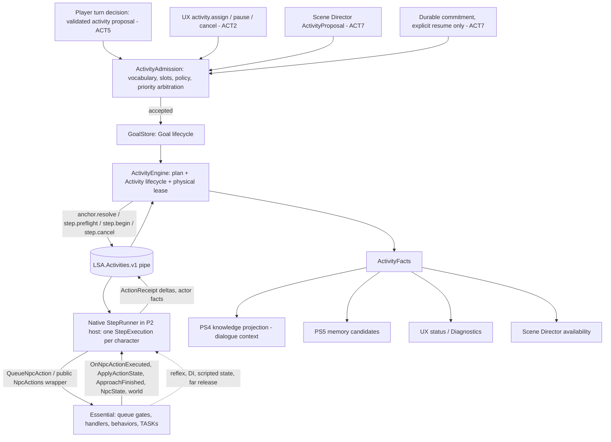

# LSA Activities / Goal Execution — architecture investigation

Research only. This is a repo-backed design for a future subsystem, provisionally named **ACT** (Activities / Goal Execution). No production code, configuration, deployment or GTA session was changed or run. The design is **PROPOSED**. Facts about current code and the pinned Essential binary carry evidence labels.

Machine-readable companions on this branch:

- [activity-capabilities.v0.json](activity-capabilities.v0.json): a draft capability registry, one row per activity capability. It is a proposal, not a runtime contract.
- [activity-native-evidence.json](activity-native-evidence.json): new static evidence gathered for this investigation, with tokens, IL offsets, decoded strings and pins.
- [activity-native-tools/](activity-native-tools/README.md): how to reproduce that evidence. The scripts extend the existing `action-native-tools` decoders; they do not replace them.

Evidence labels (same vocabulary as the action audit):

- **PROVEN**: established by current source, pinned metadata or IL, or an executed offline check. Static proof is not GTA behavior.
- **STRONGLY SUPPORTED**: the evidence agrees, but a named runtime detail has not been tested.
- **INFERRED**: a reasoned consequence that holds only under stated conditions.
- **UNKNOWN**: the evidence is insufficient. Features that depend on it stay off.
- **PROPOSED**: a design choice, budget or contract in this document.

## Inspected baseline

| Item | Pin / state |
| --- | --- |
| `origin/main` | `6ae6bc99c82a2d78ec1fea1091e4f8116f0c7257`: UX phases 2–3 merged on top of P0/P1/P2, E1–E6 and PS0/PS1 |
| Rebased PS2 branch | `feature/ps2-witness-rules-episode-correlation` at `5ea77f8d28833a439da1370aa5bdada31e53c45f`. Its merge base is `main` (`6ae6bc9`). `rebase/ps2-onto-ux-20261004` points exactly at `main` and has no PS2 commits; it is only the rebase target |
| Action audit | `research/essential-action-completion-audit-20261003` at `8e823310a41cac6529c5441a3286938f102229e7` |
| Perception / Scene Director | `research/perception-salience-scene-director` at `be6b562…`. PS2 speech extension on `research/ps2-proximity-chat-speech-plan` at `e1d0bd1…` |
| Identity / memory research | `research/session-identity-memory-architecture-20261002` at `ebc42bf…`; `research/remaining-native-context-audit` at `912ec12…` |
| Essential Hotfix #3 DLL | SHA-256 `9b6de42d4c464901d859dd95e17e100e4fa9ef6074bfbb0cf3a57a76f6ddd653`. Re-hashed from `lsa-essential-e1-candidate/upstream/LosSantosAlive.dll` |
| Stock server bundle | SHA-256 `5d81de4217bd103316a1083e482ded1bddc791314abf671d686036175c0475f2`. Re-hashed |
| Offline checks run here | `main`: `node tools/runTests.mjs`, **361 passed, 0 failed**. Rebased PS2 branch: **370 passed, 0 failed**. This re-runs the suite after PS2's corrective commit `5ea77f8`, which the PS2 checklist asked for. The pinned IL extractor reproduced **651 types / 5,588 methods** (`ActionNativeAudit`, .NET 10). Neither check runs GTA or a provider |
| Live GTA evidence reused | `docs/E6-GTA-verification-2026-10-01.md`: the accepted actions are followed in the native log by seat entry, ambient-drive resume and a `WaitHere` interrupting the drive. Branch `acceptance/ps-fiber-fix-log-20261003-1645` (`acceptance-logs/RagePluginHook-fiber-fix-20261003.log`): about 36 integration `Update` calls/s (`update_calls` 217 → 2,020 over 50 s), a snapshot cadence of about 200 ms, a steady-state PS `update_us` of 275–833 µs after a 22 ms first update, and **Smart Vehicle Entry** loaded next to LSA |

In this document, `src/…` means `lsa-essential-e1-candidate/src/…`. `native/…` paths are relative to the repository root.

---

## 1. Executive conclusions

1. **Split the work into three layers, and give each lifecycle exactly one owner.** The companion (`src/activities/`, proposed) owns *Goals* and *Activities*: the plan, priority, continue/retry/replan/abandon decisions, and pause and resume. A native **StepRunner** inside the existing P2 RAGE host owns *one step execution at a time per character*: preflight, dispatch through Essential, evidence, supersession detection and step deadlines. Essential owns *execution*: the queue, handlers, behaviors and tasks. The Scene Director only *proposes*; salience and memory only *read and receive facts*. Profiles hold durable canon only.

2. **ACT is not a task scheduler.** Every physical effect goes through an existing Essential entry point: `NpcActionQueue.QueueNpcAction(action, parameter, targetDescription, sourcePed, exactTargetPed)` (public; it applies the queue's role, state, duplicate, exact-target and reflex-lock gates), or the public `NpcActions` wrappers that P2 already uses. Essential's own `Behavior.Update` loops keep modes alive. StepRunner never re-issues TASK natives. The one exception, coordinate navigation, needs a separately gated extension (conclusion 4).

3. **Correction to the action audit: the activity queue and the destination state machine are vestigial in the pinned Hotfix #3 binary.** **PROVEN** by field cross-references:
   - The only writers of `NpcActivityQueueItem.Started` / `Completed` (`0x40002b2` / `0x40002b3`) are its constructor; nothing reads them.
   - Apart from the `NpcState` constructor allocating an empty `ActivityQueue`, `ActivityQueue` / `CurrentActivity` / `ActivityInProgress` / `HasActivityQueue` are only cleared, by `0x60002cb` (`Queue.Clear`, `false`, `null`). Nothing ever enqueues or sets them.
   - `WalkToDestination` / `DriveToDestination` / `HasDestination` / `DestinationPosition` / `DriveDestination` are only written by `ClearDestinationFlags` (`0x60002cc`) and `ClearVehicleIntentFlagsOnly` (`0x60002ff`).
   - No registrar registers `walktodestination` / `drivetodestination` / `performactivity*`, and the queue processor (`0x6000214`) has no special case for them.
   - `DestinationResolver.TryResolve` (`0x600069a`) has **no callers**.

   The audit's "activity queue is the best existing long-running completion system" and "WalkTo/DriveTo: state machine yes" are therefore wrong for this binary. Those capabilities **do not exist** and cannot simply be exposed.

4. **Civilian Essential has no executor for "walk to a point" or "drive to a point".** **PROVEN** from the TASK-native inventory:
   - `TASK_FOLLOW_NAV_MESH_TO_COORD` appears only in `DirectedInteractionManager` and hostage positioning.
   - `TASK_VEHICLE_DRIVE_TO_COORD_LONGRANGE` appears only in the scene-owned `HostageResponseDriving`.
   - `StartDriving` issues `TASK_VEHICLE_DRIVE_WANDER` (free drive, no destination).

   "Drive to the store" therefore needs a **new registered extension capability** (`NpcActionRegistry.Register`), as the roadmap already anticipates. It is phased late (ACT6) and gated on GTA probes. Destination *resolution* does exist natively and is read-only: `LocationResolver.Resolve(query, ped)` over a populated registry (convenience stores such as "LTD Davis", banks, bars, police stations, barbers and others), and `DestinationResolver.TryResolve("waypoint"|zone)`.

5. **Usable native long-running seams exist, but none of them signals completion.**
   - `ResumeActivityBehavior` is a real "go back to what you were doing" lifecycle. It walks back to the remembered spot or re-enters the remembered vehicle, restores the heading, then resumes a scenario or wanders, with timeouts.
   - `NpcActions.UseScenario` / `UseScenarioAtPosition` start `TASK_START_SCENARIO_*` with `teleport=false`, so the ped walks to the point first.
   - `ApproachTarget` and its `ApproachFinished` event remain the only per-action completion event. They have several acceptance paths, including "no-progress arrival accepted" (**PROVEN** strings).

   Completion must come from per-family world adapters. `PedContinuityMemoryService.TryGetMemory` is public and exposes the remembered spot and vehicle, which gives the resume adapter a target.

6. **ActionReceipt becomes the step-execution record, produced natively.** States: `REQUESTED → VALIDATED → DISPATCHED → HANDLER_ACCEPTED → MODE_ESTABLISHED | PHYSICALLY_COMPLETED`, with terminal outcomes `REJECTED`, `FAILED`, `CANCELLED`, `SUPERSEDED`, `TIMED_OUT` and `DETACHED`.
   - `HANDLER_ACCEPTED` comes from `OnNpcActionExecuted(ped, canonical, true)`. **PROVEN** in this investigation: the callback receives the *canonical* registry name (`TryExecute` `IL_01cf`–`IL_01d6`). For executor-only paths it comes from `IActionStateModifier.ApplyActionState(…, AfterCoreStateRule)`.
   - Mode capabilities never produce `PHYSICALLY_COMPLETED`.
   - Goals, activities, steps, receipts, mode health and predicate verdicts each have **separate** enums.

7. **Detecting supersession is feasible without patching Essential.**
   - Nearly every `NpcActions` command runs through a shared executor (`0x60002f7`): prepared-state promotion, a per-handle command-generation bump, exclusive-control acquisition, `NotifyPedControlChanged(true)`, then `ApplyActionStateModifiers` before and after the body. Queue dispatch (`0x6000218`) applies the same modifiers around `TryExecute`. The exceptions are `UseScenario*` (N18) and the reflex variants (N9).
   - An `IActionStateModifier` on the existing P2 integration therefore sees every executor- or queue-routed Essential command for a character. A command that StepRunner did not issue marks the current receipt `SUPERSEDED`.
   - Reflex variants (`*FromReflex`) bypass the executor and are caught from `NpcState` reflex fields instead.
   - Exactly how many callbacks each path delivers is a GTA log probe (Q2).

8. **Essential releases distant peds; ACT must respect this.**
   - **PROVEN** (`0x6000311`, distance² ≥ 10,000): a controlled ped is handed back to GTA, its secondary task cleared and its `NpcState` removed when it is at least **100 m** from the player and has no "control intent". The intent flags are read by `0x60002dc` and include `StayUnderLsaControl`, the follow, approach, chase, cover and sit modes, and the vehicle-intent flags.
   - Long activities are therefore only for **owned (promoted) characters** with `StayUnderLsaControl` set. That is exactly what P2 follow/wait already does.
   - Activities for ambient NPCs are out of scope in v1. A far-release is a terminal `control_released` outcome, never a silent failure.

9. **Planning is hybrid and closed.** v1 creates activities from the UX only. Later, the model may *propose* an intent from a closed vocabulary (`hold_position`, `board_vehicle`, `vehicle_trip` and others) with typed slots that reuse the turn's P0-validated `P###`/`V###` aliases and closed place and scenario words. A deterministic planner expands the intent from fixed templates, and the native side validates and executes. The model never supplies coordinates, natives, task names, handles, registry names, scripts or step lists.

10. **Interruption is modelled as pause or cancel in the companion over a terminated native step.**
    - Native Essential behaviors are never "paused". Resuming an activity always means a **new** execution of the current step after a fresh native preflight against the *same* retained anchors.
    - Automatic resume is allowed only for transient interrupts (the player's own turn, a cleared reflex, preemption by a short higher-priority activity), within bounded windows and counts.
    - Scripted, mission, ownership and player-switch interrupts need explicit player resume, which mirrors P2's "no automatic rejoin". Directed interaction is in this group too: P2's `Update` already suspends an owned character whenever `Safe()` fails, and `Safe()` includes `InDirectedInteraction`.
    - Nothing ever retargets to a new incarnation.

11. **"Resume" means two different things, and the design keeps them separate.**
    - *Ambient resume* is Essential's native `resumeactivity`. It returns an NPC to the GTA activity it had before the interaction, using continuity memory. The memory service holds a 120,000 ms constant (`0x60006bf`), most likely its expiry horizon; R1 confirms it.
    - *Activity resume* is ACT resuming its own interrupted plan.
    - "Resume what you were doing after talking to me" maps to activity resume if an ACT activity was paused by the conversation, and otherwise to the `resume_previous` intent, which is ambient resume.

12. **Scene Director boundary.** The director proposes `ActivityProposal`s; it never dispatches. ACT owns physical execution through a per-character *physical lease*. Speech stays with Essential turns and PS6 speech reservations. Speech and physical initiative therefore cannot race over the same resource. This supplies the "action intents beyond speech" that PS8 needs, so **CUSTOM ACTIONS / ACTIVITIES is not strictly after SCENE_DIRECTOR**: player-assigned activities (ACT0–ACT5) can proceed in parallel with PS3–PS5.

13. **Persistence is conservative.** ACT0–ACT6 persist nothing. Only ACT7 adds durable *commitments* and a player-set home anchor to the P2 profile, and it rides on the PS5 schema migration instead of adding a second version bump. Commitments never auto-execute after reload, summon or restart. Handles, anchors, tokens, executions, receipts, epochs and turn identities are never persisted.

14. **Every lifecycle is bounded.**
    - Limits: one active activity per character; at most 4 characters with activities; at most 6 steps per plan; 1 retry per step, 2 alternatives, 1 replan, 3 resumes and 8 executions per activity.
    - Deadlines are enforced natively in game time for steps and in the companion for activities and goals.
    - The engine itself makes zero model calls in every phase.
    - Target added cost is ≤ 0.25 ms p95 per `Update`.
    - These limits rule out "chases forever".

15. **Two small existing defects were found.**
    - PS1's `IntelligenceIntegration.OnNpcActionExecuted` maps `"follow"` and `"wait"` (`native/intelligence/IntelligenceIntegration.cs`, line 282 on `main`, line 318 on the PS2 branch), and the companion validator expects the same names (`src/perception/contracts.mjs`, line 31 on both). The callback actually delivers `followtarget` / `waithere`, so every action callback is classified `other`. **PROVEN**; a low-severity fix belongs with PS work.
    - The perception design document's description of P2 dialogue projection ("first three memories, 4 KiB") is stale. `main` now uses a 16 KiB canon budget ordered by importance (`src/characters/sessionProfiles.mjs`, line 68).

---

## 2. What existing research already proves

### 2.1 Reused facts

| Source | Fact reused here | Label |
| --- | --- | --- |
| Action audit, §1/§6 | `TryExecute == true` and `OnNpcActionExecuted(…, true)` mean the handler accepted the action. Core handlers mostly call a wrapper and return `true` | PROVEN |
| Action audit, §3/§16 | Stock `wb` returning true only means a WebSocket `npcAction` send. Only `approachperson` carries turn/generation IDs into the plugin | PROVEN |
| Action audit, §8.1 | Mode flags are intent. `Update` loops keep re-issuing tasks while a flag stays set | PROVEN |
| Action audit, §8.3 | `MovementBehavior.ApproachFinished(Ped, Ped, bool, string)` exists. It carries no turn/generation, and its stale-safety is UNKNOWN | PROVEN / UNKNOWN |
| Action audit, §11 | Public Stop/Clear APIs exist (`ClearFollowFlags`, `StopAllVehicleCommands`, `ReleaseExclusiveControlForExternalSystem` and others). Cancellation is not symmetric; for example, destination drive survives `StopAllVehicleCommands` (moot, since destination drive is vestigial) | PROVEN |
| Action audit, §12 | Seat success is a world postcondition. Ordering-dependent vehicle entry was seen live in P2 | PROVEN / live |
| Action audit, §15 | Stock actions do **not** inherit P2's mission/cutscene guard | PROVEN |
| Action audit, §17/§18 | Generic receipt states run through handler acceptance; physical completion needs per-family adapters | PROVEN design input |
| Perception research, §9–§11 | The Scene Director owns eligibility, speech reservations and policy, never ped tasks. Priority is native safety → player input → active dialogue → urgent → routine. Ticketed intake for special turns. PS8 owns the action intents | PROPOSED (adopted) |
| Perception research, §3, plus PS2 branch | `EventEpisode` / per-observer `Observation` contracts with an `action_observed`, `activity_changed`, `location_changed`, `vehicle_transition` vocabulary. Witness rules and RAM anchors (`captureRef`) | PROVEN on the PS2 branch, offline |
| Identity research, §6 | Commitments separate requested, accepted, delivered, attempted, fulfilled and failed. Durable intent is a goal, not saved execution authority. Replan from a fresh snapshot after rebind or restart | PROPOSED (adopted) |
| Identity research, §5/§7.4 | Never resolve "current character for this ped" late. No retargeting to a new incarnation. Freeze aliases and re-check at time of use | PROPOSED, implemented by P0/P1 |
| P0 (`main`) | Immutable turn snapshots. `validateStockDecision` / `validateTurnAction` compare reasoning-time with time-of-use `P###`/`V###` bindings (`src/context/decisionValidator.mjs`; `tools/buildCandidate.mjs`, lines 76–77 and 128) | PROVEN |
| P1/P2 (`main`) | Owner incarnation tokens, `Encounter` (`Id`, `OwnerAlias`, `OwnershipToken`, `Registration.IncarnationId`, `Created`, `Suspended`, `Mode`). `Safe()` guards cutscene, switch, mission flag, network, foreign mission entity and directed interaction. `Suspend()` clears only LSA flags. Dismiss calls `ReleaseExclusiveControlForExternalSystem(ped, …, false)` (`native/promoted-characters/PromotedCharactersIntegration.cs`) | PROVEN |
| P2 (`main`), `PromotedCharactersIntegration.Update` (line 122) | Every tick, any registered encounter whose `Safe()` fails is `Suspend()`ed: cutscene, player switch, mission flag, network session (`Scripted()`, line 86), foreign mission ownership, or `InDirectedInteraction` (line 87). `OnPedControlChanged(false)` also suspends (line 283). A game-clock regression runs `ResetForClockDiscontinuity`, which retires every encounter and recreates the control channel. `PerceptionRoster()` (line 44) defines the exact "still the same owned incarnation" predicate (`ReferenceEquals(Registration)`, same address, owner claim with the same `incarnationId`) | PROVEN |
| PS0/PS1 (`main`) | One factual output-only pipe (`LSA.Intelligence.v1`). Retained `EntityAnchors` with `captureRef`. Lifetime retirement on wrapper/address/owner change. At most 16 observers and 256 anchors. 1 ms Update guards | PROVEN offline; GTA pending |
| UX phases 0–3 (`main`) | `CommandEnvelope v1` with `expect.encounterId`, `LocalCommandQueue`, the catalog `contracts/commands.v1.json` (19 commands, 6 classes, fixed reasons), the native menu's Current NPC / Characters / Diagnostics pages, and "never a model tool" | PROVEN offline; GTA pending |

### 2.2 New static evidence from this investigation

All items come from the pinned DLL, extracted with the audit's own `ActionNativeAudit` and decoders plus the new query script. Tokens are listed in [activity-native-evidence.json](activity-native-evidence.json).

| # | Finding | Label | Consequence |
| --- | --- | --- | --- |
| N1 | `NpcActivityQueueItem.Started` / `Completed` are written only by `.ctor 0x6000455` and never read | PROVEN | No activity completion event or field is usable |
| N2 | `ActivityQueue` (`0x4000250`) is allocated by the `NpcState` constructor (`0x6000450`) and otherwise only read by `0x60002cb`, which clears it. `CurrentActivity`, `ActivityInProgress` and `HasActivityQueue` are only written there (null / false); their readers (`0x60002d6`, the control-intent check `0x60002dc`, `0x60002dd`, the debug overlay) therefore always see empty values | PROVEN | The native activity queue is vestigial |
| N3 | The destination flags and positions are written only by the two `Clear*` helpers. `DestinationResolver.TryResolve` has no callers | PROVEN | WalkTo/DriveTo are vestigial. Destination resolution still works as a read-only resolver |
| N4 | TASK inventory: no navigation-to-coordinate or drive-to-coordinate tasks in civilian behaviors. `StartDriving` → `TASK_VEHICLE_DRIVE_WANDER` (`0x6000989`) | PROVEN | Point-to-point navigation needs an extension |
| N5 | `TryExecute` passes the entry's canonical name (`f0x400073c`) to `NotifyNpcActionExecuted` (`IL_01cf`/`IL_01d6`), both on success and in the catch path | PROVEN | Receipts correlate on canonical names. The PS1 mapping is wrong |
| N6 | `HandleBridgeTextMessage` (`0x6001517`) routes `approachperson` to `ApproachCoordinator.Start` / `ReportImmediateFailure("target_not_found")` and everything else to `NpcActionQueue.QueueNpcAction`. `0x6001523` is a parameter-bearing-action predicate called by the parser `0x600151e`, **not** a special-case router | PROVEN | Corrects the audit's §3 row "BridgeMessageRouter destination/activity special cases" |
| N7 | The queue (`0x6000213` → `0x6000214`) is drained from `GeminiVoicePlugin.Main` (`0x60010b1`). It special-cases `takecover` (`NpcActions.TakeCover`) and the `resumeactivity` / `continueactivity` / `returntoactivity` family. Stateful duplicate suppression covers `waithere`, `takecover`, `followtarget`, `followplayer`, `driveevasive`, `drivenormal`, hands up/down, kneel, getup and `stopdirectedinteraction` (`0x600021a`). It enforces target establishment, roles, state blocks and reflex locks, then `ApplyActionStateModifiers` + `TryExecute` (`0x6000218`) | PROVEN | Dispatching through the queue inherits all of Essential's gates. A dispatch that duplicates the current mode yields **no** callback, so preflight must detect "already satisfied" |
| N8 | Executor `0x60002f7` runs, in order: `GetPreparedState` (`GetStateForActiveBehavior`), `BumpBehaviorCommandGeneration` (a `Dictionary<UInt32,Int32>` keyed by handle), clear pending vehicle exit, `AcquireExclusiveControl` (`SetControlledBrain` + `NotifyPedControlChanged(true)`), modifiers (Before), body, modifiers (After), `RefreshControlledBrain`. The deferred executor `0x60002e4` funnels into it | PROVEN (section strings `00.GetPreparedState` … `08.AfterRefreshControlledBrain`) | Supersession signal. Every executor command promotes the ped and takes exclusive control |
| N9 | Deferred-executor (`0x60002e4`) command names and vehicle policies: `FollowTarget` 0; `ApproachTarget`, `LeanAgainstVehicle`, `SitOnGround`, `WalkAwayFromTarget` 1; `TakeCover`, `ChaseTarget`, `FleeFromTarget` 2; `StartDriving`, `StopAndFaceTarget`, the three `Enter*`, `DriveEvasive`, `PutHandsUp`, `ResumeActivity` 3. `WaitHere`, `GoTalkToNearestPed`, `ExitVehicle`, `GetUp`, `DriveNormal` and the item verbs call the immediate executor `0x60002f7` directly, with no vehicle policy. Reflex variants such as `PutHandsUpFromReflex` (`0x6000282`) do **not** use the executor | PROVEN (commands.py + call scan) | The capability table records which steps force a vehicle exit first (policies 1/2). Reflex takeovers bypass the modifier callbacks, so they have to be detected from `NpcState` reflex fields |
| N10 | `UseScenario*` (`0x6000254`/`0x6000255`): `CLEAR_PED_TASKS` + `CLEAR_PED_SECONDARY_TASK`, then `TASK_START_SCENARIO_AT_POSITION(ped, name, x, y, z, h, -1, true, false)` or `…_IN_PLACE`, then `SET_BLOCKING_OF_NON_TEMPORARY_EVENTS` and `SET_PED_KEEP_TASK`. No mode flag is set | PROVEN | Native "go there and do X" for short ranges (GTA probe S1). Without a control-intent flag the ped can be far-released |
| N11 | `ResumeActivityBehavior` keeps private per-handle state with a phase (`None`, `WalkToRememberedActivity`, `EnterRememberedVehicle`). It re-enters the vehicle (driver: wander drive + keep task; passenger: release), walks back (`TASK_GO_STRAIGHT_TO_COORD`), restores the heading, maps activity text to scenarios (20 names, including every `ScenarioId` target ACT uses) and falls back to wander. Its literal constants include 12,000 / 15,000 / 2,500 / 750 (millisecond-like) and 1.0 / 1.15 / 2.0 / 18.0 / 85.0 (distance-like); the log strings name walk and vehicle-entry timeouts | PROVEN (strings, enum); timeout values STRONGLY SUPPORTED | `resume_previous` capability. Completion is judged against `PedContinuityMemory` |
| N12 | Approach acceptance strings: "immediate arrival reached", "no-progress arrival accepted", "GTA task ended near target; accepting arrival", "task no longer assigned; reissuing". The plugin sends `npcApproachCompleted` / `npcApproachFailed` (`BuildApproachResult`, `0x60014fc`). The stock server keeps a turn-scoped approach **playback gate** (`EP`/`xy`) that opens on the result and drops a `STALE_APPROACH_RESULT` whose target does not match | PROVEN | `ApproachFinished(true)` is medium evidence until a distance check passes. The gate is the native precedent for "act, then speak" |
| N13 | Far release `0x6000313`/`0x6000311`: with no control intent (`0x60002dc`) and distance ≥ 100 m, Essential clears runtime control, calls `CLEAR_PED_SECONDARY_TASK` and `SetControlledBrain(false)`, sends `NotifyPedControlChanged(false)` and removes the state. Dead peds are released through `0x60002c6` | PROVEN | ACT bubble rule and terminal reason `control_released` |
| N14 | `PedContinuityMemoryService.TryGetMemory(Ped, ref PedContinuityMemory)` is public. It returns the remembered vehicle (`RecentVehicleMemory`: handle, seat role, last seen) and the interaction activity (`InteractionActivityMemory`: activity text, position, heading, last seen). A private helper (`0x60006bf`) holds a 120,000 ms constant, most likely the expiry horizon | PROVEN (metadata); horizon STRONGLY SUPPORTED | Target state for the resume adapter. Memory older than about 2 minutes should be treated as absent until R1 |
| N15 | Ten location registries are populated (`LosSantosAlive.Locations.Registries.*`): convenience stores (first entry "LTD Davis"; the strings "store" and "gas station" are present), banks, bars and clubs, barber shops, clothing stores, subway stations, Ammu-Nation and police stations, plus the scene registries `DrugDealLocations` and `MiscCalloutLocations` | PROVEN | Closed `named` place slots can resolve to native locations. The two scene registries are excluded from ACT place resolution by policy |
| N16 | Default `NpcItemStore` items: CannedGoods, Donut, BreakfastSnack, Snack, Soda, Beer, Coffee, Liquor, EnergyDrink, Water. **There is no cigarette** | PROVEN | "Smoke" must use the `WORLD_HUMAN_SMOKING` scenario, not an item |
| N17 | `IntegrationManager.ApplyActionStateModifiers` (`0x6000c12`) walks the registered `List<IIntegration>` (`f0x40007b3`), skips integrations whose `IsAvailable` is false, and calls `ApplyActionState` on each one that `isinst IActionStateModifier` (`IL_0142`). Each call has its own try/catch that logs `[LSA Integrations] ApplyActionStateModifiers failed for {Id}`. Its only callers are the queue (`0x6000218`, two sites) and the executor (`0x60002f7`, two sites). `NotifyNpcActionExecuted` (`0x6000c11`) is called only by `TryExecute` (two sites). `IActionStateModifier` and `ActionStateModifierPhase` (`BeforeCoreStateRule = 0`, `AfterCoreStateRule = 1`) are public types in the global namespace | PROVEN | The P2 integration that `RuntimeEntry` already registers can implement the interface; no new Essential registration is needed. Exceptions are contained by Essential, but StepRunner still catches its own |
| N18 | The public `NpcActions.UseScenario(Ped, String)` / `UseScenarioAtPosition(Ped, String, Vector3, Single, String)` (`0x6000252` / `0x6000253`) go to `0x6000254`, which does **not** use the shared executor. It runs its own preparation instead: `GetPreparedState` (`0x60002fa`: `GetStateForActiveBehavior` + first-takeover `0x60002fe`), a partial mode clear (`0x600031c`: `DirectedInteractionManager.ForceStopInteractionForPed`, `ClearComplianceFlags`, `ClearDestinationFlags`, `ClearExplicitVehicleEnterFlags`, `ClearHostileFlags`, `ClearMovementActionFlags`, stop-and-face flags), a forced vehicle exit with a settle delay when seated (`0x60002fc`), then `0x6000255`: `PreparePed`, `ApplyControlledBrainIfChanged(ped, true)` (`0x6000309`), `ApplyScenarioFriendlyBrain` (`0x6000258`: `IsPersistent`, `BlockPermanentEvents`, `KeepTasks`, flee attributes, ambient-anim flags) and the scenario natives (N10). **Not cleared:** follow flags, `TakeCoverMode`, vehicle-intent flags | PROVEN | A scenario step produces no modifier callback and no command-generation bump. It ends approach, chase, pose, hostile and directed-interaction modes by itself, but not follow, cover or vehicle intents, hence precondition `no_essential_mode` for those three. Acceptance is the wrapper's return; loss is detected through `IS_PED_USING_SCENARIO` (S1) |
| N19 | `NotifyPedControlChanged` (`0x6000c10`) is called by the dead-release path (`0x60002c6`), exclusive-control acquisition (`0x60002ea`), `ReleaseExclusiveControlForExternalSystem`, `ApplyControlledBrainIfChanged` (`0x6000309`), far release (`0x6000313`) and `Cleanup` | PROVEN | Every control release reaches P2's `OnPedControlChanged(false)`, which suspends the encounter. ACT observes releases through P2's `Suspended` flag and does not need its own release hook |
| N20 | `LocationResolver.Resolve(query, ped)` returns a `LocationDefinition` with `Name`, `Zone`, `Aliases`, `Categories`, `IntentTags`, `ReferencePoint`, `InteriorId`, `Description` and `ActivityPoints`. Each `ActivityPoint` has `Name`, `Position`, `Heading`, `IntentTags`, `RequiredAccessTags`, `HiddenFromDestinationResolvingIfUnauthorized`, `UnauthorizedLabel`, `Activities`, `Items` and `OccupiedByPedHandle`. Some activity points are crime-themed (for example "Rob Cash Register", "Rob Safe" in the convenience-store registry). `DestinationResolver.TryResolve(string, out Vector3)` is public | PROVEN (metadata + strings) | In v1 a place anchor is only the location's `ReferencePoint`. Activity points are not used (they carry crime activities, access tags and Essential-owned occupancy). ACT never writes `OccupiedByPedHandle`. Interior locations are `place_unsupported` until L1 |
| N21 | `NpcActionRegistry.Register(string, IEnumerable<string>, NpcActionHandler)` and `HasAction(string)` are public. `NpcActionHandler.Invoke(NpcActionContext) → bool`, where `NpcActionContext` carries `RawAction`, `ActionName`, `Parameter`, `SourcePed`, `TargetPed`, `State`. `NpcActions.PreparePed`, `SetControlledBrain` and the `Clear*Flags(NpcState)` helpers are public; the shared executor (`0x60002f7`) is not | PROVEN (metadata) | An ACT6 extension can be registered and dispatched through the queue like any Essential action, so it inherits the queue gates, modifier callbacks and `OnNpcActionExecuted`. It cannot call the executor, so it neutralizes other modes through a public command first (§14.7) |

### 2.3 Corrections to prior documents

| Document | Statement | Correction |
| --- | --- | --- |
| Action audit §1.5, §14, §19 Y1, §20 B, catalog `performactivity*` | "The activity queue is the best existing long-running completion system"; `Started`/`Completed` usable | Vestigial (N1, N2). Treat `performactivity*` as **missing**. Delete probe Y1 and replace it with R1 (`resumeactivity`) and S1 (scenario) |
| Action audit §5, §20 B/D, catalog `walktodestination`/`drivetodestination` | "WalkTo/DriveTo: state machine yes … B after arrival adapter" | No producer and no executor (N3, N4). Reclassify as **missing; needs a registered extension** (ACT6). Probe D1 can only be run after ACT6 |
| Action audit §3 table | "BridgeMessageRouter destination/activity special cases (`0x6001523` equality list)" | `0x6001523` is the parser's parameter-bearing predicate. Routing special-cases only `approachperson` (N6). The queue special-cases `takecover` and `resumeactivity` (N7) |
| Action audit §17 | "Activity → `NpcActivityQueueItem.Completed`" adapter | Remove. Use `ResumeAdapter` (continuity memory + world) and `ScenarioAdapter` instead |
| Hotfix #3 API analysis §3 "Design rule" | "Put long-running execution in our own state machine/fiber" | For ACT: long-running *physical* execution stays in Essential behaviors. ACT keeps *step sequencing and evidence*, not a task loop. Narrow extension behaviors are allowed only in ACT6, under §14's rules |
| Perception research §8 | "Current `narrativeProfile` selects the first three `selectedForContext` memories … 4-KiB byte guard" | Stale since `c9a856b`. `main` projects all selected memories by importance within a 16 KiB canon budget (`src/characters/sessionProfiles.mjs`, lines 68 and 105–160). ACT's dialogue block gets its own small budget (§11.3) |
| Perception research §9 table "Follow/wait or flee: PS8 may request one currently permitted DO command" | Raw DO commands from the director | Director physical intents go through ACT proposals so they get receipts (§10). Raw DO commands stay player-turn only |
| ROADMAP ordering | `… SCENE_DIRECTOR → CUSTOM ACTIONS / ACTIVITIES` | Player-assigned ACT0–ACT5 does not depend on the director and can run alongside PS3–PS5. Director proposals (ACT7) depend on PS6/PS8 |
| Identity research phase names P3–P8 | Planned names `P6` commitments and `P8` autonomous intents | Superseded by the PS plan plus ACT. Commitments → ACT7 + PS5. Autonomous intents → PS8 via ACT7 |
| PS1 status / code | Action callbacks classified as follow/wait/other | All classify as `other` (N5). Fix the mapping to canonical names (`followtarget`, `waithere`) with a contract version bump |

---

## 3. Remaining unknowns

Static evidence settles *what exists*. The items below need a GTA observation (IDs refer to §19) or remain policy choices. A feature that depends on an unresolved item stays **off** or runs in shadow mode.

| ID | Unknown | Why it matters | Settled by | Blocks |
| --- | --- | --- | --- | --- |
| U1 | Does `NpcActionQueue.QueueNpcAction(…, sourcePed, exactTargetPed)`, called from the P2 host's `Update`, behave exactly like bridge dispatch? (Same tick or next main-loop tick; exact-target establishment; callbacks.) | It is the primary dispatch path | Q1 | ACT2 dispatch |
| U2 | How many `ApplyActionState` Before/After callbacks does each path deliver per command (queue vs immediate vs deferred executor), and in what name format (canonical such as `followtarget` vs executor names such as `FollowTarget`)? | Precision of supersession detection | Q2 | ACT1 shadow accuracy |
| U3 | Does a player turn (marking, talking, playback, `ConversationLookBehavior`) stop or alter the target's primary mode or task? | Whether `player_turn` is a soft or hard interrupt | PT1 | ACT4 interrupt policy |
| U4 | Can `ApproachFinished(true)` be stale, and how far from the target can a "no-progress arrival" be? | Strength of the approach adapter | A1 (audit) | `approach_person` strong evidence |
| U5 | Seat-entry ordering race. Does Smart Vehicle Entry intercept NPC or companion entry? | Vehicle family reliability | V1–V3 (audit), SVE1 | `board_vehicle`, `ride_along` |
| U6 | `UseScenarioAtPosition`: how far the ped navigates, what happens on nav failure, the effect of the unconditional `sittingScenario=true`, and whether `IS_PED_USING_SCENARIO` is reliable on Enhanced | Feasibility of `scenario_at` and short-range "go there" | S1 | `scenario_at`, `move_to_and_hold` |
| U7 | How `ResumeActivity` ends (private state). The real continuity-memory horizon. Behavior when there is no memory | Resume adapter | R1 | `resume_previous` |
| U8 | Is far-release really suppressed for owned characters with `StayUnderLsaControl`? Streaming/despawn of addon-created vs adopted peds at long range | Bubble rule | FR1 | Any activity that leaves 100 m |
| U9 | Follow health: what `FollowPaused`, task loss and re-acquisition look like across vehicle transitions | Follow adapter `ModeHealth` | F1 (audit) | `accompany` |
| U10 | `TakeCover`: where it seeks cover from (player, threat or position), how long it holds, how it stops | Cover capability | C2 | `take_cover_and_hold` |
| U11 | Do queued stock actions still run while the mission flag is set or a cutscene plays? | Guard placement | M1 (audit) | All. ACT guards anyway |
| U12 | Handle reuse vs the per-handle dictionaries (command generation, exclusive control, `ResumeActivityBehavior`) | A theoretical stale-state carry-over | SK1 | None (monitor) |
| U13 | Can an extension navigation behavior coexist with Essential `Update` loops without fighting? (Task replacement, keep-task, arrival/stuck predicates, yielding to Essential commands.) | The `walk_to` / `drive_to` extension | NV1, NV2 | ACT6 |
| U14 | Does `walktodestination` sent through the queue log "Unknown NPC action ignored"? | Closes correction N3 empirically | W1 | None (documentation) |
| U15 | `LocationResolver.Resolve(query, actor)` ranking (nearest vs first), interior places, unauthorized points | Place-slot resolution | L1 | `vehicle_trip`, `go_to_place` |
| U16 | Thread and fiber for `OnNpcActionExecuted` / `ApplyActionState` (expected: Essential main loop) | Callbacks must not touch state off-fiber | Q2 (log thread IDs) | ACT1 |
| U17 | A model-turn `DO` aimed at an NPC that is in an activity | It should appear as `SUPERSEDED`(`superseded_player`) | PT1 / Q2 | ACT4/ACT5 |

---

## 4. Authoritative lifecycle and ownership

### 4.1 Single control flow



There is one path from intent to physical effect. Model turns that emit an ordinary stock `DO` keep the existing route (`output_transcript` → stock `Rb` → `wb` → plugin → queue). ACT observes those commands only as supersession of its own executions; it never routes them.

### 4.2 Owner per lifecycle

| Lifecycle / object | Sole owner | Other layers may | Must never |
| --- | --- | --- | --- |
| **Goal** (long-lived intent) | Companion `GoalStore` (`src/activities/goalStore.mjs`) | Admission creates it; the engine updates its status; facts read it | Native code never sees or interprets goals |
| **Activity** (plan instance, cursor, budgets, pause and resume) | Companion `ActivityEngine` (`src/activities/activityEngine.mjs`) | The director proposes; UX requests pause, resume or cancel; facts read it | Native code never advances a plan or starts a step on its own |
| **Step definition** (capability, args, predicates, retry and timeouts) | Companion planner (`intentTemplates.mjs`), validated against `capabilityRegistry.mjs` | Native code re-validates arguments | The model never supplies step lists |
| **StepExecution / ActionReceipt** | Native `StepRunner` (`native/activities/StepRunner.cs`) | The engine reads receipts and requests begin, cancel or detach | The companion never writes receipt states or fabricates evidence |
| **Individual action dispatch** | Essential, invoked by StepRunner through `QueueNpcAction` or public wrappers | — | No raw TASK natives outside an ACT6 registered extension |
| **Physical-completion evidence** | Native completion adapters (`native/activities/CompletionAdapters.cs`) | The engine consumes verdicts | Nothing upgrades `HANDLER_ACCEPTED` to completion |
| **Mode maintenance** (follow, wait, cover, scenario) | Essential `Behavior.Update` loops | StepRunner observes `ModeHealth` | StepRunner never re-tasks to keep a mode alive |
| **Cancellation of an ACT step** | Requested by the engine (policy) or StepRunner (safety, deadline, lease loss). Executed by StepRunner through the capability's cancel path, *only if its execution is still the current Essential command for that ped* | — | Cancelling or clearing an Essential command ACT did not issue. `CancelAll`, `CLEAR_PED_TASKS` |
| **Interruption detection** | StepRunner for native signals (supersession, reflex, directed interaction, scripted state, death, control release, anchor retirement). Engine for companion signals (player turn, director preemption, lease and epoch) | — | — |
| **Interrupt classification (pause vs cancel)** | Engine policy (§9) | — | Native code never decides whether to resume |
| **Resume** | Engine. Always a *new* execution after a fresh preflight | UX may request an explicit resume | Reusing an old `executionId`, or retargeting an anchor |
| **Failure recovery** | Engine (§13 budgets) | — | Unbounded retry, or a native retry loop |
| **Priority and eligibility of autonomous proposals** | Scene Director (PS6+) | Engine arbitration has the final say on physical leases | The director never dispatches or holds a step |
| **Witness knowledge of activity outcomes for *other* observers** | PS2 witness pipeline (native PS1 signals → `EpisodeCorrelator`) | ACT emits self facts only | ACT never injects observations for other NPCs |
| **Relevance** | PS3 salience | — | — |
| **Durable canon / commitments** | P2 `ProfileStore` (schema v2+ for commitments, ACT7) | The engine writes through the explicit internal transaction | No live state is persisted |
| **Character ownership and incarnation** | P2 `Encounter` plus P1 registration | StepRunner reads `OwnershipToken` / `IncarnationId` | ACT never promotes, summons, dismisses or despawns |
| **Speech / turns / playback** | Essential + E1–E6. PS6 tickets for the director | ACT reads turn begin/end for interrupts | ACT never allocates a turn, generation or audio |

### 4.3 Leases (preventing overlap at runtime)

- **Physical lease (per character).** The `ActivityEngine` holds at most one per character, recorded natively per `encounterId`. StepRunner accepts `step.begin` only for the current lease holder, `leaseId` and `leaseEpoch`. A P2 player control (`follow`, `wait`, `dismiss`, `despawn`), a model-turn `DO`, or any external Essential command for that ped preempts the lease. The engine learns about it from the receipt (`SUPERSEDED`) and the lease-change frame.
- **Companion lease (process liveness).** The companion sends `lease` heartbeats every 1 s, with a 5 s TTL. When the lease expires, StepRunner applies each running step's `onLeaseLoss` (`detach` or `cancel_if_current`) and refuses new steps until a fresh `hello`.
- **Speech lease** is not owned by ACT. It belongs to Essential turns and PS6 speech reservations. Speech and physical activity may proceed concurrently. Ordering requirements ("approach, then speak") follow the stock approach playback-gate pattern (N12) and are proposed for PS7/ACT7 only.

---

## 5. Exact proposed data contracts

All contracts are **PROPOSED** and versioned (`…Version: 1`). Validators are strict, closed-shape and fail closed, following the existing style of `src/perception/contracts.mjs` and `src/identity/identityContract.mjs`: an exact key set, bounded strings and integers, UUID v4 identifiers, and no arbitrary JSON. Every identifier below is a run-local random UUID unless marked *durable*. Times named `…Ms` are monotonic milliseconds in the producing process. Times named `…GameMs` are `Game.GameTime` (uint32, wrap-safe deltas; a regression means reset).

### 5.1 Controlled vocabularies

```ts
// Who asked. Closed.
type ActivitySource = 'player_ux' | 'player_dialogue' | 'scene_director' | 'commitment' | 'recovery';
//  player_ux: LSA menu / console / Studio `activity.assign` (ACT2)
//  player_dialogue: validated activity proposal from the player's own accepted turn (ACT5)
//  scene_director: PS6+/PS8 proposal (ACT7)
//  commitment: a durable commitment the player explicitly resumed (ACT7)
//  recovery: an engine-generated alternative inside an existing activity, never a new goal

// LSA arbitration classes, highest first. Essential reflex/self-preservation and
// scripted ownership are OUTSIDE this ordering and always win.
type PriorityClass = 'player_direct' | 'player_standing' | 'director_urgent' | 'director_routine' | 'ambient';

type GoalKind   = 'instruction' | 'reaction' | 'commitment' | 'routine';
//  instruction: player-sourced (UX or the player's own turn)
//  reaction: director-proposed, short (≤ 120 s), never persisted, abandoned once a player source touches the actor (ACT7)
//  commitment: resumed from a durable commitment by explicit player action (ACT7)
//  routine: reserved for a later phase (§10.7); rejected by every validator until then
type GoalStatus = 'proposed' | 'accepted' | 'active' | 'suspended' | 'satisfied' | 'failed'
                | 'abandoned' | 'expired' | 'superseded' | 'rejected' | 'cancelled';
type ActivityStatus = 'admitting' | 'running' | 'paused' | 'resuming'
                    | 'completed' | 'failed' | 'cancelled' | 'abandoned' | 'expired' | 'superseded';
type StepKind   = 'finite' | 'mode' | 'finite_then_mode' | 'instant';
type StepStatus = 'pending' | 'preflight' | 'executing' | 'holding' | 'done' | 'skipped' | 'failed' | 'cancelled';

// One action command's lifecycle (§7). Deliberately NOT reused for goals/activities/steps.
type ReceiptState = 'REQUESTED' | 'VALIDATED' | 'REJECTED' | 'DISPATCHED' | 'HANDLER_ACCEPTED'
                  | 'MODE_ESTABLISHED' | 'PHYSICALLY_COMPLETED'
                  | 'FAILED' | 'CANCELLED' | 'SUPERSEDED' | 'TIMED_OUT' | 'DETACHED';
type ModeHealth       = 'healthy' | 'degraded' | 'lost';            // only while MODE_ESTABLISHED
type PredicateVerdict = 'satisfied' | 'not_yet' | 'violated' | 'unknown';
type EvidenceStrength = 'weak' | 'medium' | 'strong';
type EvidenceKind =
  | 'preflight_satisfied' | 'queue_submitted' | 'wrapper_invoked' | 'handler_result' | 'modifier_after'
  | 'mode_flag' | 'task_status' | 'approach_event' | 'distance' | 'seat_occupancy' | 'vehicle_motion'
  | 'held_item' | 'scenario_active' | 'heading' | 'continuity_target' | 'control_changed'
  | 'reflex_active' | 'directed_interaction' | 'scripted_state' | 'anchor_retired' | 'deadline';

type InterruptKind =
  | 'player_turn' | 'player_command' | 'directed_interaction' | 'reflex' | 'injury' | 'death'
  | 'scripted_state' | 'player_switch' | 'vehicle_change' | 'target_lost' | 'ownership_change'
  | 'control_released' | 'preempted' | 'lease_lost' | 'clock_reset' | 'superseded_external';
type ResumePolicy   = 'auto' | 'auto_if_quiet' | 'explicit_only' | 'never';
type RecoveryAction = 'retry_once' | 'alternative' | 'replan' | 'defer' | 'ask_player' | 'abandon';
type OnComplete     = 'stay' | 'restore_companion_mode' | 'resume_ambient';
type OnLeaseLoss    = 'detach' | 'cancel_if_current';
```

**Reason codes** (`ReasonCode`, closed; `^[a-z][a-z0-9_]{0,47}$`; also reused for UX reason texts):

`already_satisfied`, `actor_not_owned`, `actor_unavailable`, `actor_dead`, `actor_retired`, `actor_injured`, `scripted_state`, `directed_interaction`, `reflex_active`, `on_foot_required`, `in_vehicle_required`, `driver_required`, `vehicle_invalid`, `vehicle_moving`, `seat_occupied`, `seat_unavailable`, `target_invalid`, `target_retired`, `target_out_of_range`, `place_unresolved`, `place_unsupported`, `capability_unavailable`, `capability_disabled`, `policy_denied`, `role_blocked`, `state_blocked`, `queue_not_accepted`, `handler_false`, `handler_exception`, `approach_failed`, `no_progress`, `navigation_failed`, `accept_timeout`, `establish_timeout`, `complete_timeout`, `hold_limit`, `activity_deadline`, `goal_deadline`, `superseded_player`, `superseded_essential`, `superseded_reflex`, `superseded_activity`, `control_released`, `far_release`, `lease_lost`, `epoch_changed`, `clock_reset`, `cancelled_by_player`, `cancelled_by_engine`, `preempted`, `stale_receipt`, `budget_exhausted`, `repeated_failure`, `bubble_exceeded`, `unsupported_combination`, `activity_busy`, `activity_limit`, `vehicle_mismatch`, `target_changed`.

### 5.2 Intents and slots (the only thing a model may propose)

```ts
type ActivityIntent =
  | 'hold_position'        // "wait here"                    (ACT2)
  | 'accompany'            // "come with me" / follow a person (ACT2)
  | 'resume_previous'      // ambient resume via resumeactivity (ACT2)
  | 'sit_here'             // sitonground mode                (ACT2)
  | 'scenario_here'        // "smoke here" (closed scenario)  (ACT3)
  | 'scenario_at'          // "go sit on that bench"          (ACT3, probe S1)
  | 'move_to_and_hold'     // "walk over there and wait"      (ACT3 short-range via scenario_at; ACT6 long-range)
  | 'approach_and_face'    // "go to Sofia" / "come here"     (ACT3)
  | 'hang_out_with'        // approach + face + hold near a person (ACT3; conversation is PS7)
  | 'board_vehicle'        // "get in that car"               (ACT3)
  | 'ride_along'           // board a passenger seat and stay with the player's vehicle (ACT3)
  | 'exit_vehicle_and_hold'//                                 (ACT3)
  | 'leave_scene'          // walk away from the player, then ambient resume (ACT3)
  | 'take_cover_and_hold'  // bounded cover mode              (ACT3, director_urgent/player_direct only)
  | 'go_to_place'          // "go to the store/home" on foot  (ACT6 extension)
  | 'vehicle_trip';        // "get in that car and drive to the store" (ACT6 extension)

type RefSlot =
  | { kind: 'turn_alias'; alias: string }              // ^[PV]\d{3}$ from the turn's frozen P0 reference map
  | { kind: 'player' }
  | { kind: 'current_vehicle' }                        // actor's own current vehicle
  | { kind: 'player_vehicle' }
  | { kind: 'ux_pick'; pickId: string };               // UUID minted by the native menu snapshot (ACT2+), never a handle

type PlaceSlot =
  | { kind: 'here' }                                   // actor's current position, captured natively at admission
  | { kind: 'named'; query: string }                   // ^[a-z0-9][a-z0-9 '\-]{0,39}$, resolved ONLY by native LocationResolver
  | { kind: 'waypoint' }                               // native DestinationResolver("waypoint")
  | { kind: 'home' }                                   // durable player-set home anchor (ACT7); otherwise place_unsupported
  | { kind: 'near_person'; person: RefSlot }
  | { kind: 'ux_point'; pickId: string };              // menu-picked point (ACT3+)

type ScenarioId = 'smoke' | 'drink_coffee' | 'phone' | 'lean' | 'stand_idle' | 'sit_bench' | 'clipboard' | 'binoculars';
// Closed map to GTA scenario names lives ONLY in the native capability table, e.g. smoke → WORLD_HUMAN_SMOKING,
// sit_bench → PROP_HUMAN_SEAT_BENCH, lean → WORLD_HUMAN_LEANING (the same names Essential's ResumeActivityBehavior uses).

type UntilClause =
  | { kind: 'player_returns'; radius: 'near' | 'medium' }   // 5 m / 15 m
  | { kind: 'duration'; bucket: 'short' | 'medium' | 'long' } // 60 s / 180 s / 600 s
  | { kind: 'player_command' }                               // until cancelled or superseded (still bounded by holdMaxMs)
  | { kind: 'arrival' };

type IntentSlots = {
  person?: RefSlot; vehicle?: RefSlot; seat?: 'driver' | 'passenger' | 'rear' | 'any_passenger';
  place?: PlaceSlot; scenario?: ScenarioId; until?: UntilClause;
};

type ActivityProposal = {
  proposalVersion: 1;
  proposalId: string;
  source: ActivitySource;
  subject: { characterId: string };            // durable P1 CharacterId; selects data only
  intent: ActivityIntent;
  slots: IntentSlots;
  priority: PriorityClass;                     // the engine clamps it by source (§10.3)
  origin: {
    turn?: { pedId: string; sessionNonce: number; turnId: string; generationId: number }; // player_dialogue only; checked with host.isCurrent
    uxRequestId?: string; directorTicketId?: string; commitmentId?: string;
  };
  proposedAtMs: number;
};
```

Rules: each slot key is allowed only by the intent's slot table (§8.3). Unknown keys are rejected. A `turn_alias` is valid only when it exists in that turn's frozen `referenceMap` **and** in `turn.metadata.targetReferenceBindings` (the same comparison `validateTurnAction` performs). `named.query` is never interpreted in JavaScript; it is passed to the native resolver, which returns a bounded `label` or `place_unresolved`.

### 5.3 Goal

```ts
type Goal = {
  goalVersion: 1;
  goalId: string;
  kind: GoalKind;
  subject: { characterId: string };
  intent: ActivityIntent;
  slots: IntentSlots;                  // validated copy; contains no coordinates, handles or anchors
  source: ActivitySource;
  priority: PriorityClass;
  status: GoalStatus;
  resumePolicy: ResumePolicy;
  createdAtMs: number; acceptedAtMs: number | null; updatedAtMs: number;
  deadlineAtMs: number;                // ≤ createdAtMs + 3,600,000
  activityIds: string[];               // ≤ 4 attempts (ring)
  terminalReason: ReasonCode | null;
  commitmentId: string | null;         // ACT7 durable link, else null
};
```

### 5.4 Activity, Step and plan

```ts
type ActorAnchor = {                   // RAM only; obtained from P2 `inspect` + native `anchor.resolve`
  characterId: string;
  encounterId: string; ownerAlias: string; ownershipToken: string; incarnationId: string;
};
type AnchorRef =                       // what native steps accept; never a raw handle
  | { kind: 'actor' }
  | { kind: 'player'; captureRef: string }       // pinned at admission; a player switch retires it
  | { kind: 'capture'; captureRef: string }      // ACT-retained ped/vehicle anchor (native table)
  | { kind: 'place'; placeRef: string };         // native place anchor (resolved position + label)

type StepArgs = {                       // per-capability allow-list (§6); absent keys are absent
  target?: AnchorRef; vehicle?: AnchorRef; seat?: 'driver' | 'passenger' | 'rear' | 'any_passenger';
  place?: AnchorRef; scenario?: ScenarioId; radius?: 'arrival' | 'near' | 'medium';
  item?: ItemId;                        // grab_item only; never reachable from a v1 intent template (§8.3)
};
type ItemId = 'canned_goods' | 'donut' | 'breakfast_snack' | 'snack' | 'soda' | 'beer' | 'coffee'
            | 'liquor' | 'energy_drink' | 'water';
// Closed map to the default NpcItemStore names (N16: CannedGoods, Donut, …, Water) lives only in the native table.
type CompletionSpec = { adapter: AdapterId; until: UntilClause | null };
type AbortSpec = {
  onInterrupt: Partial<Record<InterruptKind, 'pause' | 'cancel' | 'fail'>>;   // default table §9.2
  violated: PredicateId[];                                                     // world predicates checked natively
};
type RetrySpec = { maxRetries: 0 | 1; retryOn: ReasonCode[]; backoffMs: number }; // backoffMs ∈ [500, 5000]
type AlternativeSpec = { onReason: ReasonCode[]; replaceArgs: Partial<StepArgs> }; // ≤ 2, e.g. seat:'rear'
type StepTimeouts = { acceptMs: number; establishMs: number | null; completeMs: number | null; holdMaxMs: number | null };

type Step = {
  stepId: string;
  capability: CapabilityId;            // closed (§6)
  kind: StepKind;
  args: StepArgs;
  preconditions: PreconditionId[];     // closed (§6.3), evaluated natively at preflight
  establishes: PreconditionId[];       // preconditions this step makes true for later steps (rewind target, §9.8)
  completion: CompletionSpec;
  abort: AbortSpec;
  retry: RetrySpec;
  alternatives: AlternativeSpec[];
  timeouts: StepTimeouts;              // clamped by capability maxima
  resumable: boolean;
  resumeOn: InterruptKind[];
  status: StepStatus;
  attempts: number;                    // executions started for this step
};

type Activity = {
  activityVersion: 1;
  activityId: string; goalId: string;
  actor: ActorAnchor;
  template: string;                    // closed template id (§8.3)
  planRevision: number;                // +1 per replan (max 1)
  steps: Step[];                       // 1..6
  cursor: number;                      // index of the current step
  status: ActivityStatus;
  source: ActivitySource; priority: PriorityClass;
  leaseId: string; leaseEpoch: number; // physical lease (§4.3)
  budgets: { retriesLeft: number; alternativesLeft: number; replansLeft: 0 | 1; resumesLeft: number; executionsLeft: number };
  deadlines: { activityDeadlineGameMs: number; wallCapAtMs: number };
  interrupt: { kind: InterruptKind; atMs: number; token: ResumeToken | null } | null;
  executionIds: string[];              // ring ≤ 16
  onComplete: OnComplete;
  createdAtMs: number; updatedAtMs: number;
  terminal: { status: ActivityStatus; reason: ReasonCode; atMs: number } | null;
};
```

### 5.5 ActionReceipt (one step execution)

```ts
type ActionReceipt = {
  receiptVersion: 1;
  executionId: string;                 // minted by the companion at REQUESTED; idempotency key for step.begin
  activityId: string; stepId: string; attempt: number;
  actorEncounterId: string;
  capability: CapabilityId;
  essential: { path: 'queue' | 'wrapper' | 'extension' | 'none'; name: string | null }; // canonical action or command name
  targets: { role: 'target' | 'vehicle' | 'place'; ref: string }[];   // captureRef / placeRef only
  epochs: { nativeRun: string; adapterEpoch: string; leaseEpoch: number };
  state: ReceiptState;
  modeHealth: ModeHealth | null;
  predicate: PredicateVerdict;         // completion predicate as last evaluated natively
  reason: ReasonCode | null;           // required for REJECTED/FAILED/CANCELLED/SUPERSEDED/TIMED_OUT
  handlerResult: boolean | null;       // the raw OnNpcActionExecuted bool; NEVER promoted
  milestones: {                        // native Game.GameTime (uint32) samples
    requestedGameMs: number; validatedGameMs: number | null; dispatchedGameMs: number | null;
    acceptedGameMs: number | null; establishedGameMs: number | null; completedGameMs: number | null;
    terminalGameMs: number | null;
  };
  evidence: { kind: EvidenceKind; strength: EvidenceStrength; gameMs: number; detail: EvidenceDetail | null }[]; // ≤ 8, oldest dropped (count kept)
  evidenceDropped: number;
  sequence: number;                    // per-execution monotonic delta counter
};
type EvidenceDetail =                  // closed per kind; bounded numbers only
  | { distanceBand: 'at' | 'near' | 'medium' | 'far' } | { seat: 'driver' | 'passenger' | 'rear' | 'none' }
  | { taskStatus: 'waiting' | 'performing' | 'finished' | 'unknown' } | { approachOk: boolean; approachReason: 'arrived' | 'no_progress' | 'task_ended_near' | 'target_missing' | 'other' }
  | { externalCommand: 'player_turn' | 'p2_control' | 'essential' | 'reflex' | 'unknown' } | { modifierPhase: 'before' | 'after' };
```

`REQUESTED` exists in the companion before the native ack. Every later state is set **only by native frames**.

### 5.6 ResumeToken (RAM only, never persisted)

```ts
type ResumeToken = {
  tokenVersion: 1;
  activityId: string; planRevision: number; cursor: number;
  completedStepIds: string[];
  anchors: { role: 'actor' | 'target' | 'vehicle' | 'place'; ref: string; incarnationId: string | null }[];
  interrupt: InterruptKind;
  pausedAtMs: number; resumeNotBeforeMs: number; resumeDeadlineMs: number;  // deadline ≤ pausedAtMs + 120,000
  resumeCount: number;                 // resumes already used
  nativeRun: string; adapterEpoch: string;  // a mismatch invalidates the token
};
```

### 5.7 ActivityFact (to knowledge, memory and UX)

```ts
type ActivityFact = {
  factVersion: 1; factId: string;
  characterId: string; activityId: string; goalId: string;
  kind: 'instructed' | 'accepted' | 'started' | 'step_completed' | 'arrived' | 'mode_established'
      | 'paused' | 'resumed' | 'completed' | 'failed' | 'cancelled' | 'abandoned';
  intent: ActivityIntent;
  placeLabel: string | null;           // ≤ 40 chars from the native resolver (e.g. "LTD Davis"), never coordinates
  evidence: 'none' | 'handler_only' | 'mode_flag' | 'world_strong';
  reason: ReasonCode | null;
  atMs: number;
};
```

### 5.8 Native pipe `LSA.Activities.v1` (new, separate)

This follows the rule in the P1/P2/PS documents: the factual identity pipe, the player-control pipe and the output-only intelligence pipe **gain no activity commands**. The new pipe has its own strict frames. It uses the same-user ACL used by `ControlChannel` / `IntelligenceChannel`, newline-delimited UTF-8 frames of at most 8 KiB, and is duplex and long-lived. Native output is capped at 64 queued frames and companion input at 256. Each direction has its own sequence; any sequence gap closes the connection and voids all executions.

| Direction | `type` | Required fields (closed) |
| --- | --- | --- |
| N→C | `hello` | `version:1, nativeRun, adapterEpoch, contractSha256, capabilities:{[CapabilityId]:boolean}, limits` |
| C→N | `hello` | `version:1, contractSha256, clientRun` |
| C→N | `lease` | `leaseTtlMs` (≤ 5000), sent every 1000 ms |
| C→N | `actor.acquire` | `requestId, characterId, ownerAlias, ownershipToken, leaseId` → N `actor.acquired {requestId, encounterId, incarnationId, leaseEpoch}` or `nack {reason}` |
| C→N | `actor.release` | `requestId, encounterId, leaseId` |
| C→N | `anchor.resolve` | `requestId, encounterId, leaseId, refs:[{role, slot}]`, where `slot` is `{kind:'handle_once', id}` (from a validated P0 binding, ped or vehicle) \| `{kind:'player'}` \| `{kind:'current_vehicle'}` \| `{kind:'player_vehicle'}` \| `{kind:'place', place:PlaceSlot}` \| `{kind:'ux_pick', pickId}` → `anchor.resolved {requestId, results:[{role, ref\|null, reason\|null, label\|null, distanceBand}]}` |
| C→N | `step.preflight` | `requestId, encounterId, leaseId, capability, args, preconditions[]` → `step.preflighted {requestId, verdicts:[{id, verdict}], alreadySatisfied, reason}` |
| C→N | `step.begin` | `requestId, executionId, activityId, stepId, attempt, encounterId, leaseId, leaseEpoch, capability, args, timeouts, completion, violated[], onLeaseLoss` → `ack` or `nack {reason}` |
| C→N | `step.cancel` | `requestId, executionId, mode:'cancel_if_current'\|'detach'` |
| C→N | `step.query` | `requestId, executionIds[]` (≤ 8) → `receipts {requestId, receipts[]}` |
| N→C | `receipt` | `receipt: ActionReceipt` (full; ≤ 4/s per execution, coalesced) |
| N→C | `actor.facts` | `encounterId, alive, injured, scripted, suspended, inDirectedInteraction, reflexActive, inVehicle, isDriver, controlIntent, stateRegistered, distanceBand, gameMs` (on change, ≤ 2/s per actor; `suspended` is P2's `Encounter.Suspended`) |
| N→C | `lease.changed` | `encounterId, leaseEpoch, reason:'p2_control'\|'external_command'\|'released'\|'retired'` |
| N→C | `diagnostics` | bounded counters (§15) every 1 s |

`handle_once` is the only place a native handle crosses the pipe. It is the pedId or vehicle handle string that P0 already froze for the turn and that `validateTurnAction` re-checked. The native side resolves it **once**, at admission. Peds are resolved through `PerceptionSystem.TryGetSnapshot` → `PerceptionSnapshot.TryGetPedByHandleString`. Vehicles are found with a bounded scan of that same cached snapshot's `AllVehicles`. Neither is a new world enumeration. It requires the entity to be valid, human where a person is required, within 100 m of the actor and not the actor itself. It then retains an anchor with a fresh `captureRef`. All later steps use only the `captureRef`. This is the same trust level as stock exact-target dispatch, which already resolves `targetPedId` (N6), and P0's time-of-use alias fence covers it.

### 5.9 UX command additions (to `contracts/commands.v1.json`, later revision)

| Command | Class | Target | Executor | Notes |
| --- | --- | --- | --- | --- |
| `activity.status` | read | current \| character | companion | Current activity, step, last reason |
| `activity.pause` | control | current \| character | companion | Pause with `resumePolicy:'explicit_only'` |
| `activity.resume` | control | current \| character | companion | Explicit resume; fresh preflight |
| `activity.cancel` | control | current \| character | companion | Terminal cancel |
| `activity.assign` | lifecycle | current \| character | companion | Menu only; template plus slot pickers; requires confirmation like `promote` |
| `activity.history` | read | character | companion | Last 8 terminal summaries |

The existing `expect.encounterId` / `target_changed` rule applies unchanged. Gestures may bind only `activity.pause` / `activity.cancel` (control class). This matches the UX plan's rule that gestures bind only read and control commands.

---

## 6. Capability registry design

### 6.1 What the registry is

The **capability registry** is a closed, versioned contract that maps an ACT *capability* to the one Essential entry point that executes it. It also records how the capability is checked, cancelled and observed. It sits on **top of** Essential's action vocabulary and does not replace it:

```text
Essential layers (existing):  hv model tags (51) ⊂ Vy parser (63) ≠ DLL registry (65) + queue special cases + public NpcActions wrappers
ACT layer (new):               capability ids (closed) → exactly one {queue | wrapper | extension} path + adapter + cancel path
```

The proposal is to ship the registry as `contracts/activity-capabilities.v1.json`, embedded and SHA-pinned the way `contracts/commands.v1.json` is: `CommandCatalog.ContractSha256` on the native side, `COMMANDS_CONTRACT_SHA256` in the companion. The native `CapabilityTable` and the companion `capabilityRegistry.mjs` both refuse to start on a hash mismatch. The draft for this investigation is [activity-capabilities.v0.json](activity-capabilities.v0.json).

Row schema (closed):

```ts
type CapabilityRow = {
  id: CapabilityId;                                  // ^[a-z][a-z0-9_]{2,31}$
  kind: StepKind;
  args: { [K in keyof StepArgs]?: 'required' | 'optional' };
  preconditions: PreconditionId[];
  execution: {
    path: 'queue' | 'wrapper' | 'extension' | 'none';
    essentialName: string | null;                    // canonical action (queue) or public member (wrapper)
    vehiclePolicy: 0 | 1 | 2 | 3 | null;             // from N9; 1/2 force a vehicle exit and settle first
    exactTarget: boolean;                            // passes exactTargetPed / an anchored entity
  };
  cancel: { path: 'stop_api' | 'supersede' | 'none'; essentialName: string | null; onlyIfCurrent: true };
  adapter: AdapterId;
  failureSignals: ReasonCode[];
  timeouts: { acceptMs: number; establishMaxMs: number | null; completeMaxMs: number | null; holdMaxMs: number | null };
  conflictRisk: 'low' | 'medium' | 'high';           // mission/script/vehicle/combat interplay
  allowedSources: ActivitySource[];
  allowedPriority: PriorityClass[];
  ownedOnly: boolean;                                // v1: true for every capability
  exposure: 'model_visible' | 'parser_only' | 'registry_only' | 'queue_special' | 'wrapper_only' | 'vestigial' | 'missing' | 'excluded';
  registrationWork: 'none' | 'register_extension' | 'new_behavior';
  evidence: 'PROVEN' | 'STRONGLY_SUPPORTED' | 'INFERRED' | 'UNKNOWN';
  probes: string[];                                  // §19 ids that must pass before the row is enabled
  phase: 'ACT2' | 'ACT3' | 'ACT6' | 'ACT7' | 'never';
};
```

Hard rules:

- **No raw TASK natives.** Queue and wrapper paths call only Essential. Extension paths exist only in ACT6 (§14.7).
- **One path per capability.** The registry never falls back from queue to wrapper at runtime; a fallback would make the evidence ambiguous.
- **Cancellation is applied only if ours is still the current command.** It runs only when the latest `ApplyActionState` / command observed for the ped belongs to this `executionId`; otherwise the receipt becomes `DETACHED`.
- **Excluded families stay excluded.** Offensive combat, weapons, compliance poses, policing, hostage-router verbs, `becomeaccomplice` and directed-interaction start (until PS7) are `excluded`, whatever a proposal asks for.
- **Destination resolution is read-only.** `LocationResolver` / `DestinationResolver` are called natively only to make a place anchor; they never execute anything.
- **Source and priority are checked per step.** At admission the engine checks that the activity's source is in `allowedSources` and its clamped priority (§10.3) is in `allowedPriority` for **every** step of the expanded template. The director-usable rows are exactly those its intents need (§10.4): `hold_position`, `resume_ambient`, `stop_and_face`, `approach_person`, `walk_away_from`, `take_cover`.

### 6.2 Capability table

`E` = execution path. `Pol` = vehicle policy. Timeouts are proposed defaults and are clamped per step.

| Capability | Kind | E: Essential entry | Pol | Cancel (only if current) | Adapter / completion | Failure signals | Risk | Exposure today | Work | Evidence | Phase |
| --- | --- | --- | --- | --- | --- | --- | --- | --- | --- | --- | --- |
| `hold_position` | mode | queue `waithere` | imm | supersede (next step) / detach | `hold_mode`: displacement from the optional `here` place (else from where the mode was established) ≤ 3 m healthy, > 6 m lost | `state_blocked`, `accept_timeout` | low | model_visible | none | STRONGLY SUPPORTED (P2 live) | ACT2 |
| `follow_person` | mode | `NpcFocus.SetFocus(actor,target,"lsa_activity")`, then queue `followtarget` | 0 | `NpcActions.ClearFollowFlags` + `FollowBehavior.StopFollowTarget` | `follow_mode`: `FollowPlayerOnFoot` ∧ ¬`FollowPaused` ∧ distance band | `target_retired`, `directed_interaction` | medium | model_visible | none | STRONGLY SUPPORTED (P2 live) | ACT2 |
| `resume_ambient` | finite_then_mode | queue `resumeactivity` (queue special case → `NpcActions.ResumeActivity` → `ResumeActivityBehavior`) | 3 | supersede | `resume_ambient`: compare to `PedContinuityMemory` (spot ≤ 2 m + scenario active, **or** remembered vehicle + seat role, **or** wandering if no memory) | `complete_timeout`, `no_progress` | low | model_visible | none | PROVEN path; completion UNKNOWN (R1) | ACT2 |
| `sit_on_ground` | mode | queue `sitonground` | 1 | `ComplianceBehavior.StopSitOnGround` | `pose_mode`: `SitOnGroundMode` + anim/task status | `on_foot_required` | low | model_visible | none | STRONGLY SUPPORTED | ACT2 |
| `stop_and_face` | mode | queue `stopandfacetarget` (exact target) | 3 | supersede | `pose_mode`: `StopAndFaceTargetMode` ∧ heading within 30° | `target_retired` | low | model_visible | none | STRONGLY SUPPORTED | ACT3 |
| `approach_person` | finite | queue `approachperson` (exact target; target-relative establishment) | 1 | `MovementBehavior.StopApproachTarget` | `approach`: `ApproachFinished(actor,target,true)` after dispatch **and** distance ≤ 2.5 m → strong. Event without the distance check → medium | `approach_failed`, `target_retired`, `complete_timeout` | low | parser_only | none | STRONGLY SUPPORTED (A1) | ACT3 |
| `enter_vehicle_seat` | finite | queue `enterdriverseatoftargetvehicle` \| `entertargetvehicle` \| `enterbackoftargetvehicle`; parameter is the turn-validated `V###` when dispatched in the same turn; otherwise UNKNOWN (V4) | 3 | `VehicleBehavior.StopAllVehicleCommands` | `seat_occupancy`: after acceptance `NpcState.AssignedVehicle` must equal the anchor (else `vehicle_mismatch` → cancel); completion = `CurrentVehicle` is the anchor ∧ seat index matches | `seat_occupied`, `vehicle_invalid`, `vehicle_moving`, `complete_timeout` | high | model_visible | none / V4 | STRONGLY SUPPORTED (live seat entry) | ACT3 |
| `exit_vehicle` | finite | queue `exitvehicle` | imm | none | `vehicle_exit`: ¬`IsInAnyVehicle` | `complete_timeout` | medium | model_visible | none | STRONGLY SUPPORTED | ACT3 |
| `follow_vehicle` | mode | queue `followtargetvehicle` (driver) | 3 | `VehicleBehavior.StopFollowTargetVehicle` | `drive_mode`: driver ∧ moving ∧ distance band to the target vehicle | `driver_required`, `target_retired` | high | model_visible | none | INFERRED (computed handler) | ACT3 |
| `begin_driving` | mode | queue `startdriving` → `TASK_VEHICLE_DRIVE_WANDER` | 3 | `VehicleBehavior.StopVehicleTaskOnly` | `drive_mode`: driver ∧ moving | `driver_required` | medium | model_visible | none | PROVEN (wander only) | ACT3 |
| `scenario_here` | mode | wrapper `NpcActions.UseScenario(ped, mapped)` | — | supersede (next step) | `scenario`: `IS_PED_USING_SCENARIO(mapped)` (S1) | `capability_unavailable` | medium | wrapper_only | none (owned-only direct call) | PROVEN path; detection UNKNOWN | ACT3 |
| `scenario_at` | finite_then_mode | wrapper `NpcActions.UseScenarioAtPosition(ped, mapped, pos, heading, label)` (`teleport=false`) | — | supersede | `scenario_at`: distance ≤ 1.5 m ∧ scenario active → MODE_ESTABLISHED; navigation stalls (no progress 10 s) → FAILED `navigation_failed` | `navigation_failed`, `place_unresolved` | medium | wrapper_only | none | PROVEN path; range UNKNOWN (S1) | ACT3 |
| `walk_away_from` | finite | queue `walkawayfromtarget` (exact target) | 1 | `CombatBehavior.StopWalkAwayFromTarget` | `walk_away`: distance increasing; strong completion at ≥ 40 m. `leave_scene` also sets `until: duration short`, so a slow walk-away advances after 60 s | `target_retired` | low | model_visible | none | STRONGLY SUPPORTED | ACT3 |
| `take_cover` | mode | queue `takecover` (queue special case → `NpcActions.TakeCover` → `CombatBehavior.StartTakeCover`) | 2 | `CombatBehavior.StopTakeCover(ped,state,true)` | `cover_mode`: `TakeCoverMode` (task status where available) | `establish_timeout` | high | queue_special (registry_only) | none | STRONGLY SUPPORTED; semantics U10 | ACT3 (restricted) |
| `grab_item` | finite | queue `grabitem` (parameter ∈ default item names) | imm | `NpcActions.ClearHeldItem` | `held_item`: `HeldItem.ItemName` = item | `capability_unavailable` | low | registry_only | none | STRONGLY SUPPORTED | ACT3 (optional) |
| `give_item` / `take_item` | finite | queue `givetargetitem` / `taketargetitem` (exact target) | imm | none | `item_transfer`: holder states on both peds | `target_retired` | low | parser_only | none | STRONGLY SUPPORTED; target state UNKNOWN | ACT3 (optional) |
| `clear_held_item` | instant | queue `clearhelditem` | imm | none | `held_item`: ¬`IsHoldingItem` | — | low | parser_only | none | STRONGLY SUPPORTED | ACT3 (optional) |
| `walk_to` | finite | **extension** `lsawalkto` (registered; §14.7) | — | extension stop | `place_arrival`: distance ≤ 2 m ∧ speed ≈ 0 for 1 s; stalled 15 s → `navigation_failed` | `navigation_failed`, `bubble_exceeded` | high | **missing** (vestigial `walktodestination`) | new_behavior | UNKNOWN (NV1) | ACT6 |
| `drive_to` | finite | **extension** `lsadriveto` (registered) | — | extension stop | `drive_arrival`: within 15 m ∧ speed < 1 m/s for 2 s; stalled 30 s → `navigation_failed` | `driver_required`, `navigation_failed`, `bubble_exceeded` | high | **missing** (vestigial `drivetodestination`) | new_behavior | UNKNOWN (NV2) | ACT6 |
| `chase_person` | mode | wrapper `NpcActions.ChaseTarget(ped,target)` | 2 | `MovementBehavior.StopChaseTarget` | — | — | high | wrapper_only | — | — | **never** in v1 (`policy_denied`) |
| `directed_interaction` | mode | queue `initiatedirectedinteraction` | imm | `NpcActions.StopDirectedInteraction` | — | — | high | registry_only | — | — | PS7 via ACT7 |
| `attack` / `aim_at` / `flee_from` / `equip_weapon` / compliance poses / PR verbs | — | — | — | — | — | — | high | model_visible (turn-level only) | — | — | **excluded** from ACT |
| `perform_activity` | — | — | — | — | — | — | — | **vestigial** | — | PROVEN vestigial | **never** |

`imm` means the immediate executor `0x60002f7`, which has no vehicle policy. Steps that use vehicle policy 1 or 2 automatically force a vehicle exit and settle first (N9). The planner therefore never schedules such a step while the actor is meant to remain seated, and preflight reports `on_foot_required` when the actor is in a vehicle and the template did not include `exit_vehicle`.

### 6.3 Preconditions (closed, evaluated natively at preflight)

`actor_owned` (P2 registration with the current ownership token), `actor_alive`, `actor_not_injured`, `actor_state_registered` (`NpcStateStore.TryGetState` ≠ null), `not_scripted` (P2 `Scripted()`), `not_foreign_mission_entity`, `not_directed_interaction`, `no_active_reflex` (`HasActiveReflex` false and `LastReflexTime` older than 3 s), `actor_on_foot`, `actor_in_vehicle`, `actor_is_driver`, `actor_in_bubble` (≤ 100 m from the player, or `StayUnderLsaControl` set on an owned character), `target_valid`, `target_human`, `target_not_actor`, `target_within_near` (≤ 15 m) / `target_within_medium` (≤ 50 m) / `target_within_far` (≤ 100 m), `vehicle_valid`, `vehicle_not_moving` (< 1 m/s), `seat_free`, `vehicle_has_free_passenger_seat`, `place_resolved`, `place_within_medium` / `place_within_far`, `actor_near_place` (≤ 6 m from `args.place`; checked only when the step has a place), `scenario_allowed`, `item_known`, `holding_item`, `capability_enabled`, `no_essential_mode` (wrapper scenario steps only: `FollowPlayerOnFoot`, `TakeCoverMode` and the vehicle-intent flags such as `EnterPassengerSeatWhenPlayerEnters`, `ExitVehicleWhenPlayerExits`, `DriveToXWhenBothSeated` are all false. `UseScenario*` bypasses the executor, and its own partial clear does not touch these, N18).

Preflight returns a verdict for each precondition plus `alreadySatisfied`. Examples of an already-satisfied step: seated in the requested seat of the anchored vehicle; already following that target; already within 1.5 m of the scenario point with the scenario active. An already-satisfied step is marked `done` **without** dispatch. This avoids the queue's silent stateful-duplicate suppression (N7).

### 6.4 Completion adapters (closed `AdapterId`)

`hold_mode`, `follow_mode`, `pose_mode`, `cover_mode`, `drive_mode`, `scenario` (mode health only, never `PHYSICALLY_COMPLETED`); `approach`, `seat_occupancy`, `vehicle_exit`, `held_item`, `item_transfer`, `walk_away` (finite); `resume_ambient`, `scenario_at` (finite then mode); `place_arrival`, `drive_arrival` (ACT6); `none`. Each adapter is a pure function of retained-anchor reads, at most 6 native reads per evaluation. Adapters are evaluated at most every 200 ms per execution and staggered across characters (§15).

---

## 7. ActionReceipt and completion integration

### 7.1 Receipt state machine (one `executionId`)

| From | To | Set by (only) | Trigger / evidence |
| --- | --- | --- | --- |
| — | `REQUESTED` | Companion `ActivityEngine` | `step.begin` is built. `executionId` minted |
| `REQUESTED` | `VALIDATED` | StepRunner | Lease, epoch and ownership token are current. Anchors are live (`Live(entity, handle, address)` + owner incarnation). Every precondition is `satisfied`. The capability is enabled |
| `REQUESTED` | `REJECTED` | StepRunner | Any of the above fails (`reason`), or the step is `alreadySatisfied`. In that case `reason:'already_satisfied'` and the engine marks the step `done` without dispatch |
| `VALIDATED` | `DISPATCHED` | StepRunner | `NpcActionQueue.QueueNpcAction(...)` returned, or the wrapper was invoked on the Update fiber. Evidence `queue_submitted` / `wrapper_invoked` (weak) |
| `DISPATCHED` | `HANDLER_ACCEPTED` | StepRunner | Queue path: the first `OnNpcActionExecuted(actorPed, canonical, true)` after `dispatchedGameMs`, by reference-equal ped and the same canonical name. Queue special cases and wrappers: the first `ApplyActionState(actorPed, *, commandName, AfterCoreStateRule)`. Wrapper paths with no modifier callback (`UseScenario*`): accepted when the call returns without throwing. `handlerResult` records the raw boolean |
| `DISPATCHED` | `FAILED` | StepRunner | `OnNpcActionExecuted(…, false)` (`handler_false`), or a wrapper exception (`handler_exception`) |
| `DISPATCHED` | `TIMED_OUT` | StepRunner | No acceptance within `acceptMs` (`accept_timeout`). This covers queue duplicate suppression, role or state blocks, and target-establishment failure. The queue logs those cases but gives no callback (N7) |
| `HANDLER_ACCEPTED` | `MODE_ESTABLISHED` | StepRunner (mode adapters) | Mode flag set (`TakeCoverMode`, `FollowPlayerOnFoot`, `SitOnGroundMode` …) **and** a world check passes, within `establishMs` |
| `HANDLER_ACCEPTED` / `MODE_ESTABLISHED` | `PHYSICALLY_COMPLETED` | StepRunner (finite adapters only) | Strong evidence (§7.3) |
| `HANDLER_ACCEPTED` / `MODE_ESTABLISHED` | `FAILED` | StepRunner | Adapter failure signal (`approach_failed`, `navigation_failed`, `vehicle_mismatch`, `no_progress`), or a violated predicate (`target_retired`, `actor_dead` …) |
| any non-terminal | `SUPERSEDED` | StepRunner | Another command for this ped that is not ours: `ApplyActionState` with a different name, or `OnNpcActionExecuted` with a different canonical name. Also a reflex take-over (`HasActiveReflex` rising or `LastReflexTime` advancing), a directed interaction starting, a P2 player control for this encounter, or `lease.changed` |
| any non-terminal | `CANCELLED` | StepRunner | `step.cancel` with `cancel_if_current` was applied, or a native safety cancel (scripted state at preflight time, deadline with a cancel policy) |
| any non-terminal | `TIMED_OUT` | StepRunner | `completeMs` / `holdMaxMs` elapsed (game time) |
| any non-terminal | `DETACHED` | StepRunner | `step.cancel` with `detach`, lease loss with `onLeaseLoss:'detach'`, or cancel requested while ours is no longer the current command. ACT stops tracking; whatever Essential is doing continues |

Terminal states: `REJECTED`, `PHYSICALLY_COMPLETED` (finite only), `FAILED`, `CANCELLED`, `SUPERSEDED`, `TIMED_OUT`, `DETACHED`. `MODE_ESTABLISHED` is never terminal. A terminal receipt never changes again. A frame arriving later for the same `executionId` with a lower `sequence`, or after terminal, is ignored and counted (`stale_receipt`).

### 7.2 Correlation rules

1. **One acceptance-pending dispatch per character.** StepRunner never dispatches a second command for an actor while the previous one is still `DISPATCHED`. The correlation key `(actor wrapper reference, canonical/command name, after dispatchedGameMs)` is therefore unambiguous for ACT's own commands.
2. **Ownership of "current command".** For each actor, StepRunner records `lastOwnCommand = (executionId, name, gameMs)` and `lastSeenCommand = (name, source, gameMs)` from `ApplyActionState(BeforeCoreStateRule)`. A Before callback that ACT did not just dispatch sets `lastSeenCommand.source = external`. An active non-terminal receipt then becomes `SUPERSEDED`, with `externalCommand` evidence classified as `p2_control` (P2's own operation flag set synchronously in `Handle`), `player_turn` (a companion `turn.begin` hint inside a 2 s window, ACT4), or `essential`.
3. **Canonical names only** (N5). The capability table maps each capability to the full set of names its own dispatch produces: for a queue path, the canonical queue name *and* the executor command name the handler issues (for example `followtarget` and `FollowTarget`, which can arrive as two Before/After pairs); for a wrapper path, the executor command name only. Probe Q2 pins the exact strings and the number of callbacks. Until it passes, supersession from modifier callbacks runs **in shadow only** (logged, not acted on), and only flag and anchor checks act.
4. **Approach events.** `ApproachFinished(actor, target, ok, reason)` is accepted only if the actor and target references equal the anchored wrappers, the receipt is `HANDLER_ACCEPTED`, `ApproachTargetMode` was observed `true` after `dispatchedGameMs`, and the event time is after that observation. Otherwise it is recorded as `stale_receipt` evidence and ignored.
5. **No handle lookups after admission.** Every adapter reads only retained anchors. A retired anchor yields `violated` (`target_retired` / `actor_retired`). It is never re-resolved by handle, `pedId` or CharacterId.

### 7.3 Evidence taxonomy (adopted from the audit, corrected)

| Strength | Kinds |
| --- | --- |
| **Not completion** | Model text. Validator. `wb` true. Queue submitted. `TryExecute` / `OnNpcActionExecuted(true)`. `ApplyActionState` After. A mode flag set. `PlaybackEnded` (that is speech) |
| **Weak** | TASK issued. `Last*TaskTime` bump. Task status `performing` |
| **Medium** | Mode flag kept by `Update` while the world agrees. `ApproachFinished(true)` without a distance check. `AssignedVehicle`/seat intent equals the anchor. Scenario active but not yet at the point. Continuity target exists but is not reached |
| **Strong** | Actor occupies the anchored vehicle and seat. `HeldItem` matches. Distance ≤ the arrival radius **and** speed ≈ 0 for the dwell time (arrival). Scenario active **and** within 1.5 m of the point. `ApproachFinished(true)` **and** distance ≤ 2.5 m. Resume reached the remembered spot with the scenario active, or the remembered vehicle seat. Not in a vehicle (exit). At least 40 m from the anchored target (walk-away) |

Only *strong* evidence sets `PHYSICALLY_COMPLETED`. A mode capability reaches at most `MODE_ESTABLISHED` with `modeHealth`. Its *step* finishes through the step's `until` clause (§7.4), never through physical completion. The activity therefore never claims that a follow or cover "completed". It reports that the activity *ended* because its `until` condition held, or because it was cancelled.

### 7.4 How a step decides: advance, remain, re-check, abort or recover

`ActivityEngine.onReceipt(receipt)` is the only consumer. It is a pure function of the receipt plus the activity, and it returns exactly one decision:

| Receipt | Step kind | Decision |
| --- | --- | --- |
| `REJECTED` + `already_satisfied` | any | **advance** (step `done`, evidence `preflight_satisfied`) |
| `REJECTED` + precondition reason | any | **recover** (§13), keyed by reason |
| `VALIDATED` / `DISPATCHED` / `HANDLER_ACCEPTED` | any | **remain** (step `executing`). The native accept, establish and complete deadlines run |
| `MODE_ESTABLISHED` | `mode` / `finite_then_mode` | **remain** (step `holding`). Evaluate `until` each tick of the engine's 1 s timer (§7.5) |
| `MODE_ESTABLISHED` with `modeHealth:'degraded'` | mode | **re-check**: request `step.query` after 2 s. If still degraded after 10 s → treat as `lost` |
| `MODE_ESTABLISHED` with `modeHealth:'lost'` | mode | **recover**: one retry if `retry.retryOn` includes `no_progress`, else abort per `abort` |
| `PHYSICALLY_COMPLETED` | `finite` | **advance** |
| `FAILED` / `TIMED_OUT` | any | **recover** (§13) |
| `SUPERSEDED` | any | **interrupt**: classify `InterruptKind` from the evidence, then pause or cancel per §9 |
| `CANCELLED` | any | If the engine asked: proceed with the pending pause or cancel. If native safety cancelled: **interrupt** (`scripted_state` / `clock_reset` …) |
| `DETACHED` | mode | **advance** if the step's `until` is already satisfied or the engine requested detach, else **interrupt** (`lease_lost`) |
| *no receipt within `acceptMs` + 1 s* (pipe stalled) | any | **re-check** (`step.query`). Still nothing after 3 s → **interrupt** (`lease_lost`) |

### 7.5 `until` clauses (mode step completion)

| `UntilClause` | Evaluated by | Satisfied when |
| --- | --- | --- |
| `player_returns` | Native predicate (actor–player distance), reported in `actor.facts` and on the receipt `predicate` | Player within 5 m (`near`) or 15 m (`medium`) for 2 s, **after** the player was first farther than 2× the radius |
| `duration` | Engine (monotonic; game time when paused, see §9.6) | Bucket elapsed (60 / 180 / 600 s) |
| `player_command` | Engine | Explicit cancel or replacement by the player. Still capped by `holdMaxMs` |
| `arrival` | Native adapter | Finite strong arrival evidence |

When `until` is satisfied, the engine applies the step's exit: advance to the next step, or finish the activity. The Essential mode is **left running** (`DETACHED`) unless the next step supersedes it or `onComplete` says otherwise (§8.4).

### 7.6 Turn-issued `DO` actions (outside ACT)

ACT does not stamp receipts on ordinary model-turn `DO` actions in ACT0–ACT5; they keep today's path. They show up in ACT only as supersession of an ACT execution. Stamping `turnId`/`generationId` on every stock `R4` payload is a separate, optional improvement (audit §18). If it is ever added, a later phase can reuse the same native correlation code with `source:'turn'` receipts. The stock approach playback gate (N12) shows the pattern: the turn waits on a native outcome keyed by the exact turn tuple and drops a stale target.

---

## 8. Planning architecture

### 8.1 Options considered

| Option | Verdict | Reason |
| --- | --- | --- |
| Purely deterministic (UX templates only) | **Adopted for ACT2–ACT4** | Zero model risk, so execution, receipts and interrupts can be proven first |
| Model-assisted: the model chooses a closed intent and slots; code expands and validates | **Adopted for ACT5+** | Matches the stated bias. Fits the existing one-decision-per-turn E1/E5 envelope as one extra closed field |
| Fully model-generated step lists | **Rejected** | Unbounded and hard to validate. It invites invented natives, targets and orderings, and duplicates the capability policy inside the prompt |
| Model replanning after each failure | **Rejected for v1** | Costs a provider call per failure and can cascade (PS6 rate rules). Failure reasons become dialogue context for the *next* player turn instead (§13.3) |

### 8.2 Pipeline

```text
ActivityProposal (UX | validated turn | director | commitment)
  → ActivityValidator   (src/activities/activityValidator.mjs)
       intent enabled for source+priority; slots allowed by intent; P0 alias/time-of-use checks;
       subject is a promoted character with a live owned incarnation (P2 inspect); policy (no excluded families)
  → Arbitration         (§10.3; may reject: activity_busy / preempt lower priority)
  → IntentTemplates     (src/activities/intentTemplates.mjs): closed template → Step[] (≤ 6) with registry defaults
  → actor.acquire + anchor.resolve  (native; handle_once / player / place → captureRef / placeRef + label)
  → per-step step.preflight (lazy: only the current step; later steps preflight when reached)
  → Activity 'running'
```

Nothing executes until anchor resolution succeeds. A slot that resolves to `null` rejects the whole proposal with a single reason; partial plans are never started.

### 8.3 Intent templates (closed)

`→` separates steps. All templates also get the standard abort table (§9.2). "Phase" is when the template is first enabled.

| Intent | Steps | Allowed slots | `onComplete` default | Phase | Notes for the user's examples |
| --- | --- | --- | --- | --- | --- |
| `hold_position` | `hold_position` (until) | `until` | `stay` | ACT2 | "wait here". Captures `here` as a place anchor at admission so a displaced actor can return or fail honestly (§9.10) |
| `accompany` | `follow_person(target)` (until `player_command`, hold ≤ 30 min) | `person` (default `player`) | `stay` | ACT2 | "come with me" |
| `resume_previous` | `resume_ambient` | — | `stay` | ACT2 | Ambient resume (Essential), see §9.5 |
| `sit_here` | `sit_on_ground` (until) | `until` | `stay` | ACT2 | "sit down" |
| `scenario_here` | `scenario_here(scenario)` (until) | `scenario`, `until` | `stay` | ACT3 | "smoke here" → `smoke` |
| `scenario_at` | `scenario_at(place, scenario)` (until) | `place` (`ux_point` / `near_person` / `named` within 50 m), `scenario`, `until` | `stay` | ACT3 | "go sit on that bench" → `sit_bench` (S1) |
| `move_to_and_hold` | `scenario_at(place, stand_idle)` → `hold_position`; ACT6: `walk_to(place)` → `hold_position` | `place`, `until` | `stay` | ACT3 (≤ 50 m) / ACT6 | **"walk over there and wait"** |
| `approach_and_face` | `approach_person(person)` → `stop_and_face(person)` (until short) | `person` | `stay` | ACT3 | "go to Sofia" |
| `hang_out_with` | `approach_person(person)` → `stop_and_face(person)` (until `duration`/`player_command`) | `person`, `until` | `stay` | ACT3 | **"hang out with this NPC"**. Physical only. A conversation between the two is a PS7 director concern |
| `board_vehicle` | `enter_vehicle_seat(vehicle, seat)` → `hold_position`-in-vehicle (until) | `vehicle`, `seat`, `until` | `stay` | ACT3 | **"go get in that car"** (first half) |
| `ride_along` | `enter_vehicle_seat(player_vehicle, any_passenger)` (until the player exits → then `exit_vehicle`) | `seat` | `restore_companion_mode` (UX only) | ACT3 | Overlaps P2's persistent seat policy; see §8.4 |
| `exit_vehicle_and_hold` | `exit_vehicle` → `hold_position` | `until` | `stay` | ACT3 | |
| `leave_scene` | `walk_away_from(player)` (complete at ≥ 40 m, or `until: duration short`) → `resume_ambient` | — | `stay` | ACT3 | **"leave the scene"**. For owned characters this never dismisses (P2 dismissal is player management) |
| `take_cover_and_hold` | `take_cover` (until `duration short` or `player_command`; hold ≤ 60 s) | `until` | `stay` | ACT3 | **"take cover and stay there"**. Player sources or `director_urgent` only; never `director_routine` |
| `go_to_place` | on foot: `walk_to(place)` → `hold_position` | `place` (`named` / `waypoint` / `home`) | `stay` | ACT6 | **"go home"** needs a home anchor (ACT7) |
| `vehicle_trip` | `enter_vehicle_seat(vehicle, driver)` → `drive_to(place)` → `hold_position`-in-vehicle | `vehicle`, `place` | `stay` | ACT6 | **"go get in that car and drive to the store"**. Before ACT6 the validator rejects it with `capability_unavailable` (§8.6) |

**"Sit down and smoke"** has no single native capability. Essential's scenario map has standing `WORLD_HUMAN_SMOKING` and bench `PROP_HUMAN_SEAT_BENCH`, and `sitonground` is a separate compliance-style pose. The default item store has no cigarette (N16). The validator returns `unsupported_combination` with suggested intents `scenario_here(smoke)` or `sit_here`. The dialogue model, given that reason as context, can say so or pick one. ACT never fakes a combined behavior.

### 8.4 Completion behavior and P2 companion modes

P2's `Encounter.Mode` (`follow` / `wait`) is a *player-set persistent companion policy*. While an activity runs for an owned character:

- At activity start, StepRunner records `previousMode` and sets `Encounter.Mode = "activity"`, a new value. It clears P2's persistent vehicle policies (`EnterPassengerSeatWhenPlayerEnters`, `ExitVehicleWhenPlayerExits`) for the duration so they cannot race the activity's own vehicle steps. It sets `StayUnderLsaControl = true` so far-release does not apply (N13).
- If the first step is a wrapper scenario step and P2's `follow` mode was active, StepRunner first stops that follow with the `follow_person` cancel path (`NpcActions.ClearFollowFlags` + `FollowBehavior.StopFollowTarget`). `UseScenario` does not clear follow flags (N18), and the new activity is the player's replacement for the companion mode. Queue and executor first steps need no such stop, because Essential's command replaces the mode.
- Any P2 player control (`follow`, `wait`, `dismiss`, `despawn`, `release`) for that encounter **preempts** the activity (`superseded_player`) and restores nothing; the player has decided.
- At completion: `stay` leaves Essential's last mode as is. `restore_companion_mode` (only for `player_ux` activities, because the player set the mode) re-applies `previousMode` through the same internal routine P2's `follow`/`wait` cases use. `resume_ambient` appends a `resume_ambient` step. Unless a P2 mode was restored, `Encounter.Mode` becomes `"idle"`, so the menu never shows a stale `follow` or `wait`.
- Model-proposed activities never restore P2 modes. This keeps the perception research's rule: "do not call P2's player management controls on behalf of the model".

### 8.5 Model proposals (ACT5): decision schema v2

The OpenAI decision gains one optional field, behind a flag. Gemini is unchanged.

```json
{ "dialogue": "Alright, I'll wait for you here.",
  "command": "",
  "activity": { "intent": "hold_position", "slots": { "until": { "kind": "player_returns", "radius": "near" } } } }
```

Rules:

- `command` and `activity` are **mutually exclusive**. A decision with both is rejected whole by the existing decision validator (`decision_rejected`), exactly like any other malformed decision.
- `activity` must be `null` or a closed object: `intent` ∈ the *currently enabled* intents for this actor and source; `slots` keys ∈ the intent's allowed slots; values ∈ the closed slot grammars of §5.2.
- Segmented E5 schema: `{mode, segments, command, activity}`. A non-null `activity` requires `mode:"buffered_action"`, exactly as an action-bearing turn does. Early TTS therefore never runs ahead of a side effect (E3/E6 rule).
- The prompt lists only enabled intents, with one-line descriptions, in `[E1 OUTPUT RULES]` (`src/context/essentialDecision.mjs`, `buildRequest`). Enablement comes from the registry filtered by actor facts, the same way stock `ra(actor)` filters `hv` tags.
- Admission point: in `src/openai/runSequentialTurn.mjs`, at the same point the stock action is dispatched (right after `emit({type:'output_transcript'})`, line 321), and only if `host.isCurrent(identity)` holds at that moment. Aliases go through the frozen `contextSnapshot.referenceMap` + `turn.metadata.targetReferenceBindings` comparison (the `validateTurnAction` logic in `tools/buildCandidate.mjs`, line 77), so a remapped `V001` is rejected with `target_changed`.
- The activity is *accepted* (Goal `accepted`) at admission. The NPC's spoken agreement is a delivered **promise** only after the matching successful `PlaybackEnded`. That keeps the identity research's rule that a requested or generated promise is not a delivered one (§11.4).

### 8.6 What the model can never do

It cannot name a capability, Essential action, native, task, scenario name, coordinate, handle, `pedId`, `captureRef`, CharacterId, script, item outside the closed list, step list, timeout, priority above its source's ceiling (§10.3), or a target not present in the turn's frozen reference map. It cannot start an activity for another character than the turn's actor. It cannot start an activity for a non-promoted actor in v1. It cannot request excluded families. Every rejection carries a closed reason that can be projected back as dialogue context for the next turn.

### 8.7 Replanning

Deterministic only, at most one per activity. Each template declares ≤ 2 `alternatives` per step (for example `seat: passenger → rear` on `seat_occupied`), and at most one whole-template *variant*: `move_to_and_hold` ACT6 → ACT3 short-range when `walk_to` is unavailable and the place is within 50 m. A model-assisted replan is never automatic. If the deterministic budget is exhausted, the activity fails with its reason, the reason enters the next turn's context (§11.3) and the UX shows it (§11.6). The player can then re-instruct.

---

## 9. Interruption and resume

### 9.1 Principles

1. **Pausing is a companion state over a terminated native step.** Essential behaviors cannot be suspended and continued; they can only be superseded, stopped or left alone. When an activity pauses, its current execution ends natively (`SUPERSEDED`, `CANCELLED` or `DETACHED`). A resume always starts a **new** execution with a new `executionId` after a fresh preflight.
2. **Resume never re-resolves.** A `ResumeToken` (§5.6) holds `captureRef`s and the incarnation each anchor was retained under. If any anchor has retired, the actor's `OwnershipToken` or `IncarnationId` changed, or `nativeRun` / `adapterEpoch` changed, the token is void. The activity then ends with `actor_retired`, `target_retired` or `epoch_changed`. Nothing is looked up again by handle, `pedId`, alias or CharacterId (identity research §5/§7.4).
3. **The player outranks every automatic decision.** A P2 player control, a UX activity command or a model-turn `DO` aimed at the actor cancels the activity outright, and it is never auto-resumed.
4. **Every pause has a deadline.** A paused activity that has not resumed by `resumeDeadlineMs` (at most 120 s after the pause) expires with `activity_deadline`. Explicit-only pauses get the same 120 s for the token. After that the player can still re-assign a fresh activity, which starts from a fresh snapshot.

### 9.2 Interrupt matrix (default `onInterrupt` table)

Templates may only make these defaults **stricter** (for example `pause` → `cancel`), never looser.

| `InterruptKind` | Detected by (signal) | Default | `ResumePolicy` | Window / limit | Notes |
| --- | --- | --- | --- | --- | --- |
| `player_turn` | Engine: the existing turn lifecycle for the actor's current `pedId` (`turn_bound` … `turn_terminal_summary`), **and** native evidence that the step was disturbed (`SUPERSEDED` with `externalCommand:'player_turn'`, or `modeHealth:'lost'` during the turn) | pause | `auto_if_quiet` | Resume ≥ 3 s after the matching `PlaybackEnded` or turn terminal; give up after 120 s | If the mode survives the turn (U3), nothing happens. A turn with no disturbance is not an interrupt |
| `player_command` | StepRunner: P2 control op for this encounter (`follow` / `wait` / `dismiss` / `despawn` / `release`), queue-routed model `DO` on the actor (`OnNpcActionExecuted` / modifier with a name ACT did not issue during a turn), or UX `activity.cancel` / `assign` | cancel | `never` | — | Reason `superseded_player` / `cancelled_by_player`. A model `DO` is the NPC agreeing to something new; ACT does not second-guess it |
| `directed_interaction` | StepRunner: `NpcState.InDirectedInteraction` rising. P2 then suspends the encounter (`Safe()`) | pause | `explicit_only` | Token 120 s | Mirrors P2. PS7 may later define a bounded exchange that returns control explicitly |
| `reflex` | StepRunner: `HasActiveReflex` rising or `LastReflexTime` advancing (reflex variants bypass the executor, N9) | pause | `auto` | Resume when the reflex has been inactive ≥ 3 s, within 60 s, and the actor is not injured | Essential self-preservation always wins. Second reflex in the same activity → `cancel` |
| `injury` | StepRunner: `IS_PED_INJURED` or a health drop of ≥ 25 % | cancel | `never` | — | `actor_injured` |
| `death` | StepRunner: dead, or the P2 encounter retired as dead | fail | `never` | — | `actor_dead`; the goal fails |
| `scripted_state` | StepRunner: P2 `Scripted()` true (cutscene, player switch, mission flag, network), or P2 suspended the encounter for a script reason | pause | `explicit_only` | Token 120 s | No automatic mission rejoin |
| `player_switch` | StepRunner: `IS_PLAYER_SWITCH_IN_PROGRESS`, or the player anchor retired | cancel | `never` | — | Every `player` anchor is invalid afterwards |
| `vehicle_change` | StepRunner: the actor entered or left a vehicle in a way the current step did not plan (`IsInAnyVehicle` / `CurrentVehicle` changed) | pause | `auto_if_quiet` | One automatic resume; the re-check usually rewinds (§9.8) | P2's own seat policies are disabled during activities (§8.4), so this only comes from something external |
| `target_lost` | StepRunner: target anchor retired, or out of the step's range band for 5 s | fail | `never` | — | `target_retired` / `target_out_of_range`. **No retargeting, no search** |
| `ownership_change` | StepRunner: registration, `OwnershipToken` or incarnation changed; encounter retired | cancel | `never` | — | `actor_retired` |
| `control_released` | StepRunner: P2 `Suspended` became true after `OnPedControlChanged(false)` (N19), or the Essential state disappeared (far release N13) | fail | `never` | — | `control_released` / `far_release`. Exception: the `resume_ambient` adapter may count the release as its natural end (§9.5) |
| `preempted` | Engine: a higher-priority activity for the same actor won arbitration (§10.3) | pause | `auto` | Resume when the preempting activity ends, within 120 s | The lease moves to the preempting activity. At most one paused activity per actor; a second preemption cancels the older one |
| `lease_lost` | StepRunner: companion lease expired; engine: pipe stalled (§7.4) | per `onLeaseLoss` | `explicit_only` | Token 120 s if the companion recovers in the same `nativeRun` | After a companion restart nothing is resumable (RAM only) |
| `clock_reset` | Both: `Game.GameTime` regression, or P2 `ResetForClockDiscontinuity` | cancel | `never` | — | `clock_reset`; every anchor and token is void |
| `superseded_external` | StepRunner: an Essential command for the actor that ACT did not issue and that is not classified as player, reflex or P2 | pause | `auto_if_quiet` | One automatic resume, and only if no further external command arrives for 5 s; otherwise `explicit_only` | Typical sources: a stock bridge message, a role router, another integration |

### 9.3 Pause versus cancel

| | Pause | Cancel |
| --- | --- | --- |
| Activity status | `paused`, then `resuming`, then `running` | Terminal (`cancelled`, `failed`, `superseded` or `abandoned`) |
| Native step | Already terminal (superseded) or detached. ACT never "freezes" a task | `step.cancel(cancel_if_current)`: the capability's stop API runs only if ours is still the current command; otherwise `DETACHED` |
| Physical lease | Kept for `auto` / `auto_if_quiet`; released for `explicit_only` and re-acquired on resume | Released |
| `ResumeToken` | Created (RAM) | None |
| Goal | Stays `active` (shown as suspended in UX) | `failed` / `cancelled` / `superseded`, or `satisfied` if the activity had already met its intent |
| Facts emitted | `paused`, then `resumed` | `cancelled` / `failed` |

Engine-initiated pauses (preemption) send `step.cancel(detach)` for the current execution, because the preempting activity's first step supersedes the Essential command anyway. Stopping the old mode first would only add a gap in which Essential has no command.

### 9.4 What is resumable

A step is resumable only if its `Step.resumable` is true **and** all of the following hold at resume time:

- The token's `nativeRun` and `adapterEpoch` equal the current `hello` values, and no `clock_reset` occurred.
- `actor.acquire` returns the same `encounterId` and `incarnationId`, and the `OwnershipToken` still matches.
- Every anchor in the token is still retained (`EntityAnchors.Resolve(captureRef)` is non-null and its liveness check passes).
- `resumeCount < 3`, `executionsLeft > 0`, the activity deadline has not passed, and `resumeDeadlineMs` has not passed.
- The interrupt kind's policy allows it: `auto` / `auto_if_quiet` resume by themselves; `explicit_only` requires `activity.resume` from the UX (or, from ACT5 on, a validated `resume_previous` proposal from the player's own turn, §9.5).

Non-resumable by design: `approach_person` once the target has moved more than 15 m from its position at the pause (re-approaching means chasing); `give_item` / `take_item`; any step whose `until` clause was `duration` and has already elapsed; every step of a `director_*` activity once a player source has touched the actor.

"Quiet" (`auto_if_quiet`) means, continuously for 3 s: no turn in flight for the actor (from turn start to matching `PlaybackEnded` or terminal), no P2 control or UX command for it, no active or recent reflex, `Scripted()` false, not in a directed interaction, and the actor not moving faster than walking (no flee).

### 9.5 Ambient resume versus activity resume

| | Ambient resume (`resume_previous` intent) | Activity resume |
| --- | --- | --- |
| What it restores | The GTA life the NPC had *before Essential took it over*: remembered spot + scenario, or remembered vehicle + seat, or wander (N11, N14) | ACT's own plan from its cursor |
| Owner | Essential `ResumeActivityBehavior` (queue special case `resumeactivity`) | ACT engine, through a new execution |
| State source | `PedContinuityMemoryService.TryGetMemory` (public, read natively by the adapter) | `ResumeToken` (RAM) |
| Typical end | Scenario or wander resumed; a passenger re-seat ends with Essential releasing control, which P2 records as a suspension (N11, N19) | The plan continues |
| Completion | `resume_ambient` adapter: remembered target reached (strong), or `control_released` **after** the continuity target was reached (counted as the natural end), or wandering when there was no memory (medium) | Per step |

Routing "resume what you were doing after talking to me":

1. If the actor has a paused ACT activity with a valid token, the engine resumes it (`activity.resume`, or a validated `resume_previous` proposal from the player's own turn in ACT5).
2. Otherwise `resume_previous` creates a new one-step activity with `resume_ambient`.
3. If neither applies (no continuity memory and the ped is not owned), the proposal is rejected with `capability_unavailable` and the dialogue model gets that reason as context.

This keeps the two meanings separate in data (different templates and facts) while the player can use one phrase.

### 9.6 Time

- **Step deadlines** (`acceptMs`, `establishMs`, `completeMs`, `holdMaxMs`) run natively in `Game.GameTime`, with wrap-safe deltas. A regression is `clock_reset`.
- **Activity and goal deadlines** are also game time (`activityDeadlineGameMs`), using the `gameMs` carried by native frames. A wall-clock backstop (`wallCapAtMs`, at most 2 h) covers the case where frames stop arriving.
- Whether `Game.GameTime` advances in the pause menu does not affect safety. If it stops, deadlines freeze, which is desirable. If it advances, deadlines burn during the pause, which is conservative.
- `until: duration` counts game time while the activity is `running` or `holding`; it does **not** count while `paused`.
- The resume windows in §9.2 (3 s quiet, 60 s reflex, 120 s token) are companion monotonic time, because they bound how long ACT holds RAM and a lease, not how long the NPC acts.

### 9.7 Anti-"forever" rules (no endless chases, holds or retries)

| Risk | Hard rule |
| --- | --- |
| Pursuit | `chase_person` is never enabled. `approach_person` has `completeMaxMs` 30 s and fails with `no_progress` if the actor–target distance has not shrunk by ≥ 1 m over 10 s. Its only retry happens if the target is still within 15 m of where it was |
| Following | `follow_person` / `follow_vehicle`: `holdMaxMs` 30 min; `target_out_of_range` after 5 s beyond 100 m (on foot) or 150 m (vehicle); `modeHealth:'lost'` for 10 s ends the step. No automatic re-follow by search |
| Holding | Every mode step has a `holdMaxMs` (≤ 30 min; `take_cover` ≤ 60 s). `until: player_command` is still bounded by it |
| Retries | ≤ 1 retry per step, ≤ 2 alternatives per step, ≤ 1 replan per activity, ≤ 8 executions per activity, ≤ 3 resumes. The same `(capability, reason)` failing twice in one activity → `repeated_failure`, no further attempts |
| Re-planning by the model | Never automatic (§8.7) |
| Oscillation | A resume that fails preflight on the same reason as the previous resume → `cancel` |
| Goals | Goal deadline ≤ 60 min from creation. At most 4 activity attempts per goal. No goal re-spawns itself |
| Ping-pong preemption | At most one paused activity per actor; preemption never chains |
| Distance | `actor_in_bubble` is a precondition of every step. An owned character leaving 100 m only stays valid with `StayUnderLsaControl` set; extension navigation adds its own corridor check (§14.7) |

### 9.8 Resume procedure (revalidation)

1. Check the token (§9.4). On failure the activity ends with the specific reason.
2. Re-acquire the physical lease if it was released (`explicit_only`). Arbitration (§10.3) still applies; a higher-priority holder makes the resume fail with `activity_busy`.
3. Run `step.preflight` for the step at `cursor`.
   - `alreadySatisfied` → mark the step `done` and advance.
   - A precondition fails **and** an earlier completed step of this activity lists it in `establishes` → rewind the cursor to that step, at most once per resume. Example: `vehicle_trip` is interrupted during `drive_to`, the actor is no longer the driver, and `enter_vehicle_seat` establishes `actor_is_driver`.
   - Any other failure → recovery (§13), keyed by reason.
4. Begin a new execution. It counts against `executionsLeft` and `resumesLeft`, but not against the step's retry budget.
5. Emit `resumed`.

### 9.9 Stale references and incarnations

- Anchors are retained once, at admission (§5.8). On P2 retirement (`OwnerRetired` event, the same one PS1 subscribes to in `RuntimeEntry`) StepRunner calls `RevokeOwner` on its anchor table and fails every execution of that encounter with `actor_retired`.
- A target that the turn's P0 binding named (`V001` = a specific car) is retained as that car. If it is destroyed or despawned, the step fails with `target_retired`; ACT never picks "the nearest car".
- A promoted character who is dismissed, despawned and later summoned again is a **new** incarnation. Nothing from the old activity applies. Durable commitments (ACT7) are shown to the player, never executed automatically (§12).

### 9.10 Worked examples

- **"Take cover and stay there", and the player then talks to them.** `take_cover` reaches `MODE_ESTABLISHED`. The player starts a turn. If Essential's conversation behavior supersedes the cover mode (U3), the receipt is `SUPERSEDED` with `externalCommand:'player_turn'` → pause with `auto_if_quiet`. Three seconds after `PlaybackEnded`, a new `take_cover` execution starts. Its preflight may report `alreadySatisfied` (still in cover), in which case nothing is dispatched. If the turn's decision contains `DO WaitHere`, that is `player_command` → the activity is cancelled.
- **"Get in that car and drive to the store" (ACT6), and the player hijacks the car.** `enter_vehicle_seat` done; `drive_to` running. The actor is pulled out (`vehicle_change`) → pause. Quiet → resume → preflight fails `actor_is_driver` → rewind to `enter_vehicle_seat` → its preflight fails `seat_occupied` (the player is driving) → the alternative `seat: passenger` would contradict the template's `driver` requirement, so recovery ends the activity with `seat_occupied`. The NPC then says so in the next turn's context (§11.3).
- **"Wait here" while a gunfight starts.** A reflex flee supersedes `hold_position` → pause `auto`. When the reflex has been inactive for 3 s and the actor is uninjured, the engine resumes. The `hold_position` template captured `place:'here'` as a place anchor at admission. Within 6 m of it, `hold_position` simply runs again. At 6–50 m, and only once `scenario_at` is enabled (ACT3), the activity's single replan inserts `scenario_at(here, stand_idle)` before `hold_position`, so the NPC walks back. Farther away, or before ACT3, the activity ends with `target_out_of_range` instead of silently waiting somewhere else. A second reflex cancels the activity.

---

## 10. Scene Director integration

### 10.1 Boundary

| Concern | Scene Director (PS6+) | ACT |
| --- | --- | --- |
| Deciding that a character *should* do something autonomously | **Owns** (salience + policy + budgets) | Never |
| Speech: special turns, tickets, speech reservations | **Owns** (PS6 `DirectorTicket`, `SpecialGeminiTurnScheduler.Submit`) | Never; ACT only reads turn lifecycle for interrupts |
| Physical execution: steps, receipts, cancellation | Never | **Owns** |
| Per-character physical lease | Requests it through a proposal | **Owns** arbitration and the lease |
| Character availability for initiative | Reads ACT facts (`running`, `paused`, intent, priority) | Publishes them |
| Retrying a failed physical effect | Never ("never retry an already-published action automatically", perception §9) | Within §13 budgets only |

This is the perception research's rule ("the Scene Director owns eligibility, speech reservations and scene policy, never ped tasks") extended by one thing: when the director wants a body to move, it does so only by handing a closed `ActivityProposal` to ACT. The raw-`DO` route that the perception table allowed for PS8 is replaced by this (correction in §2.3), because a raw `DO` produces no receipt, has no interrupt policy and cannot be arbitrated against the player's own activity.

### 10.2 One flow

```text
PS1 signals → PS2 Observation (per observer) → PS3 SalienceDecision
   → Director candidate (eligibility, cooldowns, rate limits)
        ├─ speech intent  → PS6 DirectorTicket → native admission → special turn → PlaybackEnded receipt
        └─ physical intent → ActivityProposal{source:'scene_director', origin.directorTicketId}
                             → ACT admission (§8.2) → arbitration (§10.3) → lease → steps → receipts
ACT ActivityFacts → director availability + PS3 "current activity" input + PS4 dialogue knowledge
```

There is no second path. The director never calls `QueueNpcAction`, never calls `NpcActions`, and never sees a receipt state other than through `ActivityFact`.

### 10.3 Arbitration and priority clamping

Priority is requested by the proposer and **clamped by source**:

| `ActivitySource` | Allowed `PriorityClass` | Default |
| --- | --- | --- |
| `player_ux` | `player_direct`, `player_standing` | `player_direct` for one-off instructions; `player_standing` when the template's `until` is `player_command` or ≥ `medium` |
| `player_dialogue` | `player_standing` | `player_standing`. A model proposal is the NPC agreeing to the player; it never outranks a direct UX command |
| `commitment` | `player_standing` | `player_standing` |
| `scene_director` | `director_urgent` (only `take_cover_and_hold`, `leave_scene`), `director_routine` | `director_routine` |
| `recovery` | Inherits the activity's class | — |

Outcome when a new proposal meets a running or paused activity on the same character:

| Running \ Incoming | `player_direct` | `player_standing` | `director_urgent` | `director_routine` |
| --- | --- | --- | --- | --- |
| `player_direct` | Replace (cancel old, `superseded_player`) | Replace | Reject `activity_busy` | Reject `activity_busy` |
| `player_standing` | Replace | Replace | Reject `activity_busy` | Reject `activity_busy` |
| `director_urgent` | Replace (director activity cancelled) | Replace | Reject | Reject |
| `director_routine` | Replace | Replace | Preempt (pause old, `auto`) | Reject `activity_busy` |
| none | Admit | Admit | Admit | Admit |

Player sources always win, and a later player instruction replaces an earlier one ("latest instruction wins"). The director can never interrupt a player-sourced activity, not even urgently: native reflexes already handle immediate danger, and the perception research's priority list puts player input above urgent optional initiative.

Outside this table and above all of it: Essential's reflex and self-preservation, scripted/mission ownership (P2 `Scripted()`), P2 player controls, and model-turn `DO` actions. These are never arbitrated; ACT only observes them as interrupts (§9.2).

### 10.4 Director-allowed intents (ACT7, behind a flag)

| Intent | Class | Conditions |
| --- | --- | --- |
| `take_cover_and_hold` | `director_urgent` | Qualified danger observation for this observer (PS2/PS3 `response:'urgent'`). `until: duration short`. No reflex active, since a reflex already handles it. At most one per incident |
| `leave_scene` | `director_urgent` / `director_routine` | Character is not in a player-sourced activity. Walk-away target is the threat anchor or the player, never an arbitrary point |
| `hold_position` | `director_routine` | For example "stay put" after an incident, `until: duration short` |
| `approach_and_face` | `director_routine` | Only as the physical first half of a PS7 exchange (§10.6) |
| `resume_previous` | `director_routine` | After a director reaction ends, to return the NPC to its life |

Never director-proposable: `accompany`, `ride_along`, every vehicle intent, `go_to_place`, `vehicle_trip`, `scenario_*`, `hang_out_with`. Those express the player's relationship with the character, and P2's rule against calling player management controls on the model's behalf applies to them by analogy.

Director proposals create `reaction` goals: short, never persisted, never resumed after a player source touches the actor, and counted in the director's own rate limits ("4 autonomous starts/min globally" counts *attempted* starts, perception §9).

### 10.5 Reactions versus goals

- A **reaction** answers *the scene*: a warning bark (PS6, speech only), or one short physical activity (§10.4). It ends by itself (`until: duration short`), and its success is not a promise to anyone.
- A **goal** answers *a person*: the player's instruction or a commitment. It survives transient interrupts, can be paused and resumed, and its outcome is reported back to the player (facts, dialogue context, UX).
- They meet only in arbitration (§10.3). A reaction never mutates a goal; a goal's pause because of a reaction is the `preempted` interrupt, which resumes automatically.

### 10.6 Speech and movement together

- The physical lease (ACT) and the speech reservation (PS6) are separate resources. Holding one never implies the other.
- "Approach, then speak" (PS7): the director first proposes `approach_and_face`. Only after ACT emits `arrived` with `world_strong` evidence does it request the speech ticket. This mirrors the stock approach playback gate (N12), but keeps the gate in the director and the evidence in ACT. If the approach fails, no speech is requested.
- ACT never delays, starts or cancels speech. A player turn during an activity is handled by §9.2 `player_turn`.
- PROXIMITY_CHAT / SOCIAL_ROUTING (PS2 speech extension) may read the current activity as an input to responder selection (for example, a character holding cover or driving is a poor responder). It reads ACT facts and never changes an activity.

### 10.7 Schedules and routines boundary

Routines ("works at the shop in the afternoon", "goes to the bar at night") are **not part of ACT0–ACT7**. The boundary for a later phase is fixed now so that nothing built earlier has to change:

- A routine engine would be **only a proposal source**, like the director. It emits `ActivityProposal`s at class `ambient` (the lowest), needs a new `ActivitySource` value and a contract version bump, and is preempted by everything.
- It runs only for **owned characters that are spawned and inside the bubble**. There is no off-screen simulation and no teleporting to "where they should be". When the player is not around, a routine is narrative ("Sofia usually works afternoons"), not physical state.
- The schedule clock would be the GTA clock of day (`GET_CLOCK_HOURS`), never `Game.GameTime`, and never wall time. Deadlines and step timers stay as defined in §9.6.
- Routine definitions are durable canon (a later profile version), edited by the player, and kept separate from commitments, which are promises with a deadline.
- Prerequisites: ACT6 navigation, ACT7 persistence, PS6 director budgets, and FR1/streaming evidence (U8), because the 100 m bubble limits physical routines to scenes the player can see.
- Ambient NPCs keep GTA's own population behavior (scenario points, wander). ACT never replaces it.

---

## 11. Perception, salience, memory and UX integration

### 11.1 What ACT reads

| Source | Read by | Purpose |
| --- | --- | --- |
| P2 `encounters`, `Encounter.Registration`, `OwnershipToken`, `Suspended`, `Mode` | StepRunner (same object, same fiber) | Actor liveness and ownership; the `PerceptionRoster()` predicate (line 44) |
| `PerceptionSystem.TryGetSnapshot` → `PerceptionSnapshot.TryGetPedByHandleString`, `AllVehicles` | StepRunner, only at `anchor.resolve` | Resolve a P0-validated `handle_once` |
| `NpcStateStore.TryGetState` (never `GetStateForActiveBehavior` for reading, which promotes) | Adapters | Mode flags, reflex and directed-interaction fields |
| `PedContinuityMemoryService.TryGetMemory` | `resume_ambient` adapter | Continuity target |
| `LocationResolver.Resolve`, `DestinationResolver.TryResolve` | StepRunner place table | Place anchors + labels (read-only) |
| P0 frozen `referenceMap` + `targetReferenceBindings` | `activityValidator.mjs` (ACT5) | Alias time-of-use fence |
| Companion turn lifecycle (`turn_bound` … `turn_terminal_summary`, `native_playback_ended`) | Engine | `player_turn` interrupts, quiet windows, promise delivery |

ACT does **not** read PS observations or salience decisions in ACT0–ACT6. The director does that, and ACT receives only its proposals.

### 11.2 What ACT emits

`ActivityFact` (§5.7) goes to four consumers, all RAM-only and bounded (a ring of 128 facts, 16 per character):

1. **PS4 dialogue knowledge.** The `[CURRENT ACTIVITY]` block (§11.3). Before PS4 exists, ACT4 adds the block itself through the same immutable turn-capture point.
2. **PS3 salience.** "Current activity decides relevance and feasibility" (perception §6, rule 4). For owned characters, ACT facts are the authoritative current activity. PS3 reads them and does not infer an activity from flags.
3. **PS5 memory candidates** (§11.5).
4. **UX and diagnostics** (§11.6) and telemetry (§16).

ACT does **not** create observations for *other* NPCs. If Marcus watches Sofia get into a car, that is PS1/PS2's job (`vehicle_transition`, `activity_changed`, `action_observed`), from Marcus's own evidence. ACT knows Sofia was *told* to get in; only Marcus's witness evidence lets him know she *did*. Fixing PS1's callback mapping (conclusion 15) makes `action_observed` carry canonical names such as `entertargetvehicle`, which helps exactly this case.

### 11.3 `[CURRENT ACTIVITY]` dialogue block

- **Captured** once at turn begin into the immutable turn inputs (`TurnActivityInputs`, alongside P0's snapshot). A step finishing during an in-flight turn does not change that turn's request.
- **Budget:** at most 2 lines, each ≤ 240 characters and ≤ 400 bytes, **480 bytes total**. Separate from the 16 KiB canon budget (`CHARACTER_CANON_MAX_BYTES`) and from PS4's 4 KiB knowledge budget.
- **Content:** fixed templates rendered from facts. No IDs, coordinates, capability names or reason codes; place labels only from the native resolver (≤ 40 characters). Reason codes map to fixed phrases.
- **Order:** the current activity line first, then at most one recent outcome (≤ 5 min old).
- **Placement:** an extra labelled block in the OpenAI request built by `buildRequest` (`src/context/essentialDecision.mjs`). Gemini is unchanged.

Examples:

```text
You are waiting here because the player asked you to, about two minutes ago.
You were driving to LTD Davis, but the player took the car, so you stopped.
```

### 11.4 "Told to go" is not "arrived"

The evidence ladder decides wording, memory and director availability:

| Fact | Evidence required | Dialogue wording allowed | Memory | Director sees |
| --- | --- | --- | --- | --- |
| `instructed` | Proposal admitted | "You were asked to …" | none | busy |
| `accepted` | The turn's decision carried the activity (ACT5) or UX confirmed | "You agreed to …" | a promise only via ACT7, and only after matching successful `PlaybackEnded` | busy |
| `started` | First receipt `HANDLER_ACCEPTED` | "You are on your way to …" / "You started …" | none | busy |
| `mode_established` | `MODE_ESTABLISHED` (mode flag + world check) | Present tense while holding: "You are waiting / following …" | none | busy |
| `arrived` / `step_completed` | `PHYSICALLY_COMPLETED` (strong) | "You got to … / You got in the car" | candidate (§11.5) | busy or free |
| `completed` | All steps done or `until` held | "You waited until the player came back" | candidate (§11.5) | free |
| `failed` / `cancelled` / `abandoned` | Terminal with reason | "You couldn't … because …" | none (ACT7: commitment status only) | free |

A handler acceptance, a mode flag, a queue submission or a spoken "I'm on my way" can never produce "arrived".

### 11.5 Memory candidates

- Only after PS5 exists. ACT0–ACT6 persist nothing.
- Only `completed` activities from **player sources**, with `world_strong` evidence, for intents that make a meaningful shared experience: `vehicle_trip`, `go_to_place`, `hang_out_with`, and fulfilled commitments.
- The candidate uses PS5's `MemoryCandidate` with base importance 50 ("meaningful shared experience", perception §6) and the template summary from §11.3. It goes through PS5's promotion threshold, suppressions and caps; ACT never writes `ProfileStore` itself.
- Holds, follows, cover, scenarios and failures never become memories automatically.

### 11.6 UX surfaces

| Surface | Addition | Phase |
| --- | --- | --- |
| Native menu, Current NPC page (`native/enhanced/Ui/MenuData.cs`, `NativeMenu.cs`) | One status line (intent label, step, health) and Pause / Resume / Cancel items. **Assign activity…** opens a template list, then slot pickers (person, vehicle and point picks come from the menu's own native snapshot as `ux_pick` IDs) | ACT2 (status, controls), ACT3 (pickers) |
| Native menu, Characters page | Per-character activity badge; Resume for paused activities | ACT2 |
| Native menu, Diagnostics page | ACT counters (§15) and the capability enablement map from `hello` | ACT1 |
| HUD notices | On `started`, `arrived`, `completed` and `failed` (fixed reason phrases), rate-limited to 1 per character per 3 s | ACT2 |
| Gestures | Only `activity.pause` and `activity.cancel` (control class), the UX plan's gesture rule | ACT2 |
| `LocalSnapshot` (`NativeCommands.cs`, line 79 builds the owned-encounter view) | Bounded `activity` object: `{intent, step, status, health, reason}` | ACT2 |
| Character editor (`src/characters/editorServer.mjs`) | Read-only activity history (last 8); ACT7: commitments list with cancel | ACT2 / ACT7 |
| Command catalog | `activity.*` commands (§5.9) in a `commands.v2.json` revision with its own SHA pin; never exposed as a model tool | ACT2 |

---

## 12. Persistence

### 12.1 Survival matrix

✓ = survives, ✗ = discarded, — = not applicable.

| State | Turn ends | Player switch | P2 dismiss / despawn | Save load / clock reset | Companion restart | RPH reload / game restart |
| --- | --- | --- | --- | --- | --- | --- |
| Goal (`instruction`, `reaction`) | ✓ | ✗ (`player_switch`) | ✗ | ✗ | ✗ | ✗ |
| Activity, steps, cursor, budgets | ✓ | ✗ | ✗ | ✗ | ✗ | ✗ |
| `ResumeToken` | ✓ | ✗ | ✗ | ✗ | ✗ | ✗ |
| `ActionReceipt`, executions | ✓ | ✗ | ✗ | ✗ | ✗ (void; native applies `onLeaseLoss`) | ✗ |
| Anchors (`captureRef`, `placeRef`) | ✓ | player anchors ✗ | ✗ (`RevokeOwner`) | ✗ | ✗ (native retires anchors of void executions at lease expiry) | ✗ |
| Physical lease | ✓ | ✗ | ✗ | ✗ | ✗ (TTL expiry) | ✗ |
| Fact ring, `[CURRENT ACTIVITY]` context | ✓ | ✓ (facts only; no live activity) | ✓ (history only) | ✗ | ✗ | ✗ |
| PS5 memory created from an activity (later) | ✓ | ✓ | ✓ | ✓ | ✓ | ✓ |
| ACT7 commitment | ✓ | ✓ | ✓ | ✓ | ✓ | ✓ |
| ACT7 home anchor | ✓ | ✓ | ✓ | ✓ | ✓ | ✓ |

ACT0–ACT6 add **no** persisted state. Only the last three rows are durable, and they arrive in ACT7 or with PS5.

### 12.2 Never persisted

Native handles, `pedId`s, `MemoryAddress`es, `captureRef`s, `placeRef`s, `encounterId`s, `ownerAlias`es, ownership tokens, incarnation IDs, `nativeRun` / `adapterEpoch` / lease epochs, `executionId`s, receipts, task or mode state, Essential command generations, turn tuples (`pedId`, `sessionNonce`, `turnId`, `generationId`), P0 aliases (`P001` / `V001`), vehicle identities, and coordinates **other than** a player-set home anchor. This extends the identity research's rule ("durable intent is a goal, not saved execution authority") and the PS5 rule list ("do not serialize capture refs, handles, addresses, native run/adapter epochs, owner proofs, sessions, turns or generation IDs").

### 12.3 ACT7: commitments and home anchor

**Schema.** These fields ride on PS5's explicit P2 profile migration (`PROFILE_SCHEMA` 1 → 2 in `src/characters/profileStore.mjs`), so there is one version bump, not two. If PS5 has already shipped v2, ACT7 takes v3 with the same pure, validated migration rules: add `commitments: []` and `homeAnchor: null`, keep every existing field, and never downgrade automatically.

```ts
type Commitment = {
  commitmentId: string;                // durable UUID v4
  intent: 'go_to_place' | 'vehicle_trip' | 'hang_out_with' | 'move_to_and_hold';
  slots: {                             // durable-safe slots only
    place?: { kind: 'named'; query: string } | { kind: 'home' };
    person?: { kind: 'player' } | { kind: 'character'; characterId: string };
    until?: UntilClause;
  };
  summary: string;                     // ≤ 160 chars, template-rendered ("meet the player at LTD Davis")
  createdAtUtc: string; deliveredAtUtc: string | null; expiresAtUtc: string;  // expiry ≤ created + 72 h
  status: 'open' | 'fulfilled' | 'abandoned' | 'failed' | 'expired';
  lastReason: ReasonCode | null;
  playerEdited: boolean;
};
type HomeAnchor = {
  label: string;                       // ≤ 40 chars, player-entered or native resolver label
  position: { x: number; y: number; z: number };  // finite, |x|,|y| ≤ 10,000, |z| ≤ 2,000
  heading: number;                     // 0..360
  setAtUtc: string; source: 'player_ux';
};
// Profile additions: commitments: Commitment[] (≤ 8 per profile), homeAnchor: HomeAnchor | null.
```

A home position is world geometry chosen by the player, not live state or a native address, so persisting it does not break §12.2.

**Creation (explicit only).**

- UX "Keep as commitment" on a player-sourced activity whose intent has a durable form. Offered when such an activity ends for a non-player reason (`scripted_state` token expired, `clock_reset`, `lease_lost`, `ownership_change`), or chosen directly in `activity.assign`.
- A commitment that originated in the player's own turn becomes `deliveredAtUtc ≠ null` only after the NPC's agreement was **delivered**: the matching successful `PlaybackEnded` (identity research: requested ≠ accepted ≠ delivered). An undelivered agreement is never saved.
- The model can never create, edit or fulfil a commitment directly.

**Use after reload, summon or restart.**

- Open commitments appear in the UX for that character and as one line inside the `[CURRENT ACTIVITY]` budget ("You promised to meet the player at LTD Davis").
- They **never auto-execute**. The player may resume one (`activity.resume` with a `commitmentId`). That creates a *new* `commitment` goal from a fresh snapshot: new actor acquisition, new anchors, a new place resolution. `home` resolves through the stored home anchor. A `character` person slot is resolved only through P2's normal `inspect` of a currently owned incarnation at that moment; if the character is not spawned and owned, the resume is rejected with `actor_unavailable`.
- `fulfilled` only on a `completed` activity with `world_strong` evidence. `failed` / `abandoned` record the reason. `expired` at `expiresAtUtc`.
- Fulfilment may produce a PS5 memory candidate (§11.5). Status changes never delete a related player-written `promise` memory (category `promise` already exists in schema v1).

### 12.4 Restart and reconnect behavior

- **Companion restart:** all goals and activities are gone. StepRunner applies `onLeaseLoss` when the lease expires, then waits for a new `hello`. The new companion learns from `hello` that no executions exist for it. Nothing resumes. The player sees "no activity" and can re-assign.
- **Native reload (RPH/Essential restart):** a new `nativeRun`. Every token is void (§9.4).
- **Save load / clock regression:** P2 already retires every encounter (`ResetForClockDiscontinuity`). ACT cancels everything with `clock_reset`.

---

## 13. Failure and recovery

### 13.1 Recovery table

The engine picks the recovery from the reason alone; it never asks a model. `RecoveryAction` values are from §5.1. "Then" is what happens when the first action is unavailable or already used.

| Reason (receipt or preflight) | Class | Recovery | Then |
| --- | --- | --- | --- |
| `already_satisfied` | — | advance (not a failure) | — |
| `accept_timeout`, `queue_not_accepted` | Ambiguous: queue duplicate suppression, role or state block, target establishment (N7) | Re-run preflight. `alreadySatisfied` → advance; otherwise `retry_once` after 1 s | `abandon` |
| `handler_false` | Essential refused | `abandon` | — |
| `handler_exception` | Essential threw | `abandon`, and count toward the circuit breaker (§13.4) | — |
| `state_blocked`, `role_blocked`, `policy_denied` | Policy | `abandon` | — |
| `seat_occupied`, `seat_unavailable` | World | `alternative` (template-declared seat order, e.g. `passenger → rear`) | `ask_player` |
| `vehicle_moving` | Transient | `defer` up to 5 s for `vehicle_not_moving`, then `retry_once` | `abandon` |
| `vehicle_mismatch` | Essential's description resolver chose another vehicle | `step.cancel(cancel_if_current)` then `abandon`. No retry: the resolver would choose it again | — |
| `vehicle_invalid`, `target_invalid`, `target_retired`, `actor_retired` | Permanent | `abandon` | — |
| `target_out_of_range` | World | `abandon` (no pursuit). One exception: `hold_position` failing `actor_near_place` 6–50 m from its `here` anchor → `replan` once, inserting `scenario_at(here, stand_idle)` to walk back (ACT3+) | `abandon` |
| `approach_failed`, `no_progress` | World | `retry_once` only if the target is within 15 m of where it was at dispatch | `abandon` |
| `navigation_failed` | World | `alternative` if the template declares one (ACT6 → ACT3 short-range variant within 50 m) | `abandon` |
| `establish_timeout` | World / unknown | `retry_once` | `abandon` |
| `complete_timeout`, `hold_limit` | Bound reached | Finish the step if its `until` is satisfied; otherwise `abandon` | — |
| `on_foot_required` | Plan | `replan` once: insert `exit_vehicle` before the step, only in templates that allow leaving the vehicle | `abandon` |
| `in_vehicle_required`, `driver_required` | Plan | Rewind to the step that `establishes` it (§9.8) | `abandon` |
| `reflex_active` (preflight) | Transient | `defer` up to 10 s | `abandon` |
| `scripted_state`, `directed_interaction` (preflight) | Ownership | Pause, `explicit_only` (§9.2) | Token expiry → `expired` |
| `actor_injured`, `actor_dead` | Safety | `abandon` (goal fails) | — |
| `control_released`, `far_release`, `bubble_exceeded` | Safety | `abandon` | — |
| `place_unresolved`, `place_unsupported`, `capability_unavailable`, `capability_disabled`, `unsupported_combination`, `target_changed` | Input | Reject at admission. Never a runtime retry | — |
| `superseded_*`, `preempted`, `cancelled_by_*` | Interrupt | §9.2 | — |
| `lease_lost`, `epoch_changed`, `clock_reset` | Infrastructure | `abandon`; nothing resumes across epochs | — |
| `stale_receipt` | Infrastructure | Ignore and count | — |
| `budget_exhausted`, `repeated_failure` | Bound reached | `abandon` | — |

`ask_player` ends the activity as `failed` with a "needs the player" hint on the fact. The next turn's `[CURRENT ACTIVITY]` line says what went wrong ("You couldn't get in; the back seat was taken too"), and the UX shows the reason. ACT makes no model call and starts no speech.

### 13.2 Budgets

Per step: ≤ 1 retry (backoff 500–5,000 ms), ≤ 2 alternatives, ≤ 1 `defer` of ≤ 10 s. Per activity: ≤ 1 replan, ≤ 1 rewind per resume, ≤ 3 resumes, ≤ 8 executions. Per goal: ≤ 4 activity attempts, deadline ≤ 60 min. The same `(capability, reason)` twice in one activity → `repeated_failure`. Exhausting any budget ends the activity with `budget_exhausted` or the last reason.

### 13.3 Reporting

Every terminal outcome produces, at once: one `ActivityFact` (§11), one telemetry record (`activity_terminal` with `reason`, `capability`, `attempts`, durations), a UX notice where enabled, and the goal update. The reason is projected into the next turn's dialogue context as a fixed phrase, so the NPC can explain itself and the player can re-instruct. The model receives it as context, not as a request to replan.

### 13.4 Systemic failure (circuit breaker)

If 5 activities end with `handler_exception`, `queue_not_accepted` or `accept_timeout` within 2 minutes, or StepRunner catches exceptions in its own `Update` slice 3 times within 1 minute, ACT stops admitting new activities for 60 s (`capability_disabled`) and logs one diagnostics line. If StepRunner throws in a way that could leave the P2 host inconsistent, it disables itself for the rest of the run, as PS1 and P2 do with `Shutdown("update_failed")`, and P2 keeps working. A broken ACT never takes P2 or Essential down with it.

---

## 14. Native, RAGE and GTA constraints

### 14.1 Execution context

- **Fiber.** StepRunner runs inside `PromotedCharactersIntegration.Update()`, which Essential's `IntegrationManager.Update` calls on the Core main-loop fiber. It runs after P2's own four-request budget, as `StepRunner.Tick(budget)` inside **its own try/catch**. P2's catch-all calls `Shutdown("update_failed")`, so an unguarded ACT exception would take P2 down. An ACT failure disables only ACT (§13.4).
- **Pipe threads.** `ActivityChannel` worker threads only parse, validate and copy bounded frames into a lock-protected queue, exactly like `ControlChannel` and `IntelligenceChannel`. They never touch a `Ped`, `NpcState` or native.
- **Callbacks.** `OnNpcActionExecuted`, `ApplyActionState`, `OnPedControlChanged` and the `MovementBehavior.ApproachFinished` subscription (removed again in `Shutdown`) only append `(ped reference, name, phase, Game.GameTime)` to a bounded ring (64 entries; overflow counted). They call no natives and never throw. U16 expects them on the main loop; the design does not depend on that.
- **AppDomain.** Everything lives in Essential's AppDomain through the existing `RuntimeEntry` host. The DomainHost bridge passes strings only, and no object crosses domains. The new pipe is opened from inside the integration, as `ControlChannel` is.
- **Configuration.** `RuntimeEntry.Config` gains `activities { mode: 'off' | 'shadow' | 'on', pipeName: 'LSA.Activities.v1' }`, still within the existing 4,096-character config limit. `off` is the default and constructs nothing.
- **Time.** `Game.GameTime` is uint32 and wraps after about 49.7 days; every delta is computed with unchecked unsigned subtraction. A regression is `clock_reset`, as in P2.
- **Shutdown.** On host stop, P2's `Shutdown` suspends live encounters and dismisses created ones. StepRunner marks its executions `DETACHED` and leaves cleanup to P2; it issues no natives during shutdown.

### 14.2 Dispatch rules

- **Queue path:** `NpcActionQueue.QueueNpcAction(canonical, parameter, targetDescription, actorPed, exactTargetPed)`. The queue is drained later by `ProcessPendingActions` from `GeminiVoicePlugin.Main` (N7), so acceptance arrives asynchronously and is handled by receipts. Whether this behaves exactly like bridge dispatch is U1/Q1.
- **Wrapper path:** the public `NpcActions` member, called directly on the Update fiber.
- **Never:** raw TASK natives (the only exception is one navigation task per ACT6 extension execution, §14.7); `CLEAR_PED_TASKS`; `CancelAll`; `ReleaseExclusiveControlForExternalSystem` (that is P2 dismissal); `SetControlledBrain(ped, false)`; writing Essential data such as `ActivityPoint.OccupiedByPedHandle` or activity queues; deleting or dismissing peds; `NpcFocus` changes other than the follow precedent (`NpcFocus.SetFocus(actor, target, "lsa_activity")`).
- **Flags ACT writes:** only `StayUnderLsaControl = true` at activity start, and clearing P2's two seat policies for the activity's duration (§8.4), both through `NpcStateStore.GetStateForActiveBehavior` as P2 does. Everything else is left to Essential's command semantics.

### 14.3 Entity validity

- ACT keeps its own `EntityAnchors` instance (≤ 32 anchors; the class is reused from `native/intelligence/EntityAnchors.cs`, the instance is separate). Each anchor is retained with `ownerLifetime = incarnationId` and a validator: `Exists()`, same `Handle`, same `MemoryAddress`, plus the P2 roster predicate for the actor (`PerceptionRoster()`, line 44).
- Handles are never compared alone (U12). A dead actor is detected through the RPH wrapper `IsDead`; injury through `IS_PED_INJURED`.
- The player anchor is captured at admission and retired on `IS_PLAYER_SWITCH_IN_PROGRESS` or when `Game.LocalPlayer.Character` stops being the same wrapper and address.

### 14.4 Mission and script ownership

- The `not_scripted` precondition is P2's `Scripted()`; `not_foreign_mission_entity` is P2's `Safe()` mission-entity logic. Both are re-checked every tick for active executions and become the `scripted_state` interrupt.
- Stock actions may still execute during missions (U11 / M1); ACT guards itself regardless and never relies on the stock path to stop.
- v1 never acts on a ped that P2 does not own.

### 14.5 Essential behavior that ACT inherits

| Essential behavior | ACT consequence |
| --- | --- |
| Queue duplicate suppression (`0x600021a`) produces no callback | Preflight `alreadySatisfied`; `accept_timeout` re-checks preflight before retrying (§13.1) |
| Target establishment / exact target (`0x6000216`) | Exact-target capabilities pass the anchored ped; failures surface as `accept_timeout` |
| Reflex special-turn locks; role and state blocks | Inherited; never bypassed |
| Vehicle policies 1/2 force a vehicle exit and settle, and abort on a newer command (N9) | Planner never schedules them for a seated actor; preflight `on_foot_required` |
| Command generation and exclusive control per handle (N8) | Every ACT command promotes the ped and takes exclusive control, which is why ACT is owned-only |
| Far release at 100 m without control intent (N13) | `StayUnderLsaControl` on owned actors; `actor_in_bubble` precondition |
| Other modifiers exist (`PrActionStateModifier` from the PR integration) | ACT's modifier only observes; it never changes `NpcState` in `ApplyActionState` |
| `UseScenario*` bypasses the executor and clears only some modes (N18) | `no_essential_mode` (follow, cover, vehicle intents); StepRunner stops an ACT- or activity-start follow first; scenario loss detected by `IS_PED_USING_SCENARIO` |

### 14.6 Other installed mods

Smart Vehicle Entry was loaded next to LSA in the acceptance log. It may intercept vehicle entry for peds or for the player (SVE1). Police and PR behavior reaches NPCs through Essential's own integrations. ACT adds no hooks into other mods: anything they do to an ACT actor arrives as supersession and is handled by §9.2. Vehicle capabilities stay disabled until SVE1 shows no conflict.

### 14.7 Extension behavior rules (ACT6: `lsawalkto`, `lsadriveto`)

These rules keep the extension a narrow capability rather than a second scheduler.

1. **Registration.** On the first `Update` after P2 is ready (after Essential's registrars have run): `if (!NpcActionRegistry.HasAction("lsawalkto")) NpcActionRegistry.Register("lsawalkto", Array.Empty<string>(), handler)`. If the name already exists, the capability stays disabled: `Register` is last-wins (audit §6.1), so ACT must never overwrite anything. ACT never registers the vestigial names (`walktodestination`, `drivetodestination`) or any alias. The names are not added to the stock `hv` or `Vy` catalogs, so the model reaches them only through ACT intents.
2. **Dispatch** goes through the queue (`QueueNpcAction("lsawalkto", placeRef, null, actor, null)`), so the queue's gates, the modifier callbacks and `OnNpcActionExecuted` apply exactly as for Essential actions (N17, N21).
3. **The handler** (`NpcActionHandler.Invoke(NpcActionContext)`) returns `true` only if `SourcePed` is an owned encounter with a live ACT execution waiting for this name **and** `Parameter` equals that execution's `placeRef`. Any other call (stray, replayed, from the bridge) returns `false` and does nothing.
4. **Neutralize first.** Run one public Essential command that takes control and ends other modes: `NpcActions.WaitHere(ped)` (immediate executor: generation bump, exclusive control, modifiers). Probe NV1 decides between this and the flag-clearing alternative (`PreparePed` + `SetControlledBrain(ped, true)` + `ClearFollowFlags` / `ClearMovementActionFlags` / `ClearVehicleIntentFlagsOnly`). The chosen option is the one after which Essential does not re-task the ped.
5. **One navigation task per execution.** Walking: `TASK_FOLLOW_NAV_MESH_TO_COORD` (walk speed, stopping range 1.5 m) + `SET_PED_KEEP_TASK`. Driving: `TASK_VEHICLE_DRIVE_TO_COORD_LONGRANGE` (≤ 20 m/s, a fixed law-abiding driving style, stop range 10 m) + keep task. Essential already uses these natives (N4); no new task family is introduced.
6. **Bounded maintenance.** The navigator re-issues the task only when `GET_SCRIPT_TASK_STATUS` reports that it ended without arrival and the execution is still current: at most 3 times per execution, at least 5 s apart. After any foreign command (a modifier callback with another name), the execution is `SUPERSEDED` and the navigator forgets the ped immediately.
7. **Arrival and stall** come only from the `place_arrival` / `drive_arrival` adapters (§6.2). There is no rerouting and no alternative destination.
8. **Corridor and bubble.** `walk_to`: destination ≤ 300 m from the actor at dispatch. `drive_to`: ≤ 2 km, and in v1 only with the player inside the vehicle ("drive me to the store"); otherwise `place_unsupported`. Throughout: actor–player distance ≤ 250 m, or `bubble_exceeded`. This respects the streaming uncertainty (U8).
9. **Cancel** is `NpcActions.WaitHere(ped)`, only if ours is still the current command. Never `CLEAR_PED_TASKS`.
10. **Off switch.** Each extension capability has its own config flag, defaults to disabled, and stays disabled unless NV1/NV2, FR1, Q2 and (for driving) D1–D3 and SVE1 pass.
11. **Scope.** One task per owned actor per execution, started only by StepRunner, gone when the execution ends. It never runs for ambient peds and never runs without a live ACT execution.

### 14.8 Remaining GTA questions

Static analysis cannot settle the items in §3. Each has a probe in §19. The ones that gate implementation are Q1 (queue dispatch from the host), Q2 (callback counts, names and thread), PT1 (player turns), S1 (scenario reach and detection), R1 (resume end), FR1 (far release for owned actors), V1–V4 + SVE1 (vehicles), C2 (cover) and NV1/NV2 (extension coexistence).

---

## 15. Performance bounds

Measured context: about 36 integration `Update` calls/s and a steady-state PS update cost of 0.28–0.83 ms in the PS fiber-fix acceptance log. ACT must stay well below that.

| Resource | Cap (PROPOSED) | Enforcement / overflow behavior |
| --- | --- | --- |
| Characters with a running or paused activity | 4 | Admission rejects with `activity_limit` |
| Activities per character | 1 running + 1 paused | §10.3 |
| Live goals | 32 (terminal ones kept 5 min for UX/history) | Oldest terminal evicted first |
| Steps per plan | 6 | Template validation at build time and runtime |
| Executions per activity | 8 | `budget_exhausted` |
| Native anchors (ACT table) | 32 | `anchor.resolve` returns `budget_exhausted` |
| Pending dispatches | 1 per actor; ≤ 2 new dispatches per tick globally | Excess waits for the next tick |
| Adapter evaluations | Each execution every 200 ms, staggered by actor; ≤ 8 evaluations per tick; ≤ 6 native reads per evaluation | Deferred to the next tick and counted |
| StepRunner cost per `Update` | ≤ 0.25 ms p95, hard stop at 1 ms (remaining work deferred once 0.2 ms is used) | `Stopwatch` guard, as PS1's 1 ms guards |
| Callback ring | 64 records | Overflow counted. While overflowing, modifier-based supersession is ignored and only flag and anchor checks act |
| Pipe | 8 KiB frames; 64 queued native→companion, 256 companion→native | A gap or overflow closes the pipe and voids executions (§5.8) |
| `receipt` frames | ≤ 4/s per execution (coalesced), ≤ 16/s total | Coalescing keeps the latest state |
| `actor.facts` frames | ≤ 2/s per actor, on change only | — |
| Companion engine | Event-driven on receipts, plus a 1 Hz timer for `until`, quiet windows and deadlines | — |
| Companion memory | 32 goals, 16 live activities + 64 history, 128 facts, latest receipt per execution only | Rings |
| Model calls | 0 from the engine in every phase. ACT5 adds no provider call (the activity rides on the existing decision) | Test asserts call counts |
| Dialogue block | 480 bytes per turn (§11.3) | Deterministic truncation, with counts |
| Telemetry | ≤ 12 records per activity lifecycle | — |

Diagnostics counters, sent every 1 s and shown on the Diagnostics page: `activities`, `paused`, `executions`, `anchors`, `dispatches`, `accepted`, `established`, `completed`, `failed`, `superseded`, `timedOut`, `detached`, `staleReceipts`, `callbackDropped`, `adapterDeferred`, `updateMicrosP95`, `leaseExpiries`, `breakerTrips`, `extensionReissues`.

---

## 16. Module and file structure

All new files are **PROPOSED**. Paths follow the repository conventions (`src/…` is under `lsa-essential-e1-candidate/`).

### 16.1 New companion modules (`src/activities/`)

| File | Responsibility | Phase |
| --- | --- | --- |
| `contracts.mjs` | Enums and strict validators for every §5 record and frame; bounds; `ACTIVITY_CONTRACT_VERSION` | ACT0 |
| `capabilityRegistry.mjs` | Loads `contracts/activity-capabilities.v1.json`, checks `ACTIVITY_CAPABILITIES_SHA256`, intersects enablement with native `hello.capabilities` and config | ACT0 |
| `intentTemplates.mjs` | Closed templates (§8.3) → `Step[]`; pure | ACT2 |
| `activityValidator.mjs` | Proposal validation: source/priority clamp, slot grammar, enabled intents, P0 alias fence for `player_dialogue` | ACT2 (ACT5 for dialogue) |
| `activityEngine.mjs` | Pure reducer `(state, event) → { state, commands }` for goals, activities, interrupts, recovery and budgets, plus a thin runtime shell (timers, client I/O) | ACT2 |
| `goalStore.mjs` | Goal lifecycle in RAM | ACT2 |
| `activityClient.mjs` | `LSA.Activities.v1` client: `hello`, lease heartbeat, sequences, frame validation | ACT1 |
| `nativeSupport.mjs` | Pipe naming and availability, following `src/perception/nativeSupport.mjs` | ACT1 |
| `activityFacts.mjs` | Fact ring; UX status projection; fixed reason phrases | ACT2 |
| `activityContext.mjs` | `TurnActivityInputs` capture at turn begin and the 480-byte `[CURRENT ACTIVITY]` rendering | ACT4 |
| `commitments.mjs` | ACT7 commitment lifecycle over `ProfileStore` transactions | ACT7 |

### 16.2 New native code (`native/activities/`)

Pure logic is kept separate from RPH-touching glue, so the console test projects can compile it without RPH, as `native/intelligence/tests` already does for `EntityAnchors.cs` and `IntelligenceChannel.cs`.

| File | Responsibility | RPH? | Phase |
| --- | --- | --- | --- |
| `ActivityContracts.cs` | Frame and record shapes, closed enums, validators | no | ACT0 |
| `CapabilityTable.cs` | Embedded registry JSON + SHA; capability → dispatch and cancel descriptors | no (descriptors) | ACT0 |
| `ActivityChannel.cs` | Duplex same-user pipe, bounded queues, sequences | no | ACT1 |
| `StepMachine.cs` | Receipt state machine, correlation, deadlines (wrap-safe), lease epochs, budgets | no | ACT1 |
| `SupersessionMonitor.cs` | Callback ring consumer; `lastOwnCommand` / `lastSeenCommand`; classification | no | ACT1 |
| `StepRunner.cs` | Glue: preflight reads, dispatch calls, adapter reads, anchors, P2 encounter access | yes | ACT2 |
| `CompletionAdapters.cs` | Adapter reads (≤ 6 natives each) feeding pure verdict functions | yes (reads) | ACT2+ |
| `PlaceTable.cs` | Place anchors: `here` (ACT2); `near_person`, `ux_point`, short-range `named` (ACT3); `waypoint`, long-range `named` (ACT6). `LocationResolver` / `DestinationResolver` are read-only | yes | ACT2 / ACT3 / ACT6 |
| `ExtensionActions.cs` | `lsawalkto` / `lsadriveto` registration, handler and bounded navigator (§14.7) | yes | ACT6 |
| `tests/` (console project) | Pure-logic tests with fakes | no | ACT0+ |

`native/promoted-characters/ActivityCommands.cs`: `partial class PromotedCharactersIntegration : IActionStateModifier`. It forwards `ApplyActionState`, hosts the `StepRunner.Tick` call site, receives P2 control notifications, and adds the bounded `activity` object to the local snapshot.

### 16.3 Existing files to modify

| File | Change | Phase |
| --- | --- | --- |
| `native/promoted-characters/PromotedCharactersIntegration.cs` | `OnNpcActionExecuted` (line 284, now a no-op) and `OnPedControlChanged` (line 283) forward to ACT; `Update` (line 122) calls the ACT tick after `ServeLocal`; `Handle`'s `follow` / `wait` / `dismiss` / `release` / `despawn` cases (lines 221–231) notify ACT *before* acting; `Encounter.Mode` gains `"activity"` and `"idle"` | ACT1 / ACT2 |
| `native/promoted-characters/RuntimeEntry.cs` | `Config.activities { mode, pipeName }` | ACT1 |
| `native/promoted-characters/PromotedCharacters.csproj` | Compile `ActivityCommands.cs` and `../activities/*.cs` explicitly (`EnableDefaultCompileItems` is false) | ACT1 |
| `native/promoted-characters/NativeCommands.cs` | Snapshot `activity` field (owned view, line 79) | ACT2 |
| `contracts/commands.v1.json` → `commands.v2.json`; `native/enhanced/Commands/CommandCatalog.cs` (`ContractSha256`); `src/control/nativeSupport.mjs` (`COMMANDS_CONTRACT_SHA256`) | `activity.*` commands (§5.9), both SHA pins updated together (as `tests/commands-contract.test.mjs` enforces) | ACT2 |
| `native/enhanced/Ui/MenuData.cs`, `NativeMenu.cs`, `Ui/ViewModels` | Status line, controls, assign flow, pickers | ACT2 / ACT3 |
| `src/config/e1Config.mjs` | `activities: normalizeActivityConfig(input.activities)` next to `intelligence` (line 166); default off | ACT1 |
| `src/bootstrap.mjs` | Start the activity runtime only when enabled, like the perception shadow runtime | ACT1 |
| `src/observability/eventContract.mjs` | `EVENT_NAMES`: `activity_admitted`, `activity_rejected`, `activity_step_started`, `activity_receipt`, `activity_paused`, `activity_resumed`, `activity_terminal`, `activity_lease_lost`, `activity_breaker_tripped`; safe keys `activityId`, `intent`, `capability`, `receiptState`, `stepIndex` | ACT1 / ACT2 |
| `src/openai/openaiConnection.mjs` | Capture `TurnActivityInputs` at `beginTurn` | ACT4 |
| `src/context/essentialDecision.mjs` | `[CURRENT ACTIVITY]` block (ACT4); decision schema v2 with `activity` (ACT5) | ACT4 / ACT5 |
| `src/openai/streamDecision.mjs`, `src/openai/segmentDecoder.mjs` | The streamed segmented schema and its incremental decoder accept the optional `activity` field with the same strictness as the final schema | ACT5 |
| `src/context/decisionValidator.mjs` | Activity slot alias fence alongside `validateStockDecision` | ACT5 |
| `src/openai/runSequentialTurn.mjs` | Admission at the dispatch point (after `output_transcript`, line 321), `host.isCurrent` re-check | ACT5 |
| `tools/buildCandidate.mjs` | `validateDecision` (line 76) returns the activity binding; `validateTurnActivity` mirrors `validateTurnAction` (line 77); pinned hooks | ACT5 |
| `tools/native-metadata/Program.cs` | `--activities` mode → `docs/activities-native-metadata.json` (`NpcActionQueue`, `NpcActionRegistry`, `NpcActionContext`, `NpcActions`, behaviors, `IActionStateModifier`, `ActionStateModifierPhase`, `PedContinuityMemoryService`, `LocationResolver`, `LocationDefinition`, `ActivityPoint`, `DestinationResolver`, `NpcItemStore`) | ACT0 |
| `tools/verifyActivitiesContract.mjs` (new) | Every member named in the registry exists in the pinned metadata with the expected signature; SHA parity companion ↔ native | ACT0 |
| `tools/testActivitiesInterop.mjs` (new) | Real Windows pipe round trip between `activityClient.mjs` and the production `ActivityChannel` hosted by the native test helper (`--serve`), like `tools/testPerceptionInterop.mjs` | ACT1 |
| `src/characters/profileStore.mjs`, `src/characters/editorServer.mjs` | Commitments and home anchor (schema v2 with PS5, or v3) | ACT7 |

**Not modified:** the P1 identity pipe (`native/session-identity/OwnerFactChannel.cs`), the P2 control pipe operations (`NativeSafetyPolicy.ControlOperations`), the intelligence pipe (`IntelligenceChannel`), the stock action catalogs (`hv`, `Vy`), and Essential itself.

---

## 17. Implementation phases

Each phase is independently shippable, default **off**, and leaves every earlier phase working. "GTA gate" lists the §19 probes that must pass before the phase's capabilities are enabled in a release configuration. Code may be written before the gate; it simply stays disabled. Every phase ends with `node tools/runTests.mjs` green, the native test projects green, and no change to existing tests.

### ACT0 — Contracts, registry and metadata (no runtime behavior)

- **Goal:** freeze the vocabularies, records, frames and capability registry so later phases cannot invent shapes.
- **Files:** `contracts/activity-capabilities.v1.json` (promoted from the v0 draft, minus the `notes` fields); `src/activities/contracts.mjs`, `capabilityRegistry.mjs`; `native/activities/ActivityContracts.cs`, `CapabilityTable.cs`; `tools/native-metadata/Program.cs --activities` → `docs/activities-native-metadata.json`; `tools/verifyActivitiesContract.mjs`; `tests/activities-contract.test.mjs` (picked up automatically: `tools/runTests.mjs` imports every `tests/*.test.mjs`); `native/activities/tests/`.
- **Contracts:** all of §5 and §6.1 exactly; `ACTIVITY_CONTRACT_VERSION = 1`; the capabilities SHA pinned on both sides.
- **Tests:** every validator accepts the canonical example and rejects each single-field mutation (extra key, missing key, wrong enum, oversized string, non-UUID, out-of-range number); companion and native hashes match; every `essentialName` / stop API in the registry exists in the pinned metadata with the expected parameter list (for example `CombatBehavior.StopTakeCover(Ped, NpcState, Boolean)`, `NpcActions.UseScenarioAtPosition(Ped, String, Vector3, Single, String)`); excluded and `never` rows can never be enabled by config.
- **GTA gate:** none.
- **Exit:** suites green; with config absent nothing is constructed and the build output is byte-identical apart from the new contract files.
- **Non-goals:** pipe, dispatch, UI, model changes.

### ACT1 — Native shadow observer (no dispatch)

- **Goal:** prove the observation side (callbacks, correlation, facts, pipe) before ACT moves anyone.
- **Files:** `native/activities/ActivityChannel.cs`, `StepMachine.cs`, `SupersessionMonitor.cs`; `native/promoted-characters/ActivityCommands.cs` (modifier + forwarding); edits to `PromotedCharactersIntegration.cs`, `RuntimeEntry.cs`, `PromotedCharacters.csproj`; `src/activities/activityClient.mjs`, `nativeSupport.mjs`; config `activities.mode: 'shadow'`; event names.
- **Behavior:** the pipe carries only `hello`, `lease`, `actor.facts` and `diagnostics`. When P2 itself handles `follow` / `wait`, StepRunner opens a *shadow execution* (no dispatch of its own) and runs the full correlation logic against the callbacks that follow. Model-turn `DO`s and reflexes on owned characters are classified as they would be for a real execution. Results are logged and counted only.
- **Tests:** callback ring bounds and overflow; correlation for canonical vs executor names; one-pending rule; wrap-safe deadlines; frame validation; sequence gaps; lease TTL; callbacks call no natives (fakes assert it); an ACT exception never reaches P2's catch-all.
- **GTA gate:** Q2, PT1 (observation half), X1, M1. Pin the exact callback names, counts and thread in the registry.
- **Exit:** across a scripted sequence (P2 follow → wait → model `DO` → reflex → mission flag) shadow classification is 100 % correct; added `Update` cost ≤ 0.1 ms p95; no gameplay difference with shadow on vs off.
- **Non-goals:** dispatch, companion engine, UX.

### ACT2 — Player-assigned basic activities (UX only)

- **Goal:** the complete lifecycle engine with four capabilities: `hold_position`, `follow_person`, `resume_ambient`, `sit_on_ground`. Intents `hold_position`, `accompany`, `resume_previous`, `sit_here`.
- **Files:** `src/activities/activityEngine.mjs`, `goalStore.mjs`, `intentTemplates.mjs`, `activityValidator.mjs`, `activityFacts.mjs`; `native/activities/StepRunner.cs`, `CompletionAdapters.cs` (`hold_mode`, `follow_mode`, `pose_mode`, `resume_ambient`), `PlaceTable.cs` (`here` only, for `hold_position`); `commands.v2.json` + `CommandCatalog.cs`; menu (`MenuData.cs`, `NativeMenu.cs`); `NativeCommands.cs` snapshot; config `activities.mode: 'on'` with `dialogue:false`.
- **Contracts:** all `step.*`, `actor.*`, `anchor.resolve` and `receipt` frames; `activity.status|pause|resume|cancel|assign|history`.
- **Tests:** the §7.4 decision table, one case per row; the §9.2 matrix, one case per interrupt kind; §9.7 anti-forever caps; token invalidation for each §9.4 condition; P2 interplay (§8.4: mode recording, seat-policy clearing, P2 controls preempt, `restore_companion_mode`); cancel-only-if-current; already-satisfied without dispatch; `clock_reset`; companion restart with live executions; circuit breaker.
- **GTA gate:** Q1, F1, K1, R1, FR1, M1.
- **Exit:** in GTA logs each capability shows dispatch → acceptance → mode/arrival → `until` → terminal; P2 follow/wait preempts; a reflex pauses and resumes once; a mission flag pauses explicit-only; 30-minute soak with no stuck activity or leaked lease.
- **Non-goals:** vehicles, scenarios, approach, model proposals, persistence.

### ACT3 — Short-range world activities

- **Goal:** enable `stop_and_face`, `approach_person`, `enter_vehicle_seat`, `exit_vehicle`, `scenario_here`, `scenario_at`, `walk_away_from`, `take_cover` (and optionally the item rows). Intents `scenario_here`, `scenario_at`, `move_to_and_hold` (≤ 50 m), `approach_and_face`, `hang_out_with`, `board_vehicle`, `ride_along`, `exit_vehicle_and_hold`, `leave_scene`, `take_cover_and_hold`. `follow_vehicle` and `begin_driving` stay registry rows with no template.
- **Files:** adapters `approach`, `seat_occupancy`, `vehicle_exit`, `scenario`, `scenario_at`, `walk_away`, `cover_mode`, `held_item`, `item_transfer`; `PlaceTable.cs` (`near_person`, `ux_point`, and `named` within 50 m); ACT3 templates; menu pickers (`ux_pick` minted from the menu's native snapshot).
- **Tests:** per adapter strong/medium evidence; `vehicle_mismatch`; seat alternatives; `no_essential_mode`; rewind (§9.8); anti-chase (§9.7); stale approach event; preflight `on_foot_required`.
- **GTA gate:** A1, V1–V4, SVE1, S1, C2, K1, X1, L1 for `named` places (and I1 if item rows are enabled). A row whose probe fails stays disabled (`capability_disabled`); the rest of ACT3 ships.
- **Exit:** every enabled row passes its gate; "walk over there and wait", "go sit on that bench", "get in that car", "take cover and stay there", "leave" work from the menu.
- **Non-goals:** navigation beyond 50 m, model proposals, director use.

### ACT4 — Interruption hardening and dialogue awareness

- **Goal:** the NPC knows what it is doing and why it stopped, and player turns interact correctly with activities.
- **Files:** `src/activities/activityContext.mjs`; `src/openai/openaiConnection.mjs` (capture at `beginTurn`); `src/context/essentialDecision.mjs` (block); engine wiring for turn lifecycle hints and `auto_if_quiet`.
- **Tests:** snapshot immutability (an activity change during an in-flight turn does not alter that request); 480-byte budget and UTF-8 truncation; the §11.4 wording ladder; U17 (model `DO` during an activity → `superseded_player`); quiet-window resume; no resume loop after repeated turns.
- **GTA gate:** PT1 (decision half), a 60-minute soak with repeated conversations during activities.
- **Exit:** wording never claims arrival without strong evidence; request build time grows ≤ 1 ms; resumes after conversations work and never loop.
- **Non-goals:** model proposals.

### ACT5 — Model proposals (closed intents)

- **Goal:** Luna may propose an activity for the turn's own promoted actor from the enabled intents.
- **Files:** `src/context/essentialDecision.mjs` (schema v2, strict and segmented); `src/openai/streamDecision.mjs` and `segmentDecoder.mjs` (streamed schema and incremental decoder); `src/context/decisionValidator.mjs`; `tools/buildCandidate.mjs` (`validateDecision` activity binding, `validateTurnActivity`); `src/openai/runSequentialTurn.mjs` (admission at the dispatch point); `src/activities/activityValidator.mjs` (`player_dialogue`); config `activities.dialogue: true`.
- **Tests:** schema strictness; `command` / `activity` exclusivity; `buffered_action` required; stale or remapped aliases (`target_changed`); non-promoted actor; disabled intent; excluded family; prompt lists only enabled intents; Gemini path byte-identical; provider call counts unchanged; promise only after matching `PlaybackEnded`.
- **GTA gate:** the dialogue flows for "wait here", "come with me", "get in that car", "go sit on that bench"; adversarial requests ("teleport", "drive to these coordinates", "shoot him", "follow that guy forever") are rejected with closed reasons.
- **Exit:** zero admissions of invented capabilities, targets, coordinates or steps across the fixture corpus; latency unchanged.
- **Non-goals:** model replanning, director proposals.

### ACT6 — Navigation extension and places

- **Goal:** "go to the store", "go home" (after ACT7), "drive me to the store".
- **Files:** `native/activities/ExtensionActions.cs`; `PlaceTable.cs` (`named`, `waypoint`); adapters `place_arrival`, `drive_arrival`; templates `go_to_place`, `vehicle_trip`, long-range `move_to_and_hold`.
- **Tests:** registration refuses an existing name; the handler rejects stray or replayed calls; navigator re-issue bounds; yield on a foreign command; corridor and bubble rules; label bounds; access-restricted and interior points rejected.
- **GTA gate:** W1, L1, NV1, NV2, D1, D2, D3, FR1, SVE1, Q2.
- **Exit:** strong arrival detection; no task fight with Essential loops; stalls end in `navigation_failed`, never in a loop; the capabilities disable themselves if a gate regresses.
- **Non-goals:** travel without the player nearby, off-screen travel, routines.

### ACT7 — Commitments, home anchor, director proposals, directed interaction

- **Depends on:** PS5 (profile schema v2), PS6 (director tickets), PS7 (directed exchange).
- **Goal:** durable commitments and home (§12.3); director-sourced proposals with clamped priority and the §10.4 subset; `directed_interaction` through ACT for PS7.
- **Files:** `src/characters/profileStore.mjs`, `editorServer.mjs`; `src/activities/commitments.mjs`; the director's call into the engine (`director.mjs`, PS6); PS7 adapter.
- **Tests:** migration preserves every v1 field; commitments never auto-execute after reload, summon or restart; delivery only after `PlaybackEnded`; the director never preempts a player source; urgent reactions are bounded and rate-limited; no persisted handle, alias or epoch.
- **GTA gate:** restart with an open commitment (shown, not executed); a director cover reaction during gunfire that a player command then overrides; DI1.
- **Non-goals:** routines (§10.7).

---

## 18. Test strategy

### 18.1 Layers

| Layer | Location | What it proves | Phase |
| --- | --- | --- | --- |
| Contract tests | `tests/activities-contract.test.mjs`; `native/activities/tests` | Strict shapes, enums, bounds and hash parity on both sides | ACT0 |
| Metadata verification | `tools/verifyActivitiesContract.mjs` against `docs/activities-native-metadata.json` | Every Essential member the registry names exists in the pinned DLL with the expected signature; drift fails closed | ACT0 |
| Engine reducer tests | `tests/activities-engine.test.mjs` | §7.4 decisions, §8.3 templates, §13 recovery, budgets. The engine is a pure reducer driven by a fake native with a scripted game clock | ACT2 |
| Interrupt and resume tests | `tests/activities-interrupts.test.mjs` | §9.2 matrix, §9.4 token rules, §9.8 rewind, §10.3 arbitration | ACT2 / ACT4 |
| Invariant (property) tests | `tests/activities-invariants.test.mjs` | Seeded pseudo-random event sequences (no new dependency) checked against the invariants in §18.2 | ACT2 |
| Native pure tests | `native/activities/tests` (console project, fakes, no RPH reference) | `StepMachine`, `SupersessionMonitor`, `ActivityChannel`, `CapabilityTable`: correlation, deadlines, sequences, overflow | ACT1 |
| Native host tests | Game-stub integration project, like `native/intelligence/integration-tests` | P2 + ACT wiring: update order, exception isolation, shutdown, clock reset | ACT1 / ACT2 |
| Pipe interop | `tools/testActivitiesInterop.mjs` (Windows) | Real named pipe between the Node client and the production .NET channel | ACT1 |
| Dialogue tests | `tests/activities-dialogue.test.mjs`, reusing `tests/stock-harness.mjs` controllers with fake providers | `[CURRENT ACTIVITY]` capture and budget, schema v2, alias fence, promise timing, unchanged call counts | ACT4 / ACT5 |
| Persistence tests | `tests/activities-persistence.test.mjs` | ACT7 migration, commitments never auto-run, no forbidden fields persisted | ACT7 |
| Existing suites | `tools/runTests.mjs`, `checkIsolation.mjs`, verify scripts | No regression; no new runtime dependency | every phase |
| GTA probes and soak | §19 | Runtime facts static analysis cannot prove | gates |

### 18.2 Invariants (checked after every simulated event)

1. At most one non-terminal execution per actor, and at most one acceptance-pending dispatch per actor.
2. A terminal receipt never changes; a stale frame never changes state.
3. No mode capability ever reaches `PHYSICALLY_COMPLETED`.
4. No `arrived` / `completed` fact without a strong-evidence receipt (or a satisfied `until`).
5. No budget counter goes below zero or above its cap; every activity terminates by its deadline.
6. No `step.begin` references an anchor that was not resolved at admission, and no anchor is resolved twice.
7. Lease epochs only increase; a frame with an old epoch is rejected.
8. A director-sourced proposal never preempts a player-sourced activity.
9. Nothing is retargeted: the set of `captureRef`s used by an activity never grows after admission.
10. After `clock_reset`, `epoch_changed` or a companion restart, no execution from before is ever resumed.

### 18.3 Fault injection

Pipe drop mid-step; sequence gap; duplicate and reordered frames; late receipts after terminal; companion crash with live executions; game-clock regression; handle reuse by a new ped; anchor retirement during preflight; P2 suspension during dispatch; callback ring overflow; an Essential exception inside a handler (`handler_exception`); an ACT exception inside `Tick` (must not reach P2's catch-all); a P2 control arriving in the same tick as `step.begin`.

### 18.4 Must-never tests (negative)

- The model names a capability, native, task, scenario name, coordinate, handle, `captureRef` or step list, and it is admitted.
- An excluded family (`attack`, `aim_at`, `flee_from`, weapons, compliance poses, PR verbs, `becomeaccomplice`) is executed through ACT.
- `HANDLER_ACCEPTED` or a mode flag is reported as completion.
- An activity resumes onto a new incarnation, or after `clock_reset`.
- ACT issues `CLEAR_PED_TASKS`, `CancelAll`, `SetControlledBrain(false)` or `ReleaseExclusiveControlForExternalSystem`, or cancels a command it did not issue.
- ACT writes a P2 profile directly, or persists any §12.2 item.
- The engine makes a model call.

### 18.5 Acceptance thresholds

Shadow classification 100 % correct on the scripted ACT1 sequence; zero stuck activities and zero leaked leases in soaks; StepRunner ≤ 0.25 ms p95 per `Update`; companion request build ≤ 1 ms added; provider call counts unchanged in ACT5; every enabled capability's GTA gate passed and recorded in its status document (`docs/ACT*-status.md`, following the PS and UX status-document pattern).

---

## 19. GTA experiment matrix

Run only on a real Enhanced session with the pinned DLL. Origin "audit" means the action audit's §19 probe, reused (its probe Y1 is deleted by correction N1/N2; its C1 is not needed because combat stays excluded). Each probe records E1 JSONL plus `RagePluginHook.log` lines from ACT shadow/diagnostics.

| ID | Origin | Setup | Record | Settles | Gates |
| --- | --- | --- | --- | --- | --- |
| Q1 | new | From the P2 host `Update`, `QueueNpcAction("waithere", "", null, actor, null)` and `("followtarget", "", null, actor, player)` on an owned character; then the same actions through the bridge | Tick of the queue's `Executing NPC action` log, modifier Before/After, `OnNpcActionExecuted` name and bool, flags after | U1 | ACT2 |
| Q2 | new | One command per path: queue `waithere`; queue special `takecover` and `resumeactivity`; wrapper `UseScenario`; immediate `ExitVehicle`; deferred `FollowTarget` | Every callback with name, phase, managed thread ID and game time; count per command | U2, U16 | ACT1 (pins names), ACT6 |
| PT1 | new | Owned character in follow / wait / sit / cover; the player marks and talks (typed and mic), with and without a `DO` in the reply | Flags before/after, command callbacks during the turn, conversation look behavior, task status | U3, U17 | ACT1 (observe), ACT4 |
| X1 | audit | Second `DO` during a long action | Flags, tasks, deferred-exit logs | Supersession completeness | ACT1, ACT3 |
| A1 | audit (extended) | `approachperson` through the queue with an exact target; warp the target; target walks away; target dies | `ApproachFinished` arguments and time vs receipt state; distance at the event | U4 | `approach_person` |
| F1 | audit | Follow; obstruct; enter/exit vehicle; `WaitHere` | `FollowPaused`, reacquisition, stop | U9 | `follow_person` |
| K1 | audit | Sit / get up; stop-and-face | Flag vs animation vs `GET_SCRIPT_TASK_STATUS`; heading | Pose evidence | `sit_on_ground`, `stop_and_face` |
| V1–V3 | audit | Seat-entry ordering races; vehicle drives away | Assigned vehicle/seat, flags, task, final seat | U5 | `enter_vehicle_seat` |
| V4 | new | `entertargetvehicle` with a turn-validated parameter vs a description, dispatched outside a turn; `VehicleBehavior.BeginAssignedVehicleSeatEntry(ped, vehicle, seat)` | `AssignedVehicle` vs the anchored vehicle; seat index | Exact vehicle selection | `enter_vehicle_seat` outside turns |
| SVE1 | new | V1–V4 (and, after ACT6, `drive_to`) with Smart Vehicle Entry loaded | Whether SVE intercepts NPC or player entry | U5 (mod interplay) | Vehicle rows |
| S1 | new | `UseScenario` / `UseScenarioAtPosition` for each mapped scenario at 2 / 10 / 25 / 50 m, with obstacles, stairs and interiors, after `waithere` and after follow | Navigation, `IS_PED_USING_SCENARIO`, start latency, failure mode, the forced seated flag | U6 | `scenario_here`, `scenario_at`, short `move_to_and_hold` |
| R1 | new | `resumeactivity` with a remembered scenario spot, a remembered vehicle (driver, passenger), no memory, memory older than 120 s | Phases, end condition, control release, `PedContinuityMemory` contents | U7 | `resume_ambient` |
| FR1 | new | Owned character with `StayUnderLsaControl` at 90 / 110 / 200 / 400 m, holding and in a scenario; created vs adopted ped | Far release, state removal, despawn or streaming | U8 | ACT2 hold, ACT6 |
| C2 | new | `takecover` through the queue with and without a threat; stop via `StopTakeCover` | Cover origin, duration, reflex interplay | U10 | `take_cover` |
| I1 | new | `grabitem` for each default item; `givetargetitem` / `taketargetitem` with the player and with an NPC | `HeldItem` on both peds | Item transfer evidence | Item rows |
| M1 | audit | Activities during a cutscene and with the mission flag set | Stock task issuance; ACT pause (explicit-only) | U11 | All phases |
| W1 | new | Queue `walktodestination`, `drivetodestination`, `performactivity` | "Unknown action" logging; no state change | U14 (confirms N1–N3) | Documentation |
| L1 | new | `LocationResolver.Resolve("store", actor)` from several positions; interiors; access-restricted points; `DestinationResolver.TryResolve("waypoint")` with and without a waypoint | Chosen location, `ReferencePoint`, activity points, labels | U15 | Place slots (ACT3 `named`, ACT6) |
| NV1 | new (dev build) | Registered `lsawalkto`; both neutralizer variants; 50 / 150 / 300 m routes; obstacles and stairs; a foreign command mid-route | Task-status timeline, Essential re-tasking, arrival and stall | U13 (walk) | `walk_to` |
| NV2 | new (dev build) | `lsadriveto` with the player as passenger; 0.5 / 1 / 2 km; traffic; player exits mid-route; foreign command | Same, plus driving behavior | U13 (drive) | `drive_to` |
| D1 | audit (redefined) | `begin_driving`, then `drive_to` through `lsadriveto` | Motion, arrival predicate, flag state | Arrival predicate | `drive_to` |
| D2 | audit (redefined) | Cancel mid-route and start a new trip | Leftover task vs new | Supersession | `drive_to` |
| D3 | new | `vehicle_trip` end to end to "LTD Davis"; parking/stop behavior; player exits before arrival | Arrival label and evidence; recovery path | Trip semantics | `vehicle_trip` |
| DI1 | new (PS7) | Directed interaction between an owned character and an NPC started through ACT; P2 suspension; explicit resume; player takeover | DI lifecycle, P2 `Suspended`, ACT receipts | DI through ACT | ACT7 `directed_interaction` |
| SK1 | new | 2-hour soak, 4 owned characters cycling activities, dismiss and re-summon | Handle reuse, counters, memory, stuck states | U12 | Release |

---

## 20. Implementation readiness

| Phase | Readiness | What blocks enabling it |
| --- | --- | --- |
| ACT0 | **Ready now** | Nothing |
| ACT1 | **Ready now** (shadow only) | Its own GTA run settles Q2, PT1 (observation) and X1 |
| ACT2 | **Implementable now**; enable after the gate | Q1, F1, K1, R1, FR1, M1 |
| ACT3 | Implementable after ACT2; enabled row by row | A1, V1–V4, SVE1, S1, C2, K1, X1, L1, I1 |
| ACT4 | After ACT2 | PT1 (decision half) and a conversation soak |
| ACT5 | After ACT4; low risk because it rides P0's existing alias fence and the E5 `buffered_action` rule | Dialogue GTA flows |
| ACT6 | **Research-gated**: run NV1/NV2 on a development build before committing to the extension design | NV1, NV2, D1–D3, FR1, SVE1, W1, L1 |
| ACT7 | **Blocked** on PS5 (schema v2), PS6 (director tickets) and PS7 (directed exchange) | DI1 and the persistence gates |

**Verdict.** The architecture is settled for ACT0–ACT5: ownership, contracts, the registry, receipts, interrupts, director boundary and persistence policy are concrete, with exact files and functions. ACT0–ACT2 can be implemented now, and nothing in them depends on an unresolved unknown except the enablement gates. ACT6 is the only place where a new native behavior is needed, and it needs a short probe spike first. ACT7 follows the PS phases.

**Top risks and mitigations**

| Risk | Mitigation |
| --- | --- |
| Callback names and counts differ from the static reading (Q2) | ACT1 is shadow-only and pins the strings before anything acts on them |
| Queue dispatch from the host behaves differently from the bridge (Q1) | One-path rule per capability; the wrapper path is the documented fallback, chosen per capability *before* enabling, never at runtime |
| Vehicle entry races and other mods (V1–V4, SVE1) | Vehicle rows ship last within ACT3 and stay disabled on any failure |
| Scenario detection on Enhanced (S1) | `scenario_*` rows gate on S1; `hold_position` covers "wait there" meanwhile |
| Far release and streaming for distant owned characters (FR1, U8) | Bubble precondition, corridor limits, owned-only |
| Extension tasks fighting Essential loops (NV1/NV2) | One task per execution, bounded re-issue, immediate yield, rows off by default |

**Policy choices for Chris** (sensible defaults are proposed; none blocks ACT0–ACT2):

1. Should the Scene Director ever move a companion (ACT7)? Default: only `take_cover_and_hold`, `leave_scene`, `hold_position`, `approach_and_face` and `resume_previous`, behind a flag, after a PS6 soak.
2. Should `drive_to` work without the player in the vehicle? Default for v1: no (§14.7).
3. Commitment expiry. Default: 72 hours of real time.
4. Item rows (including `beer` / `liquor`). Default: present in the registry, disabled until someone wants them.

**For the implementing model (Luna/Grok):** start at ACT0 and follow §16 and §17 literally. Do not add a capability, intent, slot, reason code, frame or field that is not in §5–§6. If an implementation detail forces a contract change, update this document and the registry first, in the same change. Keep every new path default-off.
