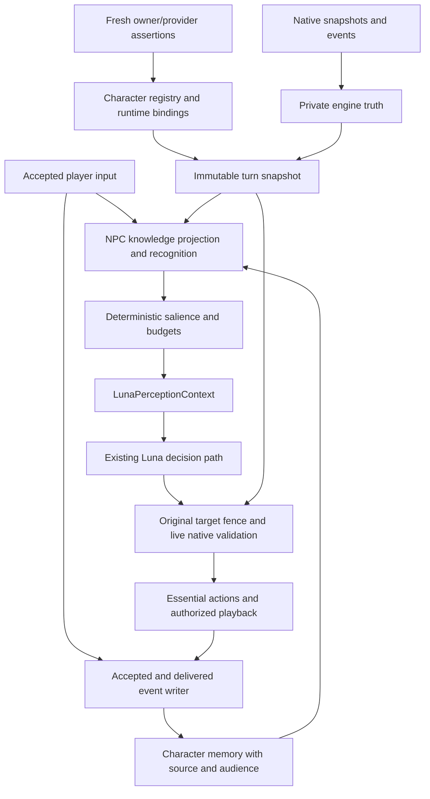

# Persistent NPC identity, memory, perception and salience

Architectural investigation of `ComradeGenosse/LSA-Enhanced-essential-fork`, 2 October 2026. Research only; no production implementation or deployment.

The recommended architecture is **layered identity → character-owned evidence and memory → NPC-relative knowledge projection → deterministic salience → the existing Luna decision and Essential delivery path**. Essential should continue owning ped control, action execution, turn generations and playback. A persistent character must sit above a native session, and an NPC's beliefs must sit behind an explicit knowledge boundary.

## 1. Decisions supported by the investigation

1. **No inspected field is a universal durable NPC identifier.** Native `PedId` is the full current `Rage.PoolHandle` string. Essential state, continuity and PR caches follow that entity; interaction and callout GUIDs identify exchanges or incidents. Names, birthdays, model classifications and scene positions are attributes. External persona reassociation and save persistence remain unproven.
2. **Keep today's four-part delivery identity.** `(pedId, sessionNonce, turnId, generationId)` protects asynchronous server work. Add a process epoch and a verified character binding for persistence; do not replace the native protocol identity with a character UUID.
3. **V1 persistence should cover explicitly owned characters.** An owner registers a stable source key and the current entity incarnation. Ambient peds retain session memory until a stronger contract exists. A correlation hypothesis can be recorded without authorizing a durable merge.
4. **Connection and dialogue history are session services.** Put character identity, long-term memory, relationships and commitments in separate services. Reuse the existing connection, provider, retry, action and playback machinery.
5. **Raw context currently bypasses NPC knowledge.** The request builder serializes the whole actor and listener, including integration records and their `raw` copy. Filtering only that JSON is insufficient: stock-generated instructions, context text and event reasons also carry dynamic facts.
6. **Perception must precede salience.** First decide what this NPC could know and how it learned it. Then choose what matters. A high threat score cannot turn an unseen private warrant or weapon into knowledge.
7. **Reuse native sensing where it is useful.** Nearby-person processing already includes geometry, player/NPC LOS phases and reference allocation. Its engine-derived enrichment and some gameplay-camera setup require an observer-specific audit. It is neither an empty perception system nor an established epistemic contract.
8. **NPC-to-NPC is a later implementation phase.** The inspected server's conversation starters are stubs, and turn/audio routing is player-only. Native directed-interaction APIs and stock prompt wording do not establish a working NPC conversation loop.
9. **Streaming imposes conservative memory rules.** Accepted player input, generated speech, delivered speech, action dispatch and physical action completion are different events. The recorded GTA run supports the repaired response path, but not complete multi-segment E6 acceptance.

These are conclusions about the inspected artifacts, with the runtime qualifications below. Proposed types, budgets and phases are design recommendations, not claims that those features already exist.

## 2. Evidence, versions and confidence

Current `main` was checked out at **`612dd99b5a5442dd973f975a71abd91920b8a4fe`**. Its history contains 62 commits. This includes the E1 bridge and observability, E2 providers, E3 retries, E5 structured streaming, E6 segmented TTS and telemetry repair, merged character-aware voice work, and the native demographic follow-up. PR #1 and PR #2 are merged. PR #3 was open and unmerged at inspection, with head **`912ec129f084d412242c8d04e8b42b428ff9f1e6`**; its evidence was inspected separately rather than treated as production code.

The pinned inputs are:

| Artifact | SHA-256 / scope |
|---|---|
| Essential DLL | `9b6de42d4c464901d859dd95e17e100e4fa9ef6074bfbb0cf3a57a76f6ddd653` |
| Stock server bundle | `5d81de4217bd103316a1083e482ded1bddc791314abf671d686036175c0475f2` |
| Native metadata manifest | `18edd2b47ffde748388b07a4a2d023793e183b882fe638acb5276440d45a2d23` |
| Deterministically built current launcher | `0443800cf148f10baa58558f106baa1e97e6edc2d227c0d48cf8fef15c457ed9`, 25 source-pinned AST edits |
| PR bridge inspected by PR #3 | `712f9491c0693d496ea82b1e4cefaa03c0575408a2fefa8d9e295bb516e5ad3e` |
| Public CDF 1.0.0.6 inspected by PR #3 | `d0a81554ff66ea344a6e778f8c7faa6292201a45854ea89b83ced5b6814c24fc`; not proof of the loaded game version |

All token references in this report apply to that Essential binary; the evidence JSON carries the exact machine-readable pin.

Confidence terminology:

| Label | Meaning here |
|---|---|
| **PROVEN** | Direct inspected source/IL or a reproduced synthetic fixture, within its stated scope. This does not mean physically observed in GTA. |
| **STRONGLY SUPPORTED** | Multiple inspected paths support the conclusion, with an explicit external or runtime boundary. |
| **INFERRED** | A reasoned consequence, usually conditional; recommendations are identified separately. |
| **UNKNOWN** | A missing external contract or an unanswered GTA experiment. |

Fresh checks performed for this investigation: **168 main offline tests passed, zero failed**; the pinned build remained reproducible; PR #3's PE/CLR reader compiled with zero warnings/errors and extracted 651 types/5,588 methods without loading the game assembly; all six PR #3 offline edge cases reproduced; seven additional architecture probes passed. The extra probes use real normalizers, request/bridge/controller code and synthetic endpoints. They make no GTA calls, real provider requests or audible playback claims.

The seven probes demonstrate: private listener fields reach the request; explicit null retains an old listener; explicit non-player routing becomes player routing; NPC exchange functions return stub results; current target-map validation accepts a changed mapping; non-player input has generic event semantics; and actor prompt generation can borrow global world context. Exact fixtures and complete relevant stock slices are in `investigation-evidence.json`.

The [machine-readable evidence](session-identity-memory-perception-salience-evidence.json) accompanies this report. Main and PR #3 were rechecked before delivery and still matched the pinned commits above.

There **is historical GTA evidence** in current main. The [October 1 E6 review](https://github.com/ComradeGenosse/LSA-Enhanced-essential-fork/blob/612dd99b5a5442dd973f975a71abd91920b8a4fe/docs/E6-GTA-verification-2026-10-01.md) records 13 microphone turns, one NPC/session, 10 completed replies and three interrupted replies. All 13 reached native authorization, playback start and end. Eight started TTS before model completion, but first PCM arrived **127–651 ms after** completion; every reply had one segment. Action logs additionally corroborate vehicle entry/seating, resumed driving, started following and an interruption of driving. This is evidence for that repaired deployed build, not a physical validation of every change in current main or of early audible multi-segment speech.

Primary source index used throughout:

| Reference | Pinned source |
|---|---|
| **S1** | [SESSION_IDENTITY design review](https://github.com/ComradeGenosse/LSA-Enhanced-essential-fork/blob/612dd99b5a5442dd973f975a71abd91920b8a4fe/docs/plans/SESSION_IDENTITY-design-review.md) and its [native/stock evidence](https://github.com/ComradeGenosse/LSA-Enhanced-essential-fork/blob/612dd99b5a5442dd973f975a71abd91920b8a4fe/docs/research/SESSION_IDENTITY-evidence.json) |
| **S2** | [PR #3 addendum](https://github.com/ComradeGenosse/LSA-Enhanced-essential-fork/blob/912ec129f084d412242c8d04e8b42b428ff9f1e6/docs/research/character-aware-native-runtime-audit-addendum.md), its [Essential IL](https://github.com/ComradeGenosse/LSA-Enhanced-essential-fork/blob/912ec129f084d412242c8d04e8b42b428ff9f1e6/docs/research/native-context-evidence/native-il.txt), [PR bridge IL](https://github.com/ComradeGenosse/LSA-Enhanced-essential-fork/blob/912ec129f084d412242c8d04e8b42b428ff9f1e6/docs/research/native-context-evidence/prbridge-il.txt) and [CDF IL](https://github.com/ComradeGenosse/LSA-Enhanced-essential-fork/blob/912ec129f084d412242c8d04e8b42b428ff9f1e6/docs/research/native-context-evidence/cdf-il.txt) |
| **S3** | [Pinned stock bundle](https://github.com/ComradeGenosse/LSA-Enhanced-essential-fork/blob/612dd99b5a5442dd973f975a71abd91920b8a4fe/lsa-essential-e1-candidate/upstream/server.bundle.mjs) and [build/bridge edits](https://github.com/ComradeGenosse/LSA-Enhanced-essential-fork/blob/612dd99b5a5442dd973f975a71abd91920b8a4fe/lsa-essential-e1-candidate/tools/buildCandidate.mjs) |
| **S4** | [Request construction](https://github.com/ComradeGenosse/LSA-Enhanced-essential-fork/blob/612dd99b5a5442dd973f975a71abd91920b8a4fe/lsa-essential-e1-candidate/src/context/essentialDecision.mjs) and [action validation](https://github.com/ComradeGenosse/LSA-Enhanced-essential-fork/blob/612dd99b5a5442dd973f975a71abd91920b8a4fe/lsa-essential-e1-candidate/src/context/decisionValidator.mjs) |
| **S5** | [OpenAIConnection](https://github.com/ComradeGenosse/LSA-Enhanced-essential-fork/blob/612dd99b5a5442dd973f975a71abd91920b8a4fe/lsa-essential-e1-candidate/src/openai/openaiConnection.mjs) and [turn runner](https://github.com/ComradeGenosse/LSA-Enhanced-essential-fork/blob/612dd99b5a5442dd973f975a71abd91920b8a4fe/lsa-essential-e1-candidate/src/openai/runSequentialTurn.mjs) |
| **S6** | [DialogueHistory](https://github.com/ComradeGenosse/LSA-Enhanced-essential-fork/blob/612dd99b5a5442dd973f975a71abd91920b8a4fe/lsa-essential-e1-candidate/src/memory/dialogueHistory.mjs), [runtime glue](https://github.com/ComradeGenosse/LSA-Enhanced-essential-fork/blob/612dd99b5a5442dd973f975a71abd91920b8a4fe/lsa-essential-e1-candidate/src/integration/essentialGlue.mjs) and [native delivery observer](https://github.com/ComradeGenosse/LSA-Enhanced-essential-fork/blob/612dd99b5a5442dd973f975a71abd91920b8a4fe/lsa-essential-e1-candidate/src/integration/nativeDelivery.mjs) |
| **S7** | [Voice profile](https://github.com/ComradeGenosse/LSA-Enhanced-essential-fork/blob/612dd99b5a5442dd973f975a71abd91920b8a4fe/lsa-essential-e1-candidate/src/voice/voiceProfile.mjs) and [trait parsing](https://github.com/ComradeGenosse/LSA-Enhanced-essential-fork/blob/612dd99b5a5442dd973f975a71abd91920b8a4fe/lsa-essential-e1-candidate/src/voice/actorVoiceTraits.mjs) |
| **S8** | [Public extension API inventory](https://github.com/ComradeGenosse/LSA-Enhanced-essential-fork/blob/612dd99b5a5442dd973f975a71abd91920b8a4fe/docs/plans/LosSantosAlive_Hotfix3_Extension_API_Analysis.md), qualified by S1/S2 and the fresh token evidence |
| **S9** | [Telemetry contracts](https://github.com/ComradeGenosse/LSA-Enhanced-essential-fork/blob/612dd99b5a5442dd973f975a71abd91920b8a4fe/lsa-essential-e1-candidate/src/observability/eventContract.mjs) and [retry executor](https://github.com/ComradeGenosse/LSA-Enhanced-essential-fork/blob/612dd99b5a5442dd973f975a71abd91920b8a4fe/lsa-essential-e1-candidate/src/reliability/providerExecutor.mjs) |

The older design/API documents are useful maps. Actual function bodies, pinned IL and PR #3 corrections take precedence over their broad feature descriptions. In particular, an API described as an action notification is not automatically a physical completion event, and NPC-to-NPC wording is not orchestration.

## 3. What the running architecture actually owns

The useful existing pipeline is:

```text
Essential owns entity/control + native hydration + turn/generation/playback
  → stock actor/session/controller state
  → patched provider selection and OpenAIConnection
  → accepted input + bounded session history
  → Luna structured decision (E5; E6 when enabled)
  → final stock action validation and dispatch
  → authorized native PCM stream / matching playback completion
  → delivered assistant history
```

**PROVEN:** `WP` creates a connection for a ped/session; `Zi` can reuse it and `qK` refreshes context. `zP` advances a per-ped server-process nonce on lifecycle transitions. Closing and reopening can move nonce 1 to 3, because close also advances it. A nonce is a stale-session fence, not a person counter and not a value that must advance consecutively. S3; reproduced PR #3 force-new fixture.

**PROVEN:** OpenAIConnection freezes its session identity and, on the first generation, its voice profile. A turn copies actor/listener context. Subsequent refresh changes future context, not an already launched generation or its voice. New generations abort previous work; provider retries operate within the same generation rather than inventing playback identities. S5/S7.

**PROVEN:** DialogueHistory is an in-memory map keyed by ped and nonce. It commits accepted player text before model completion, stages assistant text, and commits that assistant only after matching successful native playback with audio and no interruption. Runtime detach clears that session. Request history is bounded to the last 12 messages. It is delivery-aware conversation context, not persistent character memory. S6.

**PROVEN:** Native audio DTOs use the speaker ped/turn/generation triple; the JS bridge maps events to its live session nonce and tests the four-part identity. Authorization must be acknowledged before PCM forwarding. Essential remains the allocator and owner. The nonce is not a universal native field. S3/S6.

**PROVEN:** final command validation uses the current session actor and current `Ab`/`g4` reference resolvers. It does not compare the target mapping against the copied actor that Luna reasoned over. The synthetic `P001:23 → P001:24` probe accepts the action. That proves a missing comparison, not that the native allocator routinely reassigns P001 in this situation. S3/S4; new probe.

**PROVEN:** the server path is still oriented around player speech. `Xi` overwrites a supplied listener with `Ps()`; `Ba` resolves the player; `RP` requires player routing. `tb` returns null, `nb`/`rb` return false. The `npcToNpcInteractionReady` receiver can reach a stub. A non-player source is treated as an internal event, not as a typed speaker-to-hearer utterance. S3/S4/S5; new probes.

The next architecture should insert two services before request construction, without replacing the downstream lifecycle:



## 4. Identity inventory and exact stability boundaries

### 4.1 Existing identities

| Layer or candidate | What the inspected code uses | Stability and failure boundary | Classification |
|---|---|---|---|
| Native entity | `Rage.Entity.Handle`, full `PoolHandle.ToString()` → `ActorContext.PedId`; independent directed-interaction helper agrees | Valid entity lifetime only. Survival through streaming, reuse, recreation and reload is not established. | **PROVEN** representation; entity-scoped; durable behavior **UNKNOWN** |
| Native/Essential state | `NpcStateStore` string dictionary; key from the same handle; existing state updates its `.Ped` | No inspected different-handle reassociation. Removal/control cooldown is not personal history. | **PROVEN**, entity-scoped |
| Native conversation/session at server | `sessionsByPedId`, per-ped `sessionNonce`, connection | Same live session; close/hard replacement invalidates old work; counters restart with process state. | **PROVEN**, session/process-scoped |
| Turn and generation | Essential turn ID and generation ID plus live ped/session | One request generation; not an identity across encounters. | **PROVEN**, execution-scoped |
| Native playback | Ped/turn/generation triple; companion verifies the mapped nonce | Current authorization only. Must not be restored from disk. | **PROVEN**, execution-scoped |
| Directed interaction | Newly generated interaction GUID and participant handles | Exchange membership; one NPC participates in many interactions. | **PROVEN**, interaction-scoped |
| Continuity memory | `Dictionary<string,PedContinuityMemory>` keyed by exact handle | Samples nearby peds at 750 ms/15 m; retains recent vehicle handle/seat/time and interaction activity/position/heading/time; cleanup includes 120,000 ms age/null expiry. No cross-handle person lookup. | **PROVEN**, bounded local continuity |
| Interop context | `Dictionary<Rage.PoolHandle,...>` for scenario/role/emotion/actions | Belongs to a current entity; no inspected durable-person index. | **PROVEN**, entity/provider-scoped |
| Stock actor session cache | `actorSessionStates` keyed by ped ID, with actor, voice/resume state and timestamps | Broader than the connection; closing a connection does not make it a durable person record. No bounded eviction found in inspected paths. | **PROVEN** cache design; retention debt |
| Nearby P/V references | Observer-side person/vehicle reference tables resolved through current actor state | Local contextual aliases. P001/V001 has meaning only with its originating snapshot/map and current entity validity. | **PROVEN**, unsafe persistent keys |
| PR state/record caches | Normalized full handle as hexadecimal string or `uint`; worker completion returns handle-keyed records | Formatting does not create another identity. Async results lack a source incarnation/session fence. | **PROVEN**, provider/entity-scoped; reassignment risk **INFERRED** |
| CDF PedData cache | Inspected public 1.0.0.6: `Dictionary<Rage.Ped,PedData>`; constructor calls `GetPersonaForPed(holder)` | Retained entity/record object, with invalid-entry pruning and unload clearing. No inspected cross-entity index. External persona lifecycle is outside this code. | **PROVEN** for that version; durable persona contract **UNKNOWN** |
| LSPDFR persona | Name/birthday/gender/modelAge exposed through CDF delegation | Unavailable internals may contain more, but persistence, uniqueness and reassociation are not proven here. | Provider-specific; **UNKNOWN** durable key |
| Callout instance | Supplied ID or newly generated GUID | An incident, not one participant. A participant key/index is at most a member of that scene instance. | **PROVEN** incident identity; unsafe universal key |
| Scenario/setup/interior/activity IDs | Scene configuration, role or occupancy | Reusing a template, location or role does not establish the same human. | **STRONGLY SUPPORTED**, scene/template keys |
| Model and metadata | Model-name-derived gender, age range and archetype; INI descriptions | Many peds share a model. Model can change; classification can be unknown or misleading for custom names. | **PROVEN** classifier; probabilistic appearance evidence, unsafe identity |
| Names and birthday | Provider attributes; writable and callout-hydratable | Collision, mutation, provider recreation and timeline problems. Same values do not prove same person; changes do not prove a different one. | **PROVEN** attributes; provider-specific correlation candidates |
| `IsPersistent` | Engine automatic-cleanup protection | Retaining an entity does not define a person across another entity or a save. | Cleanup property; unsafe durable identity |
| Voice/profile ID | Profile ID hashes ped/nonce and assignment version; selected voice also depends on traits/configured pool | Frozen during one connection; replacement/pool/config changes can change selection. The same profile ID can accompany a different selection under changed traits/config. A voice is not a person identifier. | **PROVEN**, session-scoped |

Essential handle evidence is `ActorContextProvider.Populate` **0x060012b8**, the handle helper **0x0600046d**, and S1/S2. State lookup is **0x06000456**; continuity lookup/create/cleanup are **0x060006bc/6bd/6bf**. Those bodies were independently re-extracted. S2 also traces the PR/CDF/callout paths and their scope.

Published [RAGE PoolHandle documentation](https://docs.ragepluginhook.net/html/T_Rage_PoolHandle.htm) describes index and counter portions to protect against immediate slot reuse. It is older, preliminary documentation; it does not establish the installed Enhanced allocator's wrap/reload behavior. The [IsPersistent property](https://docs.ragepluginhook.net/html/P_Rage_Entity_IsPersistent.htm) documents cleanup protection, not a durable-person contract. Do not truncate the full handle to an index or infer practical reuse frequency from the bit layout.

### 4.2 Attributes that can help, with limits

**PROVEN:** core age range is `young`, `middle-aged`, `old`, or `unknown`; merged PR #2 maps these to voice bands `young`, `mature`, `older`, `unknown`. Core gender is `male`, `female`, `unknown`. The pinned classifiers use invariant model-string parsing, special cases and component markers; they do not consult legal records or guarantee authentic Rockstar naming. Archetype extraction and INI descriptions similarly describe an appearance/persona template, not an individual. Freemode's generic component is particularly unsuitable for identity. S2/S7.

**PROVEN:** the native actor serializer omits literal `PedModel` and `Archetype`, although the native actor object has them. Thus a server `pedModel: unknown` can be a wire omission rather than classifier failure. Any identity hypothesis using model must obtain an explicitly sourced model observation; it cannot infer one from a default. S2; serializer **0x06001178**.

**PROVEN:** the inspected PR bridge emits normal-ped names, birthday and boxed `PedModelAge.ToString()`, but omits ped `identity.gender`; the officer identity also omits modelAge. Server schema support is broader than that producer's output. Birthday formatting uses `DateTime.ToString("MM/dd/yyyy")`, so parsing requires the producer's date contract rather than an assumed ISO value. Callout hydration can set names/gender and recompute birthday from a clamped age and `DateTime.Now`. Exact external modelAge categories and ambient persona generation are **UNKNOWN**. S2, sections 7–9.

Name, birthday, model, role, address, last position and scene membership can support **candidate correlation**. None should individually or collectively trigger automatic canonical merging without a proven producer contract. A tuple of mutable attributes is still mutable; hashing it does not make it unique or durable. A source with an actual immutable person key could later qualify, but it must prove key reuse rules, world scope, mutation behavior, recreated-ped attachment and save/reload semantics.

The negative conclusion is **STRONGLY SUPPORTED**: no better universal durable key was found in the inspected layers. It is not proof that every unavailable provider lacks one.

## 5. Identity architecture under uncertainty

### 5.1 Distinct records, distinct authorities

Use an internal `CharacterId` only as the registry's own record identity. Generate it after accepting an explicit owner/provider assertion; it is not a discovered native UUID. Start with an authored owner adapter, rather than depending on unavailable LSPDFR behavior.

```ts
type CharacterRecord = {
  schemaVersion: 1;
  worldProfileId: string;
  characterId: string;                // Registry-owned opaque ID
  revision: number;
  aliases: SourceAlias[];              // Accepted producer associations
  factsRevision: number;
  voiceAssignment?: StoredVoiceChoice;
};
type SourceAlias = {
  sourceNamespace: string;
  sourceKey: string;                   // Producer's proven person key
  sourceContractVersion: number;
};
type RuntimeBinding = {
  serverRunId: string;
  adapterEpoch: string;
  worldProfileId: string;
  pedId: string;                       // Full native handle string
  sourceIncarnation: string;           // Owner's current spawn incarnation
  bindingRevision: number;
  characterId?: string;
  assurance: 'owner_verified' | 'provider_verified' | 'ephemeral' | 'conflict';
  claimRevision: number;
};
type TurnAgentSnapshot = {
  identity: { pedId: string; sessionNonce: number; turnId: string; generationId: number };
  serverRunId: string;
  binding: Readonly<RuntimeBinding>;
  conversationId?: string;
  speaker: SubjectRef;
  listener: SubjectRef | null;
  actorWorld: SourcedWorldSnapshot;
  engineSnapshot: Readonly<EngineTruthSnapshot>;
  referenceMap: Readonly<ReferenceMap>;
  capturedAt: ObservationTime;
};
```

This schema separates world/campaign identity from process epoch, source persona from entity incarnation, session from character, and conversation from the individual. Each turn captures the accepted binding revision before asynchronous work.

An inferred association belongs in a separate `IdentityHypothesis` ledger: candidate character, evidence, contradictions, producer/source and expiry. Its assurance is `candidate` or `unknown`, never `owner_verified`. It can support investigation or conservative continuity within a verified entity lifetime. It must not unlock another character's biography, relationships, voice, private memory or native control. Promotion requires a stronger assertion or an explicit administrative decision recorded with provenance. There is no defensible universal numeric matching threshold in the current evidence.

### 5.2 Backend identity and NPC recognition

Even a verified `CharacterId` is not proof that this observer recognizes that person. Introduce an observer-owned `SubjectBeliefRef` with recognition evidence: introduced name, witnessed continuity, previously known face, uncertainty and last seen state. Relationship retrieval uses that recognition gate. The engine may know that a disguised person is a protagonist; Luna should not automatically retrieve every relationship or secretly know their name.

`A.playerPedId` is the current recipient entity, not a durable identity for “the player.” Define the campaign's human/protagonist identity policy separately: one configured player persona, distinct protagonists, or actor-local unidentified counterpart records. Until that is decided, store observed behavior against a sourced local subject and do not pool relationships across a player-model/protagonist switch.

Backend assurance and NPC knowledge certainty are separate axes. `owner_verified` tells the store whose record it is; `observed/reported/inferred/unknown` tells the NPC how it knows a proposition. PR #3's PROVEN vocabulary describes this investigation's evidence and should not be reused as an in-world belief label.

### 5.3 Binding and revocation protocol

The public enrichment route is `IIntegration.EnrichActor(Ped, ActorContext)` plus a bounded `IntegrationJsonBlock`. It supplies an actual ped at a build opportunity, but no session nonce and no complete spawn/despawn/save lifecycle. `OnPedControlChanged` reports control transfer, not ped death or conversation closure. Namespace strings alone do not authenticate an owner; actor objects and blocks are mutable. S1/S2/S8.

The narrow complete protocol should work as follows:

1. The owner registers `(world profile, source namespace, stable source key, current ped, fresh incarnation)` while it still owns the entity association. Registration is cheap and versioned.
2. Enrichment emits a current claim with adapter epoch, incarnation and monotonic revision. The companion joins it to the existing Essential session; the addon does not allocate a nonce or native turn.
3. The companion checks trusted producer configuration, fresh binding evidence, exact ped, current request/revision and conflicts. A cached handle-only integration record is insufficient.
4. The owner retires/rebinds the incarnation through an explicit, bounded assertion/revocation channel. This is necessary when no new hydration occurs. If the owner already has a suitable channel, reuse it; otherwise implement a small local factual IPC route. This route is proposed, not an existing DLL capability.
5. Stale adapter epochs, old revisions and mismatched incarnations are rejected. On conflict or lost freshness, persistence becomes unavailable and new memory stays ephemeral. Default to one active incarnation per character; intentional clones require explicit separate semantics.
6. Capture the binding in the turn snapshot. Recheck the live execution identity and binding authority at asynchronous publication boundaries. Never resolve “current character for this ped” only when a delayed event finally writes.

Treat an integration block as a reference to the current owner's assertion ledger, then verify it against that ledger from the configured producer channel. A JSON `sourceNamespace` label cannot itself grant owner assurance. Define the producer connection/registration authority when implementing the narrow channel, and bind claims to a fresh request/revision; ordinary PR record cache JSON remains provider data rather than an owner registration.

Late adoption should take effect at a clean session boundary. An existing connection keeps its frozen voice, memory audience and delivery identity. Do not attach a newly discovered character to half an E6 utterance. A fresh session can adopt a fresh verified binding; uncertainty preserves today's session behavior.

A stale completion can only update the original captured record when its event was accepted under a valid binding and its policy allows historical writing. It must never update a replacement occupant of the same handle. Generated work that lost authority before acceptance is discarded. This distinguishes a legitimate delayed disk write from an invalid late model/native publication.

### 5.4 Storage and save scope

For the bounded first registry, retain S1's versioned JSON design: one writer queue, validated in-memory records, temporary write plus a tested Windows replacement/backup procedure. Enforce unique alias tuples including world profile, referential integrity, bounded input, record revisions and supported schema. Concurrent resolve-or-create must not allocate two characters for one alias. Corruption or unknown schema preserves the file for repair and falls back to ephemeral behavior.

Persist accepted source aliases, registry character IDs, character facts and stored voice choices. Keep handles, native objects, live bindings, incarnations, connection/session authorization and pending PCM in RAM. There is no existing persistent database to migrate: do not infer characters from stock caches, transcripts or telemetry.

Persistent **memory adds a timeline requirement beyond S1's identity registry**. `worldProfileId` alone cannot make the server's latest memories safe after loading an older game save. Use a `timelineId` and, once supported, a verified checkpoint/branch policy. Without a save hook, start with explicit campaign/timeline selection and fail closed for historical memory on an ambiguous reload. Stable authored identity/voice can be intentionally shared; future events and relationships must not silently leak backward into an earlier world.

A server restart creates a fresh run epoch and clears every live binding. Durable records may reload, but they become usable only after a fresh owner assertion in the selected world/timeline. Never resume audio, commands or native authorization from the registry. Telemetry has a run ID today, but its no-op path is not a lifecycle authority; create the runtime epoch independently of logging.

## 6. Memory architecture and survival rules

### 6.1 Store evidence rather than an omniscient biography

| Memory class | Contents and authority | Update rule |
|---|---|---|
| Character truths | Authored background, stable traits, source aliases, configured voice | Registry/source-owned revisions. A fact about a character is not automatically something the NPC knows. |
| Self knowledge | Known name, familiar occupation, learned abilities, remembered biography, known possessions | Explicit authored self-knowledge or self-accessible evidence. A hidden legal record is not automatically self awareness. |
| Personally observed player facts | “I saw the listener draw a handgun”; “they hit my car” | Observer, subject recognition, time, modality and confidence. Do not convert an absent snapshot into “they never had a weapon.” |
| Communicated facts | “The listener said their name is Alex”; a dispatch report or witness account | Preserve speaker/source and `reported` status. Reported claim is not a verified world fact. |
| Relationships | Familiarity, trust, hostility, obligations toward a recognized subject | Evidence-linked bounded updates with revision and decay policy. No automatic hostility from unseen warrant databases. |
| Commitments | Orders, promises, requests, agreements and unresolved obligations | Distinguish requested, accepted, delivered, attempted, fulfilled, failed/cancelled. A command request or generated promise is not fulfillment. |
| Episodes | Bounded records of accepted interactions, delivered speech and witnessed events | Literal events first; optional later summaries retain evidence links and uncertainty. |
| Scene state | Current incident roster, shared mission objective, phase and participant roles | Scene owner plus instance/version; reset or restore only under that scene's contract. Never confuse a reused template with the old incident. |
| Transient perception | Currently visible people/vehicles, sounds, fresh threats, last few deltas | Short TTL and observer-specific validity; recompute after rebind/reload. |
| Current self/world execution state | Position, vehicle occupancy, active task, injury indicators | Fresh observations. Historic state can be remembered as historic but must not be restored as current. |
| Engine truth / private integration state | Exact handles, hidden records/inventory, action targets, task flags, engine cause of death | Private control/validation store. It enters NPC knowledge only through a justified observation, self access or communication rule. |

Introduce `CharacterMemoryService`, separate from DialogueHistory. It owns a bounded event inbox, an append/commit interface and materialized views for relevant episodes, relationships and commitments. `AgentState` is a small current view; it need not run continuously for every ambient ped. A session obtains a view, not ownership of the persistent record.

```ts
type MemoryEvent = {
  eventId: string;                     // Run + native tuple + kind + sequence
  originInputId?: string;              // One accepted input, even across recovery generations
  worldProfileId: string;
  timelineId: string;
  characterId?: string;               // Captured association, never late handle lookup
  bindingRevision: number;
  source: { namespace: string; version: number; channel: string };
  observer: SubjectRef;
  subject?: SubjectBeliefRef;
  kind: string;
  knowledge: 'self_known' | 'observed' | 'reported' | 'inferred';
  observedAt: ObservationTime;
  receivedAtUtc: string;
  payload: BoundedEventPayload;
  evidenceIds: string[];
  delivery?: 'accepted_input' | 'completed_speech' | 'partial_attempt' | 'action_attempt';
};
```

Use both game/scene ordering and monotonic run time where available; UTC is storage/audit metadata, not the sole truth for paused or reloaded worlds. Enforce deterministic idempotency. Current history dedupe is a bounded session convenience; persistent event dedupe must survive window trimming and must distinguish a superseded generation from a retry of the same accepted event. An input accepted once retains its `originInputId` across speech recovery or replacement generation; attempts get separate execution IDs without inventing another user utterance.

For a few authored characters, a single-writer durable event batch/materialized snapshot can use the same versioned file discipline as the registry. Define crash behavior: a durable event is acknowledged once its commit record is recoverable; rebuild views from accepted records and reject duplicate event IDs. Keep an uncommitted inbox explicitly volatile. Do not claim unflushed memory survives a crash. Cap/compact the journal. Add SQLite behind the store interface only when measured event volume, query needs or transaction contention justify it; do not assume Node's newest embedded SQLite API is available in the production runtime.

### 6.2 Commit rules around the existing turn lifecycle

**Accepted player input:** record that a particular participant communicated the accepted words to this NPC. This can survive a failed assistant response. It remains a claim, not proof of the claim's content. The microphone/typed controller's accepted channel establishes directed conversational input; it does not establish general acoustic audibility for every nearby NPC. S5/S6.

**Completed assistant speech:** add the literal utterance to an episode, and create a delivered promise only after matching native completion. Keep today's conservative history rule. An agreement intended for one listener must not become knowledge for every scene participant.

**Interrupted/failed E6 speech:** record an attempted or possibly partial utterance if useful, but do not store the complete generated sentence as spoken, or assume the listener heard its final promise. The native evidence currently lacks per-segment heard acknowledgments. Do not substitute TTS completion or bytes forwarded for speech heard. For a later NPC listener, speaker playback completion is still not proof of that NPC's audibility/attention.

**Actions:** final model validation can dispatch an action before TTS/playback succeeds. Therefore discarding assistant history cannot roll back a real action. Store command request, validation, dispatch acceptance, handler result and subsequently observed completion separately. Native `NpcActionRegistry.TryExecute` **0x06000a91** calls the handler at `IL_01a3`, then action notification at `IL_01d6`; notification accepts ped/name/bool without the full turn identity, target or an asynchronous physical completion contract. A successful handler result does not prove a ped reached a destination. Fresh observation or an action-specific owner completion event must fulfill the commitment. S3/S5/S8; fresh IL.

**Model-written memories:** do not add another model call for every turn. V1 can store literal, typed events and retrieve them deterministically. A later version may accept bounded memory/commitment suggestions in the existing reasoning response, after final validation and delivery. Suggestions cannot establish identity, private world truth, or events the observer lacked evidence for. They must reference input evidence and be separately versioned; current strict two-/three-field decision schemas cannot accept arbitrary extra fields.

Preserve E6's early fixed mode and final action barrier when adding such fields. Memory suggestions are final validated metadata; they cannot retroactively change early speech mode, authorize a partial command or imply that an interrupted prefix was a complete delivered statement.

### 6.3 Survival matrix

`Verified` below means an accepted owner/provider character association in the same world and valid timeline. It does not mean all facts are true or recognized by the NPC.

| State | Next turn | Native session replacement | Ped streaming | Entity recreation | Save/reload | Server restart |
|---|---|---|---|---|---|---|
| Character truths / stored voice | Yes | Verified character only | Verified owner continuity; otherwise unavailable | Fresh owner assertion maps new incarnation | Explicit identity/campaign policy; no native save guarantee | Reload record, require fresh binding |
| Self knowledge / relationships | Yes | Verified + recognition/provenance | Verified continuity; suspend stale current state | Fresh strong association only | Valid timeline/checkpoint only | Durable committed events + fresh binding |
| Observed/reported facts / episodes | Yes, with source/time | Verified character; unknown peds keep local/session scope | Historical evidence may survive for verified character; no new visibility implied | Historical record can follow verified character | Reject memories from a future or ambiguous timeline | Recover only acknowledged durable records |
| Commitments | Yes | Persist accepted obligation for verified character | Suspend execution if entity is unavailable | Rebind obligation, then replan under current authority | Restore only on explicit matching scene/timeline policy | Restore obligation, never pending command/audio authorization |
| Scene state | Current scene/version | If scene owner says same scene | Owner-managed roster; handle alone insufficient | Fresh scene participant assertion | Scene-specific serializer/restore contract required | Explicit owner restoration only |
| DialogueHistory window | Yes, bounded | Cleared today | No durable promise; depends on session remaining alive | Never transfer by fuzzy match | Not restored | Cleared |
| Current position/task/vehicle/weapon/health | Fresh snapshot | Rehydrate | Invalidate/reacquire | Recompute | Recompute | Recompute |
| Transient perception / salience cache | Short TTL | Invalidate observer/session references | Expire as observations become unavailable | Clear | Clear | Clear |
| Handle/session/turn/audio binding | Same valid lifecycle | New nonce; old invalid | Native validity determines usability | Fresh incarnation and session | Never restore saved authorization | Fresh epoch/session only |
| Candidate identity hypothesis | Can guide uncertainty locally | May be retained as unconfirmed evidence | Evidence ages; no memory access authority | Still candidate, not a merge | Timeline-scoped investigation only | Optional hypothesis ledger; no automatic promotion |

Streaming is not inherently destruction, and destruction is not inherently a new persona. Both propositions require owner/runtime evidence. The safe behavior under missing evidence is to suspend persistence or use an ephemeral record rather than guess which transition happened.

## 7. NPC-relative perception

### 7.1 Two context stores and one projection boundary

Keep `EngineTruthSnapshot` for execution, diagnostics and validators. Produce `LunaPerceptionContext` through an explicit observer policy. Each source field needs provenance, subject, observation time, freshness/availability, modality and an admission rule. Missing, provider-failed and serializer-omitted values are `unknown`, not measured negative facts.

```ts
type LunaPerceptionContext = {
  version: 1;
  character: KnownCharacterView;
  selfState: SelfAccessibleState;
  currentListener: PerceivedParticipant | null;
  perceivedScene: SelectedObservation[];
  environment: PerceivedEnvironment;
  memory: RelevantMemoryView;
  currentIntent: GroundedIntent | null;
  availableActions: PerceivedActionOption[];
};
```

The model receives local P/V references when actions need them, not raw registry keys, handles, nonce/epoch metadata, integration blocks or source cache contents. Internal references remain in the frozen turn snapshot. Confidence labels should state useful limitations (“reported by dispatch,” “last seen,” “appears armed”) rather than dump diagnostic metadata.

Projection must cover **every route into the reasoning input**: actor/listener JSON, stock `BK`/`ET` instruction expansion, `contextText`, realtime updates, internal-event reasons, history and retrieved memory. `mT` already distinguishes self/perceived descriptions in parts of the stock prompt, but full JSON bypasses that distinction. The raw integration duplication is demonstrated by the new fixture. S3/S4.

Refactor the OpenAI prompt seam into trusted behavioral/output policy plus projected dynamic context. Preserve the existing action grammar and use the stock template before dynamic filling where feasible; do not regex-strip a completed giant prompt. The native/configured persona and prompt text need review on the installed machine: a self/perceived label is not assurance that arbitrary authored text is epistemically safe. Unknown integration namespaces default to private/unclassified until an adapter supplies policy. Gemini remains on its current transport unless separately opted into this feature.

For a first projection, conservatively admit fields with clear semantics. Free-form nearby/body/general text cannot always be safely transformed back into typed sensory evidence. Where mixed text cannot be justified, omit that portion or require a typed producer envelope; do not claim a JS redaction heuristic establishes real LOS.

### 7.2 Field-by-field mapping

The table maps the current serializer, stock normalizers and derived integration fields, including fields that exist natively but are missing on the wire. Sources are S2/S3/S4/S8 plus fresh serializer/perception IL.

| Existing field or group | Destination | Transform, admission rule and omission |
|---|---|---|
| `exists`, `pedId`, `label`; native Ped/Handle | Private binding/engine store | Use validity and exact binding internally. Do not present a false/default `exists` snapshot as confirmed death. Label is routing metadata, not biography. |
| Core `gender`, `ageRange` | CHARACTER / apparent description | Source as model-derived coarse classification. Self identity may come from authored self facts; external description uses “appears.” Unknown remains unknown. Not chronological DOB or legal sex. |
| `pedModel`, `archetype`, `personaName` | Private metadata; optionally curated CHARACTER | Raw model/archetype is omitted by native actor serialization. Stock unknown/default/persona-from-archetype is not a discovered individual. Only curated descriptions enter cognition. |
| `archetypeDescription`, stock `personaDescription` | CHARACTER/self knowledge | Authored self persona after policy review. Slow fact revision, not repeated speculative inference. |
| `archetypePerceivedDescription`, stock `perceivedPersona`, visual outfit/description | CURRENT LISTENER / PERCEIVED SCENE | Perceived description only when this observer can see the subject. Uniform suggests apparent occupation; it does not reveal legal identity or hidden duty state. |
| `roleName`, `roleContext` | CHARACTER / CURRENT INTENT | Own assigned role, known orders and purpose only. Other actor role is a sourced reported/apparent fact. Strip engine scene-script secrets. |
| `activity`, `interactionActivityContext` | SELF STATE / CURRENT INTENT | Fresh own task/posture and known ongoing interaction. The native serializer sends interactionActivityContext, but stock `ia` does not preserve it in its returned normalized actor: repair or type explicitly rather than assume it reaches Luna. |
| Native armed flag, `weaponDescription`, `equippedWeaponDescription`, `availableWeaponsContext`, native weapon collection | SELF STATE / AVAILABLE ACTIONS; visible other weapon in SCENE | Own accessible weapon capability may inform actions. For others, visible equipped weapon only; concealed inventory stays private. Native actor serialization omits `isArmed` and the structured weapon collection; default false/empty is not proof of being unarmed. Prefer typed verified inventory for validation. |
| Held-item description/flags | SELF STATE or perceived visible item | Native provider/object supports held items; actor serializer omits these direct fields. Do not invent them from stock defaults. Add sourced fields only when needed. |
| `vehicleContext`, `recentVehicleContext` | SELF STATE; MEMORY; visible vehicle in SCENE | Present current own occupancy/access and remembered recent interaction as separate temporal facts. Reuse continuity tracking. A prior vehicle is not current occupancy or proof of ownership. |
| Derived `vehicleKnowledge`, `recentVehicleKnowledge` | Self knowledge / MEMORY only after provenance policy | `Rv` infers knowledge/ownership from provider names, driver/passenger/seat information. Seat membership is not automatic knowledge of owner, registration, insurance or stolen status. Gate each fact separately. |
| `nearbyPeopleContext` and body enrichment | Candidate SCENE source | Existing geometry/LOS is useful, but mixed observer setup and engine enrichment prevent blanket admission. Drop engine-derived cause/medical certainty unless witnessed or reported; preserve appearance/posture and uncertainty. |
| `nearbyPersonReferences`, `nearbyVehicleReferences` | Private snapshot + AVAILABLE ACTIONS local aliases | Include only admitted actionable entities; freeze alias→entity mapping. Remembered persons may be discussable without being current action targets. |
| `reflex.active/event/reaction/reason` | SELF STATE / selected events / CURRENT INTENT | Reflex is a candidate reaction signal, not omniscient evidence. Self impact/pain can be known; exact attacker, weapon or cause requires witness/provenance. Sanitize free-form reason. Native actor serialization also omits reflex escalation state. |
| `isIndoors`, `locationContext` | ENVIRONMENT / SELF STATE | Own immediate place and known location cues. Exact interior/database labels are private unless recognized. Fallback false is not measured outdoors. |
| World `gameTime`, `weather`, `streetName`, `crossingStreetName`, `zoneCode`; actor-normalizer street fields | ENVIRONMENT | Immediate weather/light and coarse known time; named streets/zone only through familiarity/signage/navigation knowledge. Native world is a separate object; omitted actor fields/defaults must not displace it. Use the hydrated actor's world, not shared global state. |
| `radioContext`, native radio-song-known semantics | ENVIRONMENT / auditory event | Admit audible radio and recognized song metadata only with actual audibility and known-song policy. A engine-selected track is not automatically heard or recognized. No acoustic range contract was established. |
| `availableActivitiesContext`, stock `actionCapabilities` | CURRENT INTENT / AVAILABLE ACTIONS | Intersect current native capability with known/discoverable affordances and role authority. Registry destinations/staff-only points or hidden actions are not all visible opportunities. |
| Stock `voiceName` / selected voice profile | Private speech configuration | A stock voice default is not a discovered personality or identity. The frozen supported choice controls TTS; Luna need not see its provider ID. |
| `integrations.raw` and arbitrary unknown namespaces | Private integration store | Never serialize wholesale to Luna. Preserve privately for adapter interpretation if necessary; require explicit source policy for admission. |
| `policingRedefined.identity` / LSPDFR persona names, birthday, gender, modelAge | CHARACTER for trusted own authored identity; communicated/document-read listener facts | Names are not automatically visible. Legal DOB needs self knowledge or document/report provenance. Provider modelAge is not mapped exact age. Schema support is not emission. |
| PR record/license/citations/stops/parole/probation/advisory/address | Private source; possibly reported MEMORY | Admit an authorized records check, dispatch communication or actual document reading as a separate knowledge event. Being an officer alone does not inject the entire database. Own record is not necessarily known to self. |
| PR permits/inventory/impairment | Private truth; visible/reported manifestations only | Concealed items, lab values and permits stay private absent access. Visible intoxication cues can produce “appears impaired”; not certainty from a secret record. |
| `policeStatusContext`, `policeStatus`, LSPDFR rank/on-duty/outfit fields | Own role; observed police activity | Own duty assignment can be known; another actor's rank/name/on-duty flags require recognition, markings or communication. Sirens/arrest behavior can be observed without private status. |
| PR vehicle/owner records | Private source; self knowledge or communicated vehicle facts | Visible vehicle appearance/plate is different from registered owner or stolen status. Gate plate recognition/reading and lookup delivery separately. |
| `callout` source, emotionalState, cooperation, visibleIntoxication, personalContext | Scene owner's supplied context plus observer projection | Incident membership belongs to SCENE state. Own motives can be authored; other motives/cooperation are observed/reported/inferred, not definitive hidden thoughts. Distinguish “visible” producer wording from proven sensory observation. |
| `npcai` scenario/role/mood/details; interop context | CHARACTER / known objective if authored for this NPC; private script otherwise | Do not disclose other agents' plans, mood internals or scene secrets simply because the engine carries them. |
| Context updates and `internalEvent` | Candidate observation/communication, then selected event | Preserve origin, subject, time and observer. Do not put an arbitrary engine explanation directly in system context. |
| DialogueHistory and future retrieved memories | MEMORY / conversation | Keep source/audience and delivered status. Historical claim remains a claim; do not reintroduce filtered engine facts through summaries. |

This is intentionally stricter than the current request. It reduces knowledge access, not just prompt size. The engine store can still use withheld facts for validity/control checks without describing them to Luna.

### 7.3 What native perception actually proves

**PROVEN:** `PerceptionSnapshot.Capture` **0x06000684** reaches `Rage.World.GetAllPeds/GetAllVehicles`. This is an engine candidate set; it is not a list that the NPC has seen.

**PROVEN:** nearby processing **0x060011ef/0x06001212** includes validation, distance, state, geometry, `PlayerLOS`, `NpcLOS`, body enrichment, description, weapons/action and reference phases. LOS helpers **0x0600121e/121f/1220** decode `HAS_ENTITY_CLEAR_LOS_TO_ENTITY`, `START_SHAPE_TEST_LOS_PROBE`, `GET_SHAPE_TEST_RESULT`. The larger scanner also contains gameplay camera coordinate/rotation and entity forward-vector calls. These establish mechanisms, not that every branch uses the correct observer on every supported path.

**PROVEN:** that scanner directly calls body-cause helper **0x06001214**, which decodes `GET_PED_CAUSE_OF_DEATH` and descriptions including shot, stabbed, drowned, explosion and vehicle impact. Injury helper **0x06001213** uses fatal-injury engine state. These results cannot be assumed witnessed or medically known. A body lying still/blood/witnessed collision is admissible sensory evidence; an unseen exact cause of death is not.

**PROVEN:** ped-shot/reflex processing can combine damage tracker attacker/victim/weapon/body-region information. Some self pain is plausible knowledge; exact attacker and weapon attribution may be privileged. Keep reaction urgency while omitting unjustified attribution. Actual acoustic visibility, perception under occlusion/night/glass, and the player-vs-NPC camera branch need GTA experiments.

Add typed `SourceObservation` envelopes only where existing text lacks those distinctions. A small observational addon can expose observer, modality, subject, event time, quality and local source revision through the public integration seam. It should reuse native snapshots, LOS/reflex and continuity rather than implement a second global sensing engine. No integration callback should block on disk/network or perform a model call.

### 7.4 Immutable observation and action references

Capture actor, world, listener, binding, perception revision and reference map together. Explicit `null` means no listener; omitted means retain only where that contract is intentional. The current `qK` and `beginTurn` truthiness fallbacks violate that distinction. Actor-owned world should be passed explicitly through hydration → session → turn; `BK` currently borrows `A.context.world`, and patched `Xn` does not forward separate special-turn `metadata.world`. These are focused fixes, not a lifecycle rewrite.

At final validation, require: same live four-part identity; unchanged relevant binding authority; a target admitted in the original turn snapshot; unchanged alias→entity mapping; still-valid entity and current capability. If P001/V001 now points elsewhere, reject or request a fresh decision. Never silently retarget. If the intended entity is no longer actionable, remembering it does not authorize an action against a replacement. Preserve current stock parsing/allowlists/weapon and vehicle validation, with this additional fence.

`A` is currently an implicitly allowed person target. Bind its meaning to the turn's actual audience contract; do not reinterpret it globally during NPC-to-NPC implementation. Character IDs must never become native action addresses.

## 8. Deterministic salience without another model call

Salience selects from admitted observations and eligible memory. It cannot authenticate identity, determine hidden facts or compensate for wrong viewpoint. A simple, bounded implementation is appropriate.

### 8.1 Candidate generation and change tracking

Use per-observer deltas over the last valid perception revision: newly seen person, changed visible weapon/posture, own damage, heard burst/siren, witnessed collision, listener gesture/utterance, changed vehicle occupancy, action feedback or current objective progress. Missing entities from one stream/scan are “no longer observed,” not dead or teleported. Merge repeated burst events and redundant descriptions under a short episode/event key.

People matter when they are the current participant, recognized relationship subject, directly interacting, apparently threatening, injured nearby, obstructing a task, or changed in a meaningful way. Vehicles matter when occupied by the NPC/listener, involved in a witnessed collision/threat, the current task target, recently interacted with, or visibly changed. Other parked traffic usually loses to these. Exact traffic quantity need not become a repeated roster.

Threat and injury precedence is based on **observed** attack/aiming, self impact/pain, alarming sound or visible condition. Weapons matter when drawn/pointed/fired or relevant to self capability; concealed inventory is excluded. Police activity matters through uniform/marked vehicles/sirens/visible stops or received dispatch. Player actions matter when directed, witnessed or communicated; the player's global controller state is not an observation.

### 8.2 Selection policy

Apply hard rules first: observer admission, freshness, uncertainty preservation, valid subject/reference, and dedupe. Give non-droppable priority to direct self damage/threat, current speaker/listener utterance, immediate task/commitment failure and required action targets. Reserve budget for those before ordinary candidates. If necessary, summarize a cluster rather than evict urgent evidence.

For the remaining candidates, a deterministic score can combine:

```text
priority class
  + task relevance + recognized relationship relevance
  + observer-relative proximity/visibility + novelty/change
  + recency + evidence quality
  - repetition - information cost
```

Use stable ties and hysteresis so a person does not enter/leave the prompt on every small distance change. Decay old observations; retain explicitly marked last-seen facts when relevant. Confidence is also an admission/wording constraint, not merely a penalty that can be outweighed by urgency. Begin with comprehensible configurable weights, then calibrate. No arbitrary coefficient or matching threshold is claimed empirically correct.

An initial **proposed**, configurable budget is approximately six people, three vehicles, six recent events and eight retrieved memory facts, with a total dynamic-context target around 2,000–3,000 tokens. These are starting limits to measure, not requirements to fill every turn. Reserve separate budgets for behavioral policy, conversation and output; twelve messages can still be large. Apply bounded byte/token estimation and explicit truncation rules. An injured current listener should retain priority even when an ambient crowd changes.

### 8.3 Runtime cost and model triggers

Reuse one native candidate capture/spatial index where available. Query observer neighborhoods, cap expensive raycasts, and cache only briefly under movement/occlusion invalidation. Avoid all-ped-to-all-ped LOS work. Keep hot agents at conversation/task cadence, warm owned agents at slower observation cadence, and cold agents represented by durable records without active model connections. Frequencies should come from GTA timing, not guessed constants.

Wake the reasoning model for accepted conversational input, a meaningful intent change, actionable observed threat, or a relevant commitment/event; combine duplicate events and rate-limit. A scan, heartbeat or minor pose change should not inherently buy a model call. Autonomous planning later uses the same admission, budget and cancellation path.

Observe candidate/admitted/selected counts, drop reasons, projection/salience duration, estimated tokens, raycast budget and cache age. Existing telemetry is allowlisted and privacy-aware; extend with bounded scalars/enums. Do not log names, birthdays, private records, full prompts or memory text by default. Behavioral fixtures should also verify that withheld facts remain absent across prompt, history, event and retrieval paths.

## 9. Defects, debt, future limitations and theoretical risks

“Actual defect” here can mean a reproducible accepted-input/source defect. The table identifies when physical occurrence remains unknown; it does not reclassify synthetic evidence as a live GTA incident.

| Concern | Classification | Evidence and practical response |
|---|---|---|
| Raw actor/listener and integration JSON reaches Luna | **Actual knowledge-boundary defect now** relative to believable NPC cognition | S4 and synthetic private-record probe prove exposure. Installed field contents vary. Add a complete knowledge projection; prompt instructions alone do not prevent access. |
| Private demographic promotion | **Known localized accepted-input defect**; installed occurrence UNKNOWN | PR #3 counterexample proves stock flattening can overwrite core gender; inspected PR bridge omits it. Land its small guard separately, preserve PR #2 age behavior. This report's architecture does not depend on expanding that fix. |
| Explicit null retains old listener | **Actual context-refresh defect now** for the accepted clear operation | `qK`, Connection fallback and reproduced null fixture. Fix null/omitted semantics with focused regressions. No live misidentification claimed. |
| Actor-specific prompt borrows global world; special world not forwarded | **Actual source-level context defect** on differing-world paths | `BK/M4/Xn` and world fixture. Pass sourced actor world explicitly. No wrong-street GTA observation claimed. |
| Action resolves mutable P/V map without snapshot comparison | **Architectural debt with a conditional retarget defect** | Accepted reassignment fixture proves missing fence; native reassignment frequency UNKNOWN. Add immutable map/live equality test before persistence/perception expansion. |
| OpenAIConnection lifetime | Correct today; **future limitation** if used as a persistent agent | S5 session-frozen identity/voice and safe cancellation. Attach a memory view; do not make connections survive ped/session authority changes. |
| DialogueHistory | Correct delivery policy today; **future limitation** for persistent or multi-party cognition | Bounded volatile role/content window; detach clears. Keep it; add evidence/audience-aware memory separately. |
| Nonce used without process epoch in durable IDs | Correct within process; **architectural debt** for persistence | S3 per-ped counters. Prefix persistent event/binding correlation with an independent run epoch. Do not change native nonce allocation. |
| `pedId` treated as durable person | **Future limitation / unsupported assumption** | S1/S2 handle chains and no cross-handle index. Owner/provider identity layer required. |
| Best-effort hydration represented by one success flag | **Architectural debt** | S2 success envelope can accompany defaults/partial provider failures; pending PR cache is not completeness. Carry field availability/freshness/source and independently require current identity. |
| IntegrationBlocks considered trusted or fully fresh | **Architectural debt** | Mutable enrichment, preserved unknown namespaces and raw copies. Typed adapters, trust contract, epochs/revisions and default-private policy. |
| Handle-only delayed PR completion | **INFERRED conditional debt** | PR caches complete by handle without incarnation. A retained/reused handle could misattach; live occurrence UNKNOWN. Never derive durable binding from that completion alone. |
| Unbounded stock actor cache | **Architectural debt**, not proven OOM | No deletion/clear found in inspected actorSessionStates paths. Add metrics and bounded idle cleanup without deleting live owners or the separate durable registry. |
| Full handle counter wrap or reload alias | **Theoretical/UNKNOWN runtime concern** | Older RPH layout is not a reproduction. Observe; do not redesign E1–E6 around an unproven collision. A reproduced native authorization defect belongs at native validity boundary. |
| Native playback identity and current four-part bridge | Correct today; **no demonstrated rewrite need** | Offline isolation/late-event tests and recorded single-session GTA evidence. Preserve allocator, authorization and completion checks. More lifetime experiments needed for new binding layer. |
| E5 streamed structured decisions | Correct guarded architecture; **future schema limitation** | Final reconciliation before actions; strict schema. Add any memory suggestions in a versioned final envelope, never dispatch partial commands. |
| E6 early segmented speech | **Current acceptance limitation / future memory limitation** | Offline tests strong; recorded GTA run only single segments, no early audible PCM. Partial speech cannot count as full delivered commitment; preserve serial queue/one stream/end. |
| Action accepted before failed speech | Existing behavior; **future commitment limitation** | S5 action path and handler-vs-world completion distinction. Separate action and speech event ledgers. No invented rollback. |
| New native addon actions assumed model-callable | **Future catalog limitation** | Server `ra` filters its stock catalog and `h4` recognizes its current mappings. Registering a native handler does not by itself add a supported server command. Extend the catalog/parser/validator contract explicitly for each new action. |
| Voice identity | Correct session behavior; **future limitation** for persistent characters | Store actual selected supported provider/voice, version and config fingerprint for verified characters; freeze per session. A pool hash alone is unstable across pool revisions. |
| Retry/supersession | Correct bounded behavior today; **debt** only for added durable writes | At most two provider attempts under one work deadline, abortable backoff and current-generation checks. Early model retry stops after a segment is emitted; TTS retry stops after native handoff (and buffered action dispatch prevents its retry). Add event idempotency and captured binding; don't duplicate input or persist discarded work. |
| NPC-to-NPC | **Current unsupported feature / future limitation**, not a regression of player turns | Stub orchestrator and enforced player listener. General audience/source/delivery design required. Native APIs alone do not complete it. |
| Autonomous NPC turns | **Future limitation** | Generic special-event path is a useful entry point, not continuous cognition. Add event-driven scheduler, actor budgets and Essential control arbitration. |
| Global player identity or backend recognition assumed | **Future architectural trap** | Current player recipient handle does not define persistent counterpart/recognition. Separate campaign player identity and observer recognition. |
| Save rollback reuses latest memory | **Future architectural trap** | No atomic companion/game save contract inspected. Explicit timeline/checkpoint policy before cross-save historical memory. |

The high-value changes are boundaries and small services. Replacing the working provider stack, reimplementing native actions, duplicating recent-vehicle tracking, or rebuilding every sensing primitive would add risk without solving the identified problems.

## 10. Independently mergeable implementation phases

The repository has no persistent character store to migrate. Each phase should introduce a validated, versioned contract and have its own acceptance criteria. Flags are proposed names, not current configuration fields. Keep the known PR #3 demographic guard as a separate small follow-up; it is not a prerequisite for discovering a durable key.

Recommended dependency order:

```text
P0: focused context/target fixes + contracts
  → P1: owner identity registry/binding
  → P2: bounded memory store + verified persistent voice
  → P3: complete knowledge projection
  → P4: typed native observations
  → P5: deterministic salience
  → P6: recognized relationships/commitments/retrieval
  → P7: real NPC-to-NPC conversation
  → P8: bounded autonomous intents
```

P2's storage scaffolding and P3's conservative projection can be developed independently after their interfaces settle. Enabling historical dialogue retrieval requires P3. P4/P5 can run in shadow mode; some P6 relationship/commitment work can proceed after P3 without waiting for every sensor improvement. Save integration is an explicit later adapter project, not an implied feature of P1 or P2.

### P0 — Fix context ownership and pin the contracts

- **Goal:** remove the demonstrated null/world defects and fence mutable action references before adding more state. Preserve current session/playback behavior.
- **Architecture:** immutable `TurnContextSnapshot` owns actor, explicit listener state, separate actor world and reference-map revision. Final action validation compares original and current target identity as well as current capability. An explicit clear differs from omitted input.
- **Files/modules:** `tools/buildCandidate.mjs` for `qK/BK/Xn` seams and bridge validation; `src/openai/openaiConnection.mjs`; `src/context/decisionValidator.mjs`; stock-controller/request tests. Add a narrow `src/context/turnSnapshot.mjs` if it prevents duplicated copy/default logic.
- **New data:** typed snapshot, `FieldAvailability`, frozen reference binding and bounded rejection reasons. No character DB or native protocol field.
- **Compatibility/migration:** Gemini unchanged; retain 25 exact-match edits or explicitly update and review the patch manifest if a new edit is necessary. Native mandatory hash/signature pins stay intact. Existing transient context refreshes through the corrected path; no persisted migration.
- **Tests:** explicit null vs omitted listener, two differing actor worlds, player/mic/special hydration forwarding, changed P/V alias rejection, unchanged target accepted, `A` audience behavior, all current lifecycle/build/isolation tests. Promote the new synthetic fixtures into precise regressions rather than testing a copy of the implementation.
- **Observability:** snapshot revision/quality counters and `target_changed`, `listener_cleared`, `world_unavailable`; no world text or private payload logging.
- **Rollback:** independently revert the listener/world/reference patches or disable the new reference fence behind a reviewed temporary flag. Do not silently retry a rejected command against another entity.
- **Prerequisites/GTA learning:** coding is supported by current source/fixtures. Before live acceptance, test target-reference stability while crowd/vehicle snapshots refresh, alternate active actors, clear/change listeners and delayed model completion. No handle-persistence claim is required. These focused fixes can be separate PRs.

### P1 — Owner-authored SESSION_IDENTITY

- **Goal:** safely bind a small set of explicitly owned characters across encounters without pretending ambient handles are durable.
- **Architecture:** registry/source aliases plus RAM binding table; fresh owner register/retire protocol, incarnation/epoch/revision fences, companion join to the existing session. Default ephemeral on absent/conflicting evidence.
- **Files/modules:** new `src/identity/{characterRegistry,runtimeBindings,identityContract}.mjs`; runtime glue/config; `tools/verifyNativeContract.mjs` optional-feature checks. A small new RPH-compatible addon project supplies `SessionIdentityIntegration`, owner registration and assertion/revocation transport. Choose its location/target after validating installed SDK references; the .NET 10 audit utility is not the game target.
- **New data:** `CharacterRecord`, `SourceAlias`, `IdentityClaim`, `RuntimeBinding`, `IdentityHypothesis`, `serverRunId`. Character IDs and aliases stay out of model prompts and native command addresses.
- **Compatibility/migration:** `persistentIdentity.enabled=false` default; enabled but unsupported/untrusted producer falls back to legacy ephemeral sessions. No handle/cache import. Existing session cannot change identity/voice mid-turn; adoption occurs on a fresh session. Optional addon contract failure disables this feature, not the proven base route.
- **Tests:** resolve-or-create race, duplicate/conflicting alias, stale epoch/revision, full-handle formatting, different incarnation/same handle, retirement without hydration, restart clears bindings, unknown schema/corrupt store, addon exception and feature-off parity.
- **Observability:** assurance/rejection enums, active binding counts, rebind/retire/conflict counters, store commit result; pseudonymous IDs only when needed for correlation.
- **Rollback:** disable feature/remove optional addon; preserve registry for later reuse. Every connection continues its existing tuple; old registry files are never reinterpreted as live bindings.
- **Prerequisites/GTA learning:** registry/types can be implemented offline. Live binding requires an observed owner lifecycle and transport: registration before hydration, control release vs entity disposal, new spawn, streaming, abrupt addon shutdown and reordered claim/revoke delivery. Do not enable ambient cross-handle matching while LSPDFR's contract remains UNKNOWN.

### P2 — Durable event storage, self facts and stable character voice

- **Goal:** persist bounded, source-qualified memory for verified characters and preserve a stored voice choice across clean session replacements.
- **Architecture:** single-writer `CharacterMemoryStore`, idempotent event batches and materialized self/episode views; optional voice record stores actual supported provider/voice plus assignment version/config fingerprint. Voice persists for the character but stays frozen within each session.
- **Files/modules:** new `src/memory/{memoryContract,memoryStore,memoryWriter,agentView}.mjs`; identity registry; `src/voice/{voiceResolver,voiceProfile}.mjs`; `src/integration/essentialGlue.mjs`; narrow hooks in `runSequentialTurn.mjs`; config/storage tests.
- **New data:** `MemoryEvent`, durable batch/commit marker, `AgentView`, `StoredVoiceChoice`, `timelineId`, store revision. Persist accepted player claims and approved self facts initially; full assistant episodes become eligible when P3 projection is enabled. Never persist raw engine snapshots/prompts as character memory.
- **Compatibility/migration:** feature off by default; current DialogueHistory remains authoritative for the active conversation window. No transcript/telemetry backfill. Before P3, keep retrieval off and journal only safe typed events. Unsupported saved voice triggers an explicit supported fallback on the next clean session, not silent mid-utterance reassignment. Save ambiguity disables historical recall.
- **Tests:** durable event idempotency across retry/restart/window trim; crash before/after commit; Windows replacement/backup recovery; bounded compaction; two characters isolated; delayed write retains captured binding; partial/interrupted speech cannot create a delivered promise; pool reorder/config revision does not change supported stored voice.
- **Observability:** persisted/volatile/rejected event counts, inbox depth, commit latency, revision, recovery result and voice compatibility fallback. Storage must not block PCM or native terminal processing indefinitely.
- **Rollback:** disable durable writes/recall/persistent voice independently; retain versioned files. Legacy session voice and history continue. A downgrade never loads unknown schemas permissively.
- **Prerequisites/GTA learning:** P1 accepted binding contract and explicit world/timeline policy. Storage implementation can proceed offline. Before live enablement, verify accepted/delivered event hooks, delayed detach, restart and voice audition; cross-save episode restoration waits for an explicit checkpoint mechanism. Current-main demographic voice calibration is still a physical check.

### P3 — LunaPerceptionContext and complete knowledge projection

- **Goal:** make reasoning input contain only self-accessible, observed, reported or explicitly uncertain knowledge for this NPC.
- **Architecture:** private engine snapshot → source adapters → knowledge projector → eight-category context. Split trusted prompt policy from dynamic stock context; gate memory/history/event admission. Use a conservative subset of current fields until typed sensing improves it.
- **Files/modules:** new `src/perception/{observationContract,sourceAdapters,knowledgeProjector,lunaPerceptionContext}.mjs`; `src/context/essentialDecision.mjs`; connection snapshot handling; build template seam; `src/memory/agentView.mjs`; request/privacy fixtures.
- **New data:** `SourceObservation`, `KnowledgeAdmission`, `SubjectBeliefRef`, `LunaPerceptionContext`, projection version and source-quality enums. Recognition is observer-owned; registry certainty never implies recognition.
- **Compatibility/migration:** `perception.mode=shadow|enforce` for OpenAI only. Shadow collects counts/fixture comparisons without logging actual private content. Enforce replaces all dynamic routes together; retain E5/E6 output schema/action grammar. Do not import legacy raw-context summaries as established knowledge. Previously stored unclassified content stays quarantined.
- **Tests:** sentinel private facts absent from actor/listener JSON, base instruction expansion, realtime text, internal events, memory and history; allowed self/introduced/dispatch facts present with provenance; missing native fields stay unknown; known identity/disguise does not bypass recognition; engine validation still sees withheld control data.
- **Observability:** admission/drop counts by policy/source, missing-quality counts, projected sizes and version. Behavioral cases check belief wording, rather than promise a model can never hallucinate.
- **Rollback:** return to legacy request behind explicit feature flag while preserving typed store schema; do not promote quarantined facts. Keep P0 target/null/world correctness fixes independent of this flag.
- **Prerequisites/GTA learning:** P0 snapshots, source/knowledge policy review and installed stock template inventory. Coding conservative projection requires no new GTA fact; enabling rich scene fields requires viewpoint/audibility evidence. Test marked/unmarked Talk, mic/typed/special events, records lookup/introduction and optional-provider failure in GTA. Run E6 remaining acceptance tests if prompt/schema behavior affects segmented speech.

### P4 — Typed observational enrichment through the public seam

- **Goal:** supply observer/modality/time/quality evidence where current free-form scene and reflex text mixes perception with engine truth.
- **Architecture:** reuse Essential candidate capture, geometry/LOS, reflex and continuity. A bounded observational adapter emits typed descriptions/events; privileged death cause, hidden attacker/inventory and provider records remain in the private store. No alternative gameplay brain or duplicate recent-vehicle cache.
- **Files/modules:** optional addon integration/adapter; `src/perception/sourceAdapters.mjs`; optional native contract verification; native observational probes and read-only GTA runbook; perception tests.
- **New data:** `ObservationBatch` with observer incarnation, snapshot/source revision, modality, subject reference, availability and event time; no model-ready private records.
- **Compatibility/migration:** optional namespace/version; absent adapter keeps P3 conservative fallback. No DLL recompile, obfuscated hook or native audio/action protocol change. Build on exact public surfaces only after signature validation. Existing text remains private/candidate data, not automatically admitted because a new adapter exists.
- **Tests:** contract compile against pinned signatures; bounded callbacks; mixed-source/redacted body/reflex fixture; observer swap; old batch/revision/incarnation rejected; unavailable LOS/source marked unknown; source exceptions cannot stall native context.
- **Observability:** batch age/count, observer match, sensor duration/raycast budget, unavailable-source reason, private-enrichment exclusion. Use anonymized probe identifiers and bounded ring buffers.
- **Rollback:** unregister/disable adapter and ignore its namespace; P3 falls back conservatively. Preserve stock sensing and action ownership.
- **Prerequisites/GTA learning:** P1/P3 contract plus proof that the selected public observation seam can provide the required observer. A compile-only adapter skeleton is safe earlier. Before exposing fields, characterize player/NPC camera branches, walls/glass/night, range, bodies, gunshot/aim/damage attribution, radio/siren audibility and streaming. If exact modality is unavailable, omit the fact rather than implement a speculative sensor.

### P5 — Deterministic salience and bounded prompt assembly

- **Goal:** select a useful, predictable subset of allowed observations and memories at bounded cost, without another model call.
- **Architecture:** per-observer deltas, event dedupe, hard priority classes, configurable score, stable ties/hysteresis and category/token budgets. Shared candidate/spatial work and bounded sensor queries; model wake reasons are separate from scan cadence.
- **Files/modules:** new `src/perception/{observationDiff,salienceSelector,contextBudget}.mjs`; `lunaPerceptionContext.mjs`; request assembly; config; salience/observability tests. Reuse native candidate capture before inventing another scanner.
- **New data:** `SalienceCandidate`, `SelectionDecision`, short-lived observer cache, `ContextBudget`, bounded wake-reason enum.
- **Compatibility/migration:** `salience.mode=shadow|enforce`; defaults never drop mandatory input, immediate threats or necessary action targets. Cache is RAM only; invalidate on observer/binding/timeline changes. Do not turn a missing observation into a negative world fact.
- **Tests:** current listener over ambient crowd, unseen record never selected, own injury/threat protected, collision/burst dedupe, weapon change, known relationship with recognition, vehicle action reference retained, TTL, stable ties/hysteresis, crowd/stress budget and estimated-token limits. Benchmark selection independently of model latency.
- **Observability:** input/eligible/selected counts, drop reasons, cost estimate, execution duration and cache age. Compare shadow budgets before choosing weights.
- **Rollback:** disable selector and pass the full **already projected** bounded context. Do not restore raw engine context just to roll back salience.
- **Prerequisites/GTA learning:** P3; P4 for fields that cannot be safely admitted today. Pure selector implementation is an ordinary coding task. Before enforcing tuned limits, record dense traffic/crowd conversations, moving observer, threats/accidents and long-role tasks; measure missed important events, jitter, frame cost and model-trigger rate.

### P6 — Recognized relationships, commitments and episodic retrieval

- **Goal:** make verified characters remember relevant interactions, relationships and unfinished obligations without conflating speech, belief and world completion.
- **Architecture:** deterministic memory views/retrieval by observer, recognized subject, current intent, time and evidence; explicit commitment state machine. Store literal episodes first, compact with retained source links. Optional bounded suggestions in the existing reasoning call are a later sub-PR.
- **Files/modules:** `src/memory/{relationshipView,commitmentView,episodeIndex,memoryRetrieval}.mjs`; `agentView.mjs`; perception recognition policy; turn writer hooks; action-specific completion adapter. If model suggestions are introduced, version `essentialDecision.mjs`, decoder and final validator together.
- **New data:** `RelationshipEvidence`, `Commitment` with target/audience/evidence/state, `EpisodeSummary`, `RecognitionEvidence`, retrieval budget. No blanket world-fact assignment from generated text.
- **Compatibility/migration:** additive materialized-view schema with explicit rebuild/migration. Legacy history remains bounded. Quarantined/unclassified events cannot become trusted summaries. Model suggestion fields are off by default and incompatible responses fail closed; no additional perception-filtering API call.
- **Tests:** reported lie remains reported; recognition/disguise; same name/different character; generated vs delivered promise; interrupted early speech; action accepted then failed TTS; accepted handler but unfinished world task; stale callback cannot fulfill another generation's commitment; two timelines/characters isolated; bounded retrieval and summary evidence retained.
- **Observability:** view revision, retrieved count/reason, commitment transitions, unsupported completion source and summary source coverage; no default memory text logs.
- **Rollback:** disable recall/relationship updates/commitment execution independently; preserve original events and schema. Never re-execute a restored action to “repair” a derived view.
- **Prerequisites/GTA learning:** P1/P2/P3, explicit counterpart policy and verified completion source per action. E6 partial/multi-segment tests gate delivered-speech sophistication. Observe follow/drive/entry/wait completion and interruptions, then a second encounter with an owned character. Save branch/checkpoint support is required for historical cross-reload acceptance.

### P7 — Implement actual NPC-to-NPC audience semantics

- **Goal:** a real exchange between two NPCs, with correct listeners, turn-taking and separately justified hearer memory.
- **Architecture:** implement the stub orchestration behind a bounded conversation coordinator; explicit speaker/listener/source and prior delivered utterance. Replace player-only audience assumptions only in the new route. Each speaker has its own session/binding/knowledge view; hearers receive utterance events only through a delivery/audibility rule. Audio still uses existing native authorization and generation ownership.
- **Files/modules:** build seams for `tb/nb/rb`, interaction receiver, `Xi/RP/Ba/Ps` routing; a new `src/conversation/conversationCoordinator.mjs`; typed source handling in Connection/request builder; memory audience events; native directed/playback adapter contract checks and integration tests.
- **New data:** `ConversationId`, `ParticipantBinding`, `UtteranceEvent` with speaker/audience/delivery, bounded turn budget and arbitration state. Interaction GUID is conversation membership, never CharacterId.
- **Compatibility/migration:** `npcConversation.enabled=false`; ordinary player route unchanged. Keep exact native DTO expectations and listener authorization, with an explicit capability test for the supported non-player path. No SAY TO/direct-speech wording is sufficient by itself. No implicit conversion of every `special_event` into an NPC utterance.
- **Tests:** two session histories/voices isolated; no player recipient substitution; alternating speakers; listener despawn/change, conversation end/cancel, stale PCM, interrupted/failed utterance, player interruption, zero self-echo and bounded exchange length. Speaker output is not blindly committed to every participant.
- **Observability:** pseudonymous conversation/participant correlation, turn/audience/cancel reason, delivery status and budget termination. Do not assume one native success means both NPCs heard it.
- **Rollback:** disable new coordinator and non-player route; return stub behavior for that feature. Player conversation and existing audio ownership remain available; cancel active NPC exchange safely before disablement.
- **Prerequisites/GTA learning:** P0/P1/P3 and usable memory audience hooks; P6 for durable relationships, not for a basic isolated exchange. Before live implementation is accepted, verify native listener-bearing authorization/directed-interaction behavior with two valid NPCs, player interruption, occlusion/range, task/control arbitration and two-NPC E6 isolation. If the transport lacks a needed audience capability, stop that route at its adapter boundary rather than fake acknowledgments.

### P8 — Event-driven autonomous intent for a bounded agent set

- **Goal:** believable initiative from a small number of owned active NPCs, without continuous per-ped model polling or competing control loops.
- **Architecture:** agent scheduler consumes admitted salient events/commitments; deterministic wake/cooldown/budget rules decide when to request one existing Luna turn. Capture fresh context/binding, arbitrate Essential control and use the existing special/native turn route. Task execution remains native-owned.
- **Files/modules:** new `src/agents/{agentScheduler,intentPolicy,agentBudget}.mjs`; special-event controller adapter; `currentIntent` projection; memory commitment views; config/observability and scheduler tests. NPC conversations depend on P7 when autonomy needs another NPC audience.
- **New data:** `GroundedIntent`, `WakeEvent`, `AgentBudget`, resumable obligation/planning state, ephemeral active task state. Durable intent is a goal, not saved execution authorization.
- **Compatibility/migration:** off by default; explicit owned-agent allowlist, maximum active agents/concurrent requests, per-agent cooldown and emergency preemption. Respect current player turns, LSA control, scene ownership and directed interactions. On rebind/restart, replan from a fresh snapshot rather than resume an old command.
- **Tests:** duplicate events yield one wake; priorities/budgets; player supersedes autonomous work; stale binding/context cannot dispatch; source-labelled non-player input; failure/retry cannot loop indefinitely; scheduler shutdown; bounded crowd workload and no extra filtering model calls.
- **Observability:** wake accepted/suppressed reason, active agents/requests, model-call budget, intent age, native-control conflict and canceled work.
- **Rollback:** stop wakes, cancel matching active generations, clear transient scheduler state; retain commitments as suspended obligations. Existing player route remains enabled.
- **Prerequisites/GTA learning:** P1/P3/P5 and action-specific authority; P6 for obligations, P7 for NPC audience. Offline scheduler work can start earlier. Live rollout requires tests of Essential control handoff, paused scenes, dangerous reflex preemption, ambient activity resumption and frame/API cost. No evidence currently establishes safe continuous autonomy for all streamed peds.

## 11. Tasks suitable for Codex or a cheaper coding model

These are implementation work packages once the contract and acceptance criteria above are approved. They do not need another broad architectural investigation. The distinction is task complexity; no assertion about current model pricing or product capabilities is needed.

| Bounded task | Suitable handoff | Concrete completion check |
|---|---|---|
| Null/omitted listener and world forwarding fixes | Ordinary coding model | Real stock-controller fixtures plus unchanged offline/build suite; no native behavior redesign |
| Snapshot/field-quality types and clone helpers | Ordinary coding model | Explicit defaults, unknown vs false, frozen ref map, isolated two-actor fixtures |
| Registry schema, validators and single-writer persistence | Codex/ordinary coding model | Alias uniqueness/race, supported version, bounded records, Windows recovery and feature-off tests |
| Identity stale epoch/revision/revocation fixtures | Ordinary coding model | Each rejected claim has one typed reason; no character access after retirement |
| Memory event dedupe/batch recovery/materialized views | Codex/ordinary coding model | Crash/idempotency/restart tests retain original binding and provenance |
| Stored voice compatibility and config fingerprint | Ordinary coding model | Supported voice survives pool reorder; next-session fallback explicit; same-session freeze unchanged |
| Source adapters and projector from an approved field matrix | Codex/ordinary coding model | Sentinel tests cover every input route; unknown/private defaults fail closed |
| Deterministic diff/salience/budget/hysteresis | Ordinary coding model | Table-driven priorities and stress benchmark; no network/model calls |
| Telemetry allowlist, counters and run summaries | Ordinary coding model | Scalar-only fields; injected private markers absent; disabled logging preserves lifecycle |
| Feature flags, schema migrations, rollback docs | Ordinary coding model | Default legacy parity; unknown schema preserved; deterministic flag interactions |
| Native observational probe scaffolding | Codex with precise signatures | Compile against installed target; bounded, read-only, no private records or game actions |
| Commitment state machine and deterministic retrieval | Ordinary coding model after evidence contract | Dispatch/delivery/completion distinct; uncertainty, audience and timeline retained |

Reserve careful architectural/runtime review for producer identity trust, owner lifecycle and revocation transport, save/checkpoint branching, epistemic admission/recognition, native audience semantics and control arbitration. A model cannot infer the missing external provider contract by being more capable. GTA observation remains a human/runtime task; a coding model can implement the bounded probes and summarize supplied logs.

Suggested first implementation tickets are P0's listener fix, world forwarding fix and target fence; then P1's registry-only schema/store with persistence disabled; then the owner adapter and binding contract. Each can have a small diff and precise fixtures. Do not combine NPC conversations, rich memory suggestions, autonomous scheduling and native sensor changes into the identity PR.

## 12. GTA experiments that answer the remaining unknowns

Use bounded observational logs with full handle, valid-state changes, source incarnation, session/turn correlation and source revision; omit legal names, birthdays, inventory and private record bodies. Hash/pseudonymize provider identifiers where possible. Existing PR #3's compile-tested handle probe/runbook is a starting point, not a completed observation.

| Experiment | What to observe | Decision it unlocks |
|---|---|---|
| Same ped through control release/reacquire and session replacement | Exact handle, validity, owner incarnation, state lookup, nonce/open/close ordering | Separate entity life, LSA control and native session; P1 binding/revocation |
| Walk/drive out of stream range and return | Validity/handle/owner assertions, whether same entity survives, continuity expiry | Verified streaming policy; never infer from distance alone |
| Delete/recreate an owned character, same and different models | Fresh incarnation, handle changes/reuse, owner stable key | Strong cross-entity reassociation without name/model matching |
| Longer churn and reload handle probe | Full handles/validity/events, no index truncation | Characterize actual reuse; reproduce before claiming collision or protocol defect |
| Save then later load earlier save | Owner identity, scene restoration, memory checkpoint/timeline relationship | Decide explicit branch/cutoff; prevent future memory in past saves |
| LSPDFR/CDF/PR persona lifecycle | Loaded versions, stable opaque provider key if any, mutation/recreation/pruning semantics | Determine whether a provider adapter can graduate beyond candidates; names/DOB alone insufficient |
| Hydration delay/failure/late enrichment | Requests, quality/default fields, first vs later PR result, refresh delivery | Field freshness/completeness and safe assignment timing |
| Alternate two actors and listeners during model delay | Actor world, explicit listener clear, snapshot/ref revisions | P0 context isolation and alias fence acceptance |
| NPC viewpoint vs player camera, occlusion/night/glass | Candidate inclusion/LOS outcomes by observer; body/reflex source | Admit useful typed P4 observations with known limitations |
| Gunshots/aim/injury/body/collision/radio/sirens | Witnessed vs engine-only attribution, audible source, known song | Threat salience without hidden attacker/cause leakage |
| Action request → handler result → physical state | Correlated follow/entry/drive/wait progress and interruption | Action-specific commitment completion policy |
| Two-segment E6 finish and early interruption | First PCM vs model completion, serial order/gaps, one authorization/end, following-generation cleanliness | Close remaining physical E6 gate; partial speech policy remains conservative without finer acknowledgment |
| Typed input, two-NPC isolation, disconnect and injected late failure | Matching tuple, discarded/retained history and no late action/PCM | Acceptance coverage absent from the recorded one-NPC mic run |
| Real NPC exchange with player interruption | Native listener routing, hearing admission, turn-taking/control | P7 capability and conversation semantics |
| Small owned-agent autonomous scenario | Frame/API budget, event rates, arbitration/resume and cancel | Bounded P8 rollout and realistic cadence/budgets |

No single experiment proves universal durable identity. The provider contract and owner assertion are what authorize continuity; experiments establish that their implementation remains sound under the relevant transitions.

## 13. Acceptance invariants and scope

The resulting architecture is defensible if these invariants hold:

1. An entity handle, session nonce, interaction GUID and character record remain different things.
2. Durable access requires a fresh accepted association in a selected world/timeline. Candidate similarity grants no private memory access.
3. Backend identity does not bypass observer recognition; a claim does not become truth merely by entering memory.
4. Every fact given to Luna has an admission rule and source; hidden engine/integration information cannot re-enter through a different prompt/history/event route.
5. Salience only ranks admissible knowledge, is bounded, and buys no filtering-only model call.
6. A generated action is checked against the original perceived target and current native validity/capability; it cannot silently retarget.
7. Input acceptance, speech completion, action acceptance and physical completion have independent event semantics and idempotency.
8. Turn/session/binding retirement stops stale publication; durable writes retain their original captured subject and timeline.
9. No saved memory, intent or character identity restores old playback authorization or competes with Essential's control ownership.
10. Each feature can be disabled independently, preserving the current guarded player dialogue route.

This investigation does not establish a universal LSPDFR/CDF person key, actual handle reuse frequency, current sensor correctness, atomic save integration, heard-segment acknowledgments, completed NPC-to-NPC behavior or safe all-ped autonomy. It supplies the boundaries that let the project advance while those remain unknown.

The deliverable evidence includes pinned provenance, source hashes/full relevant modules, exact stock function slices, selected native IL and decoded constants/call sites, all seven new fixture results, the reproduced PR #3 edge cases, and the historical GTA scope. Invisible obfuscated identifiers are normalized for readability while original tokens, offsets and branch targets are retained. Production source remains unchanged.
