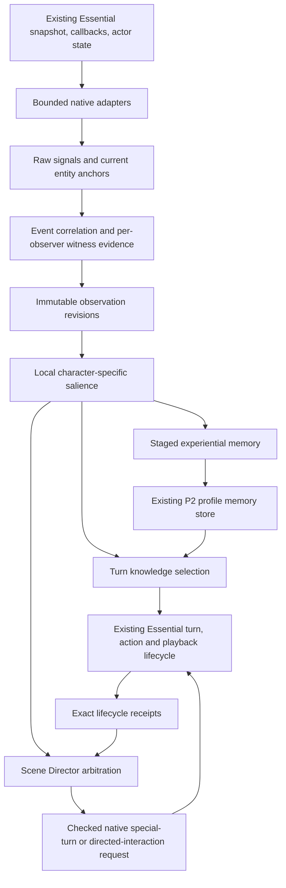

# Perception → Salience → Memory / Context → Scene Director

Research baseline: `main` at `e5b3669`, fetched October 3, 2026. This is an implementation design, not an implemented intelligence feature or a GTA acceptance report.

**PROPOSED:** build one evidence pipeline with two outputs: bounded turn knowledge and bounded initiative requests. Essential continues to execute every native effect. A world event is not automatically a character's knowledge; a salient event is not automatically a permanent memory; a requested reaction is not an executed action.



## 1. Existing evidence being reused

Evidence labels throughout this document:

- **CONFIRMED:** current source, pinned metadata/IL, or an executed offline proof establishes the stated fact. Static confirmation does not establish GTA behavior.
- **STRONGLY SUPPORTED:** evidence agrees, but a specified runtime or attribution detail remains untested.
- **PROPOSED:** an implementation choice, budget, heuristic, or future contract.
- **UNKNOWN:** insufficient evidence; the relevant feature must retain uncertainty or stay disabled.

| Evidence | Established input to this design |
| --- | --- |
| [Hotfix #3 API analysis](../plans/LosSantosAlive_Hotfix3_Extension_API_Analysis.md), sections 2–10 and relevant signatures | **CONFIRMED:** integration callbacks, action registry, state, playback events, special turns, perception snapshots and directed interactions exist. The report establishes surfaces more strongly than hidden detector behavior. |
| [Character-aware native audit](character-aware-native-runtime-audit.md), sections 5–6 | **CONFIRMED:** `PedId` is a textual pool handle; hydration supplies native context; native continuity is handle-oriented. Special turns hydrate the speaker before generation. |
| [Remaining-context audit prompt](remaining-native-context-audit-prompt.md) | Prior open questions, not completed findings. Handle reuse, provider completeness and archetype details cannot be treated as resolved just because this prompt names them. Demographic classifier reconstruction is outside this investigation. |
| [Roadmap](../ROADMAP.md) and [P0](../P0-turn-context-status.md) | **CONFIRMED:** immutable actor/listener/world/reference capture and time-of-use P/V validation are already implemented. P0 GTA lifetime acceptance remains separate. |
| [P1](../P1-session-identity-status.md), `src/identity` and native owner ledger | **CONFIRMED:** explicit authored ownership resolves durable UUIDs; fresh proofs, leases and exact bindings fence effects. Character identity is never a substitute native address. |
| [P2](../P2-promoted-characters-status.md), `profileStore.mjs`, `sessionProfiles.mjs`, `characterService.mjs` | **CONFIRMED:** durable profile/memory data already exists. Memories are bounded to 128 per profile, profiles to 500 / 8 MiB; current projection takes the first three selected memories. |
| [P2 native seams](../P2-native-evidence.md) and [RAGE host correction](../P2-rage-host-correction.md) | **CONFIRMED:** reuse follow/wait and native vehicle flags; guard scripted ownership. Register in the already-running Essential domain, not another copy of its static managers. |
| New [static evidence](perception-native-tools/evidence.json) and [reproduction tools](perception-native-tools/README.md) | Narrow investigation of actual event availability, damage callbacks, awareness lossiness and delayed scheduling; details below. |

All `src/...` references below mean `lsa-essential-e1-candidate/src/...` unless a native path is specified. Historical roadmap counts and prior GTA smoke results describe their checkpoints; they do not validate this proposed pipeline.

## 2. Remaining unknowns investigated

The Essential DLL remains pinned to SHA-256 `9b6de42d4c464901d859dd95e17e100e4fa9ef6074bfbb0cf3a57a76f6ddd653`. The shipped `DamageTrackerLib.dll` examined here has SHA-256 `64816a0d1131a6ec241f8951902b08afaee86fb0f73693399edefe2db8776750`. PE readers inspected both without loading them into the CLR or invoking game code.

| Question | Result and implementation consequence |
| --- | --- |
| Does `PerceptionSnapshot` encode who witnessed an event? | **CONFIRMED:** its public fields are player, all peds, all vehicles and game time. `Capture` (`0x06000684`) reaches `World.GetAllPeds/GetAllVehicles` through helpers `0x0600068f/690`. It is shared discovery data, not observer knowledge. Consume the existing snapshot and add observer-specific evidence. |
| Can the addon refresh it harmlessly? | **CONFIRMED:** `PerceptionSystem.Update` captures a new snapshot. Use `TryGetSnapshot` and check age locally; do not call `Update`/`Capture` as an addon scanner. Installed update order/cadence is **UNKNOWN** and must be measured. |
| Is gunshot detection a ready event source? | **CONFIRMED:** `UpdatePlayerShotDetection` (`0x060005f1`) and `Update` (`0x060005f2`) contain only `ret`; `HasRecentShotActivity` (`0x060005f7`) returns false. `TryResolveRecentGunshotSource` (`0x060005f8`) has only a false return. Public names and `GunshotNearby` enum values do not establish working gunfire observation in this build. A bounded shooting-signal adapter is needed. |
| Is reflex awareness a lossless bus? | **CONFIRMED:** `Record` (`0x06000675`) updates a dictionary of one `ReflexAwarenessMemory` per textual observer handle; `TryGetMemory` (`0x06000676`) retrieves one entry. Fields omit modality, LOS, target, event sequence and identity proof. Repeated events can overwrite earlier evidence. Active producer coverage is **UNKNOWN**; use it as optional corroboration, never as the sole exhaustive event feed. |
| Is there an existing damage callback instead of polling every actor-target pair? | **CONFIRMED:** Essential's ped-shot startup reaches `DamageTrackerService.add_OnPedTookDamage` through `0x06000616`. The shipped library exposes ped/player/vehicle damage events. Ped delegate signature is `(Ped, Ped, PedDamageInfo)`; payload has target/attacker handles, health/armour damage, weapon and bone info. Vehicle payload adds collision position. **STRONGLY SUPPORTED:** dispatch comes through the library's yielding game-fiber `Run`; installed threading, delivery loss and attacker accuracy still need GTA checks. Subscribe to the already-running instance; do not start or stop Essential's service. |
| Does delayed special scheduling retain entity lifetime identity? | **CONFIRMED:** scheduler helper `0x0600159a` captures handles and starts a fiber. Delayed closure `0x060015b8` calls helper `0x060015a4`, which calls `FindPedByHandle`, before `SendNow`. The request has no incarnation/owner field. This is not proof of retention across handle reuse. Use director-side waiting, zero-delay submission and an intake ticket, described in section 9. |
| Does scheduler success prove a delivered reaction? | **CONFIRMED:** submission and later `SendNow` are separate in the delayed path; stock `kb` can reject busy turns or failed hydration. No public scheduler completion event appears in the inspected metadata. Reserve separately from completed playback; add narrow receipts through existing lifecycle seams. |
| Does native NPC↔NPC readiness guarantee a working model exchange? | **CONFIRMED:** stock server `KJ` delegates to `tb`; `tb` returns `null`, and ended handler `rb` returns `false`. Native positioning/readiness exists, but normal server orchestration is stubbed, as the prior audit stated. PS7 must wire a bounded exchange through existing special turns rather than assume `StartInteraction` completes it. |
| Can automatic memory call the existing player API unchanged? | **CONFIRMED:** `validateMemory` permits `source:'event'`, but `ProfileStore.memory(create)` forces player provenance and refuses `source` / `playerCreated` in its patch. Extra provenance fields fail its strict schema. An internal event writer and explicit P2 format migration are required. |
| Are P2 relationships already a graph? | **CONFIRMED:** current profile relationship is one state/description, used as player-facing relationship context; memories can name related UUIDs. There is no structured NPC↔NPC edge collection. Start with known related-memory relevance; add explicit profile edges in PS7 if needed, without a second store. |

**UNKNOWN runtime gates:** Enhanced/RPH handle reuse timing; damage callback reliability; snapshot cadence; native sight flags through windows/interiors; real audibility/suppression; mission ownership shared by other addons; scheduler-to-server races; physical action outcomes. These have concrete acceptance cases in section 15. No GTA launch, live provider call or deployment was performed for this research.

## 3. Canonical Observation contract

**PROPOSED:** separate a shared `EventEpisode` from immutable per-observer `Observation` revisions. This prevents three witnesses from creating three unrelated incidents while keeping their knowledge separate. Neither object controls a ped.

```ts
type EntityRef = {
  captureRef: string; kind: 'ped' | 'vehicle' | 'player';
  characterId?: string; // only authenticated persistent peds
};
type WitnessEvidence = {
  channel: 'self' | 'visual' | 'auditory' | 'report' | 'inferred';
  basis: 'native_callback' | 'sampled_state' | 'native_awareness' | 'audibility_model' | 'dialogue_report';
  sampledGameTick: number;
  distanceMeters?: number; los?: 'clear' | 'blocked' | 'unknown';
  facing?: 'in_cone' | 'outside_cone' | 'unknown';
};
type Claim = {
  claimId: string;
  kind: 'sound' | 'firing' | 'injured' | 'dead' | 'attack' | 'location' | 'action' | 'presence';
  source?: EntityRef; target?: EntityRef;
  certainty: 'supported' | 'uncertain';
  evidence: WitnessEvidence; // per claim, preserved across revisions
  details?: { damageDelta?: number; armourDelta?: number; actionName?: string;
    locationName?: string; transition?: 'entered' | 'exited' | 'arrived' | 'left' | 'driver_changed' };
};
type Observation = {
  version: 1;
  observationId: string; episodeId: string; revision: number;
  observer: EntityRef; // validate kind=ped for NPC observations
  observedAt: { nativeRun: string; gameTick: number; receivedUtc: string };
  expiresAtMonotonicMs: number;
  eventType: string; // versioned closed vocabulary; subtype added only with a producer
  position?: { x: number; y: number; z: number; location?: string };
  severity: 'routine' | 'notable' | 'danger' | 'critical';
  claims: Claim[]; // ONLY claims available to this observer, maximum 4
  recognizedCharacterIds: string[]; // knowledge, distinct from backend identity resolution
};
```

`EventEpisode` holds episode UUID, revision, bounded time/area, up to four participant anchors, up to eight evidence-backed claims, producer IDs/sequences and status `open|settling|closed|expired`. Correlation keys stay private in RAM. `Observation` is the only event object Salience and model projection may consume. Raw signals and the richer shared episode cannot be read by the narrative builder.

Initial event types are `firing_burst`, `injury`, `death_seen`, `body_found`, `threat`, `vehicle_impact`, `action_observed`, `location_changed`, `activity_changed`, `vehicle_transition`, `character_present`, `speech_heard` and `report`; each is enabled only when its producer/witness capability is verified. Environment events may omit an entity source. Vehicles use transient vehicle anchors and never acquire CharacterId. Mixed visual/auditory claims retain their individual evidence and original sample ticks; a later revision cannot overwrite an older claim's modality/time with the latest visual check.

Validate `details` by event kind: measured bounded damage/armour deltas only on injury/impact, canonical callback action name only on an action claim, bounded location label only on a location claim, and the transition enum only on entry/presence/vehicle claims. No arbitrary JSON or native reason text. Speech/report content uses a separate bounded accepted-dialogue reference in RAM; its projection can quote only the authorized heard portion, without persisting a native turn ID into memory.

An observation's key is `(observer captureRef, episodeId)`; revision increases as that observer obtains new evidence. Do not add scalar `witnessedDirectly` or one global confidence number: directly hearing a shot establishes sound, not the shooter's identity or a death. Do not put relationship relevance in the canonical event; it changes with the observer's profile and belongs to Salience.

**Identity and recognition:** `captureRef` is a run-local random ticket referencing a retained entity, full captured handle/address and validated lifetime in the native adapter. It is not the handle itself. P2's encounter/owner evidence supplies anchors for owned peds; transient event participants get bounded, RAM-only anchors without being promoted or named automatically. `characterId` is attached only from a fresh P1-authenticated association, never name/model/appearance matching. Backend identity resolution does not mean an observer recognizes that person. Recognition requires that observer's established encounter/relationship knowledge or a grounded introduction. Unrecognized actors remain “someone” even when the backend knows their UUID.

Actors without a dialogue session do not receive fabricated session nonces. Existing owner-registration resolution can identify known promoted participants without opening a model connection. The player is a special live participant, not a newly invented P1 character UUID. Unknown targets stay absent.

**Time:** native receipt game tick records when evidence was sampled, not a guaranteed engine event timestamp; damage payloads contain no event clock. Use monotonic elapsed time for expiry and cooldowns. Treat game tick as uint32 consistently, but follow existing P1/P2 retirement on observed clock regression: drop live anchors/observations/tickets instead of stitching timelines. UTC is for durable chronology. Missing evidence remains unknown, never borrowed from another observer, a future sample or a replacement ped.

**Factual versus inferred:** position, current injury and native-reported attacker are factual sensor data with provenance. “The attacker meant to kill him,” ownership of an unfamiliar car, cause of a body discovered later, friendship inferred from standing together and person identification by model are interpretations. Claims carry uncertainty; only witnessed, supported propositions enter factual memory text. A report is remembered as a report with its speaker, not as witnessed truth.

The compact native wire envelope additionally carries producer sequence, adapter epoch, exact observer anchor and bounded payload. A copied integration JSON block cannot authenticate an observer. Reuse the live P1 owner proof for owned identities, and a separate checked factual intelligence channel for observations. P1's pipe remains factual identity only; the P2 player-control pipe remains player-control only.

## 4. Perception sources and witness rules

**PROPOSED:** one native adapter in Essential's executing domain subscribes to existing callbacks and reads a bounded slice of the already-captured snapshot. `EnrichActor` only copies a small cached block; it does no scanning, disk I/O, model calls or tasking. `Update` services the budget. No addon calls `World.GetAllPeds/GetAllVehicles`, detector `Update` methods, `ReflexSystem.Trigger` for observation, or global resolver delegate setters.

Initial observers are live promoted companions plus the current conversation actor, at most 16. Actor discovery from the shared snapshot is not itself perception. New observers establish a baseline; they do not acquire events that happened before registration. Ambient NPC initiative remains disabled until the same lifetime/ownership contracts are proven for it.

The following limits are **PROPOSED tuning defaults**, not discovered Essential radii or universal GTA acoustics. All visual rows require source-time range, facing and occlusion evidence; a positive distant global state query grants no knowledge.

| Event | Producer / availability | Witness rule and attribution |
| --- | --- | --- |
| Gunshots | Bounded `IsShooting` reads of player/relevant cached sources; sighted firing is sampled evidence. Stock gunshot methods above are unavailable. | Visual firing: 50 m, clear LOS, facing. Hearing: initially 60 m for a verified loud unsuppressed source; uncertain weapon/suppression/acoustics stays a possible sound, not named firing. Hearing never identifies shooter/target by global handle lookup. |
| Attacks, shots received, tazing | Existing damage callback plus current actor/target state; melee/aim native reflex state can corroborate. | Victim knows injury directly. Other observers must see the relevant source and target transitions, normally 35 m. Native attacker attribution is backend evidence; observer identification needs its own sight/recognition. Stun versus bullet requires validated weapon/damage type. |
| Injury | Damage callback or owned-ped health/armour delta. | Self is direct; seeing current wound/injured state within 35 m is direct observation of condition, not proof of attacker or prior attack. |
| Death / body discovery | Alive→dead transition for a retained tracked anchor; current visible corpse for discovery. | Seeing transition within 50 m can establish death. Encountering an already-dead ped establishes a body, never who killed it. A disappeared ped is not dead. Do not automatically change P2's player-editable availability/status. |
| Explosion | Verified source callback if exposed by a cooperating integration; otherwise tightly bounded local native query capability in PS8. An enum alone is insufficient. | Visible explosion at 80 m or sound at proposed 120 m; hearing has unknown cause/source. Disabled until the actual producer and interior/audio behavior pass acceptance. |
| Vehicle crash / ramming | Vehicle damage callback, retained vehicle delta and collision position; existing crash reflex can corroborate for the player. | Occupants can feel impact; bystanders see contact/impact at 50 m. Speed drop or old damage alone is not a crash. Deliberate ramming and driver identity require separate evidence. |
| Theft | Successful item-transfer action or witnessed vehicle/object entry plus proven ownership/consent semantics. | Seeing someone enter a vehicle at 25 m proves entry. “Theft” remains unsupported without established ownership/unauthorized-taking evidence. No omniscient crime classification. |
| Police arrival / activity | Sighted nearby actors, role/activity context and cooperating integration's factual notices. | At 60 m, sight proves apparent uniform/arrival. Role metadata is not knowledge of a hidden investigation, warrant or future response. Siren alone supports approaching emergency sound, not a named officer or dispatch facts. |
| Weapon drawn / aimed | Visible weapon-state edge; current aim detector/state where actually available. | At 35 m with sight of weapon/actor. Aiming at this observer can become immediate threat; drawing a gun is not firing or intent to attack. Events behind the observer need self-involvement or hearing, not visual knowledge. |
| Nearby conversation | Exact Essential playback start/end and directed partner data; supported reports from accepted dialogue. | Known speaker/listener membership plus modeled audible proximity, initially 12 m in the same acoustic space. Full text is shared only if explicitly authorized by the dialogue audibility policy; readiness/transcript generation alone is not heard speech. Interrupted playback supplies no unheard remainder. |
| Player/NPC actions | `OnNpcActionExecuted(ped, actionName, succeeded)` for self/corroboration, plus observable outcome edges. | Callback says handler reported success; it does not prove the physical action completed or every neighbor witnessed it. Only observer-visible/audible outcomes propagate. |
| Enter/leave location; activity change | Cached actor/world/location/activity provider changes on tracked participants. | Self knows own move; another observer must see arrival/departure. Require stable location transition (1 s dwell), avoiding doorway chatter. Do not hydrate every nearby actor on every tick. |
| Vehicle entry/exit, passenger/driver changes | Existing vehicle context and native companion state, compared across retained anchors. | Self knows its ride; visible others at 40 m. Seat/engine/motion edges create events only when meaningful to the observer's current activity. |
| Other promoted characters nearby | Shared discovery + sight/proximity + fresh owner facts. | Presence is perceptual only after witness checks. UUID resolution never reveals biography, private memories, relationships or remote whereabouts. Recognized presence can add relational relevance without any model call. |

**Sight:** cheaply reject distance, facing and different interiors before spending a LOS check. Proposed normal horizontal cone is 120°; direct victim involvement does not require facing. A glance/body-turn can establish later visual knowledge but cannot retroactively witness the earlier event. LOS from observer to source is not automatically LOS to target or evidence of peripheral awareness. Unknown LOS fails the visual claim; it does not become a default positive.

The [CitizenFX LOS reference](https://github.com/citizenfx/natives/blob/master/ENTITY/HasEntityClearLosToEntity.md) documents occlusion, and its [in-front variant](https://github.com/citizenfx/natives/blob/master/ENTITY/HasEntityClearLosToEntityInFront.md) combines sight with facing and warns about repeated expensive checks. These inform the proposed budget; they do not prove the installed Enhanced dispatch/flags. Prefer tested native-adapter helpers with explicit flag/version capability checks.

**Hearing:** sound does not require facing or sight. Record `basis:'audibility_model'` when audibility is a local simulation, not a native witness report. Cross-interior sound is rejected by default; unknown acoustic paths lower certainty and cannot identify people. Enclosed vehicle defaults reduce modeled sound radius by half; open vehicle/windows can use the normal radius only after a reliable vehicle-state seam is validated. Visual checks from vehicles use occupant pose/window occlusion; “inside vehicle” never gives a full-circle visual exemption. Explosion/gunfire/siren categories need a verified sound-producing source, not merely injury or police-role state. The [player-hearing native](https://github.com/citizenfx/natives/blob/master/PLAYER/CanPedHearPlayer.md) takes a player and ped; its signature is not an arbitrary NPC acoustic-event API.

**Sampling boundaries:** callbacks without an event timestamp can arrive after the causal strike. Capture current facts promptly, but label them at receipt time. Current clear LOS to an injured ped cannot prove the observer saw a projectile moments earlier. Short shooting edges can be missed by polling; metric and acceptance coverage must report this rather than claiming a lossless shot stream. Do not clear shared damage-history flags to create artificial edge semantics: [RPH's damage query](https://docs.ragepluginhook.net/html/M_Rage_Entity_HasBeenDamagedBy.htm) reports damage association, not a timestamped last-hit event.

## 5. Deduplication and event lifecycle

**PROPOSED flow:** `raw signal → episode match/update → per-observer evidence → immutable observation revision → salience delta`. Witness gating happens for each new claim before any narrative projection. A shared episode can be updated without giving every observer the update.

Native producers mint a signal UUID once per callback or detected edge and increment a sequence. Replayed channel messages retain that UUID. Polling emits only changes; baseline health, persistent damage flags and an ongoing aim do not repeatedly mint events. A duplicate callback lacking an engine ID is only safely coalesced when source/target anchors, payload and the observed state change agree; do not claim exact dedupe for indistinguishable independent hits.

| Group | Proposed correlation / expiry |
| --- | --- |
| Firing burst | Same retained source, weapon class, compatible 20 m area; 2 s silence closes a burst. Unknown source groups only compatible sound evidence within an area/time window, never attaches to the nearest named person. |
| Assault | Matching source-target lifetime anchors and compatible damage type within 5 s. Multiple victims remain distinct claims under a bounded conflict episode. Opposing attackers are not merged into one perpetrator. |
| Death outcome | Append only when retained target matches and damage/temporal evidence supports causality. If cause is insufficient, keep “injured; later died” or “found dead.” Temporal proximity alone cannot produce “Trevor killed Marcus.” |
| Repeated threat/aim | One active state with revision/escalation edges; refresh last-seen without new speech entitlement. |
| Crash/location/activity | Same vehicle/collision within 3 s; stable location/activity edge with 1 s dwell. Persistent state creates no new incident after restart. |
| Episode/context | Settling grace 2 s; hard episode lifetime 30 s. Ordinary observation TTL 30 s, danger context 120 s, capped at 128 observations per observer. Persisted memories are separate. |

Keys use episode UUIDs and retained capture anchors, not durable raw handles. Index by event family, participant anchors and coarse spatial cell; search at most eight compatible open candidates. Distance-only keys must not merge adjacent unrelated crimes. A participant's retirement closes correlation eligibility; a newly spawned lookalike starts another anchor. Unknown participants never become known merely because a name appears later; newly recognized evidence creates a qualified revision.

A 400-shot sequence increments counts/last-seen on one burst/conflict, preserves bounded injury/death evidence, and emits context updates at most twice per second per observer. Urgent self-danger can bypass the 2 s settling wait. A new critical claim raises a revision and may authorize one escalation response; routine updates do not. After 30 s an ongoing conflict becomes a linked continuation episode, preserving a bounded scene incident key so this rotation does not reset speech cooldowns or manufacture novel memories.

Reaction claims and suppression entries outlive context expiry (proposed 10 min bounded cache), so eviction is not a way to react again. Memory promotion uses the episode/continuation chain as one experience; chunk rotation is not permanent-memory novelty. Source removal, channel sequence gaps and snapshot overruns produce diagnostics and uncertainty. Do not replay an unseen backlog to a newly joined NPC or fire a delayed bark about an expired episode.

Example: Sofia sees Trevor firing, Marcus injured and Marcus die; she recognizes both and the damage callback associates the same attacker/target. Her memory can say “Trevor shot Marcus, who died” only within that evidence's confidence. Chris hears shots behind a wall: his observation says “Heard gunfire nearby; shooter unknown.” Marcus knows he was hit but does not necessarily identify an attacker behind him. Sofia's later report can add a report to Chris's knowledge; it cannot rewrite Chris's original observation as directly witnessed.

## 6. Salience architecture

**PROPOSED:** local categorical rules with separate context, memory and response decisions. A single ordered score would conflate “danger now” with “important for years.” No model ranks raw events.

```ts
type SalienceDecision = {
  observationId: string; revision: number;
  context: 'omit' | 'candidate' | 'must_include';
  memory: 'none' | 'stage';
  response: 'none' | 'eligible' | 'urgent';
  reasons: string[]; // maximum 4 controlled reason codes
  expiresAtMonotonicMs: number;
};
```

Evaluate in order:

1. **Evidence gate:** observer lifetime current, supported perception, observation unexpired, channel healthy enough. An inference can supply qualified context, never stronger factual knowledge.
2. **Safety gate:** direct current danger, injury or credible nearby threat becomes `must_include`; immediate defensive responsibility can become urgent. Native reflex/self-preservation retains control; urgent does not authorize speech interruption or a custom flee task.
3. **Involvement/relationship:** self or player involvement, explicitly known close character, companion separation or a remembered conflict raises relevance. Unrecognized backend UUIDs grant no social relevance. P2's current player relationship is not assumed to describe all NPCs.
4. **Situation:** current activity and conversation decide relevance and feasibility. Driver danger matters immediately; a companion noticing a routine parked car usually does not. A player question can make a previously unimportant observation useful context.
5. **Novelty/recency:** material new claim or severity escalation can be eligible. Repeated revisions, already explained episodes and old observations lose response entitlement. Similar previous memories affect novelty but do not erase genuinely new harm.
6. **Personality:** only explicit normalized trait-policy tags affect tie-breaking/thresholds. Free-form biography/traits remain narrative. Do not derive aggression/courage from age, gender, model or unparsed prose. Initially neutral local policy is valid.

Responses use lexicographic ordering: safety class → direct involvement → explicit relationship responsibility → material novelty → recent/nearby → stable fair tie-break. Distance has capped bands; it cannot overwhelm direct injury. Reaction feasibility is checked again by the director, so a high-salience unsafe action is still denied.

Memory importance is a separate bounded value in P2's existing 0–100 range: proposed bases 90 for severe personal harm or well-supported close-character death, 70 for meaningful witnessed aggression/help, 50 for meaningful shared experience; explicit relationship/self relevance adds at most 10, repeated/uncertain material reduces it. Hearing unidentified gunfire alone is usually context, at most 30 importance, with no automatic permanent-memory promotion. These are transparent tuning values, not personality simulation proofs.

Model reasoning is useful for one selected character's natural wording, interpreting a *qualified* emotionally meaningful experience, or proposing a short summary of already-filtered claims. It cannot upgrade witness evidence, identify unknown sources, decide every event's ranking, persist facts directly, or allocate native authority. PS3–PS5 can run entirely deterministically; summaries start as templates and model enhancement remains optional.

## 7. Persistent-memory integration

**PROPOSED:** stage experiences in RAM, then use an internal transactional writer in the existing `ProfileStore`. No new database, conversation-history import, automatic promotion of ambient peds or persistent native continuity store.

A `MemoryCandidate` contains the exact observer's authenticated CharacterId, experience UUID, bounded observer claims, proposed summary/importance and captured profile revision. Default stage grace is 2 s after the episode settles; urgent context and native protection do not wait for it. Promote only meaningful supported self/recognized-person experiences above a proposed 65 importance threshold, or an explicitly retained report with report wording. Minor noises, speculative crimes and repeated routine presence never auto-persist. At most 16 candidates per character / 128 globally, 5 min TTL; optional storage failure drops/defers within those bounds and leaves ordinary dialogue usable.

Memory creation does **not** depend on successful speech playback: an injury happened even if TTS failed. Conversely, a generated promise or conversation fact cannot become an experiential action memory before the relevant accepted dialogue/outcome. Keep `DialogueHistory`'s existing playback-gated assistant commit exactly as it is.

The event writer needs an explicit P2 schema-v2 migration before storing provenance. Preserve the P1 registry/schema entirely. Keep the current profile file path, atomic commit/backup behavior, 500-profile/8-MiB and 128-memory limits; a version number changes because strict v1 cannot accept new fields. Add a nullable `eventMetadata` to each memory and a bounded `memorySuppressions` collection to the profile. An event entry contains only:

```text
experienceId                 durable random UUID; no native addressing meaning
eventType, evidenceChannel   bounded vocabulary
confidence                   supported / uncertain-report
firstObservedUtc, lastObservedUtc
status                       active / superseded
supersedesMemoryIds          at most 4 durable memory UUIDs
playerEdited                 protects human amendments
```

Existing `text/category/source/importance/worldContext/relatedCharacterIds/editable/playerCreated/selectedForContext` remain. Event memories use `source:'event'`, `playerCreated:false`, `editable:true`, selection initially false. `worldContext` remains optional coarse game-time/location narrative context. Do not serialize capture refs, handles, addresses, native run/adapter epochs, owner proofs, sessions, turns or generation IDs. An experience UUID links durable provenance, never resolves a live ped. Up to eight related CharacterIds are allowed only when the observer's recognition evidence supports that association; anonymous people stay anonymous in text.

Migration is pure, explicit and validated: add `eventMetadata:null` to old memories, empty suppressions to old profiles, retain every manual field/UUID/selection, validate complete output and commit through the existing replace/backup mechanism. A newer file is never silently opened by an old writer; corrupt/unsupported input stays preserved. Schema downgrade is not automatic. Editor and model projections must understand the same version before enabling automatic writes.

If all 64 suppression slots are still within the replay horizon, human deletion still succeeds: advance a bounded profile `automaticMemoryNotBeforeUtc` cutoff and discard older staged candidates. Automatic candidates first observed before that cutoff are refused rather than losing deletion protection. Initialize this nullable UTC field during migration; it is a persistence policy boundary, not a native epoch. New experiences after the cutoff remain eligible.

`upsertExperience(candidate, expectedProfileRevision)` runs on the existing serialized store queue. Locate `(characterId, experienceId)`, combine only compatible claims within that experience, and preserve its memory UUID. On a revision conflict, reload and reevaluate once; never overwrite a concurrent human edit. Event text edited by the player is protected from automatic replacement. Human deletion writes a suppression for that experience; retries cannot resurrect it. Keep at most 64 such suppressions, evict only entries beyond the replay horizon; no persisted observation outbox is replayed across runs.

Do not semantically merge all gunfights or every event involving Marcus. Similar later events can share summary relevance but retain independent experiential provenance. A material correction marks an automatic record superseded and creates/updates a supported replacement; it does not silently rewrite a manually amended memory. Persistent summaries can later replace at most four compatible automatic records under explicit provenance; no model-only consolidation in PS5.

Aging affects retrieval, not factual truth: proposed recency bands are recent (under 1 day), familiar (under 7), distant (older), with relationships and high-importance events exempt from routine deprioritization. Do not silently erase a human note. At the 128-memory cap, merge the same experience or expire low-importance unpinned automatic records under a documented retention policy. If no eligible slot exists, refuse the automatic insert. Manual/pinned/player-edited memories never lose a slot to an event. There is still one bounded profile store, not an unbounded archival database.

## 8. Dialogue-context selection

**CONFIRMED:** current `narrativeProfile` selects the first three `selectedForContext` memories in storage order, each at most 240 characters, and uses a 4-KiB byte guard. P1/P2 privacy filters remove transport evidence, but they are not a complete sensory-knowledge projector. P0 freezes attribution; it does not prove that every native context field is knowledge an observer possesses.

**PROPOSED:** capture a separate immutable `TurnKnowledgeInputs` at `OpenAIConnection.beginTurn`, before an await: observer anchor, observation revisions, available profile revision, bounded memory candidates and knowledge-policy version. This accompanies the existing raw P0 snapshot; it never mutates it. After existing identity preparation, pure selection uses only those captured inputs and the accepted utterance/topic. Unloaded optional data yields less context this turn, not a late mutable substitution. STT can choose relevance from the frozen candidates once its transcript is accepted, but cannot pull in a later gunshot while the model is pending.

The selector produces one concise narrative block, with private evidence/identity outside the prompt:

```text
You heard gunfire nearby a moment ago; you did not see who fired.
Marcus is someone you know. You remember helping him after a previous crash.
You are concerned for the player, but no attacker has been identified.
```

Proposed hard combined budget for profile + current observations + memories: **4,096 UTF-8 bytes**, normally about 850 estimated tokens or less. Maximum two observation summaries and three memory summaries; no model-visible event JSON, UUIDs or correlation keys. Allocate up to 1,600 bytes to profile, 800 to observations, 1,200 to memories and the remainder to labels/qualifiers. Each summary is at most 240 characters **and** 400 bytes; trim at text/code-point boundaries and retain its uncertainty qualifier. Rebalance by dropping low-value biography/automatic context before a current safety fact. The full existing prompt/history/action budgets remain separately bounded; this is not a claim that the whole prompt is 4 KiB.

Ordering is current safety fact → other useful current evidence → established profile → selected memories → optional automatic memories. Manual **Supply to dialogue** retains priority **among memories**, not permission to exceed the byte cap or contradict current evidence. Preserve the existing first-three storage-order behavior when more than three are selected; emit only a count for excluded pins. Three selected memories fill all memory slots; automatic selection does not displace them. With zero/two selected entries, use up to three/one automatic candidates. Truncation is deterministic and visible through counts, not silent quota expansion.

Automatic memory selection is lexicographic: recognized related participant/topic → direct relevance to the current observation/activity → importance band → recency → stable memory UUID. Use structured metadata and a bounded local topic match; free-form model embedding/vector infrastructure is unnecessary initially. Recent noise does not crowd out a personally relevant older memory. Superseded, deleted/suppressed and uncertain unqualified entries are excluded.

PS4 must inventory *all* paths into Luna's request: actor, listener, world, integration blocks, stock `contextText`, special-event `Content`, profile text and history. Allow self-state, experienced location/weather and supported nearby descriptions; qualify reports/inferences and omit hidden warrants, global crime facts and other characters' private profiles. Do not append a careful observation block while passing unrestricted stock narrative beside it. Rebuild the model-facing narrative from an allowlist instead of trying to redact arbitrary free-form JSON/string fields. Retain Essential's current action capability declarations and private raw P/V maps for validation; reference labels presented to the model must be grounded in the observer's available scene or explicit player direction. Listener data cannot donate the listener's private knowledge to the speaker.

`CharacterService.prepareTurn` supplies the profile projection; a new knowledge selector replaces only its model projection/related prompt material. Stock normalization and source-pinned build hooks must reserve the new factual transport block just as P1/P2 reserve theirs. Failure falls back to a privacy-safe basic actor view, not raw transport. Special turns remain `SPECIAL_EVENT` with no fake player utterance; assistant text commits once only after matching successful `PlaybackEnded`.

## 9. Scene Director architecture

**PROPOSED:** Scene Director owns eligibility, speech reservations and scene policy, never ped tasks or session/generation allocation. Input is `SalienceDecision + Observation + current native admission facts`; no world scanning and no direct provider request. PS6 is passive speech/warnings only. Movement/combat initiative remains a later, separately validated capability.

Admission requires current retained observer and fresh owner lease; alive/available/non-suspended character; supported current script ownership; no mission/cutscene/player switch/multiplayer guard; no conflicting directed interaction; no current player input, playback or native reflex reaction for the incident; and no existing reservation/cooldown. Use `TryGetState` without promoting a passive actor just to observe it. `HasActiveReflex`, `LastReflexTime`, `LastReflexEventType` and `LastReflexRequestedGeminiSession` are useful suppressors, not complete outcome receipts. Conservative uncertainty means defer/drop optional initiative.

Queue only a bounded candidate while Essential is busy. Once quiet, recapture/check the original lifetime and submit `SpecialGeminiTurnScheduler.Submit` with `DelayMilliseconds=0`, `InterruptExisting=false`, `CancelIfPlayerStartsTurn=true`, `SkipIfSpeakerBusy=true`, and `FaceListener=false` initially. Set `RequireCurrentPlayerConversation` according to the actual desired listener; do not invent conversation ownership. Do not use native delayed `SubmitAfterCurrentTurn` for PS initiative until it can preserve an exact incarnation: its handle re-resolution is the concrete risk found above. Director-side waiting schedules *requests*, not an alternate native behavior scheduler.

### Ticketed intake and exact outcomes

The current special-turn request has no owner/lease field. The extension therefore needs a short-lived native `DirectorTicket`, at most 32 outstanding, containing episode/revision, retained speaker/listener anchors, owner incarnation/proof revision, safety-policy revision, player-turn version and expiry (proposed 2 s). Give it a random UUID. Native `DedupeKey` carries `ps:<ticketUUID>`; `Reason` carries a fixed namespace such as `ps_warning`; `Content` contains only observer-qualified narrative. No ticket metadata is embedded in speech or interpreted as a model command.

The new same-user intelligence IPC channel has separate strict frame types: factual observation/proof/receipt frames and application-only `reserve/submit/cancel` requests. It cannot spawn/promote/delete peds, set identity, task entities, allocate sessions, dispatch DO commands or send PCM. Reserve/submit can reference only an existing native ticket and policy-limited intent, not a CharacterId or arbitrary model text. Native `Update` performs all ped validation and scheduler calls; pipe workers copy bounded data only. P1 and P2 pipes gain no new commands.

The native admission service renders scheduler `Content` from its retained observer-qualified facts and fixed intent templates; no model-produced request text crosses this channel. Profile/memory context is added later by the normal immutable turn selector. The 2 s ticket expiry governs pre-turn admission only; after acceptance, its exact tuple mapping stays under existing provider/turn/playback deadlines and owner lease checks, not a renewed ticket or a new 2 s model deadline.

Add a narrow, source-pinned hook to stock `kb` for namespaced PS tickets: verify the ticket before hydration; reverify the exact anchors against hydrated speaker/listener before `Xi`; recheck after async session preparation and before generation/provider work. Do not accept a ticketless PS turn or fall back to an unrelated ephemeral session on failed proof. Carry its expected owner anchor into the existing P1 prepare/check path. All other stock special events retain their current behavior. A ticket is consumed at most once. Holding a CharacterId and finding its newest incarnation is forbidden.

This extra intake fence is required even with zero native delay: server hydration/session preparation can yield after the game-side check. If a recheck fails after a native session was prepared, cancel only the exact work/session created by that request through existing retirement; do not close another actor's new session. Capability checks and ownership checks also run at action time. Source-pinned integration must fail closed if `kb/M4` or lifecycle hooks drift.

Bridge accepted/begun/rejected/expired/cancelled receipts and matching playback/action outcomes back to the ticket record using existing controller/native lifecycle events. Only after Essential allocates them may the receipt contain the actual `(pedId, sessionNonce, turnId, generationId)`. Playback events lacking a session nonce must be joined to the still-live accepted ticket's exact mapping; never guess it from the latest session. Speech reservation is not success. Completed spoken reaction is matching successful playback; failed or partial playback remains attempted, with backoff, and does not automatically retry with another NPC. A timeout retires the reservation and suppresses immediate reattempts; late receipts cannot revive it.

### Behaviors and arbitration policy

| Intent | Reused execution path / boundary |
| --- | --- |
| Comment, warn, emotional reaction | One checked special turn through normal Luna decision/TTS/playback. PS6 requires empty command; native reflex retains physical protection. |
| Follow/wait or flee | Existing Essential action vocabulary/state. PS8 may request one currently permitted DO command through normal validators; do not call P2's player management controls on behalf of the model. |
| Take cover | Native `TakeCoverMode` exists, but the audited server vocabulary does not establish an exposed cover command. Validate/register the action through existing registry/role routing before advertising it. Never add a separate TASK loop. |
| Approach / NPC↔NPC | Existing approach action and `DirectedInteractionManager`; PS7 must supply bounded server orchestration because stock `tb` is stubbed. |
| Wider Essential actions | Only tested current registry/role capabilities. Handler success is not physical outcome; observe native state/outcome and never retry an already-published action automatically. |

Priority is native safety/script ownership → player input → active directed/dialogue lifecycle → urgent optional warning → routine initiative. Urgent danger may suppress a routine pending request; it does not interrupt existing player speech or Essential's reflex. Initial policy permits no autonomous offensive combat, police authority, weapon grants, vehicle takeover or automatic mission rejoin. Later expansion requires explicit capability/ownership gates rather than prompt persuasion.

Proposed limits: one PS model turn in flight globally, one speech reservation per acoustic scene, 4 autonomous starts/min globally, 20 s routine speaker cooldown, 5 s urgent-warning cooldown, 8 s scene gap, one response per incident/observer plus one material escalation. Rate limits count **attempted starts**, including provider failure. Candidate TTL is 2 s for immediate warnings / 10 s for routine context; old danger can remain dialogue context while its bark expires. Cancel only the director's own key and retained ped; never call `CancelAll`. Stale/retired listener cancels or removes the listener only under an explicit intent policy, never routes to a replacement.

## 10. Multi-character arbitration

**PROPOSED:** evaluate all eligible observers locally, then choose at most one speaker. Scene membership means spatial/acoustic co-presence with fresh native anchors, not a persistent group identity. Membership ends on departure, retirement or TTL; knowledge does not automatically follow it.

For Chris (player), Marcus and Sofia together when Trevor fires:

| Participant | Perception / salience | Response |
| --- | --- | --- |
| Chris | Player agency; the director does not generate dialogue for the player. | Remains player-controlled. |
| Marcus, facing Trevor | Visible firing if sight passes; perhaps danger/self-involvement. | Essential's existing reflex may protect him; director abstains if it is already reacting. |
| Sofia, facing away | May hear modeled gunfire; cannot identify Trevor from that alone. | Eligible for a generic warning if near the player and otherwise safe. |
| Another NPC behind a closed interior boundary | No supported hearing/vision. | No observation, memory or reaction, even if present in the global snapshot. |

Choose by threat responsibility/direct involvement, existing companion relationship, novelty, safe conversational availability and round-robin fairness within equal bands. Do not pick an injured/busy NPC just because it has the highest urgency. A prepared driver can remain focused on driving while another character speaks. Other characters retain their own observations/context and let existing native protection run without Luna calls.

After one accepted response, mark only a scene response reservation; after playback, propagate heard speech only to observers whose hearing policy allows it. Do not mark everyone as having witnessed the original event or as having made the response. A second speaker needs new material evidence, an explicitly requested reply or a later scene gap; a failed model call does not trigger a ten-NPC cascade.

For NPC↔NPC initiative, acquire both actors' exact anchors, verify both admission states, and start one native directed interaction. Wait for matching `NpcToNpcInteractionReady`; then schedule an opening special turn for the initiator, listener set to the partner, and use existing `MarkOpeningLineFinished/MarkInteractionActive` only after appropriate matching lifecycle receipts. A proposed maximum exchange is two alternating spoken turns, one call at a time, 15 s wall deadline per hydration/generation attempt and 40 s whole interaction deadline. Cancel through the exact interaction ID on player takeover, guard, retirement or timeout. Normal player dialogue retains priority. Neither participant receives the other's private profile/observations; a heard reply can become a qualified conversational report.

The stock special controller and provider prompt assume player-facing dialogue in places; PS7 must explicitly carry partner/listener intent and adapt wording without changing session allocation, P0 listener-null semantics or exact playback identity. Independent gestures/emotional posture are permitted only through tested native capabilities; do not invent deterministic tasking simply to avoid a model call.

## 11. Safety, identity and native ownership

These are implementation invariants, not configurable salience preferences:

| Boundary | Required behavior |
| --- | --- |
| P0 turn capture | Raw actor/listener/world/reference snapshot stays immutable. Knowledge selection captures its own immutable revisions; later events/profile edits cannot change an in-flight turn. P/V aliases are rechecked immediately before unchanged stock dispatch. |
| P1 identity | Only fresh authored-owner proof attaches CharacterId. No matching by model/name/voice/location. Alias/CharacterId selects data; effect routing always uses the originally accepted Essential tuple or pre-turn exact native ticket. |
| Ped lifetime | Validate retained entity existence/address/handle plus owner incarnation where available. Retirement invalidates observations, correlation anchors and pending tickets; no handle re-resolution to a replacement. Exact reuse timing remains a GTA uncertainty, so success cannot depend on a assumed reuse delay. |
| Essential effects | Essential allocates sessions/turns/generations, validates/actions, authorizes audio, interrupts, finishes playback and manages native behavior/interactions. No parallel WS audio sender, TASK loop or session allocator. |
| Script ownership | Reuse P2 `NativeSafetyPolicy` and actual guard reads. Guarded characters can retain factual observations without optional initiative, but unreliable scripted event semantics remain qualified. Do not release exclusive control on suspension: the prior audit shows that release can clear tasks. |
| Await boundary | After proof, hydration, store, provider or IPC waits, recheck abort/deadline/exact anchor/currency before publishing into runtime state. A valid durable write may finish after despawn, but cannot publish a new action or redirect to a returned character. |
| Action result | A request/callback is not proof of outcome. Correlate current native state/physical acceptance; never record model-proposed actions as completed facts. One action at most per normal decision, with existing E3/E5 action buffering. |
| Knowledge | Memory/profile/dialogue text is narrative, never authority. No source string can upgrade witness evidence or unlock role/actions. Never expose another observer's claims/private notes via group context. |
| Persistent timeline | Use the existing explicit world-profile UUID. Reload/clock regression resets live observations and initiative; no automatic import into another save timeline or durable revival of anchors. Save-timeline selection remains explicit, not guessed from game time. |
| Optional failure | Bad/missing native contract/channel/store disables the corresponding intelligence capability. Ordinary ephemeral dialogue, stock Gemini and P0/P1/P2 fences retain their behavior. PS initiative requires proven anchors; it does not degrade into unsafe ticketless turns. |

Suggested feature modes are `off`, `shadow`, `context`, `memory`, `initiative`, with independently checked capabilities and default `off`. Shadow observes/records bounded diagnostics but supplies no prompt data, permanent memory or initiative. Memory and initiative require explicit opt-in; neither mode promotes or spawns characters. Guard/capability changes invalidate pending optional work immediately and require normal safe re-admission, not automatic mission participation.

## 12. Performance and boundedness strategy

**PROPOSED defaults:** start small, measure actual native costs, then tune. Fixed counts prevent event storms from multiplying provider calls. A wall-time budget can stop between native calls but cannot preempt a single slow LOS call.

| Resource | Bound / behavior at the limit |
| --- | --- |
| Observers | 16 active; current companion/conversation responsibility first. Others get no fabricated observation. |
| Transient entity anchors | 256 retained peds/vehicles, prioritizing owned participants; retire invalid/idle anchors. Observe no newly assigned recycled handle as the prior lifetime. |
| Snapshot discovery | Reuse one existing snapshot/version. Inspect at most 512 candidate entries per 200 ms discovery cycle with a cursor; prioritize player and owned roster separately. No addon world enumeration; record deferred discovery. |
| Fast shooting sample | Player plus at most 8 relevant retained sources every proposed 50 ms. Missed short edges remain a measured limitation; callbacks cover injury independently. |
| Other state/witness work | Proposed 200 ms cadence; spatial/range/facing rejection before LOS. At most 4 LOS checks in one Update and 8 per 200 ms; aim for ≤1 ms p95 added Update cost on test hardware. Budget overrun defers evidence rather than assuming sight. |
| Raw ingestion | 256 signals, reserved 64 for critical involvement; merge repeated states first, drop routine oldest if necessary, report lost/gap count. Critical overflow still remains bounded and reduces certainty. |
| Correlation | 64 open episodes, 256 retained episodes, 8 match candidates/signal, maximum 8 claims and 4 participant anchors per episode. Repeated counts saturate; no unbounded projectile list. |
| Observations | 128/observer, 2,048 globally; maximum 4 claims each, ≤2 MiB aggregate serialized event RAM. Evict expired/routine first; overflow cannot reset incident suppression. |
| Transport | 8-KiB frame, native queue 64 / companion queue 256, bounded nesting/version checks, stale sequence rejection. Receipts/revocations have reserved admission; dropping one fails closed, never authorizes guessed completion. |
| Salience | At most 32 changed observations evaluated per pass; critical self-involvement first. No LLM work in Update, no scans of arbitrary external integration data. |
| Memory staging/writes | 16/character, 128 global, 5 min expiry; batches at most 8 candidates, coalesced at most once per 2 s. Use one serialized P2 writer; rate-limit commits rather than write for every shot. |
| Dialogue knowledge | 2 observations + 3 memories, combined 4,096-byte cap with final measurement. Existing history/request limits remain. |
| Initiative | 32 tickets, one global PS call in flight, 4 attempted starts/min, bounded per-scene reservations/cooldowns; no fan-out provider calls. |
| Suppression | 1,024 live incident/observer entries with 10 min TTL; memory suppression is bounded within P2. Retain active reservations until terminal/timeout; do not evict one to admit fresh speech. |

Process callback payloads promptly and copy only primitive facts/anchors into queues; keep ped work on the validated native fiber. Do not assume every callback carries immutable/live-safe references. Callback ordering, bounded handoff and snapshot age are acceptance items; if timely lifetime validation is impossible for a source, do not attribute it.

Add allowlisted telemetry for source capability, ingestion/drop counts, capture-to-consumption lag, witness rejection reason, correlation updates, categorical salience reasons, memory-stage/write outcome, byte budgets, ticket admission/rejection and matched lifecycle outcome. Engine-event-to-callback lag is unknown when the producer has no event timestamp. Exclude names, raw handles/addresses, owner aliases/proofs, CharacterIds, event narrative, memory text, prompts/audio and arbitrary native `EventReason`. Correlation uses existing permitted turn telemetry and local ticket records; diagnostic sink failure cannot affect authority.

## 13. Recommended module/file structure

**PROPOSED:** one optional intelligence runtime inside the existing P2 host domain, with pure companion modules and one P2 writer. No extra top-level RAGE loader or second Essential assembly.

| Path | Responsibility |
| --- | --- |
| `native/intelligence/IntelligenceIntegration.cs` | Idempotent integration registration/subscriptions, game-fiber Update/EnrichActor, lifecycle cleanup. Reuse P2 host bootstrap; do not register from another AppDomain. |
| `native/intelligence/EntityAnchors.cs`, `SensorAdapters.cs` | Retained lifetime anchors; existing snapshot, damage/playback/action callbacks; bounded state/shot samples. |
| `native/intelligence/WitnessPolicy.cs`, `IntelligenceChannel.cs` | Event-time observer evidence and bounded checked wire contracts; no model, storage or native task loop. |
| `native/intelligence/DirectorAdmission.cs` | Exact tickets, policy/ownership/deadline checks, immediate native scheduler submission and directed-interaction admission. |
| `src/perception/contracts.mjs`, `observationStore.mjs`, `episodeCorrelator.mjs` | Versioned primitive contracts, validation/expiry, bounded shared episodes with isolated observation revisions. |
| `src/salience/salienceEngine.mjs`, `knowledgeSelector.mjs` | Local categorical rules and immutable bounded narrative selection. |
| `src/characters/experienceMemory.mjs` | Candidate promotion/merge/retention; calls the existing P2 store's new internal transaction. |
| `src/sceneDirector/director.mjs`, `sceneArbiter.mjs`, `lifecycleReceipts.mjs` | Response policy, one-speaker reservations, cooldowns and exact outcome accounting. |
| `src/context/knowledgeProjection.mjs` | Allowlisted knowledge-safe actor/listener/world/contextText projection; raw P0 remains private. |
| Existing `profileStore.mjs`, `sessionProfiles.mjs`, `characterService.mjs` | Explicit schema migration/provenance/editor compatibility; replace manual-only projection with bounded selection while preserving pins. |
| Existing `openaiConnection.mjs`, `essentialGlue.mjs`, `buildCandidate.mjs`, `patches/essential-hooks.json` | Freeze cognitive inputs, optional wiring, source-pinned ticket intake and receipt hooks; unchanged Essential allocation/delivery path. |
| Existing native P2 host / configuration; `src/config/e1Config.mjs` | Load optional intelligence inside proven host, capability pins and default-off/shadow flags. Do not change P1 alias or voice formats. |
| `tests/perception-*.test.mjs`, `salience-*.test.mjs`, `scene-director-*.test.mjs`; `native/intelligence/tests` | Pure fixtures, stock-controller integration and native policy/host/channel harnesses, independent of GTA. |

Keep interfaces narrow: native adapter owns factual capture and admission; companion owns experience aggregation, local character relevance, durable memory and request selection; Essential owns effects. Native witness and companion contract versions must agree. Unknown native capabilities are explicitly reported, not emulated by arbitrary integration JSON.

## 14. Concrete implementation phases

The entries below are **PROPOSED work**, not checks already run. Each phase adds a testable slice of the *same* contract. PS0–PS4 can operate in shadow/context without automatic memory or initiative. Native admission is designed in PS0, but the full special-turn intake fence must pass before PS6 can enable effects.

### PS0 — Observation contract, anchors and bounded event bus

- **Implement:** primitive raw signal/episode/observer contracts, UUID/sequence/revision semantics, RAM stores and expiry; optional native factual channel and current owned-observer roster. Freeze the ownership/admission interfaces now so subsequent stages do not invent different addresses.
- **Files:** `src/perception/contracts.mjs`, `observationStore.mjs`; native `EntityAnchors.cs`, `IntelligenceChannel.cs`, integration scaffold; config and optional metadata verifier.
- **Native seams:** existing P2 executing-domain host, P1 owner facts, `IIntegration`, retained P2 encounter roster; no new world enumeration.
- **Tests:** version/size/type rejection, lease/revoke/restart, duplicate/out-of-order sequences, anchor retirement/reuse, every queue cap, disabled parity and missing-contract isolation.
- **GTA validation:** shadow registration in the actual Essential domain; callback/update cadence, owner revocation and retained anchor retirement with rounded, secret-safe diagnostics.
- **Exit:** bounded authenticated primitive facts flow without prompts, persistence, provider calls, task changes or native control changes; no live address restored from disk.

### PS1 — Core native perception adapters

- **Implement:** subscribe to existing damage/action/playback callbacks; baseline/current self injury, death/state/location/vehicle transitions; bounded sighted-shooting sample; optional awareness corroboration with explicit capability flags.
- **Files:** native `SensorAdapters.cs`, `IntelligenceIntegration.cs`; `src/perception` ingestion tests and source capability metadata.
- **Native seams:** `PerceptionSystem.TryGetSnapshot`, `DamageTrackerService` events/IsRunning, `NpcStateStore.TryGetState`, existing providers and playback events. Do not invoke stub gunshot methods or start another damage service.
- **Tests:** initial baselines create no historical event, 400 callbacks remain bounded, no actor-target Cartesian polling, callback loss/lag/absence, handler-success versus physical-outcome distinction, snapshots stale/missing.
- **GTA validation:** shots with/without injury, armour/taze/melee, non-player attacker, health changes, vehicle damage, despawn versus death, interrupted speech and callback thread/domain/cadence. Record misses rather than hiding them.
- **Exit:** supported sources demonstrably produce timestamp-qualified primitive signals within budgets; unsupported event types remain advertised as unavailable.

### PS2 — Witness rules and episode correlation

- **Implement:** self/visual/auditory/report evidence, recognition separate from identity, claim-level observer views, temporal/participant correlation and material revisions; model audibility only for validated sound-producing sources.
- **Files:** native `WitnessPolicy.cs`; `episodeCorrelator.mjs`, observation projection/fixtures.
- **Native seams:** retained positions/facing, tested LOS/interior/vehicle helpers, source-time evidence from PS1 and fresh owner identity facts. Native acoustic shortcuts stay optional.
- **Tests:** wall/back/vehicle/out-of-range cases; no causal/identity inference from sound; lost callbacks; mixed attackers/victims; same-handle new lifetime; reports never become direct witnesses; continuation episodes preserve suppression.
- **GTA validation:** three observers in different facing/interiors/vehicle states hear/see different facts; move into view after injury; body discovery versus witnessed death; concurrent nearby unrelated fights.
- **Exit:** no observer receives claims unsupported by its own evidence; bursts coalesce, causal unknowns stay unknown and hot-path budgets pass.

### PS3 — Deterministic salience

- **Implement:** context/memory/response categories and controlled reason codes; involvement, relationships, activity, novelty/recency and explicit trait policies; local fair ordering.
- **Files:** `salienceEngine.mjs`, bounded salience cache and rule fixtures.
- **Native seams:** current admission/reflex/activity facts from existing state, without altering them.
- **Tests:** urgent self-danger, recognized versus backend-only identity, distracted driver, prior-memory relevance, repeated-event suppression, changed relationship/profile revision, neutral unparsed traits; zero model calls.
- **GTA validation:** inspect shadow reason/count diagnostics for companions under harmless activity and controlled danger; native reflex behavior remains intact.
- **Exit:** explainable stable categories drive bounded candidates; repetition does not create reaction or memory entitlement.

### PS4 — Immutable dialogue knowledge

- **Implement:** capture knowledge inputs at beginTurn; select up to two observations/three memories; preserve manual pins; apply knowledge-safe allowlist to every request path and byte-budget narrative projection.
- **Files:** `knowledgeSelector.mjs`, `knowledgeProjection.mjs`; existing `openaiConnection`, `characterService`, `sessionProfiles`, request and source-pinned build hooks.
- **Native seams:** existing hydrated actor/listener/world and P0 reference maps; no extra NPC hydration per event.
- **Tests:** real typed/mic/special controllers with delayed provider; listener omission/null, actor switching, later event/profile edit, hidden global/contextText leakage, UTF-8 bounds, ≥4 pins, memory slots and unchanged P/V action fences.
- **GTA validation:** NPC answers about heard versus witnessed events; ask about a recognized character/old memory; verify late unseen outcomes do not enter an in-flight answer and actions still target the captured live entity.
- **Exit:** bounded useful narrative on every supported OpenAI path, no raw transport/private knowledge leakage, immutable snapshots and existing playback/history fences unchanged. Gemini parity remains proven while opt-in Gemini cognition is deferred.

### PS5 — Automatic experiential P2 memories

- **Implement:** RAM staging, deterministic summaries/promotion, internal serialized event upsert, explicit schema-v2 migration, provenance/supersession, protected manual amendments/deletions, capped automatic retention and editor compatibility.
- **Files:** `experienceMemory.mjs`; existing `profileStore.mjs`, `editorServer.mjs`, projection/version tests and migration fixtures.
- **Native seams:** PS2's observer-qualified evidence and PS0's authenticated identity. No native memory/action store replacement.
- **Tests:** v1 manual data preserved byte-for-field semantically, strict v2 validation, duplicate/replayed experience idempotence, concurrent manual edits/deletes/pins, restart, missing-primary backup recovery, corrupt/unsupported primary, disk failure, memory/store caps and no persisted addresses.
- **GTA validation:** meaningful injury/shared help retained after fresh session/restart; heard-only noise remains temporary; one fight creates one qualified experience, not per-shot entries; manual memory still selected/edited and never auto-overwritten.
- **Exit:** one P2 store durably contains correct qualified experiences with recoverable migrations and bounded writes; observation expiry and failed TTS do not fabricate or erase factual experience.

### PS6 — Scene Director passive initiative

- **Implement:** candidate queue, exact native ticket/intake fence, receipts, player/native-reflex priority, one-call arbitration, cooldowns and dialogue-only short warnings/comments. No new movement/combat initiative.
- **Files:** `director.mjs`, `sceneArbiter.mjs`, `lifecycleReceipts.mjs`, native `DirectorAdmission.cs`; stock `kb`/lifecycle source-pinned hooks and existing config.
- **Native seams:** zero-delay `SpecialGeminiTurnScheduler.Submit`, current ownership/state/player-turn version, existing session/generation/authorization/playback events. Native delayed handle re-resolution is bypassed by waiting before capture/submission.
- **Tests:** retire/recreate during ticket/hydration/session/model/TTS awaits, wrong listener/owner proof, duplicate ticket, late/missing receipts, provider failure, player-start race, busy/reflex state, scene/ticket caps, deadline and attempted-start rate limits.
- **GTA validation:** one brief warning after qualifying evidence; no chatter during repeated gunfire; real mission/cutscene/player switch suspends initiative; replacement incarnation receives no old speech/action; interruption commits no fake history.
- **Exit:** zero ticketless PS effects, exact matched terminal accounting, no player/reflex conflict, and per-minute model-call/scene-speech bounds established in a soak run.

### PS7 — Multi-character and directed exchange

- **Implement:** scene membership/fair responder selection, separate heard-speech reports, explicitly bounded two-turn NPC↔NPC orchestration, partner-aware prompt wording; optional explicit per-character relationship edges within P2 profiles.
- **Files:** `sceneArbiter.mjs`, directed exchange adapter/receipt tests; profile migration/editor additions only if relationship edges are introduced.
- **Native seams:** `DirectedInteractionManager.StartInteraction`, Ready/Ended events, partner lookup and matching opening/active lifecycle transitions; existing special turns. Replace the *stubbed orchestration wiring*, not native positioning/control.
- **Tests:** Chris/Marcus/Sofia/Trevor fixture, 10 observers/one initial model call, fairness, different knowledge, both actors' lifetime guards, bounded alternating turns, late Ready/Ended, player takeover and timeout cleanup without retargeting.
- **GTA validation:** one responder among a group, others continue native behavior, audibility-limited reports, two NPCs exchange at most two lines, immediate safe player takeover and no stuck interaction state.
- **Exit:** group size does not multiply model calls; native interaction lifecycle completes/cancels cleanly with no knowledge sharing beyond witnessed/heard evidence.

### PS8 — Broader events and Essential-supported actions

- **Implement:** verified explosion/theft/police sound and richer activity/vehicle producers; action intents beyond speech; cover/other missing vocabulary only through tested native registry/role seams. Add each capability with its own witness/outcome contract.
- **Files:** native sensor adapters/capability registry; perception event vocabulary, director intent policy, existing action registry integration and role/action/request fixtures.
- **Native seams:** cooperating integrations/public callbacks where available; bounded local native queries otherwise; `NpcActionRegistry`, `NpcRoleManager`, existing follow/flee/approach/vehicle behaviors. No new world scan/TASK scheduler.
- **Tests:** unsupported/hidden events, ambiguous theft/causality, action capability drift, changed P/V references and owner state, action buffered until validation, one dispatch/no retry, denial and outcome failure, no autonomous offensive escalation by default.
- **GTA validation:** each added event in LOS/hearing/interior variants; each action under safe current ownership, occupied vehicles/cover denial/player transition; no conflicts with other installed addons or native reflex.
- **Exit:** each enabled event/action has confirmed producer, qualified witness evidence, native admission, bounded execution and physical outcome acceptance. Unproven capabilities remain off and explicitly listed; they are not claimed implemented from enums/signatures alone.

## 15. Tests, GTA acceptance and research verification

### Checks run for this research

**CONFIRMED offline:**

- Latest `origin/main` fetched and isolated research branch started at `e5b3669`; pinned Essential binary and stock bundle remain unchanged.
- Existing companion suite: **294 passed, zero failed/cancelled/skipped**. This verifies the existing foundation; it does not test an implemented PS pipeline.
- New source-seam proof: **8 assertions passed** against real P2 validators/projection. Establishes event-source schema support, rejection of unsupported provenance/player-API patches, 128-memory bound, three manual-memory projection and private-field omission. No store write, IPC, game or provider operation.
- New .NET 10 PE reader successfully extracted selected Essential and shipped damage metadata/IL without loading either assembly. [Compact evidence](perception-native-tools/evidence.json) records tokens, method hashes, public contracts and excerpts; long-method excerpts are not a reconstructed control-flow proof.

Reproduction instructions and tool limitations are in [the tool README](perception-native-tools/README.md). Final research checks passed: evidence regenerated byte-for-byte, mismatched input rejected before parsing/output, all 15 sections and all six required fields per phase present, local Markdown references/code fences valid, and staged `git diff --check` clean. The probe build completed with zero warnings/errors. These checks validate the research artifacts, not hearing, native lifetimes or physical GTA behavior.

### Required implementation tests

Use production interfaces and the existing stock-controller harness rather than tests that merely duplicate scoring code. Native policy/channel/host harnesses execute pure production sources with explicit game substitutes. Every phase must retain the P0/P1/P2/E1–E6 regression suite. Replay adversarial traces: reordered/dropped facts, a game-time regression, a replaced actor during every await, concurrent manual memory writes, and simultaneous native/player/director activity. Assert actual dispatched effects/model-call counts and model-visible knowledge, not just a green category flag.

### GTA acceptance matrix

These are **PROPOSED, not run**. Retain build/DLL/game/RPH versions, bounded reason/count logs and the player's observed result. Use controlled non-mission situations first; a runtime failure does not license bypassing native guards.

| Case | Required observable result |
| --- | --- |
| Three witnesses, one shot | Facing observer can describe visible firing; behind-wall observer at most hears a qualified sound; remote/interior observer has no event. No named shooter from sound alone. |
| Vehicle/window/interior hearing | Enclosed/open vehicle and different interior policies match observed behavior or stay conservative. Unsupported acoustic/window seams remain off. |
| Injury then death versus discovered body | Supported witness can describe the qualified sequence; late arrival cannot name the killer. Health baseline/despawn/recreation never invents a death. |
| Gunfight storm, several attackers/victims | Counts/claims remain bounded; different causal pairs stay distinct; one shared experience per observer, no hundreds of memories or autonomous calls. |
| Hidden role/crime information | A stranger's private police/integration/profile facts never appear in the NPC's answer; ambiguous vehicle entry is not called theft. |
| Group response | Ten eligible NPCs produce at most one initial PS model call/speaker. Other NPCs keep native behavior; one later speaker needs explicit new evidence/response. |
| Player talk/reflex at admission | Player/native reflex wins. No director interrupt of the player, duplicate reflex bark or optional TASK takeover. |
| Retire/recreate during scheduler/hydration/model/audio | Retired ticket/generation is rejected; no old speech/action/history reaches the replacement, even when a handle is reused. Lifetime outcomes are observed, not assumed. |
| P/V target changes while reasoning | Existing P0 validation rejects old aliases. Observer knowledge cannot become action authority or redirect to a newest CharacterId binding. |
| Missions/cutscenes/player switch/foreign script | Initiative suspends without task clearing/deletion/teleport; P2 data remains; no automatic mission rejoin or hidden omniscient context. |
| Pin/manual edit/delete under automatic writes | Manual selection retains its bounded priority; amendments survive; deleted experience is not resurrected; corrupt/unsupported storage is preserved. |
| Restart/new native session | Durable qualified memory/profile remains under the same explicit world UUID; fresh owner proof/session/history; no restored handles/tickets/observation backlog. |
| NPC↔NPC and player takeover | Native interaction Ready/Ended corresponds to bounded sequential speech; at most two lines and one model call at a time; takeover/timeout leaves no stuck active interaction. |
| Native action denied or incomplete | Handler/model request never becomes a false completed-action memory. No automatic retry after publication; current native outcome determines completion. |
| Channel/provider/store failure | Bounded backoff/expiry, no provider fan-out or stale revival; ordinary dialogue and native reflex remain available. |
| 30-minute soak with scene changes | Added native Update p95 cost meets measured target; fixed RAM/queue/ticket caps hold; ≤4 attempted PS starts/min; no backlog-driven chatter, leaked handlers or retained dead anchors. |

Implementation sequence: **PS0 contracts/anchors/bus → PS1 supported native adapters → PS2 witness/correlation → PS3 local salience → PS4 immutable dialogue knowledge → PS5 automatic memories in P2 → PS6 ticketed passive initiative → PS7 multi-character/directed exchange → PS8 broader verified events/actions.** Do not enable a phase's effects until its own native gates pass; expand event coverage through the shared contracts rather than building separate perception, memory and director features.
